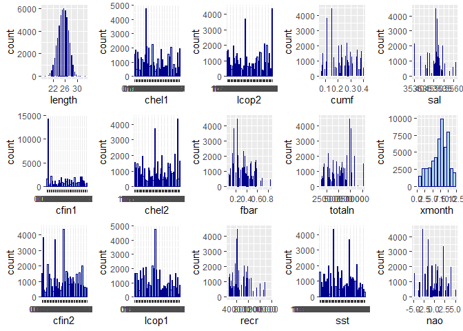

README
================
127310

    ## Warning: package 'ggplot2' was built under R version 3.5.3

## R Markdown

This is an R Markdown document. Markdown is a simple formatting syntax
for authoring HTML, PDF, and MS Word documents. For more details on
using R Markdown see <http://rmarkdown.rstudio.com>.

When you click the **Knit** button a document will be generated that
includes both content as well as the output of any embedded R code
chunks within the document. You can embed an R code chunk like this:

``` r
summary(cars)
```

    ##      speed           dist       
    ##  Min.   : 4.0   Min.   :  2.00  
    ##  1st Qu.:12.0   1st Qu.: 26.00  
    ##  Median :15.0   Median : 36.00  
    ##  Mean   :15.4   Mean   : 42.98  
    ##  3rd Qu.:19.0   3rd Qu.: 56.00  
    ##  Max.   :25.0   Max.   :120.00

## Including Plots

You can also embed plots, for example:

<!-- -->

Note that the `echo = FALSE` parameter was added to the code chunk to
prevent printing of the R code that generated the plot.

Biblioteki:

    ## [1] "ggplot2"   "stats"     "graphics"  "grDevices" "utils"     "datasets" 
    ## [7] "methods"   "base"

Wczytanie danych

Podsumowanie:

    ##        X             length         cfin1           cfin2      
    ##  Min.   :    0   Min.   :19.0   0      :14287   0.70118: 4374  
    ##  1st Qu.:13145   1st Qu.:24.0   0.02778: 2225   0      : 3806  
    ##  Median :26291   Median :25.5   1.02508: 2067   0.296  : 3706  
    ##  Mean   :26291   Mean   :25.3   1.21333: 1985   0.11736: 2106  
    ##  3rd Qu.:39436   3rd Qu.:26.5   0.33333: 1914   4.55825: 2007  
    ##  Max.   :52581   Max.   :32.5   0.11111: 1891   0.85684: 1665  
    ##                                 (Other):28213   (Other):34918  
    ##       chel1            chel2            lcop1            lcop2      
    ##  11.5    : 4787   5.67765 : 4365   23      : 4787   9.17171 : 4370  
    ##  2.46875 : 2241   21.67333: 3710   2.54787 : 2215   24.85867: 3709  
    ##  12.15192: 2109   39.56809: 2101   12.49588: 2105   41.65566: 2102  
    ##  6.42127 : 2062   26.81218: 2002   10.92857: 2059   45.70773: 1998  
    ##  19.15475: 2001   15.03   : 1941   21.23147: 1979   17.68   : 1959  
    ##  9.66667 : 1926   9.43208 : 1661   27.33333: 1916   10.72889: 1676  
    ##  (Other) :37456   (Other) :36802   (Other) :37521   (Other) :36768  
    ##       fbar             recr              cumf             totaln       
    ##  Min.   :0.0680   Min.   : 140515   Min.   :0.06833   Min.   : 144137  
    ##  1st Qu.:0.2270   1st Qu.: 360061   1st Qu.:0.14809   1st Qu.: 306068  
    ##  Median :0.3320   Median : 421391   Median :0.23191   Median : 539558  
    ##  Mean   :0.3304   Mean   : 520367   Mean   :0.22981   Mean   : 514973  
    ##  3rd Qu.:0.4560   3rd Qu.: 724151   3rd Qu.:0.29803   3rd Qu.: 730351  
    ##  Max.   :0.8490   Max.   :1565890   Max.   :0.39801   Max.   :1015595  
    ##                                                                        
    ##             sst             sal            xmonth            nao          
    ##  13.6315997001: 4359   Min.   :35.40   Min.   : 1.000   Min.   :-4.89000  
    ##  14.0693330238: 3700   1st Qu.:35.51   1st Qu.: 5.000   1st Qu.:-1.89000  
    ##  14.4415996823: 2080   Median :35.51   Median : 8.000   Median : 0.20000  
    ##  13.5598663683: 2010   Mean   :35.51   Mean   : 7.258   Mean   :-0.09236  
    ##  13.694933032 : 1950   3rd Qu.:35.52   3rd Qu.: 9.000   3rd Qu.: 1.63000  
    ##  13.861999695 : 1673   Max.   :35.61   Max.   :12.000   Max.   : 5.08000  
    ##  (Other)      :36810

    ## Warning: Ignoring unknown parameters: binwidth, bins, pad
    
    ## Warning: Ignoring unknown parameters: binwidth, bins, pad
    
    ## Warning: Ignoring unknown parameters: binwidth, bins, pad
    
    ## Warning: Ignoring unknown parameters: binwidth, bins, pad
    
    ## Warning: Ignoring unknown parameters: binwidth, bins, pad
    
    ## Warning: Ignoring unknown parameters: binwidth, bins, pad
    
    ## Warning: Ignoring unknown parameters: binwidth, bins, pad
    
    ## Warning: Ignoring unknown parameters: binwidth, bins, pad
    
    ## Warning: Ignoring unknown parameters: binwidth, bins, pad
    
    ## Warning: Ignoring unknown parameters: binwidth, bins, pad
    
    ## Warning: Ignoring unknown parameters: binwidth, bins, pad
    
    ## Warning: Ignoring unknown parameters: binwidth, bins, pad
    
    ## Warning: Ignoring unknown parameters: binwidth, bins, pad
    
    ## Warning: Ignoring unknown parameters: binwidth, bins, pad
    
    ## Warning: Ignoring unknown parameters: binwidth, bins, pad

<!-- -->
