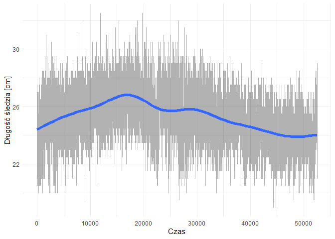

README
================
127310

    ## Warning: package 'ggplot2' was built under R version 3.5.3

1.  Kod wyliczający wykorzystane biblioteki. Biblioteki:

<!-- end list -->

    ## [1] "ggplot2"   "stats"     "graphics"  "grDevices" "utils"     "datasets" 
    ## [7] "methods"   "base"

3.Kod pozwalający wczytać dane z pliku. 4.Kod przetwarzający brakujące
dane. Wczytanie danych i oczyszczanie ich

``` r
sledzie <- read.csv("sledzie.csv",header=TRUE)
sledzie[sledzie=="?"] <- NA
```

5.Sekcję podsumowującą rozmiar zbioru i podstawowe statystyki.
Podsumowanie:

    ##        X             length         cfin1           cfin2      
    ##  Min.   :    0   Min.   :19.0   0      :14287   0.70118: 4374  
    ##  1st Qu.:13145   1st Qu.:24.0   0.02778: 2225   0      : 3806  
    ##  Median :26291   Median :25.5   1.02508: 2067   0.296  : 3706  
    ##  Mean   :26291   Mean   :25.3   1.21333: 1985   0.11736: 2106  
    ##  3rd Qu.:39436   3rd Qu.:26.5   0.33333: 1914   4.55825: 2007  
    ##  Max.   :52581   Max.   :32.5   (Other):28523   (Other):35047  
    ##                                 NA's   : 1581   NA's   : 1536  
    ##       chel1            chel2            lcop1            lcop2      
    ##  11.5    : 4787   5.67765 : 4365   23      : 4787   9.17171 : 4370  
    ##  2.46875 : 2241   21.67333: 3710   2.54787 : 2215   24.85867: 3709  
    ##  12.15192: 2109   39.56809: 2101   12.49588: 2105   41.65566: 2102  
    ##  6.42127 : 2062   26.81218: 2002   10.92857: 2059   45.70773: 1998  
    ##  19.15475: 2001   15.03   : 1941   21.23147: 1979   17.68   : 1959  
    ##  (Other) :37827   (Other) :36907   (Other) :37784   (Other) :36853  
    ##  NA's    : 1555   NA's    : 1556   NA's    : 1653   NA's    : 1591  
    ##       fbar             recr              cumf             totaln       
    ##  Min.   :0.0680   Min.   : 140515   Min.   :0.06833   Min.   : 144137  
    ##  1st Qu.:0.2270   1st Qu.: 360061   1st Qu.:0.14809   1st Qu.: 306068  
    ##  Median :0.3320   Median : 421391   Median :0.23191   Median : 539558  
    ##  Mean   :0.3304   Mean   : 520367   Mean   :0.22981   Mean   : 514973  
    ##  3rd Qu.:0.4560   3rd Qu.: 724151   3rd Qu.:0.29803   3rd Qu.: 730351  
    ##  Max.   :0.8490   Max.   :1565890   Max.   :0.39801   Max.   :1015595  
    ##                                                                        
    ##             sst             sal            xmonth            nao          
    ##  13.6315997001: 4359   Min.   :35.40   Min.   : 1.000   Min.   :-4.89000  
    ##  14.0693330238: 3700   1st Qu.:35.51   1st Qu.: 5.000   1st Qu.:-1.89000  
    ##  14.4415996823: 2080   Median :35.51   Median : 8.000   Median : 0.20000  
    ##  13.5598663683: 2010   Mean   :35.51   Mean   : 7.258   Mean   :-0.09236  
    ##  13.694933032 : 1950   3rd Qu.:35.52   3rd Qu.: 9.000   3rd Qu.: 1.63000  
    ##  (Other)      :36899   Max.   :35.61   Max.   :12.000   Max.   : 5.08000  
    ##  NA's         : 1584

6.Szczegółową analizę wartości atrybutów (np. poprzez prezentację
rozkładów wartości).

    ## Warning: Ignoring unknown parameters: binwidth, bins, pad
    
    ## Warning: Ignoring unknown parameters: binwidth, bins, pad
    
    ## Warning: Ignoring unknown parameters: binwidth, bins, pad
    
    ## Warning: Ignoring unknown parameters: binwidth, bins, pad
    
    ## Warning: Ignoring unknown parameters: binwidth, bins, pad
    
    ## Warning: Ignoring unknown parameters: binwidth, bins, pad
    
    ## Warning: Ignoring unknown parameters: binwidth, bins, pad
    
    ## Warning: Ignoring unknown parameters: binwidth, bins, pad
    
    ## Warning: Ignoring unknown parameters: binwidth, bins, pad
    
    ## Warning: Ignoring unknown parameters: binwidth, bins, pad
    
    ## Warning: Ignoring unknown parameters: binwidth, bins, pad
    
    ## Warning: Ignoring unknown parameters: binwidth, bins, pad
    
    ## Warning: Ignoring unknown parameters: binwidth, bins, pad
    
    ## Warning: Ignoring unknown parameters: binwidth, bins, pad
    
    ## Warning: Ignoring unknown parameters: binwidth, bins, pad

<!-- --> 7.Sekcję
sprawdzającą korelacje między zmiennymi; sekcja ta powinna zawierać
jakąś formę graficznej prezentacji korelacji.

8.Interaktywny wykres lub animację prezentującą zmianę rozmiaru śledzi w
czasie.

9.Sekcję próbującą stworzyć regresor przewidujący rozmiar śledzia (w tej
sekcji należy wykorzystać wiedzę z pozostałych punktów oraz wykonać
dodatkowe czynności, które mogą poprawić trafność predykcji); dobór
parametrów modelu oraz oszacowanie jego skuteczności powinny zostać
wykonane za pomocą techniki podziału zbioru na dane uczące, walidujące i
testowe; trafność regresji powinna zostać oszacowana na podstawie miar
R2 i RMSE.

10.Analizę ważności atrybutów najlepszego znalezionego modelu regresji.
Analiza ważności atrybutów powinna stanowić próbę odpowiedzi na pytanie:
co sprawia, że rozmiar śledzi zaczął w pewnym momencie maleć.
