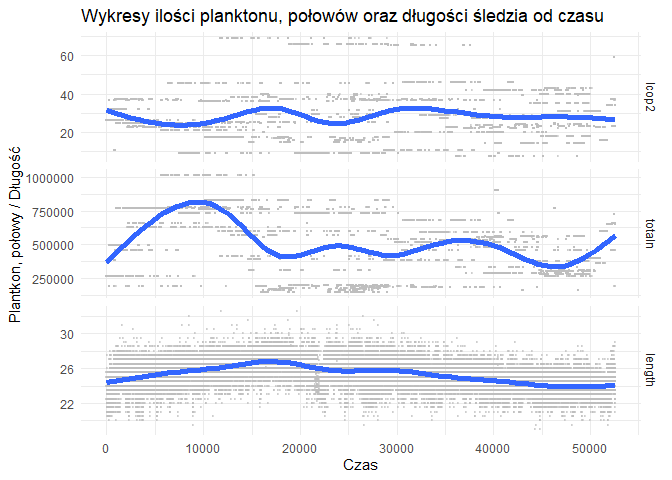

# Biblioteki:

```r
library(reshape2)
library(dplyr)
library(tidyr)
library(knitr)
library(ggplot2)
library(plotly)
library(corrplot)
library(shiny)
library(reshape)
library(randomForest)
library(caret)
```

# Wczytanie danych


Zbiór pochodzi z pliku "sledzie.csv",zwaiera16 atrybutów opisujących 52582 obserwacji. W zbiorze znajdują się 10094 niekompletnych obserwacji. Wartości puste w zbiorze reprezentowane sa za pomocą '?', a część dziesiętna liczb oddzielona jest kropką. Zbiór posiada nagłówek opisujący nazwy atrybutów.  By dane zostały wczytane poprawnie, do funcji read.csv przekazano takie argumenty jak: nazwa pliku, forma reprezentacji wartości pustych, że zbiór zawiera nagłówek oraz listę prezentującą klasy danych atrybutów.

# Powtarzalność wyników
W celu uzyskania powtarzalności wyników, ustawiono ziarno generatora na:

```r
set.seed(666)
```


# Analiza zbioru:
Na przestrzeni ostatnich lat zauważono stopniowy spadek rozmiaru śledzia oceanicznego wyławianego w Europie. Do analizy zebrano pomiary śledzi i warunków w jakich żyją z ostatnich 60 lat. Dane były pobierane z połowów komercyjnych jednostek. W ramach połowu jednej jednostki losowo wybierano od 50 do 100 sztuk trzyletnich śledzi. Dane dostępne są pod adresem: http://www.cs.put.poznan.pl/alabijak/emd/projekt/sledzie.csv.

Zbiór danych zawiera 16 atrybutów: \ 

length - długość złowionego śledzia [cm] \
cfin1  - dostępność planktonu [zagęszczenie Calanus finmarchicus gat. 1] \
cfin2  - dostępność planktonu [zagęszczenie Calanus finmarchicus gat. 2] \
chel1  - dostępność planktonu [zagęszczenie Calanus helgolandicus gat. 1] \
chel2  - dostępność planktonu [zagęszczenie Calanus helgolandicus gat. 2] \
lcop1  - dostępność planktonu [zagęszczenie widłonogów  gat. 1] \
lcop2  - dostępność planktonu [zagęszczenie widłonogów  gat. 2] \
fbar   - natężenie połowów w regionie [ułamek pozostawionego narybku] \
recr   - roczny narybek [liczba śledzi] \
cumf   - łączne roczne natężenie połowów w regionie [ułamek pozostawionego narybku] \
totaln - łączna liczba ryb złowionych w ramach połowu [liczba śledzi] \
sst    - temperatura przy powierzchni wody [°C] \
sal    - poziom zasolenia wody [Knudsen ppt] \
xmonth - miesiąc połowu [numer miesiąca] \
nao    - oscylacja północnoatlantycka [mb] \

Kolejne wiersze reprezentują kolejne obserwacje i są ułożone hronologicznie. 


```r
kable(summary(raw_df), caption = "Podsumowanie zbioru danych")
```


Table: Podsumowanie zbioru danych

           X             length         cfin1             cfin2             chel1            chel2            lcop1              lcop2             fbar             recr              cumf             totaln             sst             sal            xmonth            nao         
---  --------------  -------------  ----------------  ----------------  ---------------  ---------------  -----------------  ---------------  ---------------  ----------------  ----------------  ----------------  --------------  --------------  ---------------  -----------------
     Min.   :    0   Min.   :19.0   Min.   : 0.0000   Min.   : 0.0000   Min.   : 0.000   Min.   : 5.238   Min.   :  0.3074   Min.   : 7.849   Min.   :0.0680   Min.   : 140515   Min.   :0.06833   Min.   : 144137   Min.   :12.77   Min.   :35.40   Min.   : 1.000   Min.   :-4.89000 
     1st Qu.:13145   1st Qu.:24.0   1st Qu.: 0.0000   1st Qu.: 0.2778   1st Qu.: 2.469   1st Qu.:13.427   1st Qu.:  2.5479   1st Qu.:17.808   1st Qu.:0.2270   1st Qu.: 360061   1st Qu.:0.14809   1st Qu.: 306068   1st Qu.:13.60   1st Qu.:35.51   1st Qu.: 5.000   1st Qu.:-1.89000 
     Median :26291   Median :25.5   Median : 0.1111   Median : 0.7012   Median : 5.750   Median :21.673   Median :  7.0000   Median :24.859   Median :0.3320   Median : 421391   Median :0.23191   Median : 539558   Median :13.86   Median :35.51   Median : 8.000   Median : 0.20000 
     Mean   :26291   Mean   :25.3   Mean   : 0.4458   Mean   : 2.0248   Mean   :10.006   Mean   :21.221   Mean   : 12.8108   Mean   :28.419   Mean   :0.3304   Mean   : 520367   Mean   :0.22981   Mean   : 514973   Mean   :13.87   Mean   :35.51   Mean   : 7.258   Mean   :-0.09236 
     3rd Qu.:39436   3rd Qu.:26.5   3rd Qu.: 0.3333   3rd Qu.: 1.7936   3rd Qu.:11.500   3rd Qu.:27.193   3rd Qu.: 21.2315   3rd Qu.:37.232   3rd Qu.:0.4560   3rd Qu.: 724151   3rd Qu.:0.29803   3rd Qu.: 730351   3rd Qu.:14.16   3rd Qu.:35.52   3rd Qu.: 9.000   3rd Qu.: 1.63000 
     Max.   :52581   Max.   :32.5   Max.   :37.6667   Max.   :19.3958   Max.   :75.000   Max.   :57.706   Max.   :115.5833   Max.   :68.736   Max.   :0.8490   Max.   :1565890   Max.   :0.39801   Max.   :1015595   Max.   :14.73   Max.   :35.61   Max.   :12.000   Max.   : 5.08000 
     NA              NA             NA's   :1581      NA's   :1536      NA's   :1555     NA's   :1556     NA's   :1653       NA's   :1591     NA               NA                NA                NA                NA's   :1584    NA              NA               NA               

```r
uniq <- raw_df %>% summarise_each(funs(n_distinct(., na.rm = TRUE)))
kable(uniq, caption = "Unikalne wartości")
```


Table: Unikalne wartości

     X   length   cfin1   cfin2   chel1   chel2   lcop1   lcop2   fbar   recr   cumf   totaln   sst   sal   xmonth   nao
------  -------  ------  ------  ------  ------  ------  ------  -----  -----  -----  -------  ----  ----  -------  ----
 52582       59      39      48      48      51      48      51     51     52     52       53    51    51       12    45

## Długość śledzia  
Długość śledzia jest wyrażona w cm.

```r
plot_length <- ggplot(df,aes(X,length))  + geom_line(alpha=0.3) + stat_smooth(method="auto",size = 2)
plot_length <- plot_length + theme(axis.text.x=element_blank(),axis.ticks.x=element_blank()) + labs(x="Czas", y="Długość śledzia [cm]") + theme_minimal() 
plot_length
```

```
## `geom_smooth()` using method = 'gam' and formula 'y ~ s(x, bs = "cs")'
```

<!-- -->

```r
plot_length_hist<- ggplot(df,aes(length)) + geom_histogram(binwidth=0.5, color="white", fill="steelblue") +
  theme_minimal() + labs(x = "Długość", y = "Częstość") + ggtitle("Histogram długości śledzia") 
  
plot_length_hist
```

<!-- -->

## Dostępność planktonu - cfin1

```r
plot_plankton1 <- ggplot(df,aes(X,cfin1))  + geom_line(alpha=0.3) + stat_smooth(method="auto",size = 2)
plot_plankton1 <- plot_plankton1 + theme(axis.text.x=element_blank(),axis.ticks.x=element_blank()) + labs(x="Czas", y="Poziomu dostępności planktonu cfin1") + theme_minimal() 
plot_plankton1
```

```
## `geom_smooth()` using method = 'gam' and formula 'y ~ s(x, bs = "cs")'
```

<!-- -->

```r
plot_plankton1_hist<- ggplot(df,aes(cfin1)) + geom_histogram(binwidth=0.5, color="white", fill="steelblue") +
  theme_minimal() + labs(x = "Ilość", y = "Częstość") + ggtitle("Histogram dostępności cfin1") 
  
plot_plankton1_hist
```

<!-- -->

## Dostępność planktonu - cfin2


```r
plot_plankton2 <- ggplot(df,aes(X,cfin2))  + geom_line(alpha=0.3) + stat_smooth(method="auto",size = 2)
plot_plankton2 <- plot_plankton2 + theme(axis.text.x=element_blank(),axis.ticks.x=element_blank()) + labs(x="Czas", y="Poziom dostępności planktonu cfin2 od czasu") + theme_minimal() 
plot_plankton2
```

```
## `geom_smooth()` using method = 'gam' and formula 'y ~ s(x, bs = "cs")'
```

<!-- -->

```r
plot_plankton2_hist<- ggplot(df,aes(cfin2)) + geom_histogram(binwidth=0.5, color="white", fill="steelblue") +
  theme_minimal() + labs(x = "Ilość", y = "Częstość") + ggtitle("Histogram dostępności cfin2") 
  
plot_plankton2_hist
```

<!-- -->

## Dostępność planktonu - chel1


```r
plot_plankton3 <- ggplot(df,aes(X,chel1))  + geom_line(alpha=0.3) + stat_smooth(method="auto",size = 2)
plot_plankton3 <- plot_plankton3 + theme(axis.text.x=element_blank(),axis.ticks.x=element_blank()) + labs(x="Czas", y="Poziom dostępności planktonu chel1 od czasu") + theme_minimal() 
plot_plankton3
```

```
## `geom_smooth()` using method = 'gam' and formula 'y ~ s(x, bs = "cs")'
```

<!-- -->

```r
plot_plankton3_hist<- ggplot(df,aes(chel1)) + geom_histogram(binwidth=0.5, color="white", fill="steelblue") +
  theme_minimal() + labs(x = "Ilość", y = "Częstość") + ggtitle("Histogram dostępności chel1") 
  
plot_plankton3_hist
```

<!-- -->

## Dostępność planktonu - chel2


```r
plot_plankton3 <- ggplot(df,aes(X,chel2))  + geom_line(alpha=0.3) + stat_smooth(method="auto",size = 2)
plot_plankton3 <- plot_plankton3 + theme(axis.text.x=element_blank(),axis.ticks.x=element_blank()) + labs(x="Czas", y="Poziomu  dostępności planktonu chel2 od czasu") + theme_minimal() 
plot_plankton3
```

```
## `geom_smooth()` using method = 'gam' and formula 'y ~ s(x, bs = "cs")'
```

<!-- -->

```r
plot_plankton3_hist<- ggplot(df,aes(chel2)) + geom_histogram(binwidth=0.5, color="white", fill="steelblue") +
  theme_minimal() + labs(x = "Ilość", y = "Częstość") + ggtitle("Histogram dostępności chel2") 
  
plot_plankton3_hist
```

<!-- -->

## Dostępność planktonu - lcop1


```r
plot_plankton4 <- ggplot(df,aes(X,lcop1))  + geom_line(alpha=0.3) + stat_smooth(method="auto",size = 2)
plot_plankton4 <- plot_plankton4 + theme(axis.text.x=element_blank(),axis.ticks.x=element_blank()) + labs(x="Czas", y="Poziom dostępności planktonu lcop1 od czasu") + theme_minimal() 
plot_plankton4
```

```
## `geom_smooth()` using method = 'gam' and formula 'y ~ s(x, bs = "cs")'
```

<!-- -->

```r
plot_plankton4_hist<- ggplot(df,aes(lcop1)) + geom_histogram(binwidth=0.5, color="white", fill="steelblue") +
  theme_minimal() + labs(x = "Ilość", y = "Częstość") + ggtitle("Histogram dostępności lcop1") 
  
plot_plankton4_hist
```

<!-- -->

## Dostępność planktonu - lcop2


```r
plot_plankton5 <- ggplot(df,aes(X,lcop2))  + geom_line(alpha=0.3) + stat_smooth(method="auto",size = 2)
plot_plankton5 <- plot_plankton5 + theme(axis.text.x=element_blank(),axis.ticks.x=element_blank()) + labs(x="Czas", y="Poziom dostępności planktonu lcop2 od czasu") + theme_minimal() 
plot_plankton5
```

```
## `geom_smooth()` using method = 'gam' and formula 'y ~ s(x, bs = "cs")'
```

<!-- -->

```r
plot_plankton5_hist<- ggplot(df,aes(lcop2)) + geom_histogram(binwidth=0.5, color="white", fill="steelblue") +
  theme_minimal() + labs(x = "Ilość", y = "Częstość") + ggtitle("Histogram dostępności lcop2") 
  
plot_plankton5_hist
```

<!-- -->

## Natężenie połowów w regionie - fbar 


```r
plot_polow <- ggplot(df,aes(X,fbar))  + geom_line(alpha=0.3) + stat_smooth(method="auto",size = 2)
plot_polow <- plot_polow + theme(axis.text.x=element_blank(),axis.ticks.x=element_blank()) + labs(x="Czas", y="Natężenie połowów w regionie od czasu - fbar") + theme_minimal() 
plot_polow
```

```
## `geom_smooth()` using method = 'gam' and formula 'y ~ s(x, bs = "cs")'
```

<!-- -->

```r
plot_polow_hist<- ggplot(df,aes(fbar)) + geom_histogram(binwidth=0.5, color="white", fill="steelblue") +
  theme_minimal() + labs(x = "Natężenie", y = "Częstość") + ggtitle("Histogram natężenie połowu w rejonie -  fbar") 
  
plot_polow_hist
```

<!-- -->

## Poziom rocznego narybku - recr


```r
plot_recr <- ggplot(df,aes(X,recr))  + geom_line(alpha=0.3) + stat_smooth(method="auto",size = 2)
plot_recr <- plot_recr + theme(axis.text.x=element_blank(),axis.ticks.x=element_blank()) + labs(x="Czas", y="Poziom rocznego narybku od czasu - recr") + theme_minimal() 
plot_recr
```

```
## `geom_smooth()` using method = 'gam' and formula 'y ~ s(x, bs = "cs")'
```

<!-- -->

```r
plot_recr_hist<- ggplot(df,aes(recr)) + geom_histogram(binwidth=160000, color="white", fill="steelblue") +
  theme_minimal() + labs(x = "Roczny narybek", y = "Częstość") + ggtitle("Histogram rocznego narybku - recr") 
  
plot_recr_hist
```

<!-- -->

## Roczne natęzenie połowow - cumf


```r
plot_cumf <- ggplot(df,aes(X,cumf))  + geom_line(alpha=0.3) + stat_smooth(method="auto",size = 2)
plot_cumf <- plot_cumf + theme(axis.text.x=element_blank(),axis.ticks.x=element_blank()) + labs(x="Czas", y="Łączne roczne natężenie połowów w regionie") + theme_minimal() 
plot_cumf
```

```
## `geom_smooth()` using method = 'gam' and formula 'y ~ s(x, bs = "cs")'
```

<!-- -->

```r
plot_cumf_hist<- ggplot(df,aes(cumf)) + geom_histogram(binwidth=0.5, color="white", fill="steelblue") +
  theme_minimal() + labs(x = "Ilość", y = "Częstość") + ggtitle("Histogram łącznego rocznego natężenia połowów w regionie - cumf") 
  
plot_cumf_hist
```

<!-- -->

## Liczba zlowionych ryb - totaln


```r
plot_totaln <- ggplot(df,aes(X,totaln))  + geom_line(alpha=0.3) + stat_smooth(method="auto",size = 2)
plot_totaln <- plot_totaln + theme(axis.text.x=element_blank(),axis.ticks.x=element_blank()) + labs(x="Czas", y="Liczba złowionych ryb w ramach połowu") + theme_minimal() 
plot_totaln
```

```
## `geom_smooth()` using method = 'gam' and formula 'y ~ s(x, bs = "cs")'
```

<!-- -->

```r
plot_totaln_hist<- ggplot(df,aes(totaln)) + geom_histogram(binwidth=100000, color="white", fill="steelblue") +
  theme_minimal() + labs(x = "Ilość złowionych ryb", y = "Częstość") + ggtitle("Histogram łącznej liczby złowionych ryb w ramach połowu - totaln") 
  
plot_totaln_hist
```

<!-- -->

## Temperatura przy powiechni wody - sst
Atrubut sst zawiera informacje o temperaturze przy powierzchni wody, oraz jest wyrażony w stopniach Celcjusza


```r
plot_sst <- ggplot(df,aes(X,sst))  + geom_line(alpha=0.3) + stat_smooth(method="auto",size = 2)
plot_sst <- plot_sst + theme(axis.text.x=element_blank(),axis.ticks.x=element_blank()) + labs(x="Czas", y="Temperatura przy powierzchni wody [C]") + theme_minimal() 
plot_sst
```

```
## `geom_smooth()` using method = 'gam' and formula 'y ~ s(x, bs = "cs")'
```

<!-- -->

```r
plot_sst_hist<- ggplot(df,aes(sst)) + geom_histogram(binwidth=0.5, color="white", fill="steelblue") +
  theme_minimal() + labs(x = "Temperatura", y = "Częstość") + ggtitle("Histogram temperatury przy powierzchni wody - sst") 
  
plot_sst_hist
```

<!-- -->

## Poziom zasolenia wody - sal
Atrybut sal opisuje poziom zasolenia wody morskiej. Wartości wyrażone są w Knudsen ppt.

```r
plot_sal <- ggplot(df,aes(X,sal))  + geom_line(alpha=0.3) + stat_smooth(method="auto",size = 2)
plot_sal <- plot_sal + theme(axis.text.x=element_blank(),axis.ticks.x=element_blank()) + labs(x="Czas", y="Poziom zasolenia wody [ppt]") + theme_minimal() 
plot_sal
```

```
## `geom_smooth()` using method = 'gam' and formula 'y ~ s(x, bs = "cs")'
```

<!-- -->

```r
plot_sal_hist<- ggplot(df,aes(sal)) + geom_histogram(binwidth=0.05, color="white", fill="steelblue") +
  theme_minimal() + labs(x = "Poziom zasolenia", y = "Częstość") + ggtitle("Histogram poziomu zasolenia wody - sal") 
  
plot_sal_hist
```

<!-- -->

## Ostylacja północnoatlantycak - nao
Atrybut nao przedstawia natężenie globalnej cyrkulacji powietrza i wody oceanicznej. Jest zależny od ciśnienia, temperatury, prędkości wiatru i ilości opadów.


```r
plot_nao <- ggplot(df,aes(X,nao))  + geom_line(alpha=0.3) + stat_smooth(method="auto",size = 2)
plot_nao <- plot_nao + theme(axis.text.x=element_blank(),axis.ticks.x=element_blank()) + labs(x="Czas", y="Oscylacja północnoatlantycka") + theme_minimal() 
plot_nao
```

```
## `geom_smooth()` using method = 'gam' and formula 'y ~ s(x, bs = "cs")'
```

<!-- -->

```r
plot_nao_hist<- ggplot(df,aes(nao)) + geom_histogram(binwidth=0.5, color="white", fill="steelblue") +
  theme_minimal() + labs(x = "Ilość", y = "Częstość") + ggtitle("Histogram oscylacji północnoatlantyckiej - nao") 
  
plot_nao_hist
```

<!-- -->


# Analiza brakujących wartości.


Brakujące wartości występują tylko w 7 atrybutach: \
- dostępność planktonu -> cfin1, cfin2, chel1, chel2, lcop1, lcop2, \
- temperatura przy powierzchni wody -> sst. \
Łącznie niepełnych obserwacji mamy: 10094, czyli jest to 19.1966833 % całego zbiioru.
Jest to znacząca część zbioru. Jednak zakładamy, że zbiór danych zawiera chronologiczne ułożone dane, dlatego proste operacje na wartościach pustych, takie jak średnia lub mediana z danego atrybutu, mogą całkowicie przekłamać nam rozkład danych. Ze względu na ilość tych danych usunięcie ich może róWnież spowodować różne skutki. Jednak dzięki temu można uznać, że operacje która została dokonana na wartościach pustych, miała jakikolwiek pozytywny lub negatywny na dalsze przetwarzanie. 

```r
df <- df_no_na
```

# Korelacja między atrybutami

```r
correlation <- cor(df_no_na)
corrplot(correlation,type="upper",tl.col = "black", tl.srt = 45)
```

<!-- -->
Największą korelację można zaobserwować między parami: `chel1` - `loop1` ,`chel2` - `loop2`,  `fbar` - `cumf`, `cfin2` - `lcop2` oraz `cumf` - `totaln`.
W stosunku do atrybutu 'length' najwyższą korelacje można zaobserwować z  `sst`, `nao`.
Nao jest to Oscylacja Północnoatlantycka, która jest zjawiskiem meteorologicznym. Występuje w obszarze północnego atlantyku i ma wpływ na klimat otaczających go kontynentów. Jej działalność związana jest z cyrkulacją powietrza i wody, co by tłumaczyło zależność długości śledzia od tych dwóch atrybutów na raz. 
`length` jest także skorelowany z intensywnościa połowów oraz dostępnością planktonu (chel1 - Calanus helgolandicus gat. 1 i lcop1 - widłonogów  gat. 1).


# Zmiana rozmiaru śledzia w czasie

```r
partition <- createDataPartition(y=df_no_na$length, p=.05, list=FALSE)
dfPartition <- df_no_na[partition, ]
p <- ggplot(dfPartition, aes(x=X, y=length)) + geom_point() + geom_smooth() + theme_bw()
ggplotly(p)
```

```
## `geom_smooth()` using method = 'gam' and formula 'y ~ s(x, bs = "cs")'
```

<!--html_preserve--><div id="htmlwidget-729b826fc5183dbf954b" style="width:672px;height:480px;" class="plotly html-widget"></div>
<script type="application/json" data-for="htmlwidget-729b826fc5183dbf954b">{"x":{"data":[{"x":[12,23,41,53,64,128,148,216,226,258,308,400,406,488,489,495,502,505,540,542,554,557,601,642,655,695,775,784,837,841,867,893,908,912,929,944,985,997,1122,1139,1157,1178,1196,1227,1229,1259,1321,1390,1431,1444,1483,1539,1556,1572,1583,1587,1618,1635,1653,1658,1664,1686,1758,1763,1824,1830,1856,1859,1883,1899,1944,1952,1982,2038,2114,2156,2159,2249,2269,2278,2328,2349,2358,2437,2447,2477,2520,2530,2567,2581,2584,2660,2670,2689,2708,2749,2755,2836,2855,2940,2949,2966,2971,2980,3024,3106,3107,3115,3134,3175,3209,3237,3242,3248,3294,3316,3335,3347,3365,3412,3448,3487,3495,3503,3543,3553,3563,3580,3604,3635,3667,3699,3748,3751,3757,3808,3889,3893,3900,3907,3925,3997,4067,4072,4078,4118,4132,4139,4180,4223,4321,4351,4375,4383,4388,4399,4456,4460,4470,4482,4510,4556,4580,4610,4644,4670,4728,4729,4753,4761,4765,4781,4797,4803,4804,4835,4860,4882,4897,4898,4925,4958,4960,4999,5018,5023,5027,5032,5077,5148,5162,5247,5259,5342,5369,5384,5441,5443,5457,5467,5507,5537,5540,5561,5580,5599,5600,5630,5654,5729,5735,5749,5804,5821,5837,5838,5853,5855,5857,5862,5899,5903,5930,5992,6037,6072,6156,6205,6306,6328,6350,6351,6383,6419,6423,6505,6527,6536,6545,6546,6558,6576,6591,6602,6614,6632,6635,6638,6648,6693,6701,6734,6754,6769,6773,6826,6919,6922,6933,6939,6965,6969,7037,7058,7076,7101,7124,7214,7238,7244,7345,7364,7404,7421,7439,7466,7473,7526,7538,7546,7558,7568,7594,7652,7686,7690,7736,7747,7749,7770,7774,7787,7800,7848,7859,7860,7867,7872,7879,7893,7902,7925,7930,8020,8096,8134,8167,8175,8209,8212,8262,8279,8284,8288,8294,8356,8384,8413,8421,8445,8505,8538,8552,8553,8569,8584,8593,8596,8611,8654,8655,8723,8725,8728,8731,8774,8859,8863,8899,8901,8902,8929,8937,8952,8965,8990,9005,9007,9011,9036,9121,9127,9154,9158,9167,9211,9228,9241,9259,9318,9355,9371,9388,9398,9403,9460,9484,9592,9594,9610,9631,9648,9652,9683,9733,9761,9764,9808,9817,9819,9837,9877,9892,9907,9927,9938,9977,9983,9992,10075,10080,10094,10117,10143,10161,10191,10192,10203,10228,10286,10307,10344,10357,10369,10397,10408,10428,10461,10489,10504,10507,10527,10546,10552,10590,10603,10629,10631,10663,10697,10710,10718,10737,10754,10763,10786,10790,10796,10805,10830,10838,10859,10863,10866,10870,10902,10904,10907,10923,10926,10936,10958,10965,10981,10982,11003,11005,11053,11119,11174,11182,11193,11204,11210,11216,11299,11300,11312,11313,11339,11370,11408,11437,11440,11481,11516,11523,11537,11544,11583,11588,11685,11701,11748,11754,11755,11797,11898,11900,11930,11988,12012,12014,12017,12019,12068,12095,12109,12131,12159,12162,12175,12177,12211,12221,12224,12257,12276,12286,12287,12313,12322,12337,12363,12374,12406,12413,12416,12445,12507,12518,12536,12537,12544,12573,12654,12669,12683,12704,12717,12741,12782,12807,12812,12858,12865,12924,12928,12957,12958,13042,13056,13058,13080,13089,13094,13103,13108,13149,13157,13170,13251,13267,13290,13302,13313,13358,13363,13437,13441,13457,13470,13484,13490,13535,13553,13578,13582,13613,13632,13647,13661,13683,13713,13717,13720,13858,13901,13902,13904,13972,14009,14044,14051,14079,14091,14101,14106,14110,14114,14128,14239,14242,14259,14268,14330,14342,14399,14420,14461,14562,14579,14660,14664,14681,14711,14762,14834,14956,14962,14969,14984,14985,14987,15011,15057,15114,15118,15165,15168,15186,15187,15205,15214,15265,15320,15369,15373,15426,15437,15472,15494,15498,15526,15559,15563,15566,15630,15631,15686,15691,15722,15756,15769,15772,15788,15797,15868,16049,16068,16098,16136,16144,16168,16172,16208,16255,16279,16295,16299,16377,16424,16437,16464,16480,16514,16547,16605,16618,16623,16682,16709,16712,16800,16817,16839,16853,16882,16959,16980,17015,17016,17045,17108,17109,17134,17140,17147,17149,17182,17189,17197,17262,17266,17313,17316,17339,17358,17403,17429,17441,17454,17494,17511,17643,17664,17678,17705,17727,17737,17745,17778,17825,17833,17845,17856,17861,17867,17914,17934,17999,18041,18172,18224,18249,18267,18282,18292,18321,18326,18338,18363,18365,18372,18376,18392,18447,18448,18452,18475,18476,18484,18508,18610,18621,18642,18645,18650,18674,18679,18702,18707,18715,18716,18719,18740,18755,18805,18818,18837,18867,18934,18947,18951,19019,19046,19081,19103,19119,19140,19141,19163,19189,19193,19369,19421,19437,19451,19463,19480,19538,19555,19569,19592,19632,19679,19705,19723,19724,19745,19752,19784,19786,19787,19830,19839,19850,19853,19856,19910,19913,19927,19974,19984,20017,20036,20059,20084,20094,20103,20127,20147,20154,20181,20207,20215,20222,20228,20246,20274,20287,20291,20295,20328,20332,20336,20364,20415,20423,20481,20536,20568,20579,20631,20678,20705,20715,20730,20754,20763,20775,20816,20853,20995,20997,21082,21115,21154,21171,21180,21209,21231,21279,21311,21338,21342,21345,21364,21385,21403,21416,21459,21475,21494,21495,21505,21509,21543,21556,21558,21566,21576,21588,21621,21642,21722,21742,21748,21758,21771,21775,21810,21819,21833,21843,21876,21924,21927,21931,21936,21950,21963,21998,22027,22038,22070,22078,22141,22178,22253,22260,22317,22338,22360,22380,22426,22437,22460,22462,22477,22508,22523,22527,22568,22575,22604,22609,22621,22641,22678,22684,22704,22781,22812,22836,22848,22853,22872,22891,22904,22914,22918,22932,22942,22960,22964,22974,23036,23075,23079,23094,23128,23141,23179,23232,23273,23275,23288,23333,23339,23358,23379,23415,23425,23447,23455,23456,23547,23562,23567,23582,23647,23668,23723,23749,23763,23773,23797,23798,23896,23914,23941,23968,24001,24031,24066,24140,24193,24204,24229,24257,24296,24346,24352,24354,24392,24402,24443,24453,24457,24510,24514,24611,24613,24620,24644,24697,24699,24800,24803,24816,24829,24861,24867,24870,24873,24895,24908,24989,24990,24999,25043,25056,25059,25110,25189,25200,25203,25236,25251,25266,25303,25324,25343,25345,25346,25371,25446,25447,25492,25496,25512,25560,25578,25590,25605,25609,25611,25651,25652,25673,25677,25712,25714,25764,25767,25774,25806,25887,25897,25916,25936,25950,25983,25988,26030,26073,26089,26185,26196,26201,26227,26300,26307,26311,26315,26319,26370,26373,26377,26391,26416,26421,26434,26501,26508,26512,26594,26666,26690,26777,26846,26883,26897,26901,26904,26934,26939,26978,27033,27042,27050,27056,27059,27081,27085,27094,27096,27120,27199,27262,27320,27360,27362,27389,27410,27442,27452,27463,27486,27491,27493,27542,27545,27564,27571,27573,27612,27622,27630,27633,27642,27643,27689,27692,27724,27732,27755,27808,27819,27844,27880,27885,27943,27950,27957,27960,27970,27982,28003,28018,28031,28085,28090,28105,28116,28118,28166,28216,28239,28275,28282,28321,28377,28424,28446,28529,28533,28535,28621,28738,28745,28751,28756,28763,28767,28820,28835,28848,28893,29017,29040,29052,29058,29064,29074,29109,29145,29239,29270,29281,29338,29341,29345,29368,29393,29412,29468,29481,29518,29522,29561,29573,29581,29591,29594,29641,29693,29734,29736,29749,29754,29757,29789,29791,29793,29797,29824,29907,29935,29937,29977,30022,30076,30111,30141,30163,30169,30183,30205,30227,30233,30252,30272,30278,30296,30323,30337,30416,30456,30466,30491,30561,30618,30672,30685,30707,30764,30846,30883,30905,30906,30933,30934,30940,30942,31019,31036,31057,31068,31069,31089,31102,31112,31132,31139,31143,31147,31148,31162,31176,31179,31184,31201,31214,31227,31232,31263,31276,31286,31295,31310,31323,31371,31392,31398,31400,31449,31471,31475,31488,31502,31520,31557,31558,31573,31585,31591,31602,31604,31612,31622,31627,31673,31701,31715,31738,31761,31775,31829,31854,31886,31921,32048,32060,32066,32075,32204,32208,32221,32305,32340,32355,32376,32377,32383,32400,32411,32426,32497,32511,32525,32561,32568,32605,32636,32662,32675,32679,32720,32796,32845,32900,32941,32962,32972,33010,33012,33027,33050,33064,33096,33108,33182,33188,33243,33246,33266,33267,33270,33279,33296,33300,33325,33329,33331,33373,33419,33428,33439,33446,33460,33488,33492,33499,33514,33524,33530,33558,33584,33594,33597,33605,33636,33675,33719,33746,33760,33820,33851,33917,33926,33943,33957,33987,34037,34080,34095,34099,34113,34182,34188,34257,34268,34275,34350,34363,34370,34374,34420,34453,34466,34498,34534,34539,34560,34637,34685,34695,34708,34740,34754,34767,34776,34778,34796,34823,34825,34835,34844,34860,34882,34885,34890,34893,34915,34921,34924,34937,34984,34986,34989,35033,35078,35091,35140,35147,35210,35248,35259,35314,35337,35350,35377,35409,35422,35432,35453,35462,35485,35529,35532,35586,35648,35657,35687,35691,35699,35705,35750,35779,35794,35838,35860,35864,35898,35934,35938,35946,36016,36028,36057,36089,36091,36150,36158,36174,36197,36201,36202,36264,36278,36313,36316,36367,36368,36377,36385,36386,36387,36450,36476,36500,36591,36609,36651,36661,36678,36699,36750,36767,36768,36802,36891,36921,36924,36938,36964,37008,37049,37066,37092,37102,37120,37162,37175,37225,37234,37255,37285,37287,37295,37373,37400,37429,37431,37443,37455,37468,37476,37491,37515,37532,37552,37553,37554,37786,37828,37839,37941,37942,38011,38017,38061,38075,38078,38079,38082,38097,38175,38178,38213,38215,38225,38255,38287,38301,38306,38319,38388,38426,38478,38501,38504,38518,38576,38611,38653,38667,38686,38689,38712,38749,38777,38780,38807,38808,38811,38817,38838,38875,38896,38918,38952,38962,38979,38983,39009,39055,39070,39102,39121,39161,39164,39202,39215,39227,39286,39320,39371,39400,39418,39424,39438,39449,39467,39478,39490,39527,39572,39573,39596,39620,39694,39704,39706,39736,39737,39778,39780,39782,39812,39840,39882,39889,39891,40041,40080,40135,40151,40175,40252,40288,40295,40354,40375,40381,40431,40432,40450,40528,40555,40582,40686,40694,40713,40721,40730,40849,40864,40922,40956,40975,40988,41017,41035,41058,41132,41160,41168,41317,41331,41360,41375,41404,41431,41447,41474,41504,41544,41550,41558,41568,41586,41603,41687,41698,41702,41724,41777,41791,41825,41841,41846,41880,41902,41909,41917,41919,41952,41953,41992,41997,42008,42064,42092,42098,42106,42113,42128,42170,42188,42210,42232,42265,42277,42306,42316,42324,42425,42459,42531,42538,42557,42579,42605,42621,42644,42672,42708,42737,42766,42770,42772,42777,42815,42848,42875,42882,42901,42906,42932,42935,42959,42975,42985,42999,43016,43037,43041,43054,43083,43089,43151,43181,43191,43241,43283,43320,43342,43353,43401,43409,43422,43501,43534,43568,43578,43593,43597,43607,43613,43619,43646,43650,43651,43665,43668,43671,43686,43712,43717,43723,43742,43777,43802,43808,43818,43846,43855,43863,43880,43881,43898,43927,43941,43954,43997,44061,44128,44129,44170,44177,44181,44185,44188,44221,44225,44254,44286,44321,44338,44342,44361,44365,44374,44427,44480,44496,44516,44520,44555,44566,44567,44585,44685,44689,44720,44803,44813,44820,44837,44946,44948,44963,45000,45007,45081,45124,45315,45357,45373,45382,45384,45388,45417,45478,45480,45519,45534,45541,45564,45567,45601,45658,45695,45767,45775,45780,45806,45844,45858,45869,45890,45922,45972,45978,46007,46011,46015,46019,46051,46054,46184,46250,46284,46292,46326,46338,46350,46359,46375,46377,46387,46402,46408,46410,46492,46494,46527,46529,46533,46536,46552,46588,46593,46594,46599,46605,46633,46639,46642,46656,46699,46725,46728,46737,46748,46749,46765,46796,46801,46805,46850,46892,46894,46918,46971,47014,47098,47118,47128,47141,47201,47222,47231,47247,47255,47257,47307,47321,47327,47361,47367,47368,47400,47425,47443,47448,47449,47453,47471,47472,47499,47506,47512,47531,47572,47622,47637,47645,47709,47734,47740,47745,47760,47812,47813,47821,47857,47885,47893,47923,47970,47997,48046,48125,48148,48149,48153,48166,48189,48201,48216,48226,48242,48244,48254,48280,48341,48355,48414,48441,48447,48456,48481,48482,48485,48499,48514,48546,48561,48562,48636,48666,48722,48752,48778,48801,48839,48841,48848,48852,48896,48907,48965,49025,49038,49039,49095,49096,49150,49153,49172,49232,49246,49281,49324,49325,49380,49415,49425,49466,49504,49525,49532,49539,49540,49551,49556,49565,49587,49660,49713,49795,49808,49817,49837,49856,49868,49874,49901,49905,49906,49911,49963,49988,49995,50016,50027,50075,50080,50142,50149,50191,50192,50214,50255,50268,50283,50310,50316,50357,50432,50440,50470,50479,50499,50507,50511,50519,50550,50560,50600,50607,50615,50661,50721,50739,50755,50796,50797,50808,50851,50949,51076,51127,51142,51151,51156,51184,51203,51236,51260,51347,51431,51454,51510,51542,51567,51573,51578,51621,51635,51652,51659,51677,51686,51689,51731,51749,51830,51844,51845,51848,51869,51904,51909,51915,51944,51954,52004,52012,52046,52053,52068,52075,52116,52195,52216,52249,52273,52288,52307,52334,52338,52343,52346,52379,52387,52389,52410,52443,52485,52510,52522,52561],"y":[22,22.5,22,21,23,23,24,23,24,22,22.5,26,28,24.5,25,26,25.5,21.5,22,23.5,25.5,25.5,20.5,21,21,24,26.5,25,24,26,27.5,22.5,25,24,24,24.5,26,24.5,24.5,26,26,21.5,25,24.5,25.5,23,25,25.5,26,28,26,27,26,26,23.5,25.5,25,26,24.5,24.5,23,26,25,26.5,29,25.5,24,28,23.5,26.5,24,26.5,25.5,24.5,25.5,25.5,26,24.5,27.5,25,26,25,22,25.5,25.5,26,24.5,24.5,25,25.5,24.5,27,25,22.5,27,24.5,23,25.5,26,24,23.5,25,26,25.5,22.5,25,25.5,22,27.5,24,22.5,24.5,22,25,27.5,25,23,24.5,27.5,24.5,23.5,24,24,26,24.5,23.5,23.5,25,25.5,25,24,23,24,23,26,22.5,26.5,27,25.5,24,24.5,27,26.5,26.5,25.5,26,25.5,26,26,24,26.5,26.5,25,27.5,24,24,25.5,23.5,25.5,26,24,26,24.5,25,24,24.5,25.5,24,25,27,23,24.5,25.5,24.5,25.5,25,23,23,23.5,27,25.5,24,27.5,25,27,24,25,26,24.5,25.5,24.5,23.5,21,25.5,24.5,27,24.5,25,24,27.5,24,25.5,26,25.5,25.5,26.5,25,21,25.5,27.5,27,24,26,25,25,25.5,25.5,26.5,26.5,27,25.5,25.5,25.5,26.5,25.5,24.5,26.5,24,24.5,24,27,27.5,26.5,23,24.5,27,27.5,23.5,22.5,24.5,27,28,23,21.5,27,25.5,25.5,25.5,24.5,26,25.5,25,25.5,25,24.5,26,24,23,25,27.5,26,24.5,23,26,25.5,25.5,24,24.5,23,24,24,24.5,25,24,25.5,25.5,26.5,28,25.5,25,27.5,26,24.5,26.5,25,27.5,25,25.5,25.5,25,24,26.5,22.5,25,27,24.5,25,24,25.5,28.5,25.5,27,25.5,27.5,27.5,25,26.5,24.5,25.5,25,25.5,24.5,22.5,25,28,27,27,26.5,26,24.5,26,27,25.5,26.5,27,28.5,26,25.5,26,28.5,26.5,25.5,27.5,28,26,26.5,25.5,25,28,25.5,25,27.5,26.5,23,22,27,25.5,25,25.5,25,27,26,26,24,27.5,26,26,25.5,26,25.5,25.5,26,25,26.5,26.5,24.5,24.5,27,24,26,26.5,27,26.5,24,27.5,23.5,26.5,24.5,26,24.5,27,27,25.5,25.5,24.5,25.5,27.5,25,25.5,26.5,26.5,26,26,26.5,26.5,27.5,26.5,25,25,25,26,25,24.5,26.5,26,24.5,27,26,24.5,27.5,26,25,25.5,26,27.5,25,28,27,27.5,25.5,27.5,25.5,27,29,27,26,27,27,25,26.5,27,28.5,27.5,28.5,25.5,26.5,26,26.5,27.5,26,25,26,27,26,28.5,27.5,29,27.5,25.5,26,26,27.5,28,26.5,25.5,24,25,27,25.5,25.5,25.5,28,27.5,27.5,26,27.5,28.5,27,26,26.5,25.5,28.5,27.5,25,26,27,26,27,26.5,26,24.5,27.5,26,26.5,25.5,27,26.5,24,25,25.5,27.5,26.5,27,27,27,27,27,27.5,24,26.5,25,25,27.5,24.5,24,26.5,25.5,27.5,26.5,26.5,26,26,25.5,27,26,25,23,25.5,27,24.5,25,25,26,27,26,26,24.5,28.5,26,27.5,26.5,25,26,28,26.5,27,26,27,25.5,25.5,26.5,26.5,26,27.5,26,26,27,24,27,28,25.5,25,26.5,30.5,26.5,25,27,26,26.5,25.5,25,25.5,28.5,26.5,27,25.5,26,25,25,26,26.5,27,26,27.5,25,27.5,25.5,25.5,28,27.5,26,27,27,26.5,24.5,26,26,27,24.5,28,26,27.5,28,31.5,26,26,26.5,26.5,27.5,28,28,27,27,27.5,25,27,26,26.5,27,26.5,27.5,28.5,25,25,26,26.5,26.5,26,27.5,26.5,24.5,27,25.5,25.5,27.5,25.5,26.5,27,26,27,25.5,27.5,26,27.5,25,28,27.5,26.5,25.5,28,27.5,26.5,28.5,29,27,27,27,25.5,27,27.5,28.5,26,27,27,27.5,27.5,28,27,27,27,27,28.5,28,26.5,27.5,26.5,26,26.5,26.5,26.5,29,28.5,27,27.5,25,27.5,26.5,25.5,28,29,27,27,27,27.5,26.5,28.5,27,24.5,27,26,27.5,29,24.5,27,27,28,28,28.5,27.5,26.5,28.5,27.5,27.5,29.5,26,26.5,28.5,29,24,26,27,28,27,25,26.5,26.5,29.5,27,27,27.5,29,27,28,26.5,26.5,26,24.5,27.5,28,26.5,26,27.5,26.5,27.5,26,27.5,25.5,26,27.5,28,28.5,27,28.5,27,27.5,26.5,27.5,27.5,26.5,26,28.5,27.5,27,28,27,27,25.5,27.5,26.5,27.5,26,27,26,27,28.5,26,26,25,26,26.5,25.5,26,26,26,26.5,26.5,26.5,26,25.5,26.5,25.5,27,27.5,25.5,25.5,26.5,25.5,25.5,27,27.5,25.5,24,26.5,26.5,24,26,27,25.5,30.5,28.5,25.5,26.5,24.5,24.5,28.5,26.5,27.5,26.5,26.5,26.5,28,25,27.5,26.5,26,27.5,25.5,27.5,26.5,26.5,26,26,25.5,26.5,25,26,25.5,24,24.5,27.5,25,27.5,26,25,27,26.5,26.5,24.5,27,26.5,25.5,24.5,29,25.5,28.5,27.5,29,27.5,25,24.5,26.5,27.5,28.5,26,25.5,25.5,23.5,25.5,25,25.5,24,26,24,27,25,23.3,23.2,26,25.5,25.5,27,24.5,24.5,23.5,24,24,23.3,24,25.4,25,23,23.5,21.5,24,24,22,25.5,25,26,24,26.5,24,26.5,24.5,25,22.5,24.5,27,24.5,24.5,25.5,27.5,26.5,21,23.5,21.5,22.5,25.5,23.5,25,26.5,24,27,27.5,26,21.5,23.5,24.5,24,26,26,26.5,27,29.5,28,28,28,29,26.5,28.5,29,25.5,25,24.5,26.5,27,26,26,26,24.5,24.5,26,26,28,27,27,28.5,23,26,25,25.5,26,25,28,24,25,26,28,26.5,25.5,27,27,25.5,27,28,26.5,24.5,24,26,26,24.5,25,24,25,24,26.5,24.5,28.5,26.5,25.5,26,27,28,26.5,27,22.5,24.5,24,24.5,23,27,24,25.5,28,27,26.5,28,23.5,27,26.5,24.5,25,25,25,27.5,27,25,24.5,24,24.5,26.5,26.5,26,27.5,28.5,27.5,27,25,26,22.5,27.5,27.5,26,27,28,26,26,26,27,29,27.5,27,26.5,28,28,27.5,26,26.5,25.5,26,25,27.5,30.5,26,27.5,27.5,27,27,22.5,27.5,26.5,28,27,23,26,26.5,26,27.5,24,29,24,27.5,26.5,27,27,26,27.5,24,27,24.5,25.5,28.5,23.5,26.5,27.5,24,23,24,28.5,23,26.5,22.5,28,28,27.5,25.5,27,27.5,23,26.5,28,24,24,22.5,22.5,23,24.5,22,25,27.5,26.5,26.5,26,26,26.5,27.5,26,28,23.5,23,28,24,24,26,23.5,27,29,26.5,22.5,23,25.5,26.5,24,25,28,26.5,25,24,24.5,29.5,22.5,24,24.5,24.5,24.5,24,22.5,26.5,25.5,24,24.5,24.5,25.5,25.5,27,26.5,25.5,25,24.5,28,25.5,24,28,26,26.5,25.5,27,27,25,23.5,26.5,26.5,27,26.5,24.5,21.5,26.5,25.5,25.5,26,26.5,26,26.5,25.5,23,25.5,26.5,26.5,27,26.5,28.5,27.5,26.5,27.5,27,25.5,23.5,27.5,25,25,25.5,26.5,25,26.5,26,26.5,27,28,27.5,25.5,25.5,25,27.5,26,28,25,26,25,26,26,25.5,26,26,26,25.5,25.5,25,27,26,26.5,27,24,28,24,26.5,24.5,22,26,28,25.5,26,26.5,25.5,26,25.5,24.5,25.5,26,25.5,24,24,27.5,27,25,27,28,25.5,25,26,26.5,26,28,26.5,26.5,28.5,26.5,25,27,25.5,27.5,26,24.5,25.5,25.5,24.5,27,24.5,27.5,25,25.5,26.5,24.5,26,26.5,25,28.5,25.5,25.5,28,27,25.5,26,26.5,23.5,26.5,26,24,25.5,26,26.5,25,25.5,24,25.5,26,26.5,25.5,25,24,26.5,27.5,26.5,25,25,27,23,23.5,24.5,26.5,26,27,27,25,25.5,29,25.5,25.5,25,25.5,26,26,25,25,25.5,26,25.5,25,24.5,25,24,25.5,25,25,26,25,24,26,25,24,23,26,25.5,24.5,26,26.5,27.5,25.5,24.5,25,23,24.5,24.5,24,23.5,24,22,24,24,23.5,21.5,24,24,23,21.5,23.5,24.5,24,24,27.5,21.5,24,23,25.5,26.5,24.5,26.5,26,26,28.5,26,26.5,27.5,29,28,25,24.5,25.5,24.5,23.5,24,22,24.5,26,24.5,25.5,24,26,25.5,24,24,26,25,23.5,25,26,25.5,25,24,23.5,26,25,25.5,26.5,25,25.5,27,26.5,28.5,25,23.5,24.5,24.5,25,26.5,26.5,24.5,27,22.5,27,24.5,25,25.5,25,23.5,25.5,25.5,24.5,23,25,24.5,26,22,25,25.5,25,24,22.5,25,24,23.5,26,24.5,25.5,26.5,24.5,23.5,25.5,24,23.5,26,26.5,26,25,26,24.5,23.5,26,25.5,25,24,25,25,27,26.5,27,26.5,26,25,23,24.5,25.5,26.5,26.5,27,26,28.5,24.5,24.5,24.5,24.5,24.5,25,27.5,24.5,26.5,26.5,24.5,23.5,26,25.5,26,24,28.5,22.5,24.5,26,25,24.5,27,26,25,27,25,27.5,25,25.5,26,24.5,23.5,24.5,25.5,26,26.5,25.5,26,25,25,26,24,24,26,25,24.5,21,24.5,26.5,24.5,25.5,24,23.5,25,25,24.5,25.5,25,24.5,24,26,25.5,25.5,24.5,25,25.5,27,24.5,24.5,23,25.5,26.5,24,23,23,23,26,24,24,24,25,25,24,27,23.5,25.5,25,26.5,24,25.5,25.5,26,27.5,23.5,23.5,25,24.5,25,23,23.5,22.5,23,25.5,25.5,25,24.5,25,24.5,24,26,24.5,24,26.5,26,25.5,28,25.5,25,24.5,24.5,23.5,25,24.5,24,24,23,22,25.5,23.5,22,25,23,23.5,27.5,24,25,25,25,25,26,25,23,27,26.3,24,22.5,24.5,26.5,25,25,25.5,23,25,25.5,24.5,23.5,25.5,22.5,23,24,21,24.5,24.5,23.5,24,23.5,22,23,22,24,24,26,25,25.5,25,25.5,24,26,24,22.5,24.5,25.5,25,24,24.5,24,25,23.5,26.5,24.5,26,26,23.5,25,24,26,24.5,23.5,23,23,23,22,23.5,23.5,25,26,22.5,22.5,25,24.5,22,23.5,25,24.5,25,24,25.5,24,23,25.5,23.5,23,23,24.5,23.5,24.5,21.5,24,25,23.5,24,22.5,25,24.5,23.5,25.5,21.5,23,24.5,25,25,25,25,25,24,24.5,24.5,27,24.5,24.5,26.5,25.5,25,26.5,25,25,24,25,23,24.5,24.5,25.5,24,25.5,25.5,26,25,26,24,25.5,25,24,25,23,25.5,26,25.5,26.5,24.5,25,26,24.5,26,23,25.5,24,25,25,25,27,26.5,24,24,23.5,22.5,22.5,22,26,22.5,23.5,25.5,27,26,23,22.5,24,24.5,24,25,24.5,22.5,24,24,24,25,26,25,25.5,23.5,24,24,24.5,22.5,24.5,23.5,25,23,25,26,24,24.5,25.5,24,22.5,25,22,25,23,26,23,21.5,26,23,23,25,24,24,25,22,23,23,23,24,24,23.5,23,24,25.5,23.5,24.5,25,25.5,22,24,23.5,22.5,24.5,24,24.5,23.5,22.5,24.5,24.5,26.5,22,22.5,24,24.5,23,23,27,24,24,24,23.5,24,23,24.5,23.5,23.5,23.5,23.5,24,26,25.5,25,27,23.5,24,23.5,24,23,22,25,24,25,25,23.5,23.5,24,23.5,23.5,27,24,23.5,24,22,23.5,23,23,25,22,22.5,25,23,22,22,23.5,22,22.5,24.5,25,25.5,25,26,22,25,21.5,25.5,25.5,23,24.5,22.5,25.5,24,25,26.5,25,24.5,23.5,24.5,23.5,25,23.5,24.5,25.5,24,23,22,22,21.5,22,25.5,23.5,23,23.5,23.5,23.5,24,23.5,22.5,23,26.5,26,26,24,22.5,22,22.5,24,23,23.5,25,26.5,25,25.5,22.5,25,23.5,25,28,23.5,24,24,25.5,23,25,25,25,24.5,24.5,24,23.5,23,25.5,22.5,22.5,24,25,24.5,24.5,26,22.5,23.5,25,23,23,24.5,24.5,25,24,22.5,22.5,22.5,22.5,25,24,24,23.5,24,24.5,24.5,23.5,24.5,23.5,23.5,23.5,23.5,24,24,26.5,22.5,24.5,24,24,22.5,23.5,23,22.5,23,22.5,22.5,23.5,23.5,25.5,24.5,25,24,23.5,23,22.5,23,22.5,23,23,23.5,22.5,26.5,23,25,25,22.5,23.5,23.5,24,23,25,25,23.5,23.5,25,23.5,21.5,23,23.5,22.5,23,24,25.5,24.5,24,24,24.5,23,24.5,23,23.5,24.5,24,24.5,24.5,22.5,24,22,23,23,24,24,23.5,21,22,26.5,23,25,23.5,22,24.5,21.5,23.5,23,21,26.5,24,26.5,27.5,25.5,23.5,27,23,27,25,24,24.5,24,24.5,26.5,24,26.5,25.5,23],"text":["X:    12<br />length: 22.0","X:    23<br />length: 22.5","X:    41<br />length: 22.0","X:    53<br />length: 21.0","X:    64<br />length: 23.0","X:   128<br />length: 23.0","X:   148<br />length: 24.0","X:   216<br />length: 23.0","X:   226<br />length: 24.0","X:   258<br />length: 22.0","X:   308<br />length: 22.5","X:   400<br />length: 26.0","X:   406<br />length: 28.0","X:   488<br />length: 24.5","X:   489<br />length: 25.0","X:   495<br />length: 26.0","X:   502<br />length: 25.5","X:   505<br />length: 21.5","X:   540<br />length: 22.0","X:   542<br />length: 23.5","X:   554<br />length: 25.5","X:   557<br />length: 25.5","X:   601<br />length: 20.5","X:   642<br />length: 21.0","X:   655<br />length: 21.0","X:   695<br />length: 24.0","X:   775<br />length: 26.5","X:   784<br />length: 25.0","X:   837<br />length: 24.0","X:   841<br />length: 26.0","X:   867<br />length: 27.5","X:   893<br />length: 22.5","X:   908<br />length: 25.0","X:   912<br />length: 24.0","X:   929<br />length: 24.0","X:   944<br />length: 24.5","X:   985<br />length: 26.0","X:   997<br />length: 24.5","X:  1122<br />length: 24.5","X:  1139<br />length: 26.0","X:  1157<br />length: 26.0","X:  1178<br />length: 21.5","X:  1196<br />length: 25.0","X:  1227<br />length: 24.5","X:  1229<br />length: 25.5","X:  1259<br />length: 23.0","X:  1321<br />length: 25.0","X:  1390<br />length: 25.5","X:  1431<br />length: 26.0","X:  1444<br />length: 28.0","X:  1483<br />length: 26.0","X:  1539<br />length: 27.0","X:  1556<br />length: 26.0","X:  1572<br />length: 26.0","X:  1583<br />length: 23.5","X:  1587<br />length: 25.5","X:  1618<br />length: 25.0","X:  1635<br />length: 26.0","X:  1653<br />length: 24.5","X:  1658<br />length: 24.5","X:  1664<br />length: 23.0","X:  1686<br />length: 26.0","X:  1758<br />length: 25.0","X:  1763<br />length: 26.5","X:  1824<br />length: 29.0","X:  1830<br />length: 25.5","X:  1856<br />length: 24.0","X:  1859<br />length: 28.0","X:  1883<br />length: 23.5","X:  1899<br />length: 26.5","X:  1944<br />length: 24.0","X:  1952<br />length: 26.5","X:  1982<br />length: 25.5","X:  2038<br />length: 24.5","X:  2114<br />length: 25.5","X:  2156<br />length: 25.5","X:  2159<br />length: 26.0","X:  2249<br />length: 24.5","X:  2269<br />length: 27.5","X:  2278<br />length: 25.0","X:  2328<br />length: 26.0","X:  2349<br />length: 25.0","X:  2358<br />length: 22.0","X:  2437<br />length: 25.5","X:  2447<br />length: 25.5","X:  2477<br />length: 26.0","X:  2520<br />length: 24.5","X:  2530<br />length: 24.5","X:  2567<br />length: 25.0","X:  2581<br />length: 25.5","X:  2584<br />length: 24.5","X:  2660<br />length: 27.0","X:  2670<br />length: 25.0","X:  2689<br />length: 22.5","X:  2708<br />length: 27.0","X:  2749<br />length: 24.5","X:  2755<br />length: 23.0","X:  2836<br />length: 25.5","X:  2855<br />length: 26.0","X:  2940<br />length: 24.0","X:  2949<br />length: 23.5","X:  2966<br />length: 25.0","X:  2971<br />length: 26.0","X:  2980<br />length: 25.5","X:  3024<br />length: 22.5","X:  3106<br />length: 25.0","X:  3107<br />length: 25.5","X:  3115<br />length: 22.0","X:  3134<br />length: 27.5","X:  3175<br />length: 24.0","X:  3209<br />length: 22.5","X:  3237<br />length: 24.5","X:  3242<br />length: 22.0","X:  3248<br />length: 25.0","X:  3294<br />length: 27.5","X:  3316<br />length: 25.0","X:  3335<br />length: 23.0","X:  3347<br />length: 24.5","X:  3365<br />length: 27.5","X:  3412<br />length: 24.5","X:  3448<br />length: 23.5","X:  3487<br />length: 24.0","X:  3495<br />length: 24.0","X:  3503<br />length: 26.0","X:  3543<br />length: 24.5","X:  3553<br />length: 23.5","X:  3563<br />length: 23.5","X:  3580<br />length: 25.0","X:  3604<br />length: 25.5","X:  3635<br />length: 25.0","X:  3667<br />length: 24.0","X:  3699<br />length: 23.0","X:  3748<br />length: 24.0","X:  3751<br />length: 23.0","X:  3757<br />length: 26.0","X:  3808<br />length: 22.5","X:  3889<br />length: 26.5","X:  3893<br />length: 27.0","X:  3900<br />length: 25.5","X:  3907<br />length: 24.0","X:  3925<br />length: 24.5","X:  3997<br />length: 27.0","X:  4067<br />length: 26.5","X:  4072<br />length: 26.5","X:  4078<br />length: 25.5","X:  4118<br />length: 26.0","X:  4132<br />length: 25.5","X:  4139<br />length: 26.0","X:  4180<br />length: 26.0","X:  4223<br />length: 24.0","X:  4321<br />length: 26.5","X:  4351<br />length: 26.5","X:  4375<br />length: 25.0","X:  4383<br />length: 27.5","X:  4388<br />length: 24.0","X:  4399<br />length: 24.0","X:  4456<br />length: 25.5","X:  4460<br />length: 23.5","X:  4470<br />length: 25.5","X:  4482<br />length: 26.0","X:  4510<br />length: 24.0","X:  4556<br />length: 26.0","X:  4580<br />length: 24.5","X:  4610<br />length: 25.0","X:  4644<br />length: 24.0","X:  4670<br />length: 24.5","X:  4728<br />length: 25.5","X:  4729<br />length: 24.0","X:  4753<br />length: 25.0","X:  4761<br />length: 27.0","X:  4765<br />length: 23.0","X:  4781<br />length: 24.5","X:  4797<br />length: 25.5","X:  4803<br />length: 24.5","X:  4804<br />length: 25.5","X:  4835<br />length: 25.0","X:  4860<br />length: 23.0","X:  4882<br />length: 23.0","X:  4897<br />length: 23.5","X:  4898<br />length: 27.0","X:  4925<br />length: 25.5","X:  4958<br />length: 24.0","X:  4960<br />length: 27.5","X:  4999<br />length: 25.0","X:  5018<br />length: 27.0","X:  5023<br />length: 24.0","X:  5027<br />length: 25.0","X:  5032<br />length: 26.0","X:  5077<br />length: 24.5","X:  5148<br />length: 25.5","X:  5162<br />length: 24.5","X:  5247<br />length: 23.5","X:  5259<br />length: 21.0","X:  5342<br />length: 25.5","X:  5369<br />length: 24.5","X:  5384<br />length: 27.0","X:  5441<br />length: 24.5","X:  5443<br />length: 25.0","X:  5457<br />length: 24.0","X:  5467<br />length: 27.5","X:  5507<br />length: 24.0","X:  5537<br />length: 25.5","X:  5540<br />length: 26.0","X:  5561<br />length: 25.5","X:  5580<br />length: 25.5","X:  5599<br />length: 26.5","X:  5600<br />length: 25.0","X:  5630<br />length: 21.0","X:  5654<br />length: 25.5","X:  5729<br />length: 27.5","X:  5735<br />length: 27.0","X:  5749<br />length: 24.0","X:  5804<br />length: 26.0","X:  5821<br />length: 25.0","X:  5837<br />length: 25.0","X:  5838<br />length: 25.5","X:  5853<br />length: 25.5","X:  5855<br />length: 26.5","X:  5857<br />length: 26.5","X:  5862<br />length: 27.0","X:  5899<br />length: 25.5","X:  5903<br />length: 25.5","X:  5930<br />length: 25.5","X:  5992<br />length: 26.5","X:  6037<br />length: 25.5","X:  6072<br />length: 24.5","X:  6156<br />length: 26.5","X:  6205<br />length: 24.0","X:  6306<br />length: 24.5","X:  6328<br />length: 24.0","X:  6350<br />length: 27.0","X:  6351<br />length: 27.5","X:  6383<br />length: 26.5","X:  6419<br />length: 23.0","X:  6423<br />length: 24.5","X:  6505<br />length: 27.0","X:  6527<br />length: 27.5","X:  6536<br />length: 23.5","X:  6545<br />length: 22.5","X:  6546<br />length: 24.5","X:  6558<br />length: 27.0","X:  6576<br />length: 28.0","X:  6591<br />length: 23.0","X:  6602<br />length: 21.5","X:  6614<br />length: 27.0","X:  6632<br />length: 25.5","X:  6635<br />length: 25.5","X:  6638<br />length: 25.5","X:  6648<br />length: 24.5","X:  6693<br />length: 26.0","X:  6701<br />length: 25.5","X:  6734<br />length: 25.0","X:  6754<br />length: 25.5","X:  6769<br />length: 25.0","X:  6773<br />length: 24.5","X:  6826<br />length: 26.0","X:  6919<br />length: 24.0","X:  6922<br />length: 23.0","X:  6933<br />length: 25.0","X:  6939<br />length: 27.5","X:  6965<br />length: 26.0","X:  6969<br />length: 24.5","X:  7037<br />length: 23.0","X:  7058<br />length: 26.0","X:  7076<br />length: 25.5","X:  7101<br />length: 25.5","X:  7124<br />length: 24.0","X:  7214<br />length: 24.5","X:  7238<br />length: 23.0","X:  7244<br />length: 24.0","X:  7345<br />length: 24.0","X:  7364<br />length: 24.5","X:  7404<br />length: 25.0","X:  7421<br />length: 24.0","X:  7439<br />length: 25.5","X:  7466<br />length: 25.5","X:  7473<br />length: 26.5","X:  7526<br />length: 28.0","X:  7538<br />length: 25.5","X:  7546<br />length: 25.0","X:  7558<br />length: 27.5","X:  7568<br />length: 26.0","X:  7594<br />length: 24.5","X:  7652<br />length: 26.5","X:  7686<br />length: 25.0","X:  7690<br />length: 27.5","X:  7736<br />length: 25.0","X:  7747<br />length: 25.5","X:  7749<br />length: 25.5","X:  7770<br />length: 25.0","X:  7774<br />length: 24.0","X:  7787<br />length: 26.5","X:  7800<br />length: 22.5","X:  7848<br />length: 25.0","X:  7859<br />length: 27.0","X:  7860<br />length: 24.5","X:  7867<br />length: 25.0","X:  7872<br />length: 24.0","X:  7879<br />length: 25.5","X:  7893<br />length: 28.5","X:  7902<br />length: 25.5","X:  7925<br />length: 27.0","X:  7930<br />length: 25.5","X:  8020<br />length: 27.5","X:  8096<br />length: 27.5","X:  8134<br />length: 25.0","X:  8167<br />length: 26.5","X:  8175<br />length: 24.5","X:  8209<br />length: 25.5","X:  8212<br />length: 25.0","X:  8262<br />length: 25.5","X:  8279<br />length: 24.5","X:  8284<br />length: 22.5","X:  8288<br />length: 25.0","X:  8294<br />length: 28.0","X:  8356<br />length: 27.0","X:  8384<br />length: 27.0","X:  8413<br />length: 26.5","X:  8421<br />length: 26.0","X:  8445<br />length: 24.5","X:  8505<br />length: 26.0","X:  8538<br />length: 27.0","X:  8552<br />length: 25.5","X:  8553<br />length: 26.5","X:  8569<br />length: 27.0","X:  8584<br />length: 28.5","X:  8593<br />length: 26.0","X:  8596<br />length: 25.5","X:  8611<br />length: 26.0","X:  8654<br />length: 28.5","X:  8655<br />length: 26.5","X:  8723<br />length: 25.5","X:  8725<br />length: 27.5","X:  8728<br />length: 28.0","X:  8731<br />length: 26.0","X:  8774<br />length: 26.5","X:  8859<br />length: 25.5","X:  8863<br />length: 25.0","X:  8899<br />length: 28.0","X:  8901<br />length: 25.5","X:  8902<br />length: 25.0","X:  8929<br />length: 27.5","X:  8937<br />length: 26.5","X:  8952<br />length: 23.0","X:  8965<br />length: 22.0","X:  8990<br />length: 27.0","X:  9005<br />length: 25.5","X:  9007<br />length: 25.0","X:  9011<br />length: 25.5","X:  9036<br />length: 25.0","X:  9121<br />length: 27.0","X:  9127<br />length: 26.0","X:  9154<br />length: 26.0","X:  9158<br />length: 24.0","X:  9167<br />length: 27.5","X:  9211<br />length: 26.0","X:  9228<br />length: 26.0","X:  9241<br />length: 25.5","X:  9259<br />length: 26.0","X:  9318<br />length: 25.5","X:  9355<br />length: 25.5","X:  9371<br />length: 26.0","X:  9388<br />length: 25.0","X:  9398<br />length: 26.5","X:  9403<br />length: 26.5","X:  9460<br />length: 24.5","X:  9484<br />length: 24.5","X:  9592<br />length: 27.0","X:  9594<br />length: 24.0","X:  9610<br />length: 26.0","X:  9631<br />length: 26.5","X:  9648<br />length: 27.0","X:  9652<br />length: 26.5","X:  9683<br />length: 24.0","X:  9733<br />length: 27.5","X:  9761<br />length: 23.5","X:  9764<br />length: 26.5","X:  9808<br />length: 24.5","X:  9817<br />length: 26.0","X:  9819<br />length: 24.5","X:  9837<br />length: 27.0","X:  9877<br />length: 27.0","X:  9892<br />length: 25.5","X:  9907<br />length: 25.5","X:  9927<br />length: 24.5","X:  9938<br />length: 25.5","X:  9977<br />length: 27.5","X:  9983<br />length: 25.0","X:  9992<br />length: 25.5","X: 10075<br />length: 26.5","X: 10080<br />length: 26.5","X: 10094<br />length: 26.0","X: 10117<br />length: 26.0","X: 10143<br />length: 26.5","X: 10161<br />length: 26.5","X: 10191<br />length: 27.5","X: 10192<br />length: 26.5","X: 10203<br />length: 25.0","X: 10228<br />length: 25.0","X: 10286<br />length: 25.0","X: 10307<br />length: 26.0","X: 10344<br />length: 25.0","X: 10357<br />length: 24.5","X: 10369<br />length: 26.5","X: 10397<br />length: 26.0","X: 10408<br />length: 24.5","X: 10428<br />length: 27.0","X: 10461<br />length: 26.0","X: 10489<br />length: 24.5","X: 10504<br />length: 27.5","X: 10507<br />length: 26.0","X: 10527<br />length: 25.0","X: 10546<br />length: 25.5","X: 10552<br />length: 26.0","X: 10590<br />length: 27.5","X: 10603<br />length: 25.0","X: 10629<br />length: 28.0","X: 10631<br />length: 27.0","X: 10663<br />length: 27.5","X: 10697<br />length: 25.5","X: 10710<br />length: 27.5","X: 10718<br />length: 25.5","X: 10737<br />length: 27.0","X: 10754<br />length: 29.0","X: 10763<br />length: 27.0","X: 10786<br />length: 26.0","X: 10790<br />length: 27.0","X: 10796<br />length: 27.0","X: 10805<br />length: 25.0","X: 10830<br />length: 26.5","X: 10838<br />length: 27.0","X: 10859<br />length: 28.5","X: 10863<br />length: 27.5","X: 10866<br />length: 28.5","X: 10870<br />length: 25.5","X: 10902<br />length: 26.5","X: 10904<br />length: 26.0","X: 10907<br />length: 26.5","X: 10923<br />length: 27.5","X: 10926<br />length: 26.0","X: 10936<br />length: 25.0","X: 10958<br />length: 26.0","X: 10965<br />length: 27.0","X: 10981<br />length: 26.0","X: 10982<br />length: 28.5","X: 11003<br />length: 27.5","X: 11005<br />length: 29.0","X: 11053<br />length: 27.5","X: 11119<br />length: 25.5","X: 11174<br />length: 26.0","X: 11182<br />length: 26.0","X: 11193<br />length: 27.5","X: 11204<br />length: 28.0","X: 11210<br />length: 26.5","X: 11216<br />length: 25.5","X: 11299<br />length: 24.0","X: 11300<br />length: 25.0","X: 11312<br />length: 27.0","X: 11313<br />length: 25.5","X: 11339<br />length: 25.5","X: 11370<br />length: 25.5","X: 11408<br />length: 28.0","X: 11437<br />length: 27.5","X: 11440<br />length: 27.5","X: 11481<br />length: 26.0","X: 11516<br />length: 27.5","X: 11523<br />length: 28.5","X: 11537<br />length: 27.0","X: 11544<br />length: 26.0","X: 11583<br />length: 26.5","X: 11588<br />length: 25.5","X: 11685<br />length: 28.5","X: 11701<br />length: 27.5","X: 11748<br />length: 25.0","X: 11754<br />length: 26.0","X: 11755<br />length: 27.0","X: 11797<br />length: 26.0","X: 11898<br />length: 27.0","X: 11900<br />length: 26.5","X: 11930<br />length: 26.0","X: 11988<br />length: 24.5","X: 12012<br />length: 27.5","X: 12014<br />length: 26.0","X: 12017<br />length: 26.5","X: 12019<br />length: 25.5","X: 12068<br />length: 27.0","X: 12095<br />length: 26.5","X: 12109<br />length: 24.0","X: 12131<br />length: 25.0","X: 12159<br />length: 25.5","X: 12162<br />length: 27.5","X: 12175<br />length: 26.5","X: 12177<br />length: 27.0","X: 12211<br />length: 27.0","X: 12221<br />length: 27.0","X: 12224<br />length: 27.0","X: 12257<br />length: 27.0","X: 12276<br />length: 27.5","X: 12286<br />length: 24.0","X: 12287<br />length: 26.5","X: 12313<br />length: 25.0","X: 12322<br />length: 25.0","X: 12337<br />length: 27.5","X: 12363<br />length: 24.5","X: 12374<br />length: 24.0","X: 12406<br />length: 26.5","X: 12413<br />length: 25.5","X: 12416<br />length: 27.5","X: 12445<br />length: 26.5","X: 12507<br />length: 26.5","X: 12518<br />length: 26.0","X: 12536<br />length: 26.0","X: 12537<br />length: 25.5","X: 12544<br />length: 27.0","X: 12573<br />length: 26.0","X: 12654<br />length: 25.0","X: 12669<br />length: 23.0","X: 12683<br />length: 25.5","X: 12704<br />length: 27.0","X: 12717<br />length: 24.5","X: 12741<br />length: 25.0","X: 12782<br />length: 25.0","X: 12807<br />length: 26.0","X: 12812<br />length: 27.0","X: 12858<br />length: 26.0","X: 12865<br />length: 26.0","X: 12924<br />length: 24.5","X: 12928<br />length: 28.5","X: 12957<br />length: 26.0","X: 12958<br />length: 27.5","X: 13042<br />length: 26.5","X: 13056<br />length: 25.0","X: 13058<br />length: 26.0","X: 13080<br />length: 28.0","X: 13089<br />length: 26.5","X: 13094<br />length: 27.0","X: 13103<br />length: 26.0","X: 13108<br />length: 27.0","X: 13149<br />length: 25.5","X: 13157<br />length: 25.5","X: 13170<br />length: 26.5","X: 13251<br />length: 26.5","X: 13267<br />length: 26.0","X: 13290<br />length: 27.5","X: 13302<br />length: 26.0","X: 13313<br />length: 26.0","X: 13358<br />length: 27.0","X: 13363<br />length: 24.0","X: 13437<br />length: 27.0","X: 13441<br />length: 28.0","X: 13457<br />length: 25.5","X: 13470<br />length: 25.0","X: 13484<br />length: 26.5","X: 13490<br />length: 30.5","X: 13535<br />length: 26.5","X: 13553<br />length: 25.0","X: 13578<br />length: 27.0","X: 13582<br />length: 26.0","X: 13613<br />length: 26.5","X: 13632<br />length: 25.5","X: 13647<br />length: 25.0","X: 13661<br />length: 25.5","X: 13683<br />length: 28.5","X: 13713<br />length: 26.5","X: 13717<br />length: 27.0","X: 13720<br />length: 25.5","X: 13858<br />length: 26.0","X: 13901<br />length: 25.0","X: 13902<br />length: 25.0","X: 13904<br />length: 26.0","X: 13972<br />length: 26.5","X: 14009<br />length: 27.0","X: 14044<br />length: 26.0","X: 14051<br />length: 27.5","X: 14079<br />length: 25.0","X: 14091<br />length: 27.5","X: 14101<br />length: 25.5","X: 14106<br />length: 25.5","X: 14110<br />length: 28.0","X: 14114<br />length: 27.5","X: 14128<br />length: 26.0","X: 14239<br />length: 27.0","X: 14242<br />length: 27.0","X: 14259<br />length: 26.5","X: 14268<br />length: 24.5","X: 14330<br />length: 26.0","X: 14342<br />length: 26.0","X: 14399<br />length: 27.0","X: 14420<br />length: 24.5","X: 14461<br />length: 28.0","X: 14562<br />length: 26.0","X: 14579<br />length: 27.5","X: 14660<br />length: 28.0","X: 14664<br />length: 31.5","X: 14681<br />length: 26.0","X: 14711<br />length: 26.0","X: 14762<br />length: 26.5","X: 14834<br />length: 26.5","X: 14956<br />length: 27.5","X: 14962<br />length: 28.0","X: 14969<br />length: 28.0","X: 14984<br />length: 27.0","X: 14985<br />length: 27.0","X: 14987<br />length: 27.5","X: 15011<br />length: 25.0","X: 15057<br />length: 27.0","X: 15114<br />length: 26.0","X: 15118<br />length: 26.5","X: 15165<br />length: 27.0","X: 15168<br />length: 26.5","X: 15186<br />length: 27.5","X: 15187<br />length: 28.5","X: 15205<br />length: 25.0","X: 15214<br />length: 25.0","X: 15265<br />length: 26.0","X: 15320<br />length: 26.5","X: 15369<br />length: 26.5","X: 15373<br />length: 26.0","X: 15426<br />length: 27.5","X: 15437<br />length: 26.5","X: 15472<br />length: 24.5","X: 15494<br />length: 27.0","X: 15498<br />length: 25.5","X: 15526<br />length: 25.5","X: 15559<br />length: 27.5","X: 15563<br />length: 25.5","X: 15566<br />length: 26.5","X: 15630<br />length: 27.0","X: 15631<br />length: 26.0","X: 15686<br />length: 27.0","X: 15691<br />length: 25.5","X: 15722<br />length: 27.5","X: 15756<br />length: 26.0","X: 15769<br />length: 27.5","X: 15772<br />length: 25.0","X: 15788<br />length: 28.0","X: 15797<br />length: 27.5","X: 15868<br />length: 26.5","X: 16049<br />length: 25.5","X: 16068<br />length: 28.0","X: 16098<br />length: 27.5","X: 16136<br />length: 26.5","X: 16144<br />length: 28.5","X: 16168<br />length: 29.0","X: 16172<br />length: 27.0","X: 16208<br />length: 27.0","X: 16255<br />length: 27.0","X: 16279<br />length: 25.5","X: 16295<br />length: 27.0","X: 16299<br />length: 27.5","X: 16377<br />length: 28.5","X: 16424<br />length: 26.0","X: 16437<br />length: 27.0","X: 16464<br />length: 27.0","X: 16480<br />length: 27.5","X: 16514<br />length: 27.5","X: 16547<br />length: 28.0","X: 16605<br />length: 27.0","X: 16618<br />length: 27.0","X: 16623<br />length: 27.0","X: 16682<br />length: 27.0","X: 16709<br />length: 28.5","X: 16712<br />length: 28.0","X: 16800<br />length: 26.5","X: 16817<br />length: 27.5","X: 16839<br />length: 26.5","X: 16853<br />length: 26.0","X: 16882<br />length: 26.5","X: 16959<br />length: 26.5","X: 16980<br />length: 26.5","X: 17015<br />length: 29.0","X: 17016<br />length: 28.5","X: 17045<br />length: 27.0","X: 17108<br />length: 27.5","X: 17109<br />length: 25.0","X: 17134<br />length: 27.5","X: 17140<br />length: 26.5","X: 17147<br />length: 25.5","X: 17149<br />length: 28.0","X: 17182<br />length: 29.0","X: 17189<br />length: 27.0","X: 17197<br />length: 27.0","X: 17262<br />length: 27.0","X: 17266<br />length: 27.5","X: 17313<br />length: 26.5","X: 17316<br />length: 28.5","X: 17339<br />length: 27.0","X: 17358<br />length: 24.5","X: 17403<br />length: 27.0","X: 17429<br />length: 26.0","X: 17441<br />length: 27.5","X: 17454<br />length: 29.0","X: 17494<br />length: 24.5","X: 17511<br />length: 27.0","X: 17643<br />length: 27.0","X: 17664<br />length: 28.0","X: 17678<br />length: 28.0","X: 17705<br />length: 28.5","X: 17727<br />length: 27.5","X: 17737<br />length: 26.5","X: 17745<br />length: 28.5","X: 17778<br />length: 27.5","X: 17825<br />length: 27.5","X: 17833<br />length: 29.5","X: 17845<br />length: 26.0","X: 17856<br />length: 26.5","X: 17861<br />length: 28.5","X: 17867<br />length: 29.0","X: 17914<br />length: 24.0","X: 17934<br />length: 26.0","X: 17999<br />length: 27.0","X: 18041<br />length: 28.0","X: 18172<br />length: 27.0","X: 18224<br />length: 25.0","X: 18249<br />length: 26.5","X: 18267<br />length: 26.5","X: 18282<br />length: 29.5","X: 18292<br />length: 27.0","X: 18321<br />length: 27.0","X: 18326<br />length: 27.5","X: 18338<br />length: 29.0","X: 18363<br />length: 27.0","X: 18365<br />length: 28.0","X: 18372<br />length: 26.5","X: 18376<br />length: 26.5","X: 18392<br />length: 26.0","X: 18447<br />length: 24.5","X: 18448<br />length: 27.5","X: 18452<br />length: 28.0","X: 18475<br />length: 26.5","X: 18476<br />length: 26.0","X: 18484<br />length: 27.5","X: 18508<br />length: 26.5","X: 18610<br />length: 27.5","X: 18621<br />length: 26.0","X: 18642<br />length: 27.5","X: 18645<br />length: 25.5","X: 18650<br />length: 26.0","X: 18674<br />length: 27.5","X: 18679<br />length: 28.0","X: 18702<br />length: 28.5","X: 18707<br />length: 27.0","X: 18715<br />length: 28.5","X: 18716<br />length: 27.0","X: 18719<br />length: 27.5","X: 18740<br />length: 26.5","X: 18755<br />length: 27.5","X: 18805<br />length: 27.5","X: 18818<br />length: 26.5","X: 18837<br />length: 26.0","X: 18867<br />length: 28.5","X: 18934<br />length: 27.5","X: 18947<br />length: 27.0","X: 18951<br />length: 28.0","X: 19019<br />length: 27.0","X: 19046<br />length: 27.0","X: 19081<br />length: 25.5","X: 19103<br />length: 27.5","X: 19119<br />length: 26.5","X: 19140<br />length: 27.5","X: 19141<br />length: 26.0","X: 19163<br />length: 27.0","X: 19189<br />length: 26.0","X: 19193<br />length: 27.0","X: 19369<br />length: 28.5","X: 19421<br />length: 26.0","X: 19437<br />length: 26.0","X: 19451<br />length: 25.0","X: 19463<br />length: 26.0","X: 19480<br />length: 26.5","X: 19538<br />length: 25.5","X: 19555<br />length: 26.0","X: 19569<br />length: 26.0","X: 19592<br />length: 26.0","X: 19632<br />length: 26.5","X: 19679<br />length: 26.5","X: 19705<br />length: 26.5","X: 19723<br />length: 26.0","X: 19724<br />length: 25.5","X: 19745<br />length: 26.5","X: 19752<br />length: 25.5","X: 19784<br />length: 27.0","X: 19786<br />length: 27.5","X: 19787<br />length: 25.5","X: 19830<br />length: 25.5","X: 19839<br />length: 26.5","X: 19850<br />length: 25.5","X: 19853<br />length: 25.5","X: 19856<br />length: 27.0","X: 19910<br />length: 27.5","X: 19913<br />length: 25.5","X: 19927<br />length: 24.0","X: 19974<br />length: 26.5","X: 19984<br />length: 26.5","X: 20017<br />length: 24.0","X: 20036<br />length: 26.0","X: 20059<br />length: 27.0","X: 20084<br />length: 25.5","X: 20094<br />length: 30.5","X: 20103<br />length: 28.5","X: 20127<br />length: 25.5","X: 20147<br />length: 26.5","X: 20154<br />length: 24.5","X: 20181<br />length: 24.5","X: 20207<br />length: 28.5","X: 20215<br />length: 26.5","X: 20222<br />length: 27.5","X: 20228<br />length: 26.5","X: 20246<br />length: 26.5","X: 20274<br />length: 26.5","X: 20287<br />length: 28.0","X: 20291<br />length: 25.0","X: 20295<br />length: 27.5","X: 20328<br />length: 26.5","X: 20332<br />length: 26.0","X: 20336<br />length: 27.5","X: 20364<br />length: 25.5","X: 20415<br />length: 27.5","X: 20423<br />length: 26.5","X: 20481<br />length: 26.5","X: 20536<br />length: 26.0","X: 20568<br />length: 26.0","X: 20579<br />length: 25.5","X: 20631<br />length: 26.5","X: 20678<br />length: 25.0","X: 20705<br />length: 26.0","X: 20715<br />length: 25.5","X: 20730<br />length: 24.0","X: 20754<br />length: 24.5","X: 20763<br />length: 27.5","X: 20775<br />length: 25.0","X: 20816<br />length: 27.5","X: 20853<br />length: 26.0","X: 20995<br />length: 25.0","X: 20997<br />length: 27.0","X: 21082<br />length: 26.5","X: 21115<br />length: 26.5","X: 21154<br />length: 24.5","X: 21171<br />length: 27.0","X: 21180<br />length: 26.5","X: 21209<br />length: 25.5","X: 21231<br />length: 24.5","X: 21279<br />length: 29.0","X: 21311<br />length: 25.5","X: 21338<br />length: 28.5","X: 21342<br />length: 27.5","X: 21345<br />length: 29.0","X: 21364<br />length: 27.5","X: 21385<br />length: 25.0","X: 21403<br />length: 24.5","X: 21416<br />length: 26.5","X: 21459<br />length: 27.5","X: 21475<br />length: 28.5","X: 21494<br />length: 26.0","X: 21495<br />length: 25.5","X: 21505<br />length: 25.5","X: 21509<br />length: 23.5","X: 21543<br />length: 25.5","X: 21556<br />length: 25.0","X: 21558<br />length: 25.5","X: 21566<br />length: 24.0","X: 21576<br />length: 26.0","X: 21588<br />length: 24.0","X: 21621<br />length: 27.0","X: 21642<br />length: 25.0","X: 21722<br />length: 23.3","X: 21742<br />length: 23.2","X: 21748<br />length: 26.0","X: 21758<br />length: 25.5","X: 21771<br />length: 25.5","X: 21775<br />length: 27.0","X: 21810<br />length: 24.5","X: 21819<br />length: 24.5","X: 21833<br />length: 23.5","X: 21843<br />length: 24.0","X: 21876<br />length: 24.0","X: 21924<br />length: 23.3","X: 21927<br />length: 24.0","X: 21931<br />length: 25.4","X: 21936<br />length: 25.0","X: 21950<br />length: 23.0","X: 21963<br />length: 23.5","X: 21998<br />length: 21.5","X: 22027<br />length: 24.0","X: 22038<br />length: 24.0","X: 22070<br />length: 22.0","X: 22078<br />length: 25.5","X: 22141<br />length: 25.0","X: 22178<br />length: 26.0","X: 22253<br />length: 24.0","X: 22260<br />length: 26.5","X: 22317<br />length: 24.0","X: 22338<br />length: 26.5","X: 22360<br />length: 24.5","X: 22380<br />length: 25.0","X: 22426<br />length: 22.5","X: 22437<br />length: 24.5","X: 22460<br />length: 27.0","X: 22462<br />length: 24.5","X: 22477<br />length: 24.5","X: 22508<br />length: 25.5","X: 22523<br />length: 27.5","X: 22527<br />length: 26.5","X: 22568<br />length: 21.0","X: 22575<br />length: 23.5","X: 22604<br />length: 21.5","X: 22609<br />length: 22.5","X: 22621<br />length: 25.5","X: 22641<br />length: 23.5","X: 22678<br />length: 25.0","X: 22684<br />length: 26.5","X: 22704<br />length: 24.0","X: 22781<br />length: 27.0","X: 22812<br />length: 27.5","X: 22836<br />length: 26.0","X: 22848<br />length: 21.5","X: 22853<br />length: 23.5","X: 22872<br />length: 24.5","X: 22891<br />length: 24.0","X: 22904<br />length: 26.0","X: 22914<br />length: 26.0","X: 22918<br />length: 26.5","X: 22932<br />length: 27.0","X: 22942<br />length: 29.5","X: 22960<br />length: 28.0","X: 22964<br />length: 28.0","X: 22974<br />length: 28.0","X: 23036<br />length: 29.0","X: 23075<br />length: 26.5","X: 23079<br />length: 28.5","X: 23094<br />length: 29.0","X: 23128<br />length: 25.5","X: 23141<br />length: 25.0","X: 23179<br />length: 24.5","X: 23232<br />length: 26.5","X: 23273<br />length: 27.0","X: 23275<br />length: 26.0","X: 23288<br />length: 26.0","X: 23333<br />length: 26.0","X: 23339<br />length: 24.5","X: 23358<br />length: 24.5","X: 23379<br />length: 26.0","X: 23415<br />length: 26.0","X: 23425<br />length: 28.0","X: 23447<br />length: 27.0","X: 23455<br />length: 27.0","X: 23456<br />length: 28.5","X: 23547<br />length: 23.0","X: 23562<br />length: 26.0","X: 23567<br />length: 25.0","X: 23582<br />length: 25.5","X: 23647<br />length: 26.0","X: 23668<br />length: 25.0","X: 23723<br />length: 28.0","X: 23749<br />length: 24.0","X: 23763<br />length: 25.0","X: 23773<br />length: 26.0","X: 23797<br />length: 28.0","X: 23798<br />length: 26.5","X: 23896<br />length: 25.5","X: 23914<br />length: 27.0","X: 23941<br />length: 27.0","X: 23968<br />length: 25.5","X: 24001<br />length: 27.0","X: 24031<br />length: 28.0","X: 24066<br />length: 26.5","X: 24140<br />length: 24.5","X: 24193<br />length: 24.0","X: 24204<br />length: 26.0","X: 24229<br />length: 26.0","X: 24257<br />length: 24.5","X: 24296<br />length: 25.0","X: 24346<br />length: 24.0","X: 24352<br />length: 25.0","X: 24354<br />length: 24.0","X: 24392<br />length: 26.5","X: 24402<br />length: 24.5","X: 24443<br />length: 28.5","X: 24453<br />length: 26.5","X: 24457<br />length: 25.5","X: 24510<br />length: 26.0","X: 24514<br />length: 27.0","X: 24611<br />length: 28.0","X: 24613<br />length: 26.5","X: 24620<br />length: 27.0","X: 24644<br />length: 22.5","X: 24697<br />length: 24.5","X: 24699<br />length: 24.0","X: 24800<br />length: 24.5","X: 24803<br />length: 23.0","X: 24816<br />length: 27.0","X: 24829<br />length: 24.0","X: 24861<br />length: 25.5","X: 24867<br />length: 28.0","X: 24870<br />length: 27.0","X: 24873<br />length: 26.5","X: 24895<br />length: 28.0","X: 24908<br />length: 23.5","X: 24989<br />length: 27.0","X: 24990<br />length: 26.5","X: 24999<br />length: 24.5","X: 25043<br />length: 25.0","X: 25056<br />length: 25.0","X: 25059<br />length: 25.0","X: 25110<br />length: 27.5","X: 25189<br />length: 27.0","X: 25200<br />length: 25.0","X: 25203<br />length: 24.5","X: 25236<br />length: 24.0","X: 25251<br />length: 24.5","X: 25266<br />length: 26.5","X: 25303<br />length: 26.5","X: 25324<br />length: 26.0","X: 25343<br />length: 27.5","X: 25345<br />length: 28.5","X: 25346<br />length: 27.5","X: 25371<br />length: 27.0","X: 25446<br />length: 25.0","X: 25447<br />length: 26.0","X: 25492<br />length: 22.5","X: 25496<br />length: 27.5","X: 25512<br />length: 27.5","X: 25560<br />length: 26.0","X: 25578<br />length: 27.0","X: 25590<br />length: 28.0","X: 25605<br />length: 26.0","X: 25609<br />length: 26.0","X: 25611<br />length: 26.0","X: 25651<br />length: 27.0","X: 25652<br />length: 29.0","X: 25673<br />length: 27.5","X: 25677<br />length: 27.0","X: 25712<br />length: 26.5","X: 25714<br />length: 28.0","X: 25764<br />length: 28.0","X: 25767<br />length: 27.5","X: 25774<br />length: 26.0","X: 25806<br />length: 26.5","X: 25887<br />length: 25.5","X: 25897<br />length: 26.0","X: 25916<br />length: 25.0","X: 25936<br />length: 27.5","X: 25950<br />length: 30.5","X: 25983<br />length: 26.0","X: 25988<br />length: 27.5","X: 26030<br />length: 27.5","X: 26073<br />length: 27.0","X: 26089<br />length: 27.0","X: 26185<br />length: 22.5","X: 26196<br />length: 27.5","X: 26201<br />length: 26.5","X: 26227<br />length: 28.0","X: 26300<br />length: 27.0","X: 26307<br />length: 23.0","X: 26311<br />length: 26.0","X: 26315<br />length: 26.5","X: 26319<br />length: 26.0","X: 26370<br />length: 27.5","X: 26373<br />length: 24.0","X: 26377<br />length: 29.0","X: 26391<br />length: 24.0","X: 26416<br />length: 27.5","X: 26421<br />length: 26.5","X: 26434<br />length: 27.0","X: 26501<br />length: 27.0","X: 26508<br />length: 26.0","X: 26512<br />length: 27.5","X: 26594<br />length: 24.0","X: 26666<br />length: 27.0","X: 26690<br />length: 24.5","X: 26777<br />length: 25.5","X: 26846<br />length: 28.5","X: 26883<br />length: 23.5","X: 26897<br />length: 26.5","X: 26901<br />length: 27.5","X: 26904<br />length: 24.0","X: 26934<br />length: 23.0","X: 26939<br />length: 24.0","X: 26978<br />length: 28.5","X: 27033<br />length: 23.0","X: 27042<br />length: 26.5","X: 27050<br />length: 22.5","X: 27056<br />length: 28.0","X: 27059<br />length: 28.0","X: 27081<br />length: 27.5","X: 27085<br />length: 25.5","X: 27094<br />length: 27.0","X: 27096<br />length: 27.5","X: 27120<br />length: 23.0","X: 27199<br />length: 26.5","X: 27262<br />length: 28.0","X: 27320<br />length: 24.0","X: 27360<br />length: 24.0","X: 27362<br />length: 22.5","X: 27389<br />length: 22.5","X: 27410<br />length: 23.0","X: 27442<br />length: 24.5","X: 27452<br />length: 22.0","X: 27463<br />length: 25.0","X: 27486<br />length: 27.5","X: 27491<br />length: 26.5","X: 27493<br />length: 26.5","X: 27542<br />length: 26.0","X: 27545<br />length: 26.0","X: 27564<br />length: 26.5","X: 27571<br />length: 27.5","X: 27573<br />length: 26.0","X: 27612<br />length: 28.0","X: 27622<br />length: 23.5","X: 27630<br />length: 23.0","X: 27633<br />length: 28.0","X: 27642<br />length: 24.0","X: 27643<br />length: 24.0","X: 27689<br />length: 26.0","X: 27692<br />length: 23.5","X: 27724<br />length: 27.0","X: 27732<br />length: 29.0","X: 27755<br />length: 26.5","X: 27808<br />length: 22.5","X: 27819<br />length: 23.0","X: 27844<br />length: 25.5","X: 27880<br />length: 26.5","X: 27885<br />length: 24.0","X: 27943<br />length: 25.0","X: 27950<br />length: 28.0","X: 27957<br />length: 26.5","X: 27960<br />length: 25.0","X: 27970<br />length: 24.0","X: 27982<br />length: 24.5","X: 28003<br />length: 29.5","X: 28018<br />length: 22.5","X: 28031<br />length: 24.0","X: 28085<br />length: 24.5","X: 28090<br />length: 24.5","X: 28105<br />length: 24.5","X: 28116<br />length: 24.0","X: 28118<br />length: 22.5","X: 28166<br />length: 26.5","X: 28216<br />length: 25.5","X: 28239<br />length: 24.0","X: 28275<br />length: 24.5","X: 28282<br />length: 24.5","X: 28321<br />length: 25.5","X: 28377<br />length: 25.5","X: 28424<br />length: 27.0","X: 28446<br />length: 26.5","X: 28529<br />length: 25.5","X: 28533<br />length: 25.0","X: 28535<br />length: 24.5","X: 28621<br />length: 28.0","X: 28738<br />length: 25.5","X: 28745<br />length: 24.0","X: 28751<br />length: 28.0","X: 28756<br />length: 26.0","X: 28763<br />length: 26.5","X: 28767<br />length: 25.5","X: 28820<br />length: 27.0","X: 28835<br />length: 27.0","X: 28848<br />length: 25.0","X: 28893<br />length: 23.5","X: 29017<br />length: 26.5","X: 29040<br />length: 26.5","X: 29052<br />length: 27.0","X: 29058<br />length: 26.5","X: 29064<br />length: 24.5","X: 29074<br />length: 21.5","X: 29109<br />length: 26.5","X: 29145<br />length: 25.5","X: 29239<br />length: 25.5","X: 29270<br />length: 26.0","X: 29281<br />length: 26.5","X: 29338<br />length: 26.0","X: 29341<br />length: 26.5","X: 29345<br />length: 25.5","X: 29368<br />length: 23.0","X: 29393<br />length: 25.5","X: 29412<br />length: 26.5","X: 29468<br />length: 26.5","X: 29481<br />length: 27.0","X: 29518<br />length: 26.5","X: 29522<br />length: 28.5","X: 29561<br />length: 27.5","X: 29573<br />length: 26.5","X: 29581<br />length: 27.5","X: 29591<br />length: 27.0","X: 29594<br />length: 25.5","X: 29641<br />length: 23.5","X: 29693<br />length: 27.5","X: 29734<br />length: 25.0","X: 29736<br />length: 25.0","X: 29749<br />length: 25.5","X: 29754<br />length: 26.5","X: 29757<br />length: 25.0","X: 29789<br />length: 26.5","X: 29791<br />length: 26.0","X: 29793<br />length: 26.5","X: 29797<br />length: 27.0","X: 29824<br />length: 28.0","X: 29907<br />length: 27.5","X: 29935<br />length: 25.5","X: 29937<br />length: 25.5","X: 29977<br />length: 25.0","X: 30022<br />length: 27.5","X: 30076<br />length: 26.0","X: 30111<br />length: 28.0","X: 30141<br />length: 25.0","X: 30163<br />length: 26.0","X: 30169<br />length: 25.0","X: 30183<br />length: 26.0","X: 30205<br />length: 26.0","X: 30227<br />length: 25.5","X: 30233<br />length: 26.0","X: 30252<br />length: 26.0","X: 30272<br />length: 26.0","X: 30278<br />length: 25.5","X: 30296<br />length: 25.5","X: 30323<br />length: 25.0","X: 30337<br />length: 27.0","X: 30416<br />length: 26.0","X: 30456<br />length: 26.5","X: 30466<br />length: 27.0","X: 30491<br />length: 24.0","X: 30561<br />length: 28.0","X: 30618<br />length: 24.0","X: 30672<br />length: 26.5","X: 30685<br />length: 24.5","X: 30707<br />length: 22.0","X: 30764<br />length: 26.0","X: 30846<br />length: 28.0","X: 30883<br />length: 25.5","X: 30905<br />length: 26.0","X: 30906<br />length: 26.5","X: 30933<br />length: 25.5","X: 30934<br />length: 26.0","X: 30940<br />length: 25.5","X: 30942<br />length: 24.5","X: 31019<br />length: 25.5","X: 31036<br />length: 26.0","X: 31057<br />length: 25.5","X: 31068<br />length: 24.0","X: 31069<br />length: 24.0","X: 31089<br />length: 27.5","X: 31102<br />length: 27.0","X: 31112<br />length: 25.0","X: 31132<br />length: 27.0","X: 31139<br />length: 28.0","X: 31143<br />length: 25.5","X: 31147<br />length: 25.0","X: 31148<br />length: 26.0","X: 31162<br />length: 26.5","X: 31176<br />length: 26.0","X: 31179<br />length: 28.0","X: 31184<br />length: 26.5","X: 31201<br />length: 26.5","X: 31214<br />length: 28.5","X: 31227<br />length: 26.5","X: 31232<br />length: 25.0","X: 31263<br />length: 27.0","X: 31276<br />length: 25.5","X: 31286<br />length: 27.5","X: 31295<br />length: 26.0","X: 31310<br />length: 24.5","X: 31323<br />length: 25.5","X: 31371<br />length: 25.5","X: 31392<br />length: 24.5","X: 31398<br />length: 27.0","X: 31400<br />length: 24.5","X: 31449<br />length: 27.5","X: 31471<br />length: 25.0","X: 31475<br />length: 25.5","X: 31488<br />length: 26.5","X: 31502<br />length: 24.5","X: 31520<br />length: 26.0","X: 31557<br />length: 26.5","X: 31558<br />length: 25.0","X: 31573<br />length: 28.5","X: 31585<br />length: 25.5","X: 31591<br />length: 25.5","X: 31602<br />length: 28.0","X: 31604<br />length: 27.0","X: 31612<br />length: 25.5","X: 31622<br />length: 26.0","X: 31627<br />length: 26.5","X: 31673<br />length: 23.5","X: 31701<br />length: 26.5","X: 31715<br />length: 26.0","X: 31738<br />length: 24.0","X: 31761<br />length: 25.5","X: 31775<br />length: 26.0","X: 31829<br />length: 26.5","X: 31854<br />length: 25.0","X: 31886<br />length: 25.5","X: 31921<br />length: 24.0","X: 32048<br />length: 25.5","X: 32060<br />length: 26.0","X: 32066<br />length: 26.5","X: 32075<br />length: 25.5","X: 32204<br />length: 25.0","X: 32208<br />length: 24.0","X: 32221<br />length: 26.5","X: 32305<br />length: 27.5","X: 32340<br />length: 26.5","X: 32355<br />length: 25.0","X: 32376<br />length: 25.0","X: 32377<br />length: 27.0","X: 32383<br />length: 23.0","X: 32400<br />length: 23.5","X: 32411<br />length: 24.5","X: 32426<br />length: 26.5","X: 32497<br />length: 26.0","X: 32511<br />length: 27.0","X: 32525<br />length: 27.0","X: 32561<br />length: 25.0","X: 32568<br />length: 25.5","X: 32605<br />length: 29.0","X: 32636<br />length: 25.5","X: 32662<br />length: 25.5","X: 32675<br />length: 25.0","X: 32679<br />length: 25.5","X: 32720<br />length: 26.0","X: 32796<br />length: 26.0","X: 32845<br />length: 25.0","X: 32900<br />length: 25.0","X: 32941<br />length: 25.5","X: 32962<br />length: 26.0","X: 32972<br />length: 25.5","X: 33010<br />length: 25.0","X: 33012<br />length: 24.5","X: 33027<br />length: 25.0","X: 33050<br />length: 24.0","X: 33064<br />length: 25.5","X: 33096<br />length: 25.0","X: 33108<br />length: 25.0","X: 33182<br />length: 26.0","X: 33188<br />length: 25.0","X: 33243<br />length: 24.0","X: 33246<br />length: 26.0","X: 33266<br />length: 25.0","X: 33267<br />length: 24.0","X: 33270<br />length: 23.0","X: 33279<br />length: 26.0","X: 33296<br />length: 25.5","X: 33300<br />length: 24.5","X: 33325<br />length: 26.0","X: 33329<br />length: 26.5","X: 33331<br />length: 27.5","X: 33373<br />length: 25.5","X: 33419<br />length: 24.5","X: 33428<br />length: 25.0","X: 33439<br />length: 23.0","X: 33446<br />length: 24.5","X: 33460<br />length: 24.5","X: 33488<br />length: 24.0","X: 33492<br />length: 23.5","X: 33499<br />length: 24.0","X: 33514<br />length: 22.0","X: 33524<br />length: 24.0","X: 33530<br />length: 24.0","X: 33558<br />length: 23.5","X: 33584<br />length: 21.5","X: 33594<br />length: 24.0","X: 33597<br />length: 24.0","X: 33605<br />length: 23.0","X: 33636<br />length: 21.5","X: 33675<br />length: 23.5","X: 33719<br />length: 24.5","X: 33746<br />length: 24.0","X: 33760<br />length: 24.0","X: 33820<br />length: 27.5","X: 33851<br />length: 21.5","X: 33917<br />length: 24.0","X: 33926<br />length: 23.0","X: 33943<br />length: 25.5","X: 33957<br />length: 26.5","X: 33987<br />length: 24.5","X: 34037<br />length: 26.5","X: 34080<br />length: 26.0","X: 34095<br />length: 26.0","X: 34099<br />length: 28.5","X: 34113<br />length: 26.0","X: 34182<br />length: 26.5","X: 34188<br />length: 27.5","X: 34257<br />length: 29.0","X: 34268<br />length: 28.0","X: 34275<br />length: 25.0","X: 34350<br />length: 24.5","X: 34363<br />length: 25.5","X: 34370<br />length: 24.5","X: 34374<br />length: 23.5","X: 34420<br />length: 24.0","X: 34453<br />length: 22.0","X: 34466<br />length: 24.5","X: 34498<br />length: 26.0","X: 34534<br />length: 24.5","X: 34539<br />length: 25.5","X: 34560<br />length: 24.0","X: 34637<br />length: 26.0","X: 34685<br />length: 25.5","X: 34695<br />length: 24.0","X: 34708<br />length: 24.0","X: 34740<br />length: 26.0","X: 34754<br />length: 25.0","X: 34767<br />length: 23.5","X: 34776<br />length: 25.0","X: 34778<br />length: 26.0","X: 34796<br />length: 25.5","X: 34823<br />length: 25.0","X: 34825<br />length: 24.0","X: 34835<br />length: 23.5","X: 34844<br />length: 26.0","X: 34860<br />length: 25.0","X: 34882<br />length: 25.5","X: 34885<br />length: 26.5","X: 34890<br />length: 25.0","X: 34893<br />length: 25.5","X: 34915<br />length: 27.0","X: 34921<br />length: 26.5","X: 34924<br />length: 28.5","X: 34937<br />length: 25.0","X: 34984<br />length: 23.5","X: 34986<br />length: 24.5","X: 34989<br />length: 24.5","X: 35033<br />length: 25.0","X: 35078<br />length: 26.5","X: 35091<br />length: 26.5","X: 35140<br />length: 24.5","X: 35147<br />length: 27.0","X: 35210<br />length: 22.5","X: 35248<br />length: 27.0","X: 35259<br />length: 24.5","X: 35314<br />length: 25.0","X: 35337<br />length: 25.5","X: 35350<br />length: 25.0","X: 35377<br />length: 23.5","X: 35409<br />length: 25.5","X: 35422<br />length: 25.5","X: 35432<br />length: 24.5","X: 35453<br />length: 23.0","X: 35462<br />length: 25.0","X: 35485<br />length: 24.5","X: 35529<br />length: 26.0","X: 35532<br />length: 22.0","X: 35586<br />length: 25.0","X: 35648<br />length: 25.5","X: 35657<br />length: 25.0","X: 35687<br />length: 24.0","X: 35691<br />length: 22.5","X: 35699<br />length: 25.0","X: 35705<br />length: 24.0","X: 35750<br />length: 23.5","X: 35779<br />length: 26.0","X: 35794<br />length: 24.5","X: 35838<br />length: 25.5","X: 35860<br />length: 26.5","X: 35864<br />length: 24.5","X: 35898<br />length: 23.5","X: 35934<br />length: 25.5","X: 35938<br />length: 24.0","X: 35946<br />length: 23.5","X: 36016<br />length: 26.0","X: 36028<br />length: 26.5","X: 36057<br />length: 26.0","X: 36089<br />length: 25.0","X: 36091<br />length: 26.0","X: 36150<br />length: 24.5","X: 36158<br />length: 23.5","X: 36174<br />length: 26.0","X: 36197<br />length: 25.5","X: 36201<br />length: 25.0","X: 36202<br />length: 24.0","X: 36264<br />length: 25.0","X: 36278<br />length: 25.0","X: 36313<br />length: 27.0","X: 36316<br />length: 26.5","X: 36367<br />length: 27.0","X: 36368<br />length: 26.5","X: 36377<br />length: 26.0","X: 36385<br />length: 25.0","X: 36386<br />length: 23.0","X: 36387<br />length: 24.5","X: 36450<br />length: 25.5","X: 36476<br />length: 26.5","X: 36500<br />length: 26.5","X: 36591<br />length: 27.0","X: 36609<br />length: 26.0","X: 36651<br />length: 28.5","X: 36661<br />length: 24.5","X: 36678<br />length: 24.5","X: 36699<br />length: 24.5","X: 36750<br />length: 24.5","X: 36767<br />length: 24.5","X: 36768<br />length: 25.0","X: 36802<br />length: 27.5","X: 36891<br />length: 24.5","X: 36921<br />length: 26.5","X: 36924<br />length: 26.5","X: 36938<br />length: 24.5","X: 36964<br />length: 23.5","X: 37008<br />length: 26.0","X: 37049<br />length: 25.5","X: 37066<br />length: 26.0","X: 37092<br />length: 24.0","X: 37102<br />length: 28.5","X: 37120<br />length: 22.5","X: 37162<br />length: 24.5","X: 37175<br />length: 26.0","X: 37225<br />length: 25.0","X: 37234<br />length: 24.5","X: 37255<br />length: 27.0","X: 37285<br />length: 26.0","X: 37287<br />length: 25.0","X: 37295<br />length: 27.0","X: 37373<br />length: 25.0","X: 37400<br />length: 27.5","X: 37429<br />length: 25.0","X: 37431<br />length: 25.5","X: 37443<br />length: 26.0","X: 37455<br />length: 24.5","X: 37468<br />length: 23.5","X: 37476<br />length: 24.5","X: 37491<br />length: 25.5","X: 37515<br />length: 26.0","X: 37532<br />length: 26.5","X: 37552<br />length: 25.5","X: 37553<br />length: 26.0","X: 37554<br />length: 25.0","X: 37786<br />length: 25.0","X: 37828<br />length: 26.0","X: 37839<br />length: 24.0","X: 37941<br />length: 24.0","X: 37942<br />length: 26.0","X: 38011<br />length: 25.0","X: 38017<br />length: 24.5","X: 38061<br />length: 21.0","X: 38075<br />length: 24.5","X: 38078<br />length: 26.5","X: 38079<br />length: 24.5","X: 38082<br />length: 25.5","X: 38097<br />length: 24.0","X: 38175<br />length: 23.5","X: 38178<br />length: 25.0","X: 38213<br />length: 25.0","X: 38215<br />length: 24.5","X: 38225<br />length: 25.5","X: 38255<br />length: 25.0","X: 38287<br />length: 24.5","X: 38301<br />length: 24.0","X: 38306<br />length: 26.0","X: 38319<br />length: 25.5","X: 38388<br />length: 25.5","X: 38426<br />length: 24.5","X: 38478<br />length: 25.0","X: 38501<br />length: 25.5","X: 38504<br />length: 27.0","X: 38518<br />length: 24.5","X: 38576<br />length: 24.5","X: 38611<br />length: 23.0","X: 38653<br />length: 25.5","X: 38667<br />length: 26.5","X: 38686<br />length: 24.0","X: 38689<br />length: 23.0","X: 38712<br />length: 23.0","X: 38749<br />length: 23.0","X: 38777<br />length: 26.0","X: 38780<br />length: 24.0","X: 38807<br />length: 24.0","X: 38808<br />length: 24.0","X: 38811<br />length: 25.0","X: 38817<br />length: 25.0","X: 38838<br />length: 24.0","X: 38875<br />length: 27.0","X: 38896<br />length: 23.5","X: 38918<br />length: 25.5","X: 38952<br />length: 25.0","X: 38962<br />length: 26.5","X: 38979<br />length: 24.0","X: 38983<br />length: 25.5","X: 39009<br />length: 25.5","X: 39055<br />length: 26.0","X: 39070<br />length: 27.5","X: 39102<br />length: 23.5","X: 39121<br />length: 23.5","X: 39161<br />length: 25.0","X: 39164<br />length: 24.5","X: 39202<br />length: 25.0","X: 39215<br />length: 23.0","X: 39227<br />length: 23.5","X: 39286<br />length: 22.5","X: 39320<br />length: 23.0","X: 39371<br />length: 25.5","X: 39400<br />length: 25.5","X: 39418<br />length: 25.0","X: 39424<br />length: 24.5","X: 39438<br />length: 25.0","X: 39449<br />length: 24.5","X: 39467<br />length: 24.0","X: 39478<br />length: 26.0","X: 39490<br />length: 24.5","X: 39527<br />length: 24.0","X: 39572<br />length: 26.5","X: 39573<br />length: 26.0","X: 39596<br />length: 25.5","X: 39620<br />length: 28.0","X: 39694<br />length: 25.5","X: 39704<br />length: 25.0","X: 39706<br />length: 24.5","X: 39736<br />length: 24.5","X: 39737<br />length: 23.5","X: 39778<br />length: 25.0","X: 39780<br />length: 24.5","X: 39782<br />length: 24.0","X: 39812<br />length: 24.0","X: 39840<br />length: 23.0","X: 39882<br />length: 22.0","X: 39889<br />length: 25.5","X: 39891<br />length: 23.5","X: 40041<br />length: 22.0","X: 40080<br />length: 25.0","X: 40135<br />length: 23.0","X: 40151<br />length: 23.5","X: 40175<br />length: 27.5","X: 40252<br />length: 24.0","X: 40288<br />length: 25.0","X: 40295<br />length: 25.0","X: 40354<br />length: 25.0","X: 40375<br />length: 25.0","X: 40381<br />length: 26.0","X: 40431<br />length: 25.0","X: 40432<br />length: 23.0","X: 40450<br />length: 27.0","X: 40528<br />length: 26.3","X: 40555<br />length: 24.0","X: 40582<br />length: 22.5","X: 40686<br />length: 24.5","X: 40694<br />length: 26.5","X: 40713<br />length: 25.0","X: 40721<br />length: 25.0","X: 40730<br />length: 25.5","X: 40849<br />length: 23.0","X: 40864<br />length: 25.0","X: 40922<br />length: 25.5","X: 40956<br />length: 24.5","X: 40975<br />length: 23.5","X: 40988<br />length: 25.5","X: 41017<br />length: 22.5","X: 41035<br />length: 23.0","X: 41058<br />length: 24.0","X: 41132<br />length: 21.0","X: 41160<br />length: 24.5","X: 41168<br />length: 24.5","X: 41317<br />length: 23.5","X: 41331<br />length: 24.0","X: 41360<br />length: 23.5","X: 41375<br />length: 22.0","X: 41404<br />length: 23.0","X: 41431<br />length: 22.0","X: 41447<br />length: 24.0","X: 41474<br />length: 24.0","X: 41504<br />length: 26.0","X: 41544<br />length: 25.0","X: 41550<br />length: 25.5","X: 41558<br />length: 25.0","X: 41568<br />length: 25.5","X: 41586<br />length: 24.0","X: 41603<br />length: 26.0","X: 41687<br />length: 24.0","X: 41698<br />length: 22.5","X: 41702<br />length: 24.5","X: 41724<br />length: 25.5","X: 41777<br />length: 25.0","X: 41791<br />length: 24.0","X: 41825<br />length: 24.5","X: 41841<br />length: 24.0","X: 41846<br />length: 25.0","X: 41880<br />length: 23.5","X: 41902<br />length: 26.5","X: 41909<br />length: 24.5","X: 41917<br />length: 26.0","X: 41919<br />length: 26.0","X: 41952<br />length: 23.5","X: 41953<br />length: 25.0","X: 41992<br />length: 24.0","X: 41997<br />length: 26.0","X: 42008<br />length: 24.5","X: 42064<br />length: 23.5","X: 42092<br />length: 23.0","X: 42098<br />length: 23.0","X: 42106<br />length: 23.0","X: 42113<br />length: 22.0","X: 42128<br />length: 23.5","X: 42170<br />length: 23.5","X: 42188<br />length: 25.0","X: 42210<br />length: 26.0","X: 42232<br />length: 22.5","X: 42265<br />length: 22.5","X: 42277<br />length: 25.0","X: 42306<br />length: 24.5","X: 42316<br />length: 22.0","X: 42324<br />length: 23.5","X: 42425<br />length: 25.0","X: 42459<br />length: 24.5","X: 42531<br />length: 25.0","X: 42538<br />length: 24.0","X: 42557<br />length: 25.5","X: 42579<br />length: 24.0","X: 42605<br />length: 23.0","X: 42621<br />length: 25.5","X: 42644<br />length: 23.5","X: 42672<br />length: 23.0","X: 42708<br />length: 23.0","X: 42737<br />length: 24.5","X: 42766<br />length: 23.5","X: 42770<br />length: 24.5","X: 42772<br />length: 21.5","X: 42777<br />length: 24.0","X: 42815<br />length: 25.0","X: 42848<br />length: 23.5","X: 42875<br />length: 24.0","X: 42882<br />length: 22.5","X: 42901<br />length: 25.0","X: 42906<br />length: 24.5","X: 42932<br />length: 23.5","X: 42935<br />length: 25.5","X: 42959<br />length: 21.5","X: 42975<br />length: 23.0","X: 42985<br />length: 24.5","X: 42999<br />length: 25.0","X: 43016<br />length: 25.0","X: 43037<br />length: 25.0","X: 43041<br />length: 25.0","X: 43054<br />length: 25.0","X: 43083<br />length: 24.0","X: 43089<br />length: 24.5","X: 43151<br />length: 24.5","X: 43181<br />length: 27.0","X: 43191<br />length: 24.5","X: 43241<br />length: 24.5","X: 43283<br />length: 26.5","X: 43320<br />length: 25.5","X: 43342<br />length: 25.0","X: 43353<br />length: 26.5","X: 43401<br />length: 25.0","X: 43409<br />length: 25.0","X: 43422<br />length: 24.0","X: 43501<br />length: 25.0","X: 43534<br />length: 23.0","X: 43568<br />length: 24.5","X: 43578<br />length: 24.5","X: 43593<br />length: 25.5","X: 43597<br />length: 24.0","X: 43607<br />length: 25.5","X: 43613<br />length: 25.5","X: 43619<br />length: 26.0","X: 43646<br />length: 25.0","X: 43650<br />length: 26.0","X: 43651<br />length: 24.0","X: 43665<br />length: 25.5","X: 43668<br />length: 25.0","X: 43671<br />length: 24.0","X: 43686<br />length: 25.0","X: 43712<br />length: 23.0","X: 43717<br />length: 25.5","X: 43723<br />length: 26.0","X: 43742<br />length: 25.5","X: 43777<br />length: 26.5","X: 43802<br />length: 24.5","X: 43808<br />length: 25.0","X: 43818<br />length: 26.0","X: 43846<br />length: 24.5","X: 43855<br />length: 26.0","X: 43863<br />length: 23.0","X: 43880<br />length: 25.5","X: 43881<br />length: 24.0","X: 43898<br />length: 25.0","X: 43927<br />length: 25.0","X: 43941<br />length: 25.0","X: 43954<br />length: 27.0","X: 43997<br />length: 26.5","X: 44061<br />length: 24.0","X: 44128<br />length: 24.0","X: 44129<br />length: 23.5","X: 44170<br />length: 22.5","X: 44177<br />length: 22.5","X: 44181<br />length: 22.0","X: 44185<br />length: 26.0","X: 44188<br />length: 22.5","X: 44221<br />length: 23.5","X: 44225<br />length: 25.5","X: 44254<br />length: 27.0","X: 44286<br />length: 26.0","X: 44321<br />length: 23.0","X: 44338<br />length: 22.5","X: 44342<br />length: 24.0","X: 44361<br />length: 24.5","X: 44365<br />length: 24.0","X: 44374<br />length: 25.0","X: 44427<br />length: 24.5","X: 44480<br />length: 22.5","X: 44496<br />length: 24.0","X: 44516<br />length: 24.0","X: 44520<br />length: 24.0","X: 44555<br />length: 25.0","X: 44566<br />length: 26.0","X: 44567<br />length: 25.0","X: 44585<br />length: 25.5","X: 44685<br />length: 23.5","X: 44689<br />length: 24.0","X: 44720<br />length: 24.0","X: 44803<br />length: 24.5","X: 44813<br />length: 22.5","X: 44820<br />length: 24.5","X: 44837<br />length: 23.5","X: 44946<br />length: 25.0","X: 44948<br />length: 23.0","X: 44963<br />length: 25.0","X: 45000<br />length: 26.0","X: 45007<br />length: 24.0","X: 45081<br />length: 24.5","X: 45124<br />length: 25.5","X: 45315<br />length: 24.0","X: 45357<br />length: 22.5","X: 45373<br />length: 25.0","X: 45382<br />length: 22.0","X: 45384<br />length: 25.0","X: 45388<br />length: 23.0","X: 45417<br />length: 26.0","X: 45478<br />length: 23.0","X: 45480<br />length: 21.5","X: 45519<br />length: 26.0","X: 45534<br />length: 23.0","X: 45541<br />length: 23.0","X: 45564<br />length: 25.0","X: 45567<br />length: 24.0","X: 45601<br />length: 24.0","X: 45658<br />length: 25.0","X: 45695<br />length: 22.0","X: 45767<br />length: 23.0","X: 45775<br />length: 23.0","X: 45780<br />length: 23.0","X: 45806<br />length: 24.0","X: 45844<br />length: 24.0","X: 45858<br />length: 23.5","X: 45869<br />length: 23.0","X: 45890<br />length: 24.0","X: 45922<br />length: 25.5","X: 45972<br />length: 23.5","X: 45978<br />length: 24.5","X: 46007<br />length: 25.0","X: 46011<br />length: 25.5","X: 46015<br />length: 22.0","X: 46019<br />length: 24.0","X: 46051<br />length: 23.5","X: 46054<br />length: 22.5","X: 46184<br />length: 24.5","X: 46250<br />length: 24.0","X: 46284<br />length: 24.5","X: 46292<br />length: 23.5","X: 46326<br />length: 22.5","X: 46338<br />length: 24.5","X: 46350<br />length: 24.5","X: 46359<br />length: 26.5","X: 46375<br />length: 22.0","X: 46377<br />length: 22.5","X: 46387<br />length: 24.0","X: 46402<br />length: 24.5","X: 46408<br />length: 23.0","X: 46410<br />length: 23.0","X: 46492<br />length: 27.0","X: 46494<br />length: 24.0","X: 46527<br />length: 24.0","X: 46529<br />length: 24.0","X: 46533<br />length: 23.5","X: 46536<br />length: 24.0","X: 46552<br />length: 23.0","X: 46588<br />length: 24.5","X: 46593<br />length: 23.5","X: 46594<br />length: 23.5","X: 46599<br />length: 23.5","X: 46605<br />length: 23.5","X: 46633<br />length: 24.0","X: 46639<br />length: 26.0","X: 46642<br />length: 25.5","X: 46656<br />length: 25.0","X: 46699<br />length: 27.0","X: 46725<br />length: 23.5","X: 46728<br />length: 24.0","X: 46737<br />length: 23.5","X: 46748<br />length: 24.0","X: 46749<br />length: 23.0","X: 46765<br />length: 22.0","X: 46796<br />length: 25.0","X: 46801<br />length: 24.0","X: 46805<br />length: 25.0","X: 46850<br />length: 25.0","X: 46892<br />length: 23.5","X: 46894<br />length: 23.5","X: 46918<br />length: 24.0","X: 46971<br />length: 23.5","X: 47014<br />length: 23.5","X: 47098<br />length: 27.0","X: 47118<br />length: 24.0","X: 47128<br />length: 23.5","X: 47141<br />length: 24.0","X: 47201<br />length: 22.0","X: 47222<br />length: 23.5","X: 47231<br />length: 23.0","X: 47247<br />length: 23.0","X: 47255<br />length: 25.0","X: 47257<br />length: 22.0","X: 47307<br />length: 22.5","X: 47321<br />length: 25.0","X: 47327<br />length: 23.0","X: 47361<br />length: 22.0","X: 47367<br />length: 22.0","X: 47368<br />length: 23.5","X: 47400<br />length: 22.0","X: 47425<br />length: 22.5","X: 47443<br />length: 24.5","X: 47448<br />length: 25.0","X: 47449<br />length: 25.5","X: 47453<br />length: 25.0","X: 47471<br />length: 26.0","X: 47472<br />length: 22.0","X: 47499<br />length: 25.0","X: 47506<br />length: 21.5","X: 47512<br />length: 25.5","X: 47531<br />length: 25.5","X: 47572<br />length: 23.0","X: 47622<br />length: 24.5","X: 47637<br />length: 22.5","X: 47645<br />length: 25.5","X: 47709<br />length: 24.0","X: 47734<br />length: 25.0","X: 47740<br />length: 26.5","X: 47745<br />length: 25.0","X: 47760<br />length: 24.5","X: 47812<br />length: 23.5","X: 47813<br />length: 24.5","X: 47821<br />length: 23.5","X: 47857<br />length: 25.0","X: 47885<br />length: 23.5","X: 47893<br />length: 24.5","X: 47923<br />length: 25.5","X: 47970<br />length: 24.0","X: 47997<br />length: 23.0","X: 48046<br />length: 22.0","X: 48125<br />length: 22.0","X: 48148<br />length: 21.5","X: 48149<br />length: 22.0","X: 48153<br />length: 25.5","X: 48166<br />length: 23.5","X: 48189<br />length: 23.0","X: 48201<br />length: 23.5","X: 48216<br />length: 23.5","X: 48226<br />length: 23.5","X: 48242<br />length: 24.0","X: 48244<br />length: 23.5","X: 48254<br />length: 22.5","X: 48280<br />length: 23.0","X: 48341<br />length: 26.5","X: 48355<br />length: 26.0","X: 48414<br />length: 26.0","X: 48441<br />length: 24.0","X: 48447<br />length: 22.5","X: 48456<br />length: 22.0","X: 48481<br />length: 22.5","X: 48482<br />length: 24.0","X: 48485<br />length: 23.0","X: 48499<br />length: 23.5","X: 48514<br />length: 25.0","X: 48546<br />length: 26.5","X: 48561<br />length: 25.0","X: 48562<br />length: 25.5","X: 48636<br />length: 22.5","X: 48666<br />length: 25.0","X: 48722<br />length: 23.5","X: 48752<br />length: 25.0","X: 48778<br />length: 28.0","X: 48801<br />length: 23.5","X: 48839<br />length: 24.0","X: 48841<br />length: 24.0","X: 48848<br />length: 25.5","X: 48852<br />length: 23.0","X: 48896<br />length: 25.0","X: 48907<br />length: 25.0","X: 48965<br />length: 25.0","X: 49025<br />length: 24.5","X: 49038<br />length: 24.5","X: 49039<br />length: 24.0","X: 49095<br />length: 23.5","X: 49096<br />length: 23.0","X: 49150<br />length: 25.5","X: 49153<br />length: 22.5","X: 49172<br />length: 22.5","X: 49232<br />length: 24.0","X: 49246<br />length: 25.0","X: 49281<br />length: 24.5","X: 49324<br />length: 24.5","X: 49325<br />length: 26.0","X: 49380<br />length: 22.5","X: 49415<br />length: 23.5","X: 49425<br />length: 25.0","X: 49466<br />length: 23.0","X: 49504<br />length: 23.0","X: 49525<br />length: 24.5","X: 49532<br />length: 24.5","X: 49539<br />length: 25.0","X: 49540<br />length: 24.0","X: 49551<br />length: 22.5","X: 49556<br />length: 22.5","X: 49565<br />length: 22.5","X: 49587<br />length: 22.5","X: 49660<br />length: 25.0","X: 49713<br />length: 24.0","X: 49795<br />length: 24.0","X: 49808<br />length: 23.5","X: 49817<br />length: 24.0","X: 49837<br />length: 24.5","X: 49856<br />length: 24.5","X: 49868<br />length: 23.5","X: 49874<br />length: 24.5","X: 49901<br />length: 23.5","X: 49905<br />length: 23.5","X: 49906<br />length: 23.5","X: 49911<br />length: 23.5","X: 49963<br />length: 24.0","X: 49988<br />length: 24.0","X: 49995<br />length: 26.5","X: 50016<br />length: 22.5","X: 50027<br />length: 24.5","X: 50075<br />length: 24.0","X: 50080<br />length: 24.0","X: 50142<br />length: 22.5","X: 50149<br />length: 23.5","X: 50191<br />length: 23.0","X: 50192<br />length: 22.5","X: 50214<br />length: 23.0","X: 50255<br />length: 22.5","X: 50268<br />length: 22.5","X: 50283<br />length: 23.5","X: 50310<br />length: 23.5","X: 50316<br />length: 25.5","X: 50357<br />length: 24.5","X: 50432<br />length: 25.0","X: 50440<br />length: 24.0","X: 50470<br />length: 23.5","X: 50479<br />length: 23.0","X: 50499<br />length: 22.5","X: 50507<br />length: 23.0","X: 50511<br />length: 22.5","X: 50519<br />length: 23.0","X: 50550<br />length: 23.0","X: 50560<br />length: 23.5","X: 50600<br />length: 22.5","X: 50607<br />length: 26.5","X: 50615<br />length: 23.0","X: 50661<br />length: 25.0","X: 50721<br />length: 25.0","X: 50739<br />length: 22.5","X: 50755<br />length: 23.5","X: 50796<br />length: 23.5","X: 50797<br />length: 24.0","X: 50808<br />length: 23.0","X: 50851<br />length: 25.0","X: 50949<br />length: 25.0","X: 51076<br />length: 23.5","X: 51127<br />length: 23.5","X: 51142<br />length: 25.0","X: 51151<br />length: 23.5","X: 51156<br />length: 21.5","X: 51184<br />length: 23.0","X: 51203<br />length: 23.5","X: 51236<br />length: 22.5","X: 51260<br />length: 23.0","X: 51347<br />length: 24.0","X: 51431<br />length: 25.5","X: 51454<br />length: 24.5","X: 51510<br />length: 24.0","X: 51542<br />length: 24.0","X: 51567<br />length: 24.5","X: 51573<br />length: 23.0","X: 51578<br />length: 24.5","X: 51621<br />length: 23.0","X: 51635<br />length: 23.5","X: 51652<br />length: 24.5","X: 51659<br />length: 24.0","X: 51677<br />length: 24.5","X: 51686<br />length: 24.5","X: 51689<br />length: 22.5","X: 51731<br />length: 24.0","X: 51749<br />length: 22.0","X: 51830<br />length: 23.0","X: 51844<br />length: 23.0","X: 51845<br />length: 24.0","X: 51848<br />length: 24.0","X: 51869<br />length: 23.5","X: 51904<br />length: 21.0","X: 51909<br />length: 22.0","X: 51915<br />length: 26.5","X: 51944<br />length: 23.0","X: 51954<br />length: 25.0","X: 52004<br />length: 23.5","X: 52012<br />length: 22.0","X: 52046<br />length: 24.5","X: 52053<br />length: 21.5","X: 52068<br />length: 23.5","X: 52075<br />length: 23.0","X: 52116<br />length: 21.0","X: 52195<br />length: 26.5","X: 52216<br />length: 24.0","X: 52249<br />length: 26.5","X: 52273<br />length: 27.5","X: 52288<br />length: 25.5","X: 52307<br />length: 23.5","X: 52334<br />length: 27.0","X: 52338<br />length: 23.0","X: 52343<br />length: 27.0","X: 52346<br />length: 25.0","X: 52379<br />length: 24.0","X: 52387<br />length: 24.5","X: 52389<br />length: 24.0","X: 52410<br />length: 24.5","X: 52443<br />length: 26.5","X: 52485<br />length: 24.0","X: 52510<br />length: 26.5","X: 52522<br />length: 25.5","X: 52561<br />length: 23.0"],"type":"scatter","mode":"markers","marker":{"autocolorscale":false,"color":"rgba(0,0,0,1)","opacity":1,"size":5.66929133858268,"symbol":"circle","line":{"width":1.88976377952756,"color":"rgba(0,0,0,1)"}},"hoveron":"points","showlegend":false,"xaxis":"x","yaxis":"y","hoverinfo":"text","frame":null},{"x":[12,677.177215189873,1342.35443037975,2007.53164556962,2672.70886075949,3337.88607594937,4003.06329113924,4668.24050632911,5333.41772151899,5998.59493670886,6663.77215189873,7328.94936708861,7994.12658227848,8659.30379746835,9324.48101265823,9989.6582278481,10654.835443038,11320.0126582278,11985.1898734177,12650.3670886076,13315.5443037975,13980.7215189873,14645.8987341772,15311.0759493671,15976.253164557,16641.4303797468,17306.6075949367,17971.7848101266,18636.9620253165,19302.1392405063,19967.3164556962,20632.4936708861,21297.6708860759,21962.8481012658,22628.0253164557,23293.2025316456,23958.3797468354,24623.5569620253,25288.7341772152,25953.9113924051,26619.0886075949,27284.2658227848,27949.4430379747,28614.6202531646,29279.7974683544,29944.9746835443,30610.1518987342,31275.3291139241,31940.5063291139,32605.6835443038,33270.8607594937,33936.0379746835,34601.2151898734,35266.3924050633,35931.5696202532,36596.746835443,37261.9240506329,37927.1012658228,38592.2784810127,39257.4556962025,39922.6329113924,40587.8101265823,41252.9873417722,41918.164556962,42583.3417721519,43248.5189873418,43913.6962025316,44578.8734177215,45244.0506329114,45909.2278481013,46574.4050632911,47239.582278481,47904.7594936709,48569.9367088608,49235.1139240506,49900.2911392405,50565.4683544304,51230.6455696203,51895.8227848101,52561],"y":[24.3165291669045,24.4313598627855,24.5460702032563,24.6605398329069,24.7746483963273,24.8882755381073,25.0013009028368,25.1136041351057,25.225064879504,25.3355627806216,25.4449782224741,25.5533432570559,25.6610258613708,25.7684390854903,25.8759959794858,25.9841095934286,26.09319297739,26.2036591814415,26.3158678296086,26.4280495822583,26.5356390205761,26.6338807612063,26.718019420793,26.7832996159806,26.8249659634133,26.8382630797353,26.8184355815909,26.7607288469449,26.663482645391,26.5351749246922,26.3863566752292,26.2275788873831,26.0693925515349,25.9223486580654,25.7969981973556,25.7038921597865,25.6521698124292,25.6390095573392,25.6555668733485,25.6929513721853,25.742272665578,25.794640365255,25.8411640829445,25.8729534303749,25.8811180192745,25.8572634556144,25.8011963254395,25.7194603565659,25.618798950888,25.5059555103004,25.3876734366977,25.2706961319745,25.1617669980252,25.0674139538808,24.9893950833829,24.9247998797268,24.8705226050744,24.8234575215876,24.7804988914283,24.7385409767583,24.6944780397397,24.6452043425343,24.5876141473039,24.519154949693,24.4414649283546,24.3581011836774,24.2726307735372,24.1886207558096,24.1096381883704,24.0392501290953,23.98102363586,23.9382404171752,23.9109888901102,23.8973546276165,23.8953923061839,23.9031566023022,23.9187021924612,23.9400837531508,23.9653559608608,23.9925734920809],"text":["X:    12.0000<br />length: 24.31653","X:   677.1772<br />length: 24.43136","X:  1342.3544<br />length: 24.54607","X:  2007.5316<br />length: 24.66054","X:  2672.7089<br />length: 24.77465","X:  3337.8861<br />length: 24.88828","X:  4003.0633<br />length: 25.00130","X:  4668.2405<br />length: 25.11360","X:  5333.4177<br />length: 25.22506","X:  5998.5949<br />length: 25.33556","X:  6663.7722<br />length: 25.44498","X:  7328.9494<br />length: 25.55334","X:  7994.1266<br />length: 25.66103","X:  8659.3038<br />length: 25.76844","X:  9324.4810<br />length: 25.87600","X:  9989.6582<br />length: 25.98411","X: 10654.8354<br />length: 26.09319","X: 11320.0127<br />length: 26.20366","X: 11985.1899<br />length: 26.31587","X: 12650.3671<br />length: 26.42805","X: 13315.5443<br />length: 26.53564","X: 13980.7215<br />length: 26.63388","X: 14645.8987<br />length: 26.71802","X: 15311.0759<br />length: 26.78330","X: 15976.2532<br />length: 26.82497","X: 16641.4304<br />length: 26.83826","X: 17306.6076<br />length: 26.81844","X: 17971.7848<br />length: 26.76073","X: 18636.9620<br />length: 26.66348","X: 19302.1392<br />length: 26.53517","X: 19967.3165<br />length: 26.38636","X: 20632.4937<br />length: 26.22758","X: 21297.6709<br />length: 26.06939","X: 21962.8481<br />length: 25.92235","X: 22628.0253<br />length: 25.79700","X: 23293.2025<br />length: 25.70389","X: 23958.3797<br />length: 25.65217","X: 24623.5570<br />length: 25.63901","X: 25288.7342<br />length: 25.65557","X: 25953.9114<br />length: 25.69295","X: 26619.0886<br />length: 25.74227","X: 27284.2658<br />length: 25.79464","X: 27949.4430<br />length: 25.84116","X: 28614.6203<br />length: 25.87295","X: 29279.7975<br />length: 25.88112","X: 29944.9747<br />length: 25.85726","X: 30610.1519<br />length: 25.80120","X: 31275.3291<br />length: 25.71946","X: 31940.5063<br />length: 25.61880","X: 32605.6835<br />length: 25.50596","X: 33270.8608<br />length: 25.38767","X: 33936.0380<br />length: 25.27070","X: 34601.2152<br />length: 25.16177","X: 35266.3924<br />length: 25.06741","X: 35931.5696<br />length: 24.98940","X: 36596.7468<br />length: 24.92480","X: 37261.9241<br />length: 24.87052","X: 37927.1013<br />length: 24.82346","X: 38592.2785<br />length: 24.78050","X: 39257.4557<br />length: 24.73854","X: 39922.6329<br />length: 24.69448","X: 40587.8101<br />length: 24.64520","X: 41252.9873<br />length: 24.58761","X: 41918.1646<br />length: 24.51915","X: 42583.3418<br />length: 24.44146","X: 43248.5190<br />length: 24.35810","X: 43913.6962<br />length: 24.27263","X: 44578.8734<br />length: 24.18862","X: 45244.0506<br />length: 24.10964","X: 45909.2278<br />length: 24.03925","X: 46574.4051<br />length: 23.98102","X: 47239.5823<br />length: 23.93824","X: 47904.7595<br />length: 23.91099","X: 48569.9367<br />length: 23.89735","X: 49235.1139<br />length: 23.89539","X: 49900.2911<br />length: 23.90316","X: 50565.4684<br />length: 23.91870","X: 51230.6456<br />length: 23.94008","X: 51895.8228<br />length: 23.96536","X: 52561.0000<br />length: 23.99257"],"type":"scatter","mode":"lines","name":"fitted values","line":{"width":3.77952755905512,"color":"rgba(51,102,255,1)","dash":"solid"},"hoveron":"points","showlegend":false,"xaxis":"x","yaxis":"y","hoverinfo":"text","frame":null},{"x":[12,677.177215189873,1342.35443037975,2007.53164556962,2672.70886075949,3337.88607594937,4003.06329113924,4668.24050632911,5333.41772151899,5998.59493670886,6663.77215189873,7328.94936708861,7994.12658227848,8659.30379746835,9324.48101265823,9989.6582278481,10654.835443038,11320.0126582278,11985.1898734177,12650.3670886076,13315.5443037975,13980.7215189873,14645.8987341772,15311.0759493671,15976.253164557,16641.4303797468,17306.6075949367,17971.7848101266,18636.9620253165,19302.1392405063,19967.3164556962,20632.4936708861,21297.6708860759,21962.8481012658,22628.0253164557,23293.2025316456,23958.3797468354,24623.5569620253,25288.7341772152,25953.9113924051,26619.0886075949,27284.2658227848,27949.4430379747,28614.6202531646,29279.7974683544,29944.9746835443,30610.1518987342,31275.3291139241,31940.5063291139,32605.6835443038,33270.8607594937,33936.0379746835,34601.2151898734,35266.3924050633,35931.5696202532,36596.746835443,37261.9240506329,37927.1012658228,38592.2784810127,39257.4556962025,39922.6329113924,40587.8101265823,41252.9873417722,41918.164556962,42583.3417721519,43248.5189873418,43913.6962025316,44578.8734177215,45244.0506329114,45909.2278481013,46574.4050632911,47239.582278481,47904.7594936709,48569.9367088608,49235.1139240506,49900.2911392405,50565.4683544304,51230.6455696203,51895.8227848101,52561,52561,52561,51895.8227848101,51230.6455696203,50565.4683544304,49900.2911392405,49235.1139240506,48569.9367088608,47904.7594936709,47239.582278481,46574.4050632911,45909.2278481013,45244.0506329114,44578.8734177215,43913.6962025316,43248.5189873418,42583.3417721519,41918.164556962,41252.9873417722,40587.8101265823,39922.6329113924,39257.4556962025,38592.2784810127,37927.1012658228,37261.9240506329,36596.746835443,35931.5696202532,35266.3924050633,34601.2151898734,33936.0379746835,33270.8607594937,32605.6835443038,31940.5063291139,31275.3291139241,30610.1518987342,29944.9746835443,29279.7974683544,28614.6202531646,27949.4430379747,27284.2658227848,26619.0886075949,25953.9113924051,25288.7341772152,24623.5569620253,23958.3797468354,23293.2025316456,22628.0253164557,21962.8481012658,21297.6708860759,20632.4936708861,19967.3164556962,19302.1392405063,18636.9620253165,17971.7848101266,17306.6075949367,16641.4303797468,15976.253164557,15311.0759493671,14645.8987341772,13980.7215189873,13315.5443037975,12650.3670886076,11985.1898734177,11320.0126582278,10654.835443038,9989.6582278481,9324.48101265823,8659.30379746835,7994.12658227848,7328.94936708861,6663.77215189873,5998.59493670886,5333.41772151899,4668.24050632911,4003.06329113924,3337.88607594937,2672.70886075949,2007.53164556962,1342.35443037975,677.177215189873,12,12],"y":[23.9550566344084,24.1285420111622,24.2957201346321,24.452682157342,24.5952031342808,24.7209612366294,24.8324777760065,24.9363024535622,25.0391342623926,25.1457131040175,25.2586542438392,25.3775693875968,25.4982800035148,25.6155505658996,25.7252938219122,25.8272780814366,25.9256451849579,26.0264371862338,26.1350530247746,26.2510001539531,26.3664639748093,26.4722109741327,26.5592592203923,26.6207532129597,26.6531916064835,26.6556200814211,26.6278116188108,26.5689624268945,26.4789592581697,26.3627487303452,26.2254419611454,26.0722786564112,25.9111539087816,25.7544650777031,25.6178171032456,25.517339949143,25.466242681685,25.4607733609786,25.4879362087171,25.5339150081875,25.5856587637171,25.6330300283183,25.6696311234885,25.6912423028721,25.6937704182635,25.6723571030634,25.6258327690469,25.5558662905754,25.4635862381437,25.3515125450637,25.2261246424731,25.0980630482026,24.9796636651234,24.8823885038203,24.8089109028674,24.7531473985146,24.7076710097851,24.6651084844306,24.6198928347046,24.5696849793443,24.5148760799663,24.4568142638088,24.3964180643342,24.3335075969145,24.2672440181867,24.1958912153596,24.1174893437938,24.0322110782911,23.9446107989515,23.8629203120614,23.7963402386032,23.7525963122771,23.7317775322303,23.7277927584284,23.7316646969803,23.7328633250386,23.7239546289422,23.7039954723594,23.6757271545861,23.641944590846,23.641944590846,24.3432023933158,24.2549847671355,24.1761720339423,24.1134497559802,24.0734498795658,24.0591199153875,24.0669164968046,24.0902002479901,24.1238845220733,24.1657070331168,24.2155799461293,24.2746655777894,24.3450304333282,24.4277722032806,24.5203111519952,24.6156858385225,24.7048023024714,24.7788102302736,24.8335944212597,24.8740799995131,24.9073969741723,24.9411049481519,24.9818065587445,25.0333742003636,25.096452360939,25.1698792638984,25.2524394039412,25.343870330927,25.4433292157463,25.5492222309223,25.6603984755371,25.7740116636323,25.8830544225563,25.9765598818322,26.0421698081655,26.0684656202854,26.0546645578777,26.0126970424005,25.9562507021917,25.898886567439,25.8519877361832,25.8231975379798,25.8172457536998,25.8380969431734,25.89044437043,25.9761792914657,26.0902322384278,26.2276311942882,26.3828791183551,26.547271389313,26.7076011190391,26.8480060326123,26.9524952669953,27.009059544371,27.0209060780494,26.996740320343,26.9458460190015,26.8767796211937,26.7955505482799,26.704814066343,26.6050990105635,26.4966826344426,26.3808811766491,26.2607407698222,26.1409411054206,26.0266981370594,25.9213276050811,25.8237717192268,25.7291171265149,25.631302201109,25.5254124572256,25.4109954966155,25.2909058166492,25.1701240296671,25.0555898395851,24.9540936583738,24.8683975084719,24.7964202718804,24.7341777144087,24.6780016994007,23.9550566344084],"text":["X:    12.0000<br />length: 24.31653","X:   677.1772<br />length: 24.43136","X:  1342.3544<br />length: 24.54607","X:  2007.5316<br />length: 24.66054","X:  2672.7089<br />length: 24.77465","X:  3337.8861<br />length: 24.88828","X:  4003.0633<br />length: 25.00130","X:  4668.2405<br />length: 25.11360","X:  5333.4177<br />length: 25.22506","X:  5998.5949<br />length: 25.33556","X:  6663.7722<br />length: 25.44498","X:  7328.9494<br />length: 25.55334","X:  7994.1266<br />length: 25.66103","X:  8659.3038<br />length: 25.76844","X:  9324.4810<br />length: 25.87600","X:  9989.6582<br />length: 25.98411","X: 10654.8354<br />length: 26.09319","X: 11320.0127<br />length: 26.20366","X: 11985.1899<br />length: 26.31587","X: 12650.3671<br />length: 26.42805","X: 13315.5443<br />length: 26.53564","X: 13980.7215<br />length: 26.63388","X: 14645.8987<br />length: 26.71802","X: 15311.0759<br />length: 26.78330","X: 15976.2532<br />length: 26.82497","X: 16641.4304<br />length: 26.83826","X: 17306.6076<br />length: 26.81844","X: 17971.7848<br />length: 26.76073","X: 18636.9620<br />length: 26.66348","X: 19302.1392<br />length: 26.53517","X: 19967.3165<br />length: 26.38636","X: 20632.4937<br />length: 26.22758","X: 21297.6709<br />length: 26.06939","X: 21962.8481<br />length: 25.92235","X: 22628.0253<br />length: 25.79700","X: 23293.2025<br />length: 25.70389","X: 23958.3797<br />length: 25.65217","X: 24623.5570<br />length: 25.63901","X: 25288.7342<br />length: 25.65557","X: 25953.9114<br />length: 25.69295","X: 26619.0886<br />length: 25.74227","X: 27284.2658<br />length: 25.79464","X: 27949.4430<br />length: 25.84116","X: 28614.6203<br />length: 25.87295","X: 29279.7975<br />length: 25.88112","X: 29944.9747<br />length: 25.85726","X: 30610.1519<br />length: 25.80120","X: 31275.3291<br />length: 25.71946","X: 31940.5063<br />length: 25.61880","X: 32605.6835<br />length: 25.50596","X: 33270.8608<br />length: 25.38767","X: 33936.0380<br />length: 25.27070","X: 34601.2152<br />length: 25.16177","X: 35266.3924<br />length: 25.06741","X: 35931.5696<br />length: 24.98940","X: 36596.7468<br />length: 24.92480","X: 37261.9241<br />length: 24.87052","X: 37927.1013<br />length: 24.82346","X: 38592.2785<br />length: 24.78050","X: 39257.4557<br />length: 24.73854","X: 39922.6329<br />length: 24.69448","X: 40587.8101<br />length: 24.64520","X: 41252.9873<br />length: 24.58761","X: 41918.1646<br />length: 24.51915","X: 42583.3418<br />length: 24.44146","X: 43248.5190<br />length: 24.35810","X: 43913.6962<br />length: 24.27263","X: 44578.8734<br />length: 24.18862","X: 45244.0506<br />length: 24.10964","X: 45909.2278<br />length: 24.03925","X: 46574.4051<br />length: 23.98102","X: 47239.5823<br />length: 23.93824","X: 47904.7595<br />length: 23.91099","X: 48569.9367<br />length: 23.89735","X: 49235.1139<br />length: 23.89539","X: 49900.2911<br />length: 23.90316","X: 50565.4684<br />length: 23.91870","X: 51230.6456<br />length: 23.94008","X: 51895.8228<br />length: 23.96536","X: 52561.0000<br />length: 23.99257","X: 52561.0000<br />length: 23.99257","X: 52561.0000<br />length: 23.99257","X: 51895.8228<br />length: 23.96536","X: 51230.6456<br />length: 23.94008","X: 50565.4684<br />length: 23.91870","X: 49900.2911<br />length: 23.90316","X: 49235.1139<br />length: 23.89539","X: 48569.9367<br />length: 23.89735","X: 47904.7595<br />length: 23.91099","X: 47239.5823<br />length: 23.93824","X: 46574.4051<br />length: 23.98102","X: 45909.2278<br />length: 24.03925","X: 45244.0506<br />length: 24.10964","X: 44578.8734<br />length: 24.18862","X: 43913.6962<br />length: 24.27263","X: 43248.5190<br />length: 24.35810","X: 42583.3418<br />length: 24.44146","X: 41918.1646<br />length: 24.51915","X: 41252.9873<br />length: 24.58761","X: 40587.8101<br />length: 24.64520","X: 39922.6329<br />length: 24.69448","X: 39257.4557<br />length: 24.73854","X: 38592.2785<br />length: 24.78050","X: 37927.1013<br />length: 24.82346","X: 37261.9241<br />length: 24.87052","X: 36596.7468<br />length: 24.92480","X: 35931.5696<br />length: 24.98940","X: 35266.3924<br />length: 25.06741","X: 34601.2152<br />length: 25.16177","X: 33936.0380<br />length: 25.27070","X: 33270.8608<br />length: 25.38767","X: 32605.6835<br />length: 25.50596","X: 31940.5063<br />length: 25.61880","X: 31275.3291<br />length: 25.71946","X: 30610.1519<br />length: 25.80120","X: 29944.9747<br />length: 25.85726","X: 29279.7975<br />length: 25.88112","X: 28614.6203<br />length: 25.87295","X: 27949.4430<br />length: 25.84116","X: 27284.2658<br />length: 25.79464","X: 26619.0886<br />length: 25.74227","X: 25953.9114<br />length: 25.69295","X: 25288.7342<br />length: 25.65557","X: 24623.5570<br />length: 25.63901","X: 23958.3797<br />length: 25.65217","X: 23293.2025<br />length: 25.70389","X: 22628.0253<br />length: 25.79700","X: 21962.8481<br />length: 25.92235","X: 21297.6709<br />length: 26.06939","X: 20632.4937<br />length: 26.22758","X: 19967.3165<br />length: 26.38636","X: 19302.1392<br />length: 26.53517","X: 18636.9620<br />length: 26.66348","X: 17971.7848<br />length: 26.76073","X: 17306.6076<br />length: 26.81844","X: 16641.4304<br />length: 26.83826","X: 15976.2532<br />length: 26.82497","X: 15311.0759<br />length: 26.78330","X: 14645.8987<br />length: 26.71802","X: 13980.7215<br />length: 26.63388","X: 13315.5443<br />length: 26.53564","X: 12650.3671<br />length: 26.42805","X: 11985.1899<br />length: 26.31587","X: 11320.0127<br />length: 26.20366","X: 10654.8354<br />length: 26.09319","X:  9989.6582<br />length: 25.98411","X:  9324.4810<br />length: 25.87600","X:  8659.3038<br />length: 25.76844","X:  7994.1266<br />length: 25.66103","X:  7328.9494<br />length: 25.55334","X:  6663.7722<br />length: 25.44498","X:  5998.5949<br />length: 25.33556","X:  5333.4177<br />length: 25.22506","X:  4668.2405<br />length: 25.11360","X:  4003.0633<br />length: 25.00130","X:  3337.8861<br />length: 24.88828","X:  2672.7089<br />length: 24.77465","X:  2007.5316<br />length: 24.66054","X:  1342.3544<br />length: 24.54607","X:   677.1772<br />length: 24.43136","X:    12.0000<br />length: 24.31653","X:    12.0000<br />length: 24.31653"],"type":"scatter","mode":"lines","line":{"width":3.77952755905512,"color":"transparent","dash":"solid"},"fill":"toself","fillcolor":"rgba(153,153,153,0.4)","hoveron":"points","hoverinfo":"x+y","showlegend":false,"xaxis":"x","yaxis":"y","frame":null}],"layout":{"margin":{"t":26.2283105022831,"r":7.30593607305936,"b":40.1826484018265,"l":48.9497716894977},"plot_bgcolor":"rgba(255,255,255,1)","paper_bgcolor":"rgba(255,255,255,1)","font":{"color":"rgba(0,0,0,1)","family":"","size":14.6118721461187},"xaxis":{"domain":[0,1],"automargin":true,"type":"linear","autorange":false,"range":[-2615.45,55188.45],"tickmode":"array","ticktext":["0","10000","20000","30000","40000","50000"],"tickvals":[0,10000,20000,30000,40000,50000],"categoryorder":"array","categoryarray":["0","10000","20000","30000","40000","50000"],"nticks":null,"ticks":"outside","tickcolor":"rgba(51,51,51,1)","ticklen":3.65296803652968,"tickwidth":0.66417600664176,"showticklabels":true,"tickfont":{"color":"rgba(77,77,77,1)","family":"","size":11.689497716895},"tickangle":-0,"showline":false,"linecolor":null,"linewidth":0,"showgrid":true,"gridcolor":"rgba(235,235,235,1)","gridwidth":0.66417600664176,"zeroline":false,"anchor":"y","title":{"text":"X","font":{"color":"rgba(0,0,0,1)","family":"","size":14.6118721461187}},"hoverformat":".2f"},"yaxis":{"domain":[0,1],"automargin":true,"type":"linear","autorange":false,"range":[19.95,32.05],"tickmode":"array","ticktext":["20.0","22.5","25.0","27.5","30.0"],"tickvals":[20,22.5,25,27.5,30],"categoryorder":"array","categoryarray":["20.0","22.5","25.0","27.5","30.0"],"nticks":null,"ticks":"outside","tickcolor":"rgba(51,51,51,1)","ticklen":3.65296803652968,"tickwidth":0.66417600664176,"showticklabels":true,"tickfont":{"color":"rgba(77,77,77,1)","family":"","size":11.689497716895},"tickangle":-0,"showline":false,"linecolor":null,"linewidth":0,"showgrid":true,"gridcolor":"rgba(235,235,235,1)","gridwidth":0.66417600664176,"zeroline":false,"anchor":"x","title":{"text":"length","font":{"color":"rgba(0,0,0,1)","family":"","size":14.6118721461187}},"hoverformat":".2f"},"shapes":[{"type":"rect","fillcolor":"transparent","line":{"color":"rgba(51,51,51,1)","width":0.66417600664176,"linetype":"solid"},"yref":"paper","xref":"paper","x0":0,"x1":1,"y0":0,"y1":1}],"showlegend":false,"legend":{"bgcolor":"rgba(255,255,255,1)","bordercolor":"transparent","borderwidth":1.88976377952756,"font":{"color":"rgba(0,0,0,1)","family":"","size":11.689497716895}},"hovermode":"closest","barmode":"relative"},"config":{"doubleClick":"reset","showSendToCloud":false},"source":"A","attrs":{"45c4d8df05":{"x":{},"y":{},"type":"scatter"},"45c42c4b1449":{"x":{},"y":{}}},"cur_data":"45c4d8df05","visdat":{"45c4d8df05":["function (y) ","x"],"45c42c4b1449":["function (y) ","x"]},"highlight":{"on":"plotly_click","persistent":false,"dynamic":false,"selectize":false,"opacityDim":0.2,"selected":{"opacity":1},"debounce":0},"shinyEvents":["plotly_hover","plotly_click","plotly_selected","plotly_relayout","plotly_brushed","plotly_brushing","plotly_clickannotation","plotly_doubleclick","plotly_deselect","plotly_afterplot","plotly_sunburstclick"],"base_url":"https://plot.ly"},"evals":[],"jsHooks":[]}</script><!--/html_preserve-->


# Regresor 
Sekcję próbującą stworzyć regresor przewidujący rozmiar śledzia (w tej sekcji należy wykorzystać wiedzę z pozostałych punktów oraz wykonać dodatkowe czynności, które mogą poprawić trafność predykcji); dobór parametrów modelu oraz oszacowanie jego skuteczności powinny zostać wykonane za pomocą techniki podziału zbioru na dane uczące, walidujące i testowe; trafność regresji powinna zostać oszacowana na podstawie miar R2 i RMSE.

Dane zostały podzielone na 2 zbiory: zbiór treningowy - zawierający 80 % danych, oraz zbiór testowy - zawierający 20 % 


```r
afterFeatureSelection <- df_no_na %>% select(length, cfin1, cfin2, chel1, chel2, lcop1, lcop2, fbar, recr, cumf, totaln, sst, sal, nao)

inTraining <- createDataPartition(y=afterFeatureSelection$length,p=0.8,list = F)
training <- afterFeatureSelection[inTraining,]
testing <- afterFeatureSelection[-inTraining,]
X_train = select(training, -length)
y_train = training$length
X_test = select(testing, -length)
y_test = testing$length
```
COS O MODELU

```r
fit <- train(X_train,y_train,
            method = 'rf',
             trControl = ctrl,
             metric = "RMSE",
             tuneGrid=rfGrid,
             importance = TRUE,
             ntree=20)
ggplot(fit) + ggtitle("Optymalizacja parametru mtry na podstawie miary RMSE") + theme_bw()
```

<!-- -->

Sprawdzenie modelu na danych testowych

```r
predictions <- predict(fit, newdata = X_test)
modelValues <- data.frame(obs = y_test, pred = predictions)
kable(fit$results, caption = "Tabela wyników z podzbioru uczącego")
```


Table: Tabela wyników z podzbioru uczącego

 mtry       RMSE    Rsquared         MAE      RMSESD   RsquaredSD       MAESD
-----  ---------  ----------  ----------  ----------  -----------  ----------
    1   1.191016   0.4814546   0.9408527   0.0088770    0.0070564   0.0066071
    2   1.190781   0.4816634   0.9405444   0.0088491    0.0071403   0.0065099
    3   1.190771   0.4816592   0.9405148   0.0088704    0.0070689   0.0064455
    4   1.190692   0.4817293   0.9404672   0.0089877    0.0071602   0.0064862
    5   1.190693   0.4817204   0.9402680   0.0088012    0.0071579   0.0063432
    6   1.190703   0.4817234   0.9402743   0.0089912    0.0072815   0.0065609


Model regresyjny został poddany testom na danych testowych. Osiągnięto wynik w postaci miar RMSE i Rsquared:


                    x
---------  ----------
RMSE        1.1774105
Rsquared    0.4801605
MAE         0.9356735


```r
xs <- 1:length(y_test)
dataf <- data.frame(xs,y_test)
reg_plot_test <- ggplot(dataf,aes(dataf$xs,dataf$y_test)) + 
  geom_point(alpha = 0.5, size = 0.7,color="blue") + 
  geom_smooth(aes(y=dataf$y_test,colour = "trend"), size = 2) +
  coord_cartesian(ylim = c(19, 31)) +
  theme_minimal() + theme(legend.position = "none") +
  labs(x = "Nr przykładu", y = "Długość śledzia ") + 
  ggtitle("Wykres długości śledzia od czasu - dane testowe") 
reg_plot_test
```

```
## `geom_smooth()` using method = 'gam' and formula 'y ~ s(x, bs = "cs")'
```

<!-- -->

```r
xs <- 1:length(predictions)
dataf <- data.frame(xs,predictions)
reg_plot_test <- ggplot(dataf,aes(dataf$xs,dataf$predictions)) + 
  geom_point(alpha = 0.5, size = 0.7,color="blue") + 
  geom_smooth(aes(y=dataf$predictions,colour = "trend"), size = 2) +
  coord_cartesian(ylim = c(19, 31)) +
  theme_minimal() + theme(legend.position = "none") +
  labs(x = "Nr przykładu", y = "Długość śledzia ") + 
  ggtitle("Wykres długości śledzia od czasu - predykcja") 
reg_plot_test
```

```
## `geom_smooth()` using method = 'gam' and formula 'y ~ s(x, bs = "cs")'
```

<!-- -->


# Analiza ważności atrybutów

```r
importance <- varImp(fit, scale = FALSE)
ggplot(importance)
```

<!-- -->

Z wykresu wynika, że najważniejszym atrybutem jest sst - temperatura przy powierzchni wody. Jego dominacja nad pozostałymi atrybutmami jest dość znacząca. Na drugim miejscu znajduje się totaln oraz lcop2, czyli liczość połowów oraz dostępność planktonu - zagęszczenie widłonogów gat. 2. Co ciekawe żadne z tych atrybutów nie miały znacząjek korelacji między sobą.

## Zależność długości śledzia od temperatury przy powiechni

```r
df_sst_length <- df_no_na %>% select(X,sst,length)
df_sst_length2 <- melt(df_sst_length,id.vars = 'X')
fin_plot_tlen <- ggplot(df_sst_length2,aes(x = X, y=value)) + 
  geom_point(size = 0.5, alpha = 0.5, color="grey") +
  geom_smooth(size = 2) +
  facet_grid(variable~. ,scales = 'free')  + theme_minimal() + 
  labs(x = "Czas", y = "Temperatura / Długość") + 
  scale_x_continuous() + 
  ggtitle("Wykresy temperatury przy powiechni wody oraz długości śledzia od czasu") 
fin_plot_tlen
```

```
## `geom_smooth()` using method = 'gam' and formula 'y ~ s(x, bs = "cs")'
```

<!-- -->

```r
df_planct <- df_no_na %>% select(X,lcop2,totaln,length)
df_planct2 <- melt(df_planct,id.vars = 'X')
fin_plot_tlen <- ggplot(df_planct2,aes(x = X, y=value)) + 
  geom_point(size = 0.5, alpha = 0.5, color="grey") +
  geom_smooth(size = 2) +
  facet_grid(variable~. ,scales = 'free')  + theme_minimal() + 
  labs(x = "Czas", y = "Plantkon, połowy / Długość") + 
  scale_x_continuous() + 
  ggtitle("Wykresy ilości planktonu, połowów oraz długości śledzia od czasu") 
fin_plot_tlen
```

```
## `geom_smooth()` using method = 'gam' and formula 'y ~ s(x, bs = "cs")'
```

<!-- -->

# Wnioski
Na podstawie wykonanej analizy można stwierdzić, że największy wpływ na pomniejszenie się śledzi ma temperatura powietrza przy powiechni wody. Następnym czynnikem jest ilość połowów oraz liczba planktonu. Są to według koleracji niezależne od siebie atrybuty, ale może gdyby przeprowadzić dokładniejsze badania na ich temat wynik byłby inny. Przez ilość niepełnych obserwacji wyniki badań mogą być w pewnym stopniu przekłamane. Ciekawym rozwiązaniem mogło by być, stworzenie klasyfikatora, który uzupełnia brakujące dane, a następnie ponowna próba przeprowadzenia takich badań. 

# Interaktywny Wykres
W celu wygenerowania interaktywnego wykresu za pomocą biblioteki shiny, dane z kolumny lenght zostały pogrupowane po 50 kolejnych elementów, a z takich grup policzona średnia. Wykonano to by "suwak" na wykresie nie był za długi. Niestety biblioteka shiny nie daje możliwości na wykorzystanie jej w statycznym pliku raportu, dlatego kod do wykonania takiego wykresu znajduje się w pliku "library.R".
