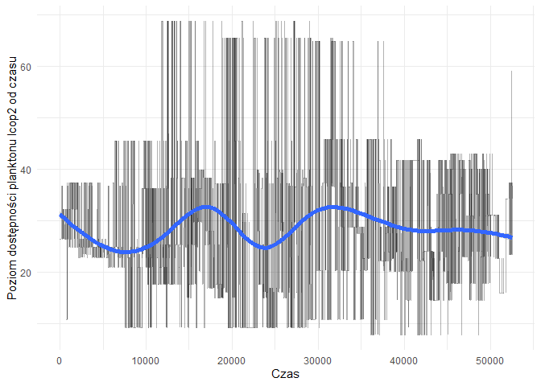

# Biblioteki:

```r
library(reshape2)
library(dplyr)
library(tidyr)
library(knitr)
library(ggplot2)
library(plotly)
library(corrplot)
library(shiny)
library(reshape)
library(randomForest)
library(caret)
```

# Wczytanie danych


Zbiór pochodzi z pliku "sledzie.csv",zwaiera16 atrybutów opisujących 52582 obserwacji. W zbiorze znajdują się 10094 niekompletnych obserwacji. Wartości puste w zbiorze reprezentowane sa za pomocą '?', a część dziesiętna liczb oddzielona jest kropką. Zbiór posiada nagłówek opisujący nazwy atrybutów.  By dane zostały wczytane poprawnie, do funcji read.csv przekazano takie argumenty jak: nazwa pliku, forma reprezentacji wartości pustych, że zbiór zawiera nagłówek oraz listę prezentującą klasy danych atrybutów.

# Powtarzalność wyników
W celu uzyskania powtarzalności wyników, ustawiono ziarno generatora na:

```r
set.seed(666)
```


# Analiza zbioru:
Na przestrzeni ostatnich lat zauważono stopniowy spadek rozmiaru śledzia oceanicznego wyławianego w Europie. Do analizy zebrano pomiary śledzi i warunków w jakich żyją z ostatnich 60 lat. Dane były pobierane z połowów komercyjnych jednostek. W ramach połowu jednej jednostki losowo wybierano od 50 do 100 sztuk trzyletnich śledzi. Dane dostępne są pod adresem: http://www.cs.put.poznan.pl/alabijak/emd/projekt/sledzie.csv.

Zbiór danych zawiera 16 atrybutów: \ 

length - długość złowionego śledzia [cm] \
cfin1  - dostępność planktonu [zagęszczenie Calanus finmarchicus gat. 1] \
cfin2  - dostępność planktonu [zagęszczenie Calanus finmarchicus gat. 2] \
chel1  - dostępność planktonu [zagęszczenie Calanus helgolandicus gat. 1] \
chel2  - dostępność planktonu [zagęszczenie Calanus helgolandicus gat. 2] \
lcop1  - dostępność planktonu [zagęszczenie widłonogów  gat. 1] \
lcop2  - dostępność planktonu [zagęszczenie widłonogów  gat. 2] \
fbar   - natężenie połowów w regionie [ułamek pozostawionego narybku] \
recr   - roczny narybek [liczba śledzi] \
cumf   - łączne roczne natężenie połowów w regionie [ułamek pozostawionego narybku] \
totaln - łączna liczba ryb złowionych w ramach połowu [liczba śledzi] \
sst    - temperatura przy powierzchni wody [°C] \
sal    - poziom zasolenia wody [Knudsen ppt] \
xmonth - miesiąc połowu [numer miesiąca] \
nao    - oscylacja północnoatlantycka [mb] \

Kolejne wiersze reprezentują kolejne obserwacje i są ułożone hronologicznie. 


```r
kable(summary(raw_df), caption = "Podsumowanie zbioru danych")
```


Table: Podsumowanie zbioru danych

           X             length         cfin1             cfin2             chel1            chel2            lcop1              lcop2             fbar             recr              cumf             totaln             sst             sal            xmonth            nao         
---  --------------  -------------  ----------------  ----------------  ---------------  ---------------  -----------------  ---------------  ---------------  ----------------  ----------------  ----------------  --------------  --------------  ---------------  -----------------
     Min.   :    0   Min.   :19.0   Min.   : 0.0000   Min.   : 0.0000   Min.   : 0.000   Min.   : 5.238   Min.   :  0.3074   Min.   : 7.849   Min.   :0.0680   Min.   : 140515   Min.   :0.06833   Min.   : 144137   Min.   :12.77   Min.   :35.40   Min.   : 1.000   Min.   :-4.89000 
     1st Qu.:13145   1st Qu.:24.0   1st Qu.: 0.0000   1st Qu.: 0.2778   1st Qu.: 2.469   1st Qu.:13.427   1st Qu.:  2.5479   1st Qu.:17.808   1st Qu.:0.2270   1st Qu.: 360061   1st Qu.:0.14809   1st Qu.: 306068   1st Qu.:13.60   1st Qu.:35.51   1st Qu.: 5.000   1st Qu.:-1.89000 
     Median :26291   Median :25.5   Median : 0.1111   Median : 0.7012   Median : 5.750   Median :21.673   Median :  7.0000   Median :24.859   Median :0.3320   Median : 421391   Median :0.23191   Median : 539558   Median :13.86   Median :35.51   Median : 8.000   Median : 0.20000 
     Mean   :26291   Mean   :25.3   Mean   : 0.4458   Mean   : 2.0248   Mean   :10.006   Mean   :21.221   Mean   : 12.8108   Mean   :28.419   Mean   :0.3304   Mean   : 520367   Mean   :0.22981   Mean   : 514973   Mean   :13.87   Mean   :35.51   Mean   : 7.258   Mean   :-0.09236 
     3rd Qu.:39436   3rd Qu.:26.5   3rd Qu.: 0.3333   3rd Qu.: 1.7936   3rd Qu.:11.500   3rd Qu.:27.193   3rd Qu.: 21.2315   3rd Qu.:37.232   3rd Qu.:0.4560   3rd Qu.: 724151   3rd Qu.:0.29803   3rd Qu.: 730351   3rd Qu.:14.16   3rd Qu.:35.52   3rd Qu.: 9.000   3rd Qu.: 1.63000 
     Max.   :52581   Max.   :32.5   Max.   :37.6667   Max.   :19.3958   Max.   :75.000   Max.   :57.706   Max.   :115.5833   Max.   :68.736   Max.   :0.8490   Max.   :1565890   Max.   :0.39801   Max.   :1015595   Max.   :14.73   Max.   :35.61   Max.   :12.000   Max.   : 5.08000 
     NA              NA             NA's   :1581      NA's   :1536      NA's   :1555     NA's   :1556     NA's   :1653       NA's   :1591     NA               NA                NA                NA                NA's   :1584    NA              NA               NA               

```r
uniq <- raw_df %>% summarise_each(funs(n_distinct(., na.rm = TRUE)))
kable(uniq, caption = "Unikalne wartości")
```


Table: Unikalne wartości

     X   length   cfin1   cfin2   chel1   chel2   lcop1   lcop2   fbar   recr   cumf   totaln   sst   sal   xmonth   nao
------  -------  ------  ------  ------  ------  ------  ------  -----  -----  -----  -------  ----  ----  -------  ----
 52582       59      39      48      48      51      48      51     51     52     52       53    51    51       12    45

## Długość śledzia  
Długość śledzia jest wyrażona w cm.

```r
plot_length <- ggplot(df,aes(X,length))  + geom_line(alpha=0.3) + stat_smooth(method="auto",size = 2)
plot_length <- plot_length + theme(axis.text.x=element_blank(),axis.ticks.x=element_blank()) + labs(x="Czas", y="Długość śledzia [cm]") + theme_minimal() 
plot_length
```

```
## `geom_smooth()` using method = 'gam' and formula 'y ~ s(x, bs = "cs")'
```

<!-- -->

```r
plot_length_hist<- ggplot(df,aes(length)) + geom_histogram(binwidth=0.5, color="white", fill="steelblue") +
  theme_minimal() + labs(x = "Długość", y = "Częstość") + ggtitle("Histogram długości śledzia") 
  
plot_length_hist
```

<!-- -->

## Dostępność planktonu - cfin1

```r
plot_plankton1 <- ggplot(df,aes(X,cfin1))  + geom_line(alpha=0.3) + stat_smooth(method="auto",size = 2)
plot_plankton1 <- plot_plankton1 + theme(axis.text.x=element_blank(),axis.ticks.x=element_blank()) + labs(x="Czas", y="Poziomu dostępności planktonu cfin1") + theme_minimal() 
plot_plankton1
```

```
## `geom_smooth()` using method = 'gam' and formula 'y ~ s(x, bs = "cs")'
```

<!-- -->

```r
plot_plankton1_hist<- ggplot(df,aes(cfin1)) + geom_histogram(binwidth=0.5, color="white", fill="steelblue") +
  theme_minimal() + labs(x = "Ilość", y = "Częstość") + ggtitle("Histogram dostępności cfin1") 
  
plot_plankton1_hist
```

<!-- -->

## Dostępność planktonu - cfin2


```r
plot_plankton2 <- ggplot(df,aes(X,cfin2))  + geom_line(alpha=0.3) + stat_smooth(method="auto",size = 2)
plot_plankton2 <- plot_plankton2 + theme(axis.text.x=element_blank(),axis.ticks.x=element_blank()) + labs(x="Czas", y="Poziom dostępności planktonu cfin2 od czasu") + theme_minimal() 
plot_plankton2
```

```
## `geom_smooth()` using method = 'gam' and formula 'y ~ s(x, bs = "cs")'
```

<!-- -->

```r
plot_plankton2_hist<- ggplot(df,aes(cfin2)) + geom_histogram(binwidth=0.5, color="white", fill="steelblue") +
  theme_minimal() + labs(x = "Ilość", y = "Częstość") + ggtitle("Histogram dostępności cfin2") 
  
plot_plankton2_hist
```

<!-- -->

## Dostępność planktonu - chel1


```r
plot_plankton3 <- ggplot(df,aes(X,chel1))  + geom_line(alpha=0.3) + stat_smooth(method="auto",size = 2)
plot_plankton3 <- plot_plankton3 + theme(axis.text.x=element_blank(),axis.ticks.x=element_blank()) + labs(x="Czas", y="Poziom dostępności planktonu chel1 od czasu") + theme_minimal() 
plot_plankton3
```

```
## `geom_smooth()` using method = 'gam' and formula 'y ~ s(x, bs = "cs")'
```

<!-- -->

```r
plot_plankton3_hist<- ggplot(df,aes(chel1)) + geom_histogram(binwidth=0.5, color="white", fill="steelblue") +
  theme_minimal() + labs(x = "Ilość", y = "Częstość") + ggtitle("Histogram dostępności chel1") 
  
plot_plankton3_hist
```

<!-- -->

## Dostępność planktonu - chel2


```r
plot_plankton3 <- ggplot(df,aes(X,chel2))  + geom_line(alpha=0.3) + stat_smooth(method="auto",size = 2)
plot_plankton3 <- plot_plankton3 + theme(axis.text.x=element_blank(),axis.ticks.x=element_blank()) + labs(x="Czas", y="Poziomu  dostępności planktonu chel2 od czasu") + theme_minimal() 
plot_plankton3
```

```
## `geom_smooth()` using method = 'gam' and formula 'y ~ s(x, bs = "cs")'
```

<!-- -->

```r
plot_plankton3_hist<- ggplot(df,aes(chel2)) + geom_histogram(binwidth=0.5, color="white", fill="steelblue") +
  theme_minimal() + labs(x = "Ilość", y = "Częstość") + ggtitle("Histogram dostępności chel2") 
  
plot_plankton3_hist
```

<!-- -->

## Dostępność planktonu - lcop1


```r
plot_plankton4 <- ggplot(df,aes(X,lcop1))  + geom_line(alpha=0.3) + stat_smooth(method="auto",size = 2)
plot_plankton4 <- plot_plankton4 + theme(axis.text.x=element_blank(),axis.ticks.x=element_blank()) + labs(x="Czas", y="Poziom dostępności planktonu lcop1 od czasu") + theme_minimal() 
plot_plankton4
```

```
## `geom_smooth()` using method = 'gam' and formula 'y ~ s(x, bs = "cs")'
```

<!-- -->

```r
plot_plankton4_hist<- ggplot(df,aes(lcop1)) + geom_histogram(binwidth=0.5, color="white", fill="steelblue") +
  theme_minimal() + labs(x = "Ilość", y = "Częstość") + ggtitle("Histogram dostępności lcop1") 
  
plot_plankton4_hist
```

<!-- -->

## Dostępność planktonu - lcop2


```r
plot_plankton5 <- ggplot(df,aes(X,lcop2))  + geom_line(alpha=0.3) + stat_smooth(method="auto",size = 2)
plot_plankton5 <- plot_plankton5 + theme(axis.text.x=element_blank(),axis.ticks.x=element_blank()) + labs(x="Czas", y="Poziom dostępności planktonu lcop2 od czasu") + theme_minimal() 
plot_plankton5
```

```
## `geom_smooth()` using method = 'gam' and formula 'y ~ s(x, bs = "cs")'
```

<!-- -->

```r
plot_plankton5_hist<- ggplot(df,aes(lcop2)) + geom_histogram(binwidth=0.5, color="white", fill="steelblue") +
  theme_minimal() + labs(x = "Ilość", y = "Częstość") + ggtitle("Histogram dostępności lcop2") 
  
plot_plankton5_hist
```

<!-- -->

## Natężenie połowów w regionie - fbar 


```r
plot_polow <- ggplot(df,aes(X,fbar))  + geom_line(alpha=0.3) + stat_smooth(method="auto",size = 2)
plot_polow <- plot_polow + theme(axis.text.x=element_blank(),axis.ticks.x=element_blank()) + labs(x="Czas", y="Natężenie połowów w regionie od czasu - fbar") + theme_minimal() 
plot_polow
```

```
## `geom_smooth()` using method = 'gam' and formula 'y ~ s(x, bs = "cs")'
```

<!-- -->

```r
plot_polow_hist<- ggplot(df,aes(fbar)) + geom_histogram(binwidth=0.5, color="white", fill="steelblue") +
  theme_minimal() + labs(x = "Natężenie", y = "Częstość") + ggtitle("Histogram natężenie połowu w rejonie -  fbar") 
  
plot_polow_hist
```

<!-- -->

## Poziom rocznego narybku - recr


```r
plot_recr <- ggplot(df,aes(X,recr))  + geom_line(alpha=0.3) + stat_smooth(method="auto",size = 2)
plot_recr <- plot_recr + theme(axis.text.x=element_blank(),axis.ticks.x=element_blank()) + labs(x="Czas", y="Poziom rocznego narybku od czasu - recr") + theme_minimal() 
plot_recr
```

```
## `geom_smooth()` using method = 'gam' and formula 'y ~ s(x, bs = "cs")'
```

<!-- -->

```r
plot_recr_hist<- ggplot(df,aes(recr)) + geom_histogram(binwidth=160000, color="white", fill="steelblue") +
  theme_minimal() + labs(x = "Roczny narybek", y = "Częstość") + ggtitle("Histogram rocznego narybku - recr") 
  
plot_recr_hist
```

<!-- -->

## Roczne natęzenie połowow - cumf


```r
plot_cumf <- ggplot(df,aes(X,cumf))  + geom_line(alpha=0.3) + stat_smooth(method="auto",size = 2)
plot_cumf <- plot_cumf + theme(axis.text.x=element_blank(),axis.ticks.x=element_blank()) + labs(x="Czas", y="Łączne roczne natężenie połowów w regionie") + theme_minimal() 
plot_cumf
```

```
## `geom_smooth()` using method = 'gam' and formula 'y ~ s(x, bs = "cs")'
```

<!-- -->

```r
plot_cumf_hist<- ggplot(df,aes(cumf)) + geom_histogram(binwidth=0.5, color="white", fill="steelblue") +
  theme_minimal() + labs(x = "Ilość", y = "Częstość") + ggtitle("Histogram łącznego rocznego natężenia połowów w regionie - cumf") 
  
plot_cumf_hist
```

<!-- -->

## Liczba zlowionych ryb - totaln


```r
plot_totaln <- ggplot(df,aes(X,totaln))  + geom_line(alpha=0.3) + stat_smooth(method="auto",size = 2)
plot_totaln <- plot_totaln + theme(axis.text.x=element_blank(),axis.ticks.x=element_blank()) + labs(x="Czas", y="Liczba złowionych ryb w ramach połowu") + theme_minimal() 
plot_totaln
```

```
## `geom_smooth()` using method = 'gam' and formula 'y ~ s(x, bs = "cs")'
```

<!-- -->

```r
plot_totaln_hist<- ggplot(df,aes(totaln)) + geom_histogram(binwidth=100000, color="white", fill="steelblue") +
  theme_minimal() + labs(x = "Ilość złowionych ryb", y = "Częstość") + ggtitle("Histogram łącznej liczby złowionych ryb w ramach połowu - totaln") 
  
plot_totaln_hist
```

<!-- -->

## Temperatura przy powiechni wody - sst
Atrubut sst zawiera informacje o temperaturze przy powierzchni wody, oraz jest wyrażony w stopniach Celcjusza


```r
plot_sst <- ggplot(df,aes(X,sst))  + geom_line(alpha=0.3) + stat_smooth(method="auto",size = 2)
plot_sst <- plot_sst + theme(axis.text.x=element_blank(),axis.ticks.x=element_blank()) + labs(x="Czas", y="Temperatura przy powierzchni wody [C]") + theme_minimal() 
plot_sst
```

```
## `geom_smooth()` using method = 'gam' and formula 'y ~ s(x, bs = "cs")'
```

<!-- -->

```r
plot_sst_hist<- ggplot(df,aes(sst)) + geom_histogram(binwidth=0.5, color="white", fill="steelblue") +
  theme_minimal() + labs(x = "Temperatura", y = "Częstość") + ggtitle("Histogram temperatury przy powierzchni wody - sst") 
  
plot_sst_hist
```

<!-- -->

## Poziom zasolenia wody - sal
Atrybut sal opisuje poziom zasolenia wody morskiej. Wartości wyrażone są w Knudsen ppt.

```r
plot_sal <- ggplot(df,aes(X,sal))  + geom_line(alpha=0.3) + stat_smooth(method="auto",size = 2)
plot_sal <- plot_sal + theme(axis.text.x=element_blank(),axis.ticks.x=element_blank()) + labs(x="Czas", y="Poziom zasolenia wody [ppt]") + theme_minimal() 
plot_sal
```

```
## `geom_smooth()` using method = 'gam' and formula 'y ~ s(x, bs = "cs")'
```

<!-- -->

```r
plot_sal_hist<- ggplot(df,aes(sal)) + geom_histogram(binwidth=0.05, color="white", fill="steelblue") +
  theme_minimal() + labs(x = "Poziom zasolenia", y = "Częstość") + ggtitle("Histogram poziomu zasolenia wody - sal") 
  
plot_sal_hist
```

<!-- -->

## Ostylacja północnoatlantycak - nao
Atrybut nao przedstawia natężenie globalnej cyrkulacji powietrza i wody oceanicznej. Jest zależny od ciśnienia, temperatury, prędkości wiatru i ilości opadów.


```r
plot_nao <- ggplot(df,aes(X,nao))  + geom_line(alpha=0.3) + stat_smooth(method="auto",size = 2)
plot_nao <- plot_nao + theme(axis.text.x=element_blank(),axis.ticks.x=element_blank()) + labs(x="Czas", y="Oscylacja północnoatlantycka") + theme_minimal() 
plot_nao
```

```
## `geom_smooth()` using method = 'gam' and formula 'y ~ s(x, bs = "cs")'
```

<!-- -->

```r
plot_nao_hist<- ggplot(df,aes(nao)) + geom_histogram(binwidth=0.5, color="white", fill="steelblue") +
  theme_minimal() + labs(x = "Ilość", y = "Częstość") + ggtitle("Histogram oscylacji północnoatlantyckiej - nao") 
  
plot_nao_hist
```

<!-- -->


# Analiza brakujących wartości.


Brakujące wartości występują tylko w 7 atrybutach: \
- dostępność planktonu -> cfin1, cfin2, chel1, chel2, lcop1, lcop2, \
- temperatura przy powierzchni wody -> sst. \
Łącznie niepełnych obserwacji mamy: 10094, czyli jest to 19.1966833 % całego zbiioru.
Jest to znacząca część zbioru. Jednak zakładamy, że zbiór danych zawiera chronologiczne ułożone dane, dlatego proste operacje na wartościach pustych, takie jak średnia lub mediana z danego atrybutu, mogą całkowicie przekłamać nam rozkład danych. Ze względu na ilość tych danych usunięcie ich może róWnież spowodować różne skutki. Jednak dzięki temu można uznać, że operacje która została dokonana na wartościach pustych, miała jakikolwiek pozytywny lub negatywny na dalsze przetwarzanie. 

```r
df <- df_no_na
```

# Korelacja między atrybutami

```r
correlation <- cor(df_no_na)
corrplot(correlation,type="upper",tl.col = "black", tl.srt = 45)
```

<!-- -->
Największą korelację można zaobserwować między parami: `chel1` - `loop1` ,`chel2` - `loop2`,  `fbar` - `cumf`, `cfin2` - `lcop2` oraz `cumf` - `totaln`.
W stosunku do atrybutu 'length' najwyższą korelacje można zaobserwować z  `sst`, `nao`.
Nao jest to Oscylacja Północnoatlantycka, która jest zjawiskiem meteorologicznym. Występuje w obszarze północnego atlantyku i ma wpływ na klimat otaczających go kontynentów. Jej działalność związana jest z cyrkulacją powietrza i wody, co by tłumaczyło zależność długości śledzia od tych dwóch atrybutów na raz. 
`length` jest także skorelowany z intensywnościa połowów oraz dostępnością planktonu (chel1 - Calanus helgolandicus gat. 1 i lcop1 - widłonogów  gat. 1).


# Zmiana rozmiaru śledzia w czasie

```r
partition <- createDataPartition(y=df_no_na$length, p=.05, list=FALSE)
dfPartition <- df_no_na[partition, ]
p <- ggplot(dfPartition, aes(x=X, y=length)) + geom_point() + geom_smooth() + theme_bw()
p
```

```
## `geom_smooth()` using method = 'gam' and formula 'y ~ s(x, bs = "cs")'
```

<!-- -->


# Regresor 
Sekcję próbującą stworzyć regresor przewidujący rozmiar śledzia (w tej sekcji należy wykorzystać wiedzę z pozostałych punktów oraz wykonać dodatkowe czynności, które mogą poprawić trafność predykcji); dobór parametrów modelu oraz oszacowanie jego skuteczności powinny zostać wykonane za pomocą techniki podziału zbioru na dane uczące, walidujące i testowe; trafność regresji powinna zostać oszacowana na podstawie miar R2 i RMSE.

Dane zostały podzielone na 2 zbiory: zbiór treningowy - zawierający 80 % danych, oraz zbiór testowy - zawierający 20 % 


```r
afterFeatureSelection <- df_no_na %>% select(length, cfin1, cfin2, chel1, chel2, lcop1, lcop2, fbar, recr, cumf, totaln, sst, sal, nao)

inTraining <- createDataPartition(y=afterFeatureSelection$length,p=0.8,list = F)
training <- afterFeatureSelection[inTraining,]
testing <- afterFeatureSelection[-inTraining,]
X_train = select(training, -length)
y_train = training$length
X_test = select(testing, -length)
y_test = testing$length
```
COS O MODELU

```r
fit <- train(X_train,y_train,
            method = 'rf',
             trControl = ctrl,
             metric = "RMSE",
             tuneGrid=rfGrid,
             importance = TRUE,
             ntree=20)
ggplot(fit) + ggtitle("Optymalizacja parametru mtry na podstawie miary RMSE") + theme_bw()
```

<!-- -->

Sprawdzenie modelu na danych testowych

```r
predictions <- predict(fit, newdata = X_test)
modelValues <- data.frame(obs = y_test, pred = predictions)
kable(fit$results, caption = "Tabela wyników z podzbioru uczącego")
```


Table: Tabela wyników z podzbioru uczącego

 mtry       RMSE    Rsquared         MAE      RMSESD   RsquaredSD       MAESD
-----  ---------  ----------  ----------  ----------  -----------  ----------
    1   1.191016   0.4814546   0.9408527   0.0088770    0.0070564   0.0066071
    2   1.190781   0.4816634   0.9405444   0.0088491    0.0071403   0.0065099
    3   1.190771   0.4816592   0.9405148   0.0088704    0.0070689   0.0064455
    4   1.190692   0.4817293   0.9404672   0.0089877    0.0071602   0.0064862
    5   1.190693   0.4817204   0.9402680   0.0088012    0.0071579   0.0063432
    6   1.190703   0.4817234   0.9402743   0.0089912    0.0072815   0.0065609


Model regresyjny został poddany testom na danych testowych. Osiągnięto wynik w postaci miar RMSE i Rsquared:


                    x
---------  ----------
RMSE        1.1774105
Rsquared    0.4801605
MAE         0.9356735


```r
xs <- 1:length(y_test)
dataf <- data.frame(xs,y_test)
reg_plot_test <- ggplot(dataf,aes(dataf$xs,dataf$y_test)) + 
  geom_point(alpha = 0.5, size = 0.7,color="blue") + 
  geom_smooth(aes(y=dataf$y_test,colour = "trend"), size = 2) +
  coord_cartesian(ylim = c(19, 31)) +
  theme_minimal() + theme(legend.position = "none") +
  labs(x = "Nr przykładu", y = "Długość śledzia ") + 
  ggtitle("Wykres długości śledzia od czasu - dane testowe") 
reg_plot_test
```

```
## `geom_smooth()` using method = 'gam' and formula 'y ~ s(x, bs = "cs")'
```

<!-- -->

```r
xs <- 1:length(predictions)
dataf <- data.frame(xs,predictions)
reg_plot_test <- ggplot(dataf,aes(dataf$xs,dataf$predictions)) + 
  geom_point(alpha = 0.5, size = 0.7,color="blue") + 
  geom_smooth(aes(y=dataf$predictions,colour = "trend"), size = 2) +
  coord_cartesian(ylim = c(19, 31)) +
  theme_minimal() + theme(legend.position = "none") +
  labs(x = "Nr przykładu", y = "Długość śledzia ") + 
  ggtitle("Wykres długości śledzia od czasu - predykcja") 
reg_plot_test
```

```
## `geom_smooth()` using method = 'gam' and formula 'y ~ s(x, bs = "cs")'
```

<!-- -->


# Analiza ważności atrybutów

```r
importance <- varImp(fit, scale = FALSE)
ggplot(importance)
```

<!-- -->

Z wykresu wynika, że najważniejszym atrybutem jest sst - temperatura przy powierzchni wody. Jego dominacja nad pozostałymi atrybutmami jest dość znacząca. Na drugim miejscu znajduje się totaln oraz lcop2, czyli liczość połowów oraz dostępność planktonu - zagęszczenie widłonogów gat. 2. Co ciekawe żadne z tych atrybutów nie miały znacząjek korelacji między sobą.

## Zależność długości śledzia od temperatury przy powiechni

```r
df_sst_length <- df_no_na %>% select(X,sst,length)
df_sst_length2 <- melt(df_sst_length,id.vars = 'X')
fin_plot_tlen <- ggplot(df_sst_length2,aes(x = X, y=value)) + 
  geom_point(size = 0.5, alpha = 0.5, color="grey") +
  geom_smooth(size = 2) +
  facet_grid(variable~. ,scales = 'free')  + theme_minimal() + 
  labs(x = "Czas", y = "Temperatura / Długość") + 
  scale_x_continuous() + 
  ggtitle("Wykresy temperatury przy powiechni wody oraz długości śledzia od czasu") 
fin_plot_tlen
```

```
## `geom_smooth()` using method = 'gam' and formula 'y ~ s(x, bs = "cs")'
```

<!-- -->

```r
df_planct <- df_no_na %>% select(X,lcop2,totaln,length)
df_planct2 <- melt(df_planct,id.vars = 'X')
fin_plot_tlen <- ggplot(df_planct2,aes(x = X, y=value)) + 
  geom_point(size = 0.5, alpha = 0.5, color="grey") +
  geom_smooth(size = 2) +
  facet_grid(variable~. ,scales = 'free')  + theme_minimal() + 
  labs(x = "Czas", y = "Plantkon, połowy / Długość") + 
  scale_x_continuous() + 
  ggtitle("Wykresy ilości planktonu, połowów oraz długości śledzia od czasu") 
fin_plot_tlen
```

```
## `geom_smooth()` using method = 'gam' and formula 'y ~ s(x, bs = "cs")'
```

<!-- -->

# Wnioski
Na podstawie wykonanej analizy można stwierdzić, że największy wpływ na pomniejszenie się śledzi ma temperatura powietrza przy powiechni wody. Następnym czynnikem jest ilość połowów oraz liczba planktonu. Są to według koleracji niezależne od siebie atrybuty, ale może gdyby przeprowadzić dokładniejsze badania na ich temat wynik byłby inny. Przez ilość niepełnych obserwacji wyniki badań mogą być w pewnym stopniu przekłamane. Ciekawym rozwiązaniem mogło by być, stworzenie klasyfikatora, który uzupełnia brakujące dane, a następnie ponowna próba przeprowadzenia takich badań. 

# Interaktywny Wykres
W celu wygenerowania interaktywnego wykresu za pomocą biblioteki shiny, dane z kolumny lenght zostały pogrupowane po 50 kolejnych elementów, a z takich grup policzona średnia. Wykonano to by "suwak" na wykresie nie był za długi. Niestety biblioteka shiny nie daje możliwości na wykorzystanie jej w statycznym pliku raportu, dlatego kod do wykonania takiego wykresu znajduje się w pliku "library.R".
