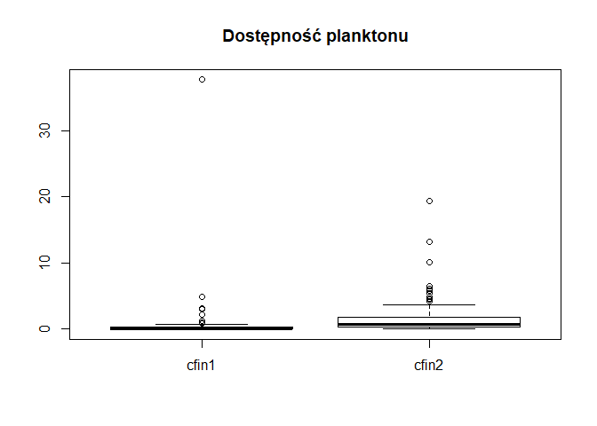
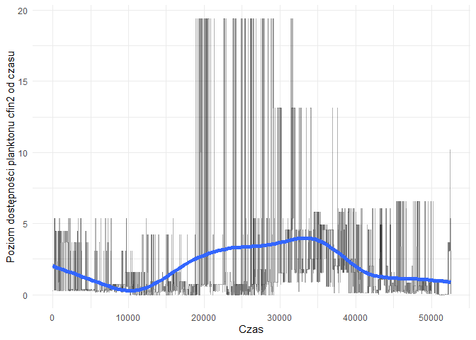

# Biblioteki:

```r
library(reshape2)
library(dplyr)
library(tidyr)
library(knitr)
library(ggplot2)
library(plotly)
library(corrplot)
library(shiny)
library(reshape)
library(randomForest)
library(caret)
```

# Wczytanie danych


Zbiór pochodzi z pliku "sledzie.csv",zwaiera16 atrybutów opisujących 52582 obserwacji. W zbiorze znajdują się 10094 niekompletnych obserwacji. Wartości puste w zbiorze reprezentowane sa za pomocą '?', a część dziesiętna liczb oddzielona jest kropką. Zbiór posiada nagłówek opisujący nazwy atrybutów.  By dane zostały wczytane poprawnie, do funcji read.csv przekazano takie argumenty jak: nazwa pliku, forma reprezentacji wartości pustych, że zbiór zawiera nagłówek oraz listę prezentującą klasy danych atrybutów.

# Analiza zbioru:
Zbiór danych zawiera 16 atrybutów: \ 

length - długość złowionego śledzia [cm] \
cfin1  - dostępność planktonu [zagęszczenie Calanus finmarchicus gat. 1] \
cfin2  - dostępność planktonu [zagęszczenie Calanus finmarchicus gat. 2] \
chel1  - dostępność planktonu [zagęszczenie Calanus helgolandicus gat. 1] \
chel2  - dostępność planktonu [zagęszczenie Calanus helgolandicus gat. 2] \
lcop1  - dostępność planktonu [zagęszczenie widłonogów  gat. 1] \
lcop2  - dostępność planktonu [zagęszczenie widłonogów  gat. 2] \
fbar   - natężenie połowów w regionie [ułamek pozostawionego narybku] \
recr   - roczny narybek [liczba śledzi] \
cumf   - łączne roczne natężenie połowów w regionie [ułamek pozostawionego narybku] \
totaln - łączna liczba ryb złowionych w ramach połowu [liczba śledzi] \
sst    - temperatura przy powierzchni wody [°C] \
sal    - poziom zasolenia wody [Knudsen ppt] \
xmonth - miesiąc połowu [numer miesiąca] \
nao    - oscylacja północnoatlantycka [mb] \

Kolejne wiersze reprezentują kolejne obserwacje i są ułożone hronologicznie. 


```r
kable(summary(raw_df), caption = "Podsumowanie zbioru danych")
```


Table: Podsumowanie zbioru danych

           X             length         cfin1             cfin2             chel1            chel2            lcop1              lcop2             fbar             recr              cumf             totaln             sst             sal            xmonth            nao         
---  --------------  -------------  ----------------  ----------------  ---------------  ---------------  -----------------  ---------------  ---------------  ----------------  ----------------  ----------------  --------------  --------------  ---------------  -----------------
     Min.   :    0   Min.   :19.0   Min.   : 0.0000   Min.   : 0.0000   Min.   : 0.000   Min.   : 5.238   Min.   :  0.3074   Min.   : 7.849   Min.   :0.0680   Min.   : 140515   Min.   :0.06833   Min.   : 144137   Min.   :12.77   Min.   :35.40   Min.   : 1.000   Min.   :-4.89000 
     1st Qu.:13145   1st Qu.:24.0   1st Qu.: 0.0000   1st Qu.: 0.2778   1st Qu.: 2.469   1st Qu.:13.427   1st Qu.:  2.5479   1st Qu.:17.808   1st Qu.:0.2270   1st Qu.: 360061   1st Qu.:0.14809   1st Qu.: 306068   1st Qu.:13.60   1st Qu.:35.51   1st Qu.: 5.000   1st Qu.:-1.89000 
     Median :26291   Median :25.5   Median : 0.1111   Median : 0.7012   Median : 5.750   Median :21.673   Median :  7.0000   Median :24.859   Median :0.3320   Median : 421391   Median :0.23191   Median : 539558   Median :13.86   Median :35.51   Median : 8.000   Median : 0.20000 
     Mean   :26291   Mean   :25.3   Mean   : 0.4458   Mean   : 2.0248   Mean   :10.006   Mean   :21.221   Mean   : 12.8108   Mean   :28.419   Mean   :0.3304   Mean   : 520367   Mean   :0.22981   Mean   : 514973   Mean   :13.87   Mean   :35.51   Mean   : 7.258   Mean   :-0.09236 
     3rd Qu.:39436   3rd Qu.:26.5   3rd Qu.: 0.3333   3rd Qu.: 1.7936   3rd Qu.:11.500   3rd Qu.:27.193   3rd Qu.: 21.2315   3rd Qu.:37.232   3rd Qu.:0.4560   3rd Qu.: 724151   3rd Qu.:0.29803   3rd Qu.: 730351   3rd Qu.:14.16   3rd Qu.:35.52   3rd Qu.: 9.000   3rd Qu.: 1.63000 
     Max.   :52581   Max.   :32.5   Max.   :37.6667   Max.   :19.3958   Max.   :75.000   Max.   :57.706   Max.   :115.5833   Max.   :68.736   Max.   :0.8490   Max.   :1565890   Max.   :0.39801   Max.   :1015595   Max.   :14.73   Max.   :35.61   Max.   :12.000   Max.   : 5.08000 
     NA              NA             NA's   :1581      NA's   :1536      NA's   :1555     NA's   :1556     NA's   :1653       NA's   :1591     NA               NA                NA                NA                NA's   :1584    NA              NA               NA               

```r
uniq <- raw_df %>% summarise_each(funs(n_distinct(., na.rm = TRUE)))
kable(uniq, caption = "Unikalne wartości")
```


Table: Unikalne wartości

     X   length   cfin1   cfin2   chel1   chel2   lcop1   lcop2   fbar   recr   cumf   totaln   sst   sal   xmonth   nao
------  -------  ------  ------  ------  ------  ------  ------  -----  -----  -----  -------  ----  ----  -------  ----
 52582       59      39      48      48      51      48      51     51     52     52       53    51    51       12    45
# Rozkład wartości atrybutów 

```r
boxplot(df_no_na$length, horizontal = TRUE, main="Długość złowionego śledzia [cm]")
```

<!-- -->

```r
boxplot(df_no_na[,3:4], main="Dostępność planktonu", 
        names=c("cfin1","cfin2"))
```

<!-- -->

```r
boxplot(df_no_na[,5:6], main="Dostępność planktonu", 
        names=c("chel1","chel2"))
```

<!-- -->

```r
boxplot(df_no_na[,7:8], main="Dostępność planktonu", 
        names=c("lcop1","lcop2"))
```

<!-- -->

```r
boxplot(df_no_na$fbar, horizontal=TRUE, main="Natężenie połowów w regionie")
```

<!-- -->

```r
boxplot(df_no_na$recr, horizontal=TRUE, main="Roczny narybek")
```

<!-- -->

```r
boxplot(df_no_na$cumf, horizontal=TRUE, main="Łączne roczne natężenie połowów w regionie")
```

<!-- -->

```r
boxplot(df_no_na$totaln, horizontal=TRUE, main="Łączna liczba ryb złowionych w ramach połowu")
```

<!-- -->

```r
boxplot(df_no_na$sst, horizontal=TRUE, main="Temperatura przy powierzchni wody")
```

<!-- -->

```r
boxplot(df_no_na$sal, horizontal=TRUE, main="Poziom zasolenia wody")
```

<!-- -->

```r
boxplot(df_no_na$nao, horizontal=TRUE, main="Oscylacja północnoatlantycka")
```

<!-- -->


# Analiza brakujących wartości.


```r
for (i in 1:ncol(df)){df[is.na(df[,i]),i] <- mean(df[,i],na.rm = T)}
```
Brakujące wartości występują tylko w 7 atrybutach: \
- dostępność planktonu -> cfin1, cfin2, chel1, chel2, lcop1, lcop2, \
- temperatura przy powierzchni wody -> sst. \
Łącznie niepełnych obserwacji mamy: 10094, czyli jest to 19.1966833 % całego zbiioru. Usunięcie takiej ilości obserwacji ze względu na braki w jednej cesze może być dużo bardziej szkodliwe niż podmienienie ich na wartości średnie lub mediane danej cechy.
Można by spróbować, ze względu na chronologiczne ułożenie danych, obliczać średnią z wartości poprzedzającej wartość pustą oraz następującej po wartości pustej, jednak to może spowodować duże przekłamanie w danych. Średnia jest bezpieczniejszym rozwiązaniem, która nie psuje tak mocno rozkładu danych.


# Korelacja między atrybutami

```r
correlation <- cor(df_no_na)
corrplot(correlation,type="upper",tl.col = "black", tl.srt = 45)
```

<!-- -->
Największą korelację można zaobserwować między parami: `chel1` - `loop1` ,`chel2` - `loop2`,  `fbar` - `cumf`, `cfin2` - `lcop2` oraz `cumf` - `totaln`.
W stosunku do atrybutu 'length' najwyższą korelacje można zaobserwować z  `sst`, `nao`.
Nao jest to Oscylacja Północnoatlantycka, która jest zjawiskiem meteorologicznym. Występuje w obszarze północnego atlantyku i ma wpływ na klimat otaczających go kontynentów. Jej działalność związana jest z cyrkulacją powietrza i wody, co by tłumaczyło zależność długości śledzia od tych dwóch atrybutów na raz. 
`length` jest także skorelowany z intensywnościa połowów oraz dostępnością planktonu (chel1 - Calanus helgolandicus gat. 1 i lcop1 - widłonogów  gat. 1).


# Zmiana rozmiaru śledzia w czasie

```r
partition <- createDataPartition(y=df_no_na$length, p=.05, list=FALSE)
dfPartition <- df_no_na[partition, ]
p <- ggplot(dfPartition, aes(x=X, y=length)) + geom_point() + geom_smooth() + theme_bw()
ggplotly(p)
```

```
## `geom_smooth()` using method = 'gam' and formula 'y ~ s(x, bs = "cs")'
```

<!--html_preserve--><div id="htmlwidget-8b1f66cc550e23c38335" style="width:672px;height:480px;" class="plotly html-widget"></div>
<script type="application/json" data-for="htmlwidget-8b1f66cc550e23c38335">{"x":{"data":[{"x":[2,17,62,66,101,103,109,169,226,296,308,381,386,400,506,519,520,528,554,580,614,664,714,723,731,759,794,828,877,924,932,969,1002,1102,1118,1127,1213,1243,1246,1264,1283,1315,1363,1393,1404,1410,1417,1426,1444,1451,1455,1476,1506,1528,1546,1573,1592,1600,1604,1649,1685,1755,1768,1818,1903,1948,2005,2016,2023,2032,2040,2066,2085,2107,2118,2145,2180,2196,2200,2233,2239,2270,2278,2286,2317,2418,2522,2538,2540,2541,2556,2580,2586,2592,2612,2628,2705,2734,2800,2806,2814,2824,2849,2850,2867,2869,2899,2928,2949,2981,3016,3048,3064,3192,3193,3227,3235,3236,3254,3255,3257,3260,3261,3279,3286,3310,3324,3336,3353,3440,3456,3469,3486,3517,3520,3551,3606,3607,3611,3628,3648,3651,3668,3678,3709,3724,3750,3753,3764,3768,3827,3830,3832,3853,3877,3891,3924,3928,3964,3975,4007,4032,4033,4056,4093,4094,4097,4099,4120,4124,4159,4167,4177,4179,4189,4247,4264,4285,4293,4316,4374,4384,4389,4426,4427,4457,4467,4487,4492,4585,4590,4624,4659,4665,4672,4722,4736,4750,4818,4848,4863,4878,4897,4909,4918,4994,5008,5019,5027,5029,5041,5058,5062,5076,5079,5086,5098,5111,5141,5160,5162,5198,5216,5238,5245,5251,5262,5296,5349,5352,5385,5396,5413,5417,5466,5470,5508,5534,5540,5583,5585,5633,5675,5676,5738,5857,5880,5948,5952,5973,6022,6049,6054,6250,6323,6362,6393,6452,6458,6466,6493,6495,6517,6529,6552,6560,6582,6636,6637,6647,6725,6730,6735,6758,6775,6783,6791,6805,6808,6810,6821,6859,6867,6906,6917,6940,6955,6977,6986,6993,7019,7022,7036,7063,7070,7095,7112,7131,7151,7189,7257,7288,7319,7330,7342,7356,7363,7378,7395,7396,7418,7428,7447,7449,7495,7542,7554,7575,7606,7612,7622,7624,7641,7666,7687,7701,7719,7723,7800,7807,7840,7858,7859,7862,7894,7904,7920,7943,8037,8112,8126,8141,8143,8197,8218,8246,8276,8277,8334,8339,8386,8470,8524,8526,8546,8559,8580,8603,8604,8618,8629,8710,8720,8749,8806,8830,8900,8922,8930,8954,9016,9027,9064,9065,9072,9084,9090,9099,9115,9131,9132,9188,9251,9258,9264,9269,9271,9302,9306,9308,9316,9337,9342,9382,9392,9393,9411,9418,9471,9501,9506,9515,9549,9571,9599,9649,9664,9669,9719,9752,9788,9887,9915,9927,9942,9956,9981,9994,10011,10014,10015,10049,10059,10086,10092,10109,10115,10128,10142,10190,10204,10213,10256,10302,10346,10354,10468,10491,10502,10504,10524,10526,10535,10552,10585,10622,10653,10656,10662,10712,10715,10767,10785,10790,10825,10847,10911,10923,10944,10957,10977,11013,11028,11073,11124,11171,11188,11189,11199,11202,11206,11209,11298,11299,11318,11321,11329,11339,11342,11393,11443,11457,11496,11522,11540,11555,11581,11596,11627,11632,11634,11645,11658,11786,11790,11824,11853,11856,11880,11913,11917,11993,12011,12014,12052,12068,12073,12100,12113,12118,12127,12183,12224,12238,12323,12333,12343,12358,12371,12390,12393,12427,12459,12479,12490,12495,12500,12534,12539,12555,12561,12564,12567,12633,12656,12665,12720,12773,12799,12818,12823,12873,12879,12888,12891,12913,12944,13009,13083,13097,13119,13127,13151,13194,13272,13290,13291,13298,13308,13312,13332,13380,13401,13402,13420,13437,13473,13490,13538,13543,13582,13595,13621,13665,13666,13668,13690,13708,13739,13779,13788,13899,13951,13966,13969,13993,14031,14035,14054,14073,14090,14095,14131,14152,14154,14166,14222,14275,14300,14305,14365,14377,14378,14410,14413,14459,14492,14542,14544,14562,14566,14574,14621,14630,14631,14667,14748,14750,14778,14821,14835,14836,14840,14886,14908,14914,14917,14929,14952,14954,14958,15030,15103,15116,15123,15145,15160,15179,15207,15234,15243,15248,15252,15257,15266,15278,15279,15281,15282,15287,15291,15337,15351,15358,15383,15402,15403,15414,15420,15423,15433,15453,15463,15470,15474,15476,15484,15497,15575,15581,15620,15636,15640,15651,15654,15694,15696,15699,15705,15714,15763,15780,15809,15880,15934,15950,15957,15961,15962,16064,16175,16179,16188,16222,16226,16264,16281,16287,16297,16319,16348,16371,16377,16419,16421,16458,16465,16467,16505,16538,16577,16592,16647,16659,16666,16672,16675,16749,16767,16769,16842,16913,16935,17019,17041,17046,17089,17101,17114,17229,17241,17264,17267,17300,17348,17358,17361,17395,17430,17481,17483,17525,17588,17642,17661,17673,17688,17696,17705,17719,17728,17751,17804,17900,17901,17927,17930,17938,18028,18036,18043,18122,18140,18165,18215,18265,18286,18395,18401,18408,18471,18484,18497,18547,18556,18564,18605,18686,18694,18706,18783,18786,18892,18923,18932,19072,19086,19097,19125,19156,19158,19164,19176,19254,19330,19356,19385,19395,19420,19421,19435,19446,19457,19463,19492,19534,19547,19597,19626,19643,19665,19688,19697,19730,19837,19877,19902,19922,19923,19931,19959,19995,20018,20071,20154,20167,20171,20186,20190,20194,20204,20214,20252,20382,20406,20410,20429,20446,20489,20494,20510,20526,20550,20565,20576,20619,20624,20665,20751,20757,20775,20777,20805,20815,20824,20900,20927,20955,21052,21075,21085,21108,21111,21141,21195,21200,21221,21224,21242,21295,21315,21317,21331,21389,21404,21441,21462,21469,21548,21593,21600,21615,21630,21743,21748,21764,21805,21809,21825,21836,21843,21873,21891,21903,21914,21930,21937,21941,21990,22058,22074,22137,22153,22164,22167,22225,22228,22281,22283,22310,22388,22404,22434,22437,22443,22459,22467,22474,22510,22568,22578,22603,22608,22671,22714,22749,22754,22763,22766,22792,22808,22851,22858,22860,22872,22876,22921,22949,22951,22967,22970,23016,23080,23090,23110,23117,23133,23160,23161,23225,23229,23295,23374,23431,23445,23461,23485,23515,23527,23580,23582,23596,23623,23647,23654,23662,23669,23671,23674,23683,23702,23717,23725,23753,23760,23779,23816,23853,23859,23868,23903,23926,23944,23949,23951,24005,24006,24018,24059,24089,24137,24149,24168,24260,24266,24276,24294,24355,24367,24378,24383,24385,24409,24439,24457,24469,24521,24528,24573,24615,24620,24625,24627,24652,24665,24673,24686,24722,24797,24842,24893,24898,24981,24982,24988,24994,25007,25096,25195,25248,25324,25353,25372,25373,25385,25439,25452,25480,25505,25506,25513,25515,25516,25537,25556,25558,25560,25651,25652,25653,25688,25701,25714,25740,25759,25762,25833,25858,25946,25948,25976,25997,26007,26033,26038,26044,26072,26114,26125,26132,26209,26306,26341,26380,26387,26392,26402,26408,26437,26446,26479,26513,26533,26553,26558,26571,26578,26589,26593,26610,26614,26615,26621,26639,26665,26667,26677,26699,26768,26780,26788,26799,26815,26947,26959,26965,26987,27066,27077,27099,27157,27164,27188,27231,27253,27256,27259,27300,27301,27336,27343,27348,27355,27368,27405,27410,27537,27598,27612,27649,27686,27717,27766,27792,27799,27814,27830,27846,27861,27868,27916,27990,28001,28037,28059,28064,28124,28142,28163,28179,28181,28227,28233,28256,28298,28318,28354,28377,28409,28434,28459,28481,28504,28508,28532,28582,28595,28600,28658,28671,28682,28697,28738,28742,28743,28749,28820,28833,28851,28852,28876,28897,28900,28909,28931,28942,28972,28981,29071,29145,29156,29158,29197,29205,29229,29315,29325,29334,29374,29389,29395,29404,29442,29454,29507,29524,29620,29679,29709,29719,29740,29755,29763,29766,29778,29793,29799,29878,29916,29919,29984,30010,30021,30022,30032,30069,30089,30124,30243,30263,30373,30382,30416,30421,30441,30446,30464,30523,30542,30546,30602,30648,30650,30716,30718,30738,30775,30783,30815,30841,30843,30857,30875,30897,30902,30916,30920,30973,31048,31061,31063,31081,31146,31174,31178,31184,31187,31192,31202,31240,31250,31264,31311,31314,31336,31341,31342,31365,31366,31376,31422,31433,31439,31468,31489,31513,31531,31628,31632,31651,31717,31724,31747,31758,31769,31776,31885,31921,31924,31948,31982,31988,31991,31998,32015,32030,32046,32049,32065,32096,32119,32144,32187,32190,32221,32231,32277,32292,32299,32307,32312,32314,32333,32353,32360,32389,32466,32487,32511,32512,32517,32523,32549,32639,32645,32652,32690,32694,32706,32725,32740,32765,32777,32798,32835,32856,32857,32859,32874,32876,32916,32919,32931,32980,32985,33042,33044,33061,33098,33099,33105,33175,33189,33203,33262,33263,33270,33274,33351,33362,33366,33376,33409,33432,33451,33455,33472,33488,33489,33491,33605,33641,33674,33723,33777,33784,33812,33851,33865,33892,33902,33987,34001,34003,34007,34011,34017,34029,34043,34065,34098,34106,34158,34197,34223,34300,34310,34347,34366,34381,34387,34406,34437,34456,34470,34472,34476,34477,34521,34562,34596,34599,34683,34714,34717,34752,34764,34783,34784,34788,34801,34811,34819,34823,34825,34859,34869,34888,34920,34996,35020,35078,35097,35108,35114,35159,35165,35217,35303,35327,35343,35348,35349,35410,35432,35442,35468,35479,35484,35488,35493,35585,35662,35719,35840,35865,35874,35878,35915,35940,35972,35980,35992,36004,36013,36038,36041,36042,36057,36078,36083,36115,36138,36185,36198,36278,36357,36379,36422,36564,36602,36610,36643,36662,36701,36717,36728,36733,36740,36742,36757,36760,36774,36817,36849,36883,36898,36950,36956,36983,37008,37044,37046,37090,37108,37126,37151,37194,37272,37273,37288,37328,37342,37370,37381,37384,37387,37423,37430,37572,37626,37672,37681,37738,37799,37826,37840,37857,37873,37899,37918,37919,37921,37960,38048,38060,38074,38088,38095,38125,38126,38139,38176,38236,38288,38325,38372,38398,38413,38426,38427,38454,38460,38469,38487,38546,38549,38606,38636,38652,38662,38684,38686,38688,38689,38721,38734,38754,38768,38781,38821,38828,38869,38873,38903,38942,38955,38971,39011,39026,39096,39109,39127,39177,39178,39184,39185,39226,39256,39262,39272,39277,39388,39413,39446,39447,39467,39512,39537,39547,39578,39593,39617,39641,39651,39677,39682,39708,39807,39842,39912,39918,39978,40010,40020,40035,40046,40049,40060,40113,40188,40209,40251,40261,40263,40294,40354,40363,40403,40430,40434,40438,40441,40469,40480,40488,40497,40612,40631,40642,40645,40650,40672,40677,40707,40723,40755,40765,40768,40851,40861,40883,40908,40994,41005,41064,41070,41112,41138,41191,41200,41229,41241,41268,41280,41322,41324,41337,41398,41405,41412,41418,41446,41456,41470,41485,41490,41527,41542,41573,41618,41627,41665,41666,41711,41726,41731,41773,41798,41800,41828,41831,41853,41865,41889,41907,41914,41947,41949,41975,41979,41985,42052,42115,42134,42156,42160,42223,42284,42301,42340,42356,42446,42526,42528,42577,42608,42721,42724,42752,42867,42882,42891,42908,42950,42976,43023,43052,43062,43076,43091,43109,43146,43188,43198,43256,43281,43297,43316,43345,43348,43357,43374,43449,43454,43457,43557,43569,43595,43617,43649,43675,43701,43731,43748,43749,43753,43818,43848,43900,43919,43927,43963,43966,44009,44039,44096,44102,44108,44116,44117,44136,44177,44187,44198,44317,44325,44346,44364,44399,44445,44456,44496,44501,44508,44529,44531,44546,44599,44646,44664,44724,44736,44737,44738,44739,44762,44810,44826,44852,44856,44864,44871,44889,44910,45017,45102,45103,45120,45138,45142,45148,45224,45229,45287,45295,45304,45305,45323,45348,45367,45372,45376,45379,45426,45467,45485,45551,45568,45578,45622,45638,45647,45651,45652,45705,45718,45726,45755,45770,45786,45798,45807,45809,45831,45866,45874,45883,45976,45982,45986,46009,46032,46045,46048,46068,46093,46130,46243,46271,46311,46335,46353,46354,46363,46384,46409,46457,46466,46470,46478,46486,46495,46496,46503,46526,46530,46555,46575,46609,46610,46748,46792,46830,46845,46850,46871,46872,46934,46968,46982,47015,47041,47082,47160,47195,47217,47226,47231,47261,47276,47304,47322,47327,47332,47339,47390,47411,47440,47471,47482,47497,47501,47510,47527,47547,47557,47591,47616,47681,47699,47727,47763,47809,47836,47839,47874,47886,47925,47939,47950,47958,48097,48123,48127,48151,48152,48166,48169,48197,48218,48221,48224,48228,48244,48272,48273,48287,48294,48302,48306,48324,48331,48341,48343,48378,48413,48439,48492,48573,48612,48656,48663,48668,48731,48742,48809,48849,48866,48985,49014,49048,49107,49110,49122,49123,49130,49131,49138,49158,49191,49208,49266,49279,49292,49302,49326,49341,49342,49345,49352,49353,49430,49465,49480,49503,49506,49533,49545,49597,49691,49699,49738,49775,49786,49824,49919,50089,50092,50143,50147,50221,50271,50278,50285,50293,50336,50355,50364,50366,50392,50487,50506,50532,50541,50575,50586,50594,50603,50621,50646,50660,50716,50753,50764,50776,50788,50795,50821,50842,50865,50919,50933,50956,50967,51016,51064,51075,51090,51182,51205,51252,51253,51255,51284,51290,51298,51341,51349,51358,51372,51398,51424,51451,51533,51542,51556,51561,51571,51575,51578,51585,51595,51597,51614,51703,51755,51774,51814,51818,51826,51827,51837,51844,51869,51914,51968,51990,51991,51993,52010,52021,52027,52068,52126,52178,52181,52187,52211,52241,52248,52254,52309,52311,52368,52372,52394,52409,52423,52440,52491,52511,52515,52517,52525,52537,52538],"y":[25,23,23,21.5,20.5,22.5,22.5,21.5,24,23,22.5,23.5,24.5,26,22.5,25,21.5,22,25.5,21.5,25,23.5,25,26,26,26.5,22,26,26,25,25.5,24,25.5,25,25.5,24.5,26,24.5,24.5,21,25,26.5,25.5,26.5,25.5,26.5,22,26,28,24,25,25,26.5,25.5,26.5,27,24,25.5,25,26,25,25,25,26,26.5,23.5,25.5,26,24,24.5,22.5,22,26,27.5,26.5,21.5,22.5,26.5,25.5,23.5,22.5,24.5,25,23,27,24,26,27,24.5,26,24.5,25,26,25.5,26.5,26.5,26.5,25.5,25.5,27.5,28.5,25.5,26,25,25,26,27,24.5,23.5,24.5,26.5,25.5,25,24.5,25,22,22.5,26.5,25.5,26.5,25,26,26,27,26.5,23.5,26.5,23.5,26,20,21,25.5,24.5,23,25,26,24.5,25.5,25.5,23.5,25.5,28,26,25,26.5,24.5,23,22,26.5,25.5,27,27.5,26,25.5,26.5,27.5,25.5,27,25.5,26.5,26.5,25.5,24,27,28,25,26.5,25.5,24.5,27,26.5,26.5,26.5,26,25,24,24.5,25.5,25.5,27,26,27.5,26,24,26,26.5,23.5,26.5,28.5,25,26.5,24.5,26.5,24.5,26.5,23.5,24,26,26,25,25.5,24.5,23.5,25,26,27,25,25.5,25,24,27,26,26.5,25.5,25,25.5,26,26,25,25,24.5,25.5,25.5,21.5,22.5,23,22,25.5,24.5,25,25.5,26,24,24,23.5,23.5,26.5,25,26,27,26.5,22,25,26.5,26,26.5,23.5,25,26.5,26.5,24.5,26,27,27,25.5,26,24.5,26,26,26.5,27.5,25.5,24.5,24,25.5,26,23,26,27,26,25.5,25,27.5,24.5,24.5,24.5,24.5,24,25.5,25.5,25.5,23.5,25.5,24.5,24,25,26.5,27,24.5,25,23,27,23.5,27,26,26.5,25,25.5,25.5,26,24.5,25,25,25,24.5,26.5,24.5,24,23,28,24,25,25.5,27.5,26,24,23.5,27.5,25.5,25.5,25,25.5,26,27,25,24.5,24.5,26,22.5,25.5,22.5,25.5,27,24,27.5,24.5,26,25.5,26.5,26.5,24.5,27,27,26,25.5,27,25.5,23.5,27,26.5,26.5,25.5,27,26.5,27.5,26.5,31,25.5,25.5,24.5,26.5,25.5,25.5,26.5,26,26.5,26.5,28,27.5,21,25,27,26,26.5,25.5,27,24,26.5,25.5,24,26,26,25.5,27.5,25,24,23.5,24,25.5,23,24,23.5,27,28,24.5,25.5,25.5,24.5,24.5,25.5,25.5,25,25.5,25.5,25,26,28.5,26.5,24.5,25.5,26.5,26,23.5,24.5,25,28,27.5,24.5,25,24,26.5,26,25.5,28,24,26,28,27,26.5,26.5,24,24.5,24.5,26,26.5,26.5,27,26,25.5,27.5,25.5,24.5,26.5,26,25.5,27.5,25.5,26.5,26,27.5,28,27.5,27.5,27,28,24,26.5,27.5,28,25.5,27,27,26.5,25.5,26,26.5,26.5,26,27.5,26.5,26.5,26,25.5,24,24.5,25,25.5,25.5,25,27,28,25.5,26,26.5,26,27,24.5,27,24,24.5,23,25,25.5,28,26,26,27,25.5,26.5,27,25.5,25.5,26.5,26,27.5,27,26,27,26,28.5,27,27.5,27,27,25,26,24,26,25,25.5,24,26,27.5,25.5,26.5,27,28,26.5,27.5,27,26,28.5,28,25.5,25.5,26,27.5,26,25.5,26,25.5,26,26,26,28,28.5,28,28,27,28.5,28,26.5,25,27.5,25,27.5,25,24,24.5,27.5,28,27.5,26,24.5,25,27,25.5,30.5,26.5,25.5,26,28,25.5,28,28.5,26,27,27,29,27,26.5,26,27,26,25,26.5,25.5,26.5,27,24,26,27,24,27.5,25.5,27,28.5,27.5,27,26.5,26,26,26,25.5,25,27.5,28,26,26.5,26,26.5,27.5,24,27.5,27.5,27,27,26.5,26,27.5,25.5,26.5,28,27,27,27.5,26.5,25,28.5,26,28.5,27,26.5,26.5,28,24.5,26,24,25.5,25,25,28,24,27,25.5,25.5,26,23.5,26,27.5,26.5,28,27,26.5,28,26.5,27,28,26.5,28,26.5,27.5,27.5,26,26,25.5,25.5,27.5,27.5,27.5,28,26.5,29,27.5,25.5,24.5,24,24,27,26,25.5,27,27,24.5,26.5,26.5,25.5,26,25,27,29,28.5,28.5,27.5,27,28.5,28,26,28.5,27.5,26.5,26.5,28.5,28.5,28.5,25.5,25.5,25.5,28,28,29,26.5,28.5,29,28,27,27,25.5,28.5,28.5,27.5,26.5,27.5,26.5,25,28,25.5,26,27,27.5,26,27,27,28,27.5,24.5,26,31,27.5,27.5,27,26,24.5,27.5,28.5,27.5,28,28,28.5,25.5,26.5,27.5,27,24.5,24,25.5,25.5,28,27.5,28,27,26.5,27.5,27,25.5,27.5,28,27,27,28,27.5,27.5,27.5,27.5,27,28,28,29,27.5,28,26.5,27,27,25,29,29,27.5,28,26.5,27.5,27,27,28,27,28,27.5,26.5,26.5,26,26,26.5,26,25,26,28,27,26.5,25.5,26.5,25,24.5,26,26.5,26.5,27.5,27,26.5,25.5,25.5,25,25.5,25.5,27,28,24.5,25,24.5,24,28.5,28,27.5,26,26.5,27.5,26,25.5,26,25.5,26,27,26.5,27.5,25,26.5,25,27.5,25,27,24,25,25,26,25.5,27.5,25.5,26,26.5,24,27,26,25.5,27,26,25.5,26,24,26.5,25.5,25,25,26,26,26.5,24,25,26.5,26.5,28.5,26.5,23.7,30.5,28,28.5,23.8,26,25.5,24.5,23.5,23.5,23.5,24,24.5,24.5,25.7,24.7,23.6,24.5,24.5,23.5,23.5,25.5,25.5,24.5,25,24.5,23.5,25,25.5,25,24.5,24.5,25,23.5,24.5,23.5,27,27,24.5,24,21,22,22.5,25.5,25.5,24,30.5,24.5,27.5,27,27.5,27.5,23,25,23.5,24.5,25.5,28,26,26,28,28,29,26,25,27,28,25,24.5,24.5,26,25.5,26,26.5,26,29,27.5,26,26,24,27.5,25.5,28,26.5,26,27.5,27.5,26,26.5,25.5,26.5,27.5,27.5,28,27.5,27,28.5,26,30.5,26.5,26.5,27,26,25,26,26.5,26,28,28.5,25.5,27,27,22.5,28,25,25,23.5,22,24.5,24,25.5,25.5,25,25.5,29,25.5,27.5,27,25,25,27,27,23.5,26,23,24,24.5,24,26,21.5,22.5,27,24.5,27.5,27,25.5,26.5,27.5,27,26,23,26,28.5,27.5,27.5,28,26.5,28.5,28,27.5,27.5,26.5,23.5,26.5,21.5,28.5,28,26,27,29,27.5,28.5,24,28,26.5,28.5,26,24.5,24,29,28,23.5,27.5,28,26.5,27.5,28.5,26,24,27,27.5,25,26,25.5,25,28,25.5,28,28,27,25.5,27.5,26.5,23,26.5,26.5,25.5,25,26.5,25.5,24.5,25,22.5,24.5,27,26.5,24,22,26.5,23.5,26,22,25.5,25.5,22.5,29.5,27,24.5,27.5,26.5,28,22,25,26.5,27,27.5,28.5,27,23,23.5,27,28,26,24,22.5,23,23,28,22,28,26,26.5,27,26,27.5,27,23,23.5,22,26,28,22,28,25,24,28,28,24,26,24.5,25.5,24.5,28.5,26,26.5,25,25,27.5,25.5,27.5,26.5,22.5,25.5,23.5,25,25,27.5,27,27.5,25,25,26.5,24.5,25.5,27.5,26,27,27,26.5,25,26,25.5,26,26,28.5,24,25.5,26.5,25,24.5,25.5,26.5,24.5,24.5,23.5,25,26,25.5,27.5,23,27,25.5,26,25.5,28,28,27,27,28.5,26.5,27,27,26,25.5,25,26.5,26.5,27,27,27,28,25.5,26,24.5,27.5,27.5,25.5,23,26,26.5,25.5,24.5,26,26,26.5,25,24,25.5,24.5,26,25.5,23,26,26,24,23.5,26.5,26.5,25,27.5,25.5,24.5,26.5,26,27.5,24.5,25.5,26,23.5,26,27,27.5,26,25,25,26,26.5,29.5,26,26.5,24,24,26,25.5,25.5,27,28.5,27.5,24.5,26,27,25,25.5,26.5,27.5,26,24.5,23.5,27.5,22,26,26.5,28,25,24.5,26,26,28.5,24,29,23.5,23.5,23.5,24.5,25,23,25.5,25.5,25.5,26,26.5,26,24.5,26.5,26.5,26.5,25,24.5,26.5,29,27.5,26.5,27.5,27,25,27,27.5,25,27,27,25.5,25.5,26,26,25,24.5,25.5,24.5,25.5,26,28.5,27,25.5,24,24,24,25,25,26,24.5,22,23,24,26.5,25.5,26,26.5,26,25.5,24,25.5,26.5,25,26,22,23,24,23,24.5,24.5,26.5,24,24,25.5,26,25,25.5,25.5,24,24.5,23,23,23.5,23,23.5,23.5,24,26.5,21.5,25.5,26.5,25,24.5,26.5,26.5,25,26.5,25,26,27,23.5,28.5,28,25,28.5,28.5,26,25.5,22.5,23.5,23.5,22.5,22,25,22.5,24.5,24.5,25.5,24,25,22,22,22,25.5,22,24,26,24.5,24.5,24,24.5,24.5,26,23,25,24,24.5,27,24.5,26.5,24.5,26.5,26.5,23,26,27,26.5,26,24.5,26,27,26,25.5,26,25.5,24.5,24.5,24,25.5,26,23,25,25,26,25,26,25.5,26.5,24.5,23.5,26.5,25.5,25.5,23.5,26,24.5,25,27,25.5,26,25.5,25.5,25,25.5,25,25,25,25,27,25.5,26,25,24.5,24.5,24.5,24,27,24.5,24.5,25,26,24.5,26,23.5,25.5,26,26,25,24,24,23.5,26,25,25.5,23.5,25,21,25.5,27.5,24.5,23.5,24.5,26.5,26,26,24,23.5,24.5,25.5,24,24,24.5,26.5,26.5,24.5,25.5,25,26.5,25.5,26,25.5,25.5,25,26,26,25.5,20.5,25.5,24.5,24,24,24,25.5,22.5,24,25.5,25,25,25,24.5,24.5,25.5,25.5,24.5,25.5,26,25.5,24.5,23.5,22.5,25,26,26,24,23.5,23,24,25.5,24.5,23.5,23.5,23.5,26,27.5,26.5,24.5,27,26.5,23.5,25.5,25.5,26,26.5,21.5,24.5,24.5,26,25,24,22,24,22.5,23,24.5,24,24.5,26.5,24,25.5,23,22.5,26.5,24.5,27,26,25.5,25,25,24.5,23.5,25,22,22,24,26,22,23,25,25.5,25.5,24.5,24.5,23.5,28,26,25.5,24.5,25,25.5,24.5,24.5,22,22.5,21.5,25.5,25.5,23.5,25,24.5,25,24,23.5,24.5,24,23,24,25,24.5,24,23.5,25.5,26,25,26,25,24,21.5,23.5,24,22.5,24,26,21,22.5,22.5,25,24,22.5,23,23.5,23.5,23,23,22.5,23,22,24,24,23.5,26.5,24.5,22.5,24.5,25,23,24.5,24.5,24,25.5,25,24,25,24,24.5,24.5,23,24.5,24.5,24.5,25,24.5,27,25,25.5,23.5,21.5,24,25.5,25.5,26,26,23,25.5,24,24,26,24,24,24.5,23,25,23,22.5,22,25.5,25.5,22.5,25,24,24.5,25.5,24,26.5,26,24.5,25,24.5,25.5,24,25,24.5,26,24,24.5,23.5,24.5,24,24.5,23.5,23.5,25.5,24,25.5,24,26,22,24,23.5,26,24,23.5,25.5,25,26,24,24.5,24.5,25.5,25.5,23,25.5,24.5,23,22.5,24,24,22.5,23.5,21.5,24,23,25,25,24,26.5,24.5,24.5,22.5,22,25.5,24,22.5,23.5,25,22.5,24,25.5,25.5,24,22,22,23,22,23.5,25.5,23.5,25.5,26,23.5,23.5,22.5,22,24,25,23,22.5,23.5,23.5,24,22.5,23.5,24,26,24,22,24.5,25,22.5,23,23.5,24.5,25,23,23,25.5,25,24.5,21.5,23,25.5,23,25,23,24.5,24.5,25.5,22.5,22,23.5,24,24.5,24.5,24,21,22.5,23,22.5,25,24,23,24.5,24,23.5,26,26,23.5,23,22.5,22,23,22.5,23,23.5,23,23,25.5,22.5,23,25,25,25.5,24,24,25,21.5,24,25,26,24.5,22.5,23,26,24,24,23.5,23,23.5,22,22,23,22.5,25.5,24.5,23,23,23.5,24.5,24,23.5,25,26,26,24.5,24.5,24,24.5,24.5,23,25,23.5,24.5,23.5,25.5,24.5,22.5,23.5,25,23.5,25.5,24.5,25,25.5,23,23,22,22.5,24.5,19.5,23.5,23,23.5,25.5,24.5,24,23.5,23.5,23,22.5,24,23.5,24.5,25.5,22.5,26,26.5,25,24,26,24.5,23,25,25.5,25.5,25,24.5,24,23.5,24,23.5,24.5,25.5,26,25,25.5,24,22,21.5,22,24,23.5,24,22.5,24,25,24,23.5,24,24,27,23,22.5,24,23.5,25,23.5,24,24,22,24,22.5,23,27,25.5,23,25,23,24.5,23,23,23.5,22.5,23.5,24.5,22.5,24,23,23,22,22.5,22,25,23,23,24.5,23.5,23.5,24,24,25,24,23,24.5,24.5,24.5,23.5,23,23,23,24.5,22.5,24.5,24.5,24.5,23,25.5,25,23.5,24,21.5,25.5,23.5,21,23,25,23.5,24,25,22.5,23.5,24,22,24,24.5,21,24.5,23.5,24,23.5,25,23,23.5,24.5,24.5,25,24,23,24,24,24.5,23.5,23.5,23,21,24.5,23,23.5,26,25,25,24.5,26,23,24,25.5,23.5,22,23,28,24.5,24,22,24.5,27,26.5,27,26,24,23.5,24,25,24.5,25,27,24.5,24,23.5,24.5,25.5],"text":["X:     2<br />length: 25.0","X:    17<br />length: 23.0","X:    62<br />length: 23.0","X:    66<br />length: 21.5","X:   101<br />length: 20.5","X:   103<br />length: 22.5","X:   109<br />length: 22.5","X:   169<br />length: 21.5","X:   226<br />length: 24.0","X:   296<br />length: 23.0","X:   308<br />length: 22.5","X:   381<br />length: 23.5","X:   386<br />length: 24.5","X:   400<br />length: 26.0","X:   506<br />length: 22.5","X:   519<br />length: 25.0","X:   520<br />length: 21.5","X:   528<br />length: 22.0","X:   554<br />length: 25.5","X:   580<br />length: 21.5","X:   614<br />length: 25.0","X:   664<br />length: 23.5","X:   714<br />length: 25.0","X:   723<br />length: 26.0","X:   731<br />length: 26.0","X:   759<br />length: 26.5","X:   794<br />length: 22.0","X:   828<br />length: 26.0","X:   877<br />length: 26.0","X:   924<br />length: 25.0","X:   932<br />length: 25.5","X:   969<br />length: 24.0","X:  1002<br />length: 25.5","X:  1102<br />length: 25.0","X:  1118<br />length: 25.5","X:  1127<br />length: 24.5","X:  1213<br />length: 26.0","X:  1243<br />length: 24.5","X:  1246<br />length: 24.5","X:  1264<br />length: 21.0","X:  1283<br />length: 25.0","X:  1315<br />length: 26.5","X:  1363<br />length: 25.5","X:  1393<br />length: 26.5","X:  1404<br />length: 25.5","X:  1410<br />length: 26.5","X:  1417<br />length: 22.0","X:  1426<br />length: 26.0","X:  1444<br />length: 28.0","X:  1451<br />length: 24.0","X:  1455<br />length: 25.0","X:  1476<br />length: 25.0","X:  1506<br />length: 26.5","X:  1528<br />length: 25.5","X:  1546<br />length: 26.5","X:  1573<br />length: 27.0","X:  1592<br />length: 24.0","X:  1600<br />length: 25.5","X:  1604<br />length: 25.0","X:  1649<br />length: 26.0","X:  1685<br />length: 25.0","X:  1755<br />length: 25.0","X:  1768<br />length: 25.0","X:  1818<br />length: 26.0","X:  1903<br />length: 26.5","X:  1948<br />length: 23.5","X:  2005<br />length: 25.5","X:  2016<br />length: 26.0","X:  2023<br />length: 24.0","X:  2032<br />length: 24.5","X:  2040<br />length: 22.5","X:  2066<br />length: 22.0","X:  2085<br />length: 26.0","X:  2107<br />length: 27.5","X:  2118<br />length: 26.5","X:  2145<br />length: 21.5","X:  2180<br />length: 22.5","X:  2196<br />length: 26.5","X:  2200<br />length: 25.5","X:  2233<br />length: 23.5","X:  2239<br />length: 22.5","X:  2270<br />length: 24.5","X:  2278<br />length: 25.0","X:  2286<br />length: 23.0","X:  2317<br />length: 27.0","X:  2418<br />length: 24.0","X:  2522<br />length: 26.0","X:  2538<br />length: 27.0","X:  2540<br />length: 24.5","X:  2541<br />length: 26.0","X:  2556<br />length: 24.5","X:  2580<br />length: 25.0","X:  2586<br />length: 26.0","X:  2592<br />length: 25.5","X:  2612<br />length: 26.5","X:  2628<br />length: 26.5","X:  2705<br />length: 26.5","X:  2734<br />length: 25.5","X:  2800<br />length: 25.5","X:  2806<br />length: 27.5","X:  2814<br />length: 28.5","X:  2824<br />length: 25.5","X:  2849<br />length: 26.0","X:  2850<br />length: 25.0","X:  2867<br />length: 25.0","X:  2869<br />length: 26.0","X:  2899<br />length: 27.0","X:  2928<br />length: 24.5","X:  2949<br />length: 23.5","X:  2981<br />length: 24.5","X:  3016<br />length: 26.5","X:  3048<br />length: 25.5","X:  3064<br />length: 25.0","X:  3192<br />length: 24.5","X:  3193<br />length: 25.0","X:  3227<br />length: 22.0","X:  3235<br />length: 22.5","X:  3236<br />length: 26.5","X:  3254<br />length: 25.5","X:  3255<br />length: 26.5","X:  3257<br />length: 25.0","X:  3260<br />length: 26.0","X:  3261<br />length: 26.0","X:  3279<br />length: 27.0","X:  3286<br />length: 26.5","X:  3310<br />length: 23.5","X:  3324<br />length: 26.5","X:  3336<br />length: 23.5","X:  3353<br />length: 26.0","X:  3440<br />length: 20.0","X:  3456<br />length: 21.0","X:  3469<br />length: 25.5","X:  3486<br />length: 24.5","X:  3517<br />length: 23.0","X:  3520<br />length: 25.0","X:  3551<br />length: 26.0","X:  3606<br />length: 24.5","X:  3607<br />length: 25.5","X:  3611<br />length: 25.5","X:  3628<br />length: 23.5","X:  3648<br />length: 25.5","X:  3651<br />length: 28.0","X:  3668<br />length: 26.0","X:  3678<br />length: 25.0","X:  3709<br />length: 26.5","X:  3724<br />length: 24.5","X:  3750<br />length: 23.0","X:  3753<br />length: 22.0","X:  3764<br />length: 26.5","X:  3768<br />length: 25.5","X:  3827<br />length: 27.0","X:  3830<br />length: 27.5","X:  3832<br />length: 26.0","X:  3853<br />length: 25.5","X:  3877<br />length: 26.5","X:  3891<br />length: 27.5","X:  3924<br />length: 25.5","X:  3928<br />length: 27.0","X:  3964<br />length: 25.5","X:  3975<br />length: 26.5","X:  4007<br />length: 26.5","X:  4032<br />length: 25.5","X:  4033<br />length: 24.0","X:  4056<br />length: 27.0","X:  4093<br />length: 28.0","X:  4094<br />length: 25.0","X:  4097<br />length: 26.5","X:  4099<br />length: 25.5","X:  4120<br />length: 24.5","X:  4124<br />length: 27.0","X:  4159<br />length: 26.5","X:  4167<br />length: 26.5","X:  4177<br />length: 26.5","X:  4179<br />length: 26.0","X:  4189<br />length: 25.0","X:  4247<br />length: 24.0","X:  4264<br />length: 24.5","X:  4285<br />length: 25.5","X:  4293<br />length: 25.5","X:  4316<br />length: 27.0","X:  4374<br />length: 26.0","X:  4384<br />length: 27.5","X:  4389<br />length: 26.0","X:  4426<br />length: 24.0","X:  4427<br />length: 26.0","X:  4457<br />length: 26.5","X:  4467<br />length: 23.5","X:  4487<br />length: 26.5","X:  4492<br />length: 28.5","X:  4585<br />length: 25.0","X:  4590<br />length: 26.5","X:  4624<br />length: 24.5","X:  4659<br />length: 26.5","X:  4665<br />length: 24.5","X:  4672<br />length: 26.5","X:  4722<br />length: 23.5","X:  4736<br />length: 24.0","X:  4750<br />length: 26.0","X:  4818<br />length: 26.0","X:  4848<br />length: 25.0","X:  4863<br />length: 25.5","X:  4878<br />length: 24.5","X:  4897<br />length: 23.5","X:  4909<br />length: 25.0","X:  4918<br />length: 26.0","X:  4994<br />length: 27.0","X:  5008<br />length: 25.0","X:  5019<br />length: 25.5","X:  5027<br />length: 25.0","X:  5029<br />length: 24.0","X:  5041<br />length: 27.0","X:  5058<br />length: 26.0","X:  5062<br />length: 26.5","X:  5076<br />length: 25.5","X:  5079<br />length: 25.0","X:  5086<br />length: 25.5","X:  5098<br />length: 26.0","X:  5111<br />length: 26.0","X:  5141<br />length: 25.0","X:  5160<br />length: 25.0","X:  5162<br />length: 24.5","X:  5198<br />length: 25.5","X:  5216<br />length: 25.5","X:  5238<br />length: 21.5","X:  5245<br />length: 22.5","X:  5251<br />length: 23.0","X:  5262<br />length: 22.0","X:  5296<br />length: 25.5","X:  5349<br />length: 24.5","X:  5352<br />length: 25.0","X:  5385<br />length: 25.5","X:  5396<br />length: 26.0","X:  5413<br />length: 24.0","X:  5417<br />length: 24.0","X:  5466<br />length: 23.5","X:  5470<br />length: 23.5","X:  5508<br />length: 26.5","X:  5534<br />length: 25.0","X:  5540<br />length: 26.0","X:  5583<br />length: 27.0","X:  5585<br />length: 26.5","X:  5633<br />length: 22.0","X:  5675<br />length: 25.0","X:  5676<br />length: 26.5","X:  5738<br />length: 26.0","X:  5857<br />length: 26.5","X:  5880<br />length: 23.5","X:  5948<br />length: 25.0","X:  5952<br />length: 26.5","X:  5973<br />length: 26.5","X:  6022<br />length: 24.5","X:  6049<br />length: 26.0","X:  6054<br />length: 27.0","X:  6250<br />length: 27.0","X:  6323<br />length: 25.5","X:  6362<br />length: 26.0","X:  6393<br />length: 24.5","X:  6452<br />length: 26.0","X:  6458<br />length: 26.0","X:  6466<br />length: 26.5","X:  6493<br />length: 27.5","X:  6495<br />length: 25.5","X:  6517<br />length: 24.5","X:  6529<br />length: 24.0","X:  6552<br />length: 25.5","X:  6560<br />length: 26.0","X:  6582<br />length: 23.0","X:  6636<br />length: 26.0","X:  6637<br />length: 27.0","X:  6647<br />length: 26.0","X:  6725<br />length: 25.5","X:  6730<br />length: 25.0","X:  6735<br />length: 27.5","X:  6758<br />length: 24.5","X:  6775<br />length: 24.5","X:  6783<br />length: 24.5","X:  6791<br />length: 24.5","X:  6805<br />length: 24.0","X:  6808<br />length: 25.5","X:  6810<br />length: 25.5","X:  6821<br />length: 25.5","X:  6859<br />length: 23.5","X:  6867<br />length: 25.5","X:  6906<br />length: 24.5","X:  6917<br />length: 24.0","X:  6940<br />length: 25.0","X:  6955<br />length: 26.5","X:  6977<br />length: 27.0","X:  6986<br />length: 24.5","X:  6993<br />length: 25.0","X:  7019<br />length: 23.0","X:  7022<br />length: 27.0","X:  7036<br />length: 23.5","X:  7063<br />length: 27.0","X:  7070<br />length: 26.0","X:  7095<br />length: 26.5","X:  7112<br />length: 25.0","X:  7131<br />length: 25.5","X:  7151<br />length: 25.5","X:  7189<br />length: 26.0","X:  7257<br />length: 24.5","X:  7288<br />length: 25.0","X:  7319<br />length: 25.0","X:  7330<br />length: 25.0","X:  7342<br />length: 24.5","X:  7356<br />length: 26.5","X:  7363<br />length: 24.5","X:  7378<br />length: 24.0","X:  7395<br />length: 23.0","X:  7396<br />length: 28.0","X:  7418<br />length: 24.0","X:  7428<br />length: 25.0","X:  7447<br />length: 25.5","X:  7449<br />length: 27.5","X:  7495<br />length: 26.0","X:  7542<br />length: 24.0","X:  7554<br />length: 23.5","X:  7575<br />length: 27.5","X:  7606<br />length: 25.5","X:  7612<br />length: 25.5","X:  7622<br />length: 25.0","X:  7624<br />length: 25.5","X:  7641<br />length: 26.0","X:  7666<br />length: 27.0","X:  7687<br />length: 25.0","X:  7701<br />length: 24.5","X:  7719<br />length: 24.5","X:  7723<br />length: 26.0","X:  7800<br />length: 22.5","X:  7807<br />length: 25.5","X:  7840<br />length: 22.5","X:  7858<br />length: 25.5","X:  7859<br />length: 27.0","X:  7862<br />length: 24.0","X:  7894<br />length: 27.5","X:  7904<br />length: 24.5","X:  7920<br />length: 26.0","X:  7943<br />length: 25.5","X:  8037<br />length: 26.5","X:  8112<br />length: 26.5","X:  8126<br />length: 24.5","X:  8141<br />length: 27.0","X:  8143<br />length: 27.0","X:  8197<br />length: 26.0","X:  8218<br />length: 25.5","X:  8246<br />length: 27.0","X:  8276<br />length: 25.5","X:  8277<br />length: 23.5","X:  8334<br />length: 27.0","X:  8339<br />length: 26.5","X:  8386<br />length: 26.5","X:  8470<br />length: 25.5","X:  8524<br />length: 27.0","X:  8526<br />length: 26.5","X:  8546<br />length: 27.5","X:  8559<br />length: 26.5","X:  8580<br />length: 31.0","X:  8603<br />length: 25.5","X:  8604<br />length: 25.5","X:  8618<br />length: 24.5","X:  8629<br />length: 26.5","X:  8710<br />length: 25.5","X:  8720<br />length: 25.5","X:  8749<br />length: 26.5","X:  8806<br />length: 26.0","X:  8830<br />length: 26.5","X:  8900<br />length: 26.5","X:  8922<br />length: 28.0","X:  8930<br />length: 27.5","X:  8954<br />length: 21.0","X:  9016<br />length: 25.0","X:  9027<br />length: 27.0","X:  9064<br />length: 26.0","X:  9065<br />length: 26.5","X:  9072<br />length: 25.5","X:  9084<br />length: 27.0","X:  9090<br />length: 24.0","X:  9099<br />length: 26.5","X:  9115<br />length: 25.5","X:  9131<br />length: 24.0","X:  9132<br />length: 26.0","X:  9188<br />length: 26.0","X:  9251<br />length: 25.5","X:  9258<br />length: 27.5","X:  9264<br />length: 25.0","X:  9269<br />length: 24.0","X:  9271<br />length: 23.5","X:  9302<br />length: 24.0","X:  9306<br />length: 25.5","X:  9308<br />length: 23.0","X:  9316<br />length: 24.0","X:  9337<br />length: 23.5","X:  9342<br />length: 27.0","X:  9382<br />length: 28.0","X:  9392<br />length: 24.5","X:  9393<br />length: 25.5","X:  9411<br />length: 25.5","X:  9418<br />length: 24.5","X:  9471<br />length: 24.5","X:  9501<br />length: 25.5","X:  9506<br />length: 25.5","X:  9515<br />length: 25.0","X:  9549<br />length: 25.5","X:  9571<br />length: 25.5","X:  9599<br />length: 25.0","X:  9649<br />length: 26.0","X:  9664<br />length: 28.5","X:  9669<br />length: 26.5","X:  9719<br />length: 24.5","X:  9752<br />length: 25.5","X:  9788<br />length: 26.5","X:  9887<br />length: 26.0","X:  9915<br />length: 23.5","X:  9927<br />length: 24.5","X:  9942<br />length: 25.0","X:  9956<br />length: 28.0","X:  9981<br />length: 27.5","X:  9994<br />length: 24.5","X: 10011<br />length: 25.0","X: 10014<br />length: 24.0","X: 10015<br />length: 26.5","X: 10049<br />length: 26.0","X: 10059<br />length: 25.5","X: 10086<br />length: 28.0","X: 10092<br />length: 24.0","X: 10109<br />length: 26.0","X: 10115<br />length: 28.0","X: 10128<br />length: 27.0","X: 10142<br />length: 26.5","X: 10190<br />length: 26.5","X: 10204<br />length: 24.0","X: 10213<br />length: 24.5","X: 10256<br />length: 24.5","X: 10302<br />length: 26.0","X: 10346<br />length: 26.5","X: 10354<br />length: 26.5","X: 10468<br />length: 27.0","X: 10491<br />length: 26.0","X: 10502<br />length: 25.5","X: 10504<br />length: 27.5","X: 10524<br />length: 25.5","X: 10526<br />length: 24.5","X: 10535<br />length: 26.5","X: 10552<br />length: 26.0","X: 10585<br />length: 25.5","X: 10622<br />length: 27.5","X: 10653<br />length: 25.5","X: 10656<br />length: 26.5","X: 10662<br />length: 26.0","X: 10712<br />length: 27.5","X: 10715<br />length: 28.0","X: 10767<br />length: 27.5","X: 10785<br />length: 27.5","X: 10790<br />length: 27.0","X: 10825<br />length: 28.0","X: 10847<br />length: 24.0","X: 10911<br />length: 26.5","X: 10923<br />length: 27.5","X: 10944<br />length: 28.0","X: 10957<br />length: 25.5","X: 10977<br />length: 27.0","X: 11013<br />length: 27.0","X: 11028<br />length: 26.5","X: 11073<br />length: 25.5","X: 11124<br />length: 26.0","X: 11171<br />length: 26.5","X: 11188<br />length: 26.5","X: 11189<br />length: 26.0","X: 11199<br />length: 27.5","X: 11202<br />length: 26.5","X: 11206<br />length: 26.5","X: 11209<br />length: 26.0","X: 11298<br />length: 25.5","X: 11299<br />length: 24.0","X: 11318<br />length: 24.5","X: 11321<br />length: 25.0","X: 11329<br />length: 25.5","X: 11339<br />length: 25.5","X: 11342<br />length: 25.0","X: 11393<br />length: 27.0","X: 11443<br />length: 28.0","X: 11457<br />length: 25.5","X: 11496<br />length: 26.0","X: 11522<br />length: 26.5","X: 11540<br />length: 26.0","X: 11555<br />length: 27.0","X: 11581<br />length: 24.5","X: 11596<br />length: 27.0","X: 11627<br />length: 24.0","X: 11632<br />length: 24.5","X: 11634<br />length: 23.0","X: 11645<br />length: 25.0","X: 11658<br />length: 25.5","X: 11786<br />length: 28.0","X: 11790<br />length: 26.0","X: 11824<br />length: 26.0","X: 11853<br />length: 27.0","X: 11856<br />length: 25.5","X: 11880<br />length: 26.5","X: 11913<br />length: 27.0","X: 11917<br />length: 25.5","X: 11993<br />length: 25.5","X: 12011<br />length: 26.5","X: 12014<br />length: 26.0","X: 12052<br />length: 27.5","X: 12068<br />length: 27.0","X: 12073<br />length: 26.0","X: 12100<br />length: 27.0","X: 12113<br />length: 26.0","X: 12118<br />length: 28.5","X: 12127<br />length: 27.0","X: 12183<br />length: 27.5","X: 12224<br />length: 27.0","X: 12238<br />length: 27.0","X: 12323<br />length: 25.0","X: 12333<br />length: 26.0","X: 12343<br />length: 24.0","X: 12358<br />length: 26.0","X: 12371<br />length: 25.0","X: 12390<br />length: 25.5","X: 12393<br />length: 24.0","X: 12427<br />length: 26.0","X: 12459<br />length: 27.5","X: 12479<br />length: 25.5","X: 12490<br />length: 26.5","X: 12495<br />length: 27.0","X: 12500<br />length: 28.0","X: 12534<br />length: 26.5","X: 12539<br />length: 27.5","X: 12555<br />length: 27.0","X: 12561<br />length: 26.0","X: 12564<br />length: 28.5","X: 12567<br />length: 28.0","X: 12633<br />length: 25.5","X: 12656<br />length: 25.5","X: 12665<br />length: 26.0","X: 12720<br />length: 27.5","X: 12773<br />length: 26.0","X: 12799<br />length: 25.5","X: 12818<br />length: 26.0","X: 12823<br />length: 25.5","X: 12873<br />length: 26.0","X: 12879<br />length: 26.0","X: 12888<br />length: 26.0","X: 12891<br />length: 28.0","X: 12913<br />length: 28.5","X: 12944<br />length: 28.0","X: 13009<br />length: 28.0","X: 13083<br />length: 27.0","X: 13097<br />length: 28.5","X: 13119<br />length: 28.0","X: 13127<br />length: 26.5","X: 13151<br />length: 25.0","X: 13194<br />length: 27.5","X: 13272<br />length: 25.0","X: 13290<br />length: 27.5","X: 13291<br />length: 25.0","X: 13298<br />length: 24.0","X: 13308<br />length: 24.5","X: 13312<br />length: 27.5","X: 13332<br />length: 28.0","X: 13380<br />length: 27.5","X: 13401<br />length: 26.0","X: 13402<br />length: 24.5","X: 13420<br />length: 25.0","X: 13437<br />length: 27.0","X: 13473<br />length: 25.5","X: 13490<br />length: 30.5","X: 13538<br />length: 26.5","X: 13543<br />length: 25.5","X: 13582<br />length: 26.0","X: 13595<br />length: 28.0","X: 13621<br />length: 25.5","X: 13665<br />length: 28.0","X: 13666<br />length: 28.5","X: 13668<br />length: 26.0","X: 13690<br />length: 27.0","X: 13708<br />length: 27.0","X: 13739<br />length: 29.0","X: 13779<br />length: 27.0","X: 13788<br />length: 26.5","X: 13899<br />length: 26.0","X: 13951<br />length: 27.0","X: 13966<br />length: 26.0","X: 13969<br />length: 25.0","X: 13993<br />length: 26.5","X: 14031<br />length: 25.5","X: 14035<br />length: 26.5","X: 14054<br />length: 27.0","X: 14073<br />length: 24.0","X: 14090<br />length: 26.0","X: 14095<br />length: 27.0","X: 14131<br />length: 24.0","X: 14152<br />length: 27.5","X: 14154<br />length: 25.5","X: 14166<br />length: 27.0","X: 14222<br />length: 28.5","X: 14275<br />length: 27.5","X: 14300<br />length: 27.0","X: 14305<br />length: 26.5","X: 14365<br />length: 26.0","X: 14377<br />length: 26.0","X: 14378<br />length: 26.0","X: 14410<br />length: 25.5","X: 14413<br />length: 25.0","X: 14459<br />length: 27.5","X: 14492<br />length: 28.0","X: 14542<br />length: 26.0","X: 14544<br />length: 26.5","X: 14562<br />length: 26.0","X: 14566<br />length: 26.5","X: 14574<br />length: 27.5","X: 14621<br />length: 24.0","X: 14630<br />length: 27.5","X: 14631<br />length: 27.5","X: 14667<br />length: 27.0","X: 14748<br />length: 27.0","X: 14750<br />length: 26.5","X: 14778<br />length: 26.0","X: 14821<br />length: 27.5","X: 14835<br />length: 25.5","X: 14836<br />length: 26.5","X: 14840<br />length: 28.0","X: 14886<br />length: 27.0","X: 14908<br />length: 27.0","X: 14914<br />length: 27.5","X: 14917<br />length: 26.5","X: 14929<br />length: 25.0","X: 14952<br />length: 28.5","X: 14954<br />length: 26.0","X: 14958<br />length: 28.5","X: 15030<br />length: 27.0","X: 15103<br />length: 26.5","X: 15116<br />length: 26.5","X: 15123<br />length: 28.0","X: 15145<br />length: 24.5","X: 15160<br />length: 26.0","X: 15179<br />length: 24.0","X: 15207<br />length: 25.5","X: 15234<br />length: 25.0","X: 15243<br />length: 25.0","X: 15248<br />length: 28.0","X: 15252<br />length: 24.0","X: 15257<br />length: 27.0","X: 15266<br />length: 25.5","X: 15278<br />length: 25.5","X: 15279<br />length: 26.0","X: 15281<br />length: 23.5","X: 15282<br />length: 26.0","X: 15287<br />length: 27.5","X: 15291<br />length: 26.5","X: 15337<br />length: 28.0","X: 15351<br />length: 27.0","X: 15358<br />length: 26.5","X: 15383<br />length: 28.0","X: 15402<br />length: 26.5","X: 15403<br />length: 27.0","X: 15414<br />length: 28.0","X: 15420<br />length: 26.5","X: 15423<br />length: 28.0","X: 15433<br />length: 26.5","X: 15453<br />length: 27.5","X: 15463<br />length: 27.5","X: 15470<br />length: 26.0","X: 15474<br />length: 26.0","X: 15476<br />length: 25.5","X: 15484<br />length: 25.5","X: 15497<br />length: 27.5","X: 15575<br />length: 27.5","X: 15581<br />length: 27.5","X: 15620<br />length: 28.0","X: 15636<br />length: 26.5","X: 15640<br />length: 29.0","X: 15651<br />length: 27.5","X: 15654<br />length: 25.5","X: 15694<br />length: 24.5","X: 15696<br />length: 24.0","X: 15699<br />length: 24.0","X: 15705<br />length: 27.0","X: 15714<br />length: 26.0","X: 15763<br />length: 25.5","X: 15780<br />length: 27.0","X: 15809<br />length: 27.0","X: 15880<br />length: 24.5","X: 15934<br />length: 26.5","X: 15950<br />length: 26.5","X: 15957<br />length: 25.5","X: 15961<br />length: 26.0","X: 15962<br />length: 25.0","X: 16064<br />length: 27.0","X: 16175<br />length: 29.0","X: 16179<br />length: 28.5","X: 16188<br />length: 28.5","X: 16222<br />length: 27.5","X: 16226<br />length: 27.0","X: 16264<br />length: 28.5","X: 16281<br />length: 28.0","X: 16287<br />length: 26.0","X: 16297<br />length: 28.5","X: 16319<br />length: 27.5","X: 16348<br />length: 26.5","X: 16371<br />length: 26.5","X: 16377<br />length: 28.5","X: 16419<br />length: 28.5","X: 16421<br />length: 28.5","X: 16458<br />length: 25.5","X: 16465<br />length: 25.5","X: 16467<br />length: 25.5","X: 16505<br />length: 28.0","X: 16538<br />length: 28.0","X: 16577<br />length: 29.0","X: 16592<br />length: 26.5","X: 16647<br />length: 28.5","X: 16659<br />length: 29.0","X: 16666<br />length: 28.0","X: 16672<br />length: 27.0","X: 16675<br />length: 27.0","X: 16749<br />length: 25.5","X: 16767<br />length: 28.5","X: 16769<br />length: 28.5","X: 16842<br />length: 27.5","X: 16913<br />length: 26.5","X: 16935<br />length: 27.5","X: 17019<br />length: 26.5","X: 17041<br />length: 25.0","X: 17046<br />length: 28.0","X: 17089<br />length: 25.5","X: 17101<br />length: 26.0","X: 17114<br />length: 27.0","X: 17229<br />length: 27.5","X: 17241<br />length: 26.0","X: 17264<br />length: 27.0","X: 17267<br />length: 27.0","X: 17300<br />length: 28.0","X: 17348<br />length: 27.5","X: 17358<br />length: 24.5","X: 17361<br />length: 26.0","X: 17395<br />length: 31.0","X: 17430<br />length: 27.5","X: 17481<br />length: 27.5","X: 17483<br />length: 27.0","X: 17525<br />length: 26.0","X: 17588<br />length: 24.5","X: 17642<br />length: 27.5","X: 17661<br />length: 28.5","X: 17673<br />length: 27.5","X: 17688<br />length: 28.0","X: 17696<br />length: 28.0","X: 17705<br />length: 28.5","X: 17719<br />length: 25.5","X: 17728<br />length: 26.5","X: 17751<br />length: 27.5","X: 17804<br />length: 27.0","X: 17900<br />length: 24.5","X: 17901<br />length: 24.0","X: 17927<br />length: 25.5","X: 17930<br />length: 25.5","X: 17938<br />length: 28.0","X: 18028<br />length: 27.5","X: 18036<br />length: 28.0","X: 18043<br />length: 27.0","X: 18122<br />length: 26.5","X: 18140<br />length: 27.5","X: 18165<br />length: 27.0","X: 18215<br />length: 25.5","X: 18265<br />length: 27.5","X: 18286<br />length: 28.0","X: 18395<br />length: 27.0","X: 18401<br />length: 27.0","X: 18408<br />length: 28.0","X: 18471<br />length: 27.5","X: 18484<br />length: 27.5","X: 18497<br />length: 27.5","X: 18547<br />length: 27.5","X: 18556<br />length: 27.0","X: 18564<br />length: 28.0","X: 18605<br />length: 28.0","X: 18686<br />length: 29.0","X: 18694<br />length: 27.5","X: 18706<br />length: 28.0","X: 18783<br />length: 26.5","X: 18786<br />length: 27.0","X: 18892<br />length: 27.0","X: 18923<br />length: 25.0","X: 18932<br />length: 29.0","X: 19072<br />length: 29.0","X: 19086<br />length: 27.5","X: 19097<br />length: 28.0","X: 19125<br />length: 26.5","X: 19156<br />length: 27.5","X: 19158<br />length: 27.0","X: 19164<br />length: 27.0","X: 19176<br />length: 28.0","X: 19254<br />length: 27.0","X: 19330<br />length: 28.0","X: 19356<br />length: 27.5","X: 19385<br />length: 26.5","X: 19395<br />length: 26.5","X: 19420<br />length: 26.0","X: 19421<br />length: 26.0","X: 19435<br />length: 26.5","X: 19446<br />length: 26.0","X: 19457<br />length: 25.0","X: 19463<br />length: 26.0","X: 19492<br />length: 28.0","X: 19534<br />length: 27.0","X: 19547<br />length: 26.5","X: 19597<br />length: 25.5","X: 19626<br />length: 26.5","X: 19643<br />length: 25.0","X: 19665<br />length: 24.5","X: 19688<br />length: 26.0","X: 19697<br />length: 26.5","X: 19730<br />length: 26.5","X: 19837<br />length: 27.5","X: 19877<br />length: 27.0","X: 19902<br />length: 26.5","X: 19922<br />length: 25.5","X: 19923<br />length: 25.5","X: 19931<br />length: 25.0","X: 19959<br />length: 25.5","X: 19995<br />length: 25.5","X: 20018<br />length: 27.0","X: 20071<br />length: 28.0","X: 20154<br />length: 24.5","X: 20167<br />length: 25.0","X: 20171<br />length: 24.5","X: 20186<br />length: 24.0","X: 20190<br />length: 28.5","X: 20194<br />length: 28.0","X: 20204<br />length: 27.5","X: 20214<br />length: 26.0","X: 20252<br />length: 26.5","X: 20382<br />length: 27.5","X: 20406<br />length: 26.0","X: 20410<br />length: 25.5","X: 20429<br />length: 26.0","X: 20446<br />length: 25.5","X: 20489<br />length: 26.0","X: 20494<br />length: 27.0","X: 20510<br />length: 26.5","X: 20526<br />length: 27.5","X: 20550<br />length: 25.0","X: 20565<br />length: 26.5","X: 20576<br />length: 25.0","X: 20619<br />length: 27.5","X: 20624<br />length: 25.0","X: 20665<br />length: 27.0","X: 20751<br />length: 24.0","X: 20757<br />length: 25.0","X: 20775<br />length: 25.0","X: 20777<br />length: 26.0","X: 20805<br />length: 25.5","X: 20815<br />length: 27.5","X: 20824<br />length: 25.5","X: 20900<br />length: 26.0","X: 20927<br />length: 26.5","X: 20955<br />length: 24.0","X: 21052<br />length: 27.0","X: 21075<br />length: 26.0","X: 21085<br />length: 25.5","X: 21108<br />length: 27.0","X: 21111<br />length: 26.0","X: 21141<br />length: 25.5","X: 21195<br />length: 26.0","X: 21200<br />length: 24.0","X: 21221<br />length: 26.5","X: 21224<br />length: 25.5","X: 21242<br />length: 25.0","X: 21295<br />length: 25.0","X: 21315<br />length: 26.0","X: 21317<br />length: 26.0","X: 21331<br />length: 26.5","X: 21389<br />length: 24.0","X: 21404<br />length: 25.0","X: 21441<br />length: 26.5","X: 21462<br />length: 26.5","X: 21469<br />length: 28.5","X: 21548<br />length: 26.5","X: 21593<br />length: 23.7","X: 21600<br />length: 30.5","X: 21615<br />length: 28.0","X: 21630<br />length: 28.5","X: 21743<br />length: 23.8","X: 21748<br />length: 26.0","X: 21764<br />length: 25.5","X: 21805<br />length: 24.5","X: 21809<br />length: 23.5","X: 21825<br />length: 23.5","X: 21836<br />length: 23.5","X: 21843<br />length: 24.0","X: 21873<br />length: 24.5","X: 21891<br />length: 24.5","X: 21903<br />length: 25.7","X: 21914<br />length: 24.7","X: 21930<br />length: 23.6","X: 21937<br />length: 24.5","X: 21941<br />length: 24.5","X: 21990<br />length: 23.5","X: 22058<br />length: 23.5","X: 22074<br />length: 25.5","X: 22137<br />length: 25.5","X: 22153<br />length: 24.5","X: 22164<br />length: 25.0","X: 22167<br />length: 24.5","X: 22225<br />length: 23.5","X: 22228<br />length: 25.0","X: 22281<br />length: 25.5","X: 22283<br />length: 25.0","X: 22310<br />length: 24.5","X: 22388<br />length: 24.5","X: 22404<br />length: 25.0","X: 22434<br />length: 23.5","X: 22437<br />length: 24.5","X: 22443<br />length: 23.5","X: 22459<br />length: 27.0","X: 22467<br />length: 27.0","X: 22474<br />length: 24.5","X: 22510<br />length: 24.0","X: 22568<br />length: 21.0","X: 22578<br />length: 22.0","X: 22603<br />length: 22.5","X: 22608<br />length: 25.5","X: 22671<br />length: 25.5","X: 22714<br />length: 24.0","X: 22749<br />length: 30.5","X: 22754<br />length: 24.5","X: 22763<br />length: 27.5","X: 22766<br />length: 27.0","X: 22792<br />length: 27.5","X: 22808<br />length: 27.5","X: 22851<br />length: 23.0","X: 22858<br />length: 25.0","X: 22860<br />length: 23.5","X: 22872<br />length: 24.5","X: 22876<br />length: 25.5","X: 22921<br />length: 28.0","X: 22949<br />length: 26.0","X: 22951<br />length: 26.0","X: 22967<br />length: 28.0","X: 22970<br />length: 28.0","X: 23016<br />length: 29.0","X: 23080<br />length: 26.0","X: 23090<br />length: 25.0","X: 23110<br />length: 27.0","X: 23117<br />length: 28.0","X: 23133<br />length: 25.0","X: 23160<br />length: 24.5","X: 23161<br />length: 24.5","X: 23225<br />length: 26.0","X: 23229<br />length: 25.5","X: 23295<br />length: 26.0","X: 23374<br />length: 26.5","X: 23431<br />length: 26.0","X: 23445<br />length: 29.0","X: 23461<br />length: 27.5","X: 23485<br />length: 26.0","X: 23515<br />length: 26.0","X: 23527<br />length: 24.0","X: 23580<br />length: 27.5","X: 23582<br />length: 25.5","X: 23596<br />length: 28.0","X: 23623<br />length: 26.5","X: 23647<br />length: 26.0","X: 23654<br />length: 27.5","X: 23662<br />length: 27.5","X: 23669<br />length: 26.0","X: 23671<br />length: 26.5","X: 23674<br />length: 25.5","X: 23683<br />length: 26.5","X: 23702<br />length: 27.5","X: 23717<br />length: 27.5","X: 23725<br />length: 28.0","X: 23753<br />length: 27.5","X: 23760<br />length: 27.0","X: 23779<br />length: 28.5","X: 23816<br />length: 26.0","X: 23853<br />length: 30.5","X: 23859<br />length: 26.5","X: 23868<br />length: 26.5","X: 23903<br />length: 27.0","X: 23926<br />length: 26.0","X: 23944<br />length: 25.0","X: 23949<br />length: 26.0","X: 23951<br />length: 26.5","X: 24005<br />length: 26.0","X: 24006<br />length: 28.0","X: 24018<br />length: 28.5","X: 24059<br />length: 25.5","X: 24089<br />length: 27.0","X: 24137<br />length: 27.0","X: 24149<br />length: 22.5","X: 24168<br />length: 28.0","X: 24260<br />length: 25.0","X: 24266<br />length: 25.0","X: 24276<br />length: 23.5","X: 24294<br />length: 22.0","X: 24355<br />length: 24.5","X: 24367<br />length: 24.0","X: 24378<br />length: 25.5","X: 24383<br />length: 25.5","X: 24385<br />length: 25.0","X: 24409<br />length: 25.5","X: 24439<br />length: 29.0","X: 24457<br />length: 25.5","X: 24469<br />length: 27.5","X: 24521<br />length: 27.0","X: 24528<br />length: 25.0","X: 24573<br />length: 25.0","X: 24615<br />length: 27.0","X: 24620<br />length: 27.0","X: 24625<br />length: 23.5","X: 24627<br />length: 26.0","X: 24652<br />length: 23.0","X: 24665<br />length: 24.0","X: 24673<br />length: 24.5","X: 24686<br />length: 24.0","X: 24722<br />length: 26.0","X: 24797<br />length: 21.5","X: 24842<br />length: 22.5","X: 24893<br />length: 27.0","X: 24898<br />length: 24.5","X: 24981<br />length: 27.5","X: 24982<br />length: 27.0","X: 24988<br />length: 25.5","X: 24994<br />length: 26.5","X: 25007<br />length: 27.5","X: 25096<br />length: 27.0","X: 25195<br />length: 26.0","X: 25248<br />length: 23.0","X: 25324<br />length: 26.0","X: 25353<br />length: 28.5","X: 25372<br />length: 27.5","X: 25373<br />length: 27.5","X: 25385<br />length: 28.0","X: 25439<br />length: 26.5","X: 25452<br />length: 28.5","X: 25480<br />length: 28.0","X: 25505<br />length: 27.5","X: 25506<br />length: 27.5","X: 25513<br />length: 26.5","X: 25515<br />length: 23.5","X: 25516<br />length: 26.5","X: 25537<br />length: 21.5","X: 25556<br />length: 28.5","X: 25558<br />length: 28.0","X: 25560<br />length: 26.0","X: 25651<br />length: 27.0","X: 25652<br />length: 29.0","X: 25653<br />length: 27.5","X: 25688<br />length: 28.5","X: 25701<br />length: 24.0","X: 25714<br />length: 28.0","X: 25740<br />length: 26.5","X: 25759<br />length: 28.5","X: 25762<br />length: 26.0","X: 25833<br />length: 24.5","X: 25858<br />length: 24.0","X: 25946<br />length: 29.0","X: 25948<br />length: 28.0","X: 25976<br />length: 23.5","X: 25997<br />length: 27.5","X: 26007<br />length: 28.0","X: 26033<br />length: 26.5","X: 26038<br />length: 27.5","X: 26044<br />length: 28.5","X: 26072<br />length: 26.0","X: 26114<br />length: 24.0","X: 26125<br />length: 27.0","X: 26132<br />length: 27.5","X: 26209<br />length: 25.0","X: 26306<br />length: 26.0","X: 26341<br />length: 25.5","X: 26380<br />length: 25.0","X: 26387<br />length: 28.0","X: 26392<br />length: 25.5","X: 26402<br />length: 28.0","X: 26408<br />length: 28.0","X: 26437<br />length: 27.0","X: 26446<br />length: 25.5","X: 26479<br />length: 27.5","X: 26513<br />length: 26.5","X: 26533<br />length: 23.0","X: 26553<br />length: 26.5","X: 26558<br />length: 26.5","X: 26571<br />length: 25.5","X: 26578<br />length: 25.0","X: 26589<br />length: 26.5","X: 26593<br />length: 25.5","X: 26610<br />length: 24.5","X: 26614<br />length: 25.0","X: 26615<br />length: 22.5","X: 26621<br />length: 24.5","X: 26639<br />length: 27.0","X: 26665<br />length: 26.5","X: 26667<br />length: 24.0","X: 26677<br />length: 22.0","X: 26699<br />length: 26.5","X: 26768<br />length: 23.5","X: 26780<br />length: 26.0","X: 26788<br />length: 22.0","X: 26799<br />length: 25.5","X: 26815<br />length: 25.5","X: 26947<br />length: 22.5","X: 26959<br />length: 29.5","X: 26965<br />length: 27.0","X: 26987<br />length: 24.5","X: 27066<br />length: 27.5","X: 27077<br />length: 26.5","X: 27099<br />length: 28.0","X: 27157<br />length: 22.0","X: 27164<br />length: 25.0","X: 27188<br />length: 26.5","X: 27231<br />length: 27.0","X: 27253<br />length: 27.5","X: 27256<br />length: 28.5","X: 27259<br />length: 27.0","X: 27300<br />length: 23.0","X: 27301<br />length: 23.5","X: 27336<br />length: 27.0","X: 27343<br />length: 28.0","X: 27348<br />length: 26.0","X: 27355<br />length: 24.0","X: 27368<br />length: 22.5","X: 27405<br />length: 23.0","X: 27410<br />length: 23.0","X: 27537<br />length: 28.0","X: 27598<br />length: 22.0","X: 27612<br />length: 28.0","X: 27649<br />length: 26.0","X: 27686<br />length: 26.5","X: 27717<br />length: 27.0","X: 27766<br />length: 26.0","X: 27792<br />length: 27.5","X: 27799<br />length: 27.0","X: 27814<br />length: 23.0","X: 27830<br />length: 23.5","X: 27846<br />length: 22.0","X: 27861<br />length: 26.0","X: 27868<br />length: 28.0","X: 27916<br />length: 22.0","X: 27990<br />length: 28.0","X: 28001<br />length: 25.0","X: 28037<br />length: 24.0","X: 28059<br />length: 28.0","X: 28064<br />length: 28.0","X: 28124<br />length: 24.0","X: 28142<br />length: 26.0","X: 28163<br />length: 24.5","X: 28179<br />length: 25.5","X: 28181<br />length: 24.5","X: 28227<br />length: 28.5","X: 28233<br />length: 26.0","X: 28256<br />length: 26.5","X: 28298<br />length: 25.0","X: 28318<br />length: 25.0","X: 28354<br />length: 27.5","X: 28377<br />length: 25.5","X: 28409<br />length: 27.5","X: 28434<br />length: 26.5","X: 28459<br />length: 22.5","X: 28481<br />length: 25.5","X: 28504<br />length: 23.5","X: 28508<br />length: 25.0","X: 28532<br />length: 25.0","X: 28582<br />length: 27.5","X: 28595<br />length: 27.0","X: 28600<br />length: 27.5","X: 28658<br />length: 25.0","X: 28671<br />length: 25.0","X: 28682<br />length: 26.5","X: 28697<br />length: 24.5","X: 28738<br />length: 25.5","X: 28742<br />length: 27.5","X: 28743<br />length: 26.0","X: 28749<br />length: 27.0","X: 28820<br />length: 27.0","X: 28833<br />length: 26.5","X: 28851<br />length: 25.0","X: 28852<br />length: 26.0","X: 28876<br />length: 25.5","X: 28897<br />length: 26.0","X: 28900<br />length: 26.0","X: 28909<br />length: 28.5","X: 28931<br />length: 24.0","X: 28942<br />length: 25.5","X: 28972<br />length: 26.5","X: 28981<br />length: 25.0","X: 29071<br />length: 24.5","X: 29145<br />length: 25.5","X: 29156<br />length: 26.5","X: 29158<br />length: 24.5","X: 29197<br />length: 24.5","X: 29205<br />length: 23.5","X: 29229<br />length: 25.0","X: 29315<br />length: 26.0","X: 29325<br />length: 25.5","X: 29334<br />length: 27.5","X: 29374<br />length: 23.0","X: 29389<br />length: 27.0","X: 29395<br />length: 25.5","X: 29404<br />length: 26.0","X: 29442<br />length: 25.5","X: 29454<br />length: 28.0","X: 29507<br />length: 28.0","X: 29524<br />length: 27.0","X: 29620<br />length: 27.0","X: 29679<br />length: 28.5","X: 29709<br />length: 26.5","X: 29719<br />length: 27.0","X: 29740<br />length: 27.0","X: 29755<br />length: 26.0","X: 29763<br />length: 25.5","X: 29766<br />length: 25.0","X: 29778<br />length: 26.5","X: 29793<br />length: 26.5","X: 29799<br />length: 27.0","X: 29878<br />length: 27.0","X: 29916<br />length: 27.0","X: 29919<br />length: 28.0","X: 29984<br />length: 25.5","X: 30010<br />length: 26.0","X: 30021<br />length: 24.5","X: 30022<br />length: 27.5","X: 30032<br />length: 27.5","X: 30069<br />length: 25.5","X: 30089<br />length: 23.0","X: 30124<br />length: 26.0","X: 30243<br />length: 26.5","X: 30263<br />length: 25.5","X: 30373<br />length: 24.5","X: 30382<br />length: 26.0","X: 30416<br />length: 26.0","X: 30421<br />length: 26.5","X: 30441<br />length: 25.0","X: 30446<br />length: 24.0","X: 30464<br />length: 25.5","X: 30523<br />length: 24.5","X: 30542<br />length: 26.0","X: 30546<br />length: 25.5","X: 30602<br />length: 23.0","X: 30648<br />length: 26.0","X: 30650<br />length: 26.0","X: 30716<br />length: 24.0","X: 30718<br />length: 23.5","X: 30738<br />length: 26.5","X: 30775<br />length: 26.5","X: 30783<br />length: 25.0","X: 30815<br />length: 27.5","X: 30841<br />length: 25.5","X: 30843<br />length: 24.5","X: 30857<br />length: 26.5","X: 30875<br />length: 26.0","X: 30897<br />length: 27.5","X: 30902<br />length: 24.5","X: 30916<br />length: 25.5","X: 30920<br />length: 26.0","X: 30973<br />length: 23.5","X: 31048<br />length: 26.0","X: 31061<br />length: 27.0","X: 31063<br />length: 27.5","X: 31081<br />length: 26.0","X: 31146<br />length: 25.0","X: 31174<br />length: 25.0","X: 31178<br />length: 26.0","X: 31184<br />length: 26.5","X: 31187<br />length: 29.5","X: 31192<br />length: 26.0","X: 31202<br />length: 26.5","X: 31240<br />length: 24.0","X: 31250<br />length: 24.0","X: 31264<br />length: 26.0","X: 31311<br />length: 25.5","X: 31314<br />length: 25.5","X: 31336<br />length: 27.0","X: 31341<br />length: 28.5","X: 31342<br />length: 27.5","X: 31365<br />length: 24.5","X: 31366<br />length: 26.0","X: 31376<br />length: 27.0","X: 31422<br />length: 25.0","X: 31433<br />length: 25.5","X: 31439<br />length: 26.5","X: 31468<br />length: 27.5","X: 31489<br />length: 26.0","X: 31513<br />length: 24.5","X: 31531<br />length: 23.5","X: 31628<br />length: 27.5","X: 31632<br />length: 22.0","X: 31651<br />length: 26.0","X: 31717<br />length: 26.5","X: 31724<br />length: 28.0","X: 31747<br />length: 25.0","X: 31758<br />length: 24.5","X: 31769<br />length: 26.0","X: 31776<br />length: 26.0","X: 31885<br />length: 28.5","X: 31921<br />length: 24.0","X: 31924<br />length: 29.0","X: 31948<br />length: 23.5","X: 31982<br />length: 23.5","X: 31988<br />length: 23.5","X: 31991<br />length: 24.5","X: 31998<br />length: 25.0","X: 32015<br />length: 23.0","X: 32030<br />length: 25.5","X: 32046<br />length: 25.5","X: 32049<br />length: 25.5","X: 32065<br />length: 26.0","X: 32096<br />length: 26.5","X: 32119<br />length: 26.0","X: 32144<br />length: 24.5","X: 32187<br />length: 26.5","X: 32190<br />length: 26.5","X: 32221<br />length: 26.5","X: 32231<br />length: 25.0","X: 32277<br />length: 24.5","X: 32292<br />length: 26.5","X: 32299<br />length: 29.0","X: 32307<br />length: 27.5","X: 32312<br />length: 26.5","X: 32314<br />length: 27.5","X: 32333<br />length: 27.0","X: 32353<br />length: 25.0","X: 32360<br />length: 27.0","X: 32389<br />length: 27.5","X: 32466<br />length: 25.0","X: 32487<br />length: 27.0","X: 32511<br />length: 27.0","X: 32512<br />length: 25.5","X: 32517<br />length: 25.5","X: 32523<br />length: 26.0","X: 32549<br />length: 26.0","X: 32639<br />length: 25.0","X: 32645<br />length: 24.5","X: 32652<br />length: 25.5","X: 32690<br />length: 24.5","X: 32694<br />length: 25.5","X: 32706<br />length: 26.0","X: 32725<br />length: 28.5","X: 32740<br />length: 27.0","X: 32765<br />length: 25.5","X: 32777<br />length: 24.0","X: 32798<br />length: 24.0","X: 32835<br />length: 24.0","X: 32856<br />length: 25.0","X: 32857<br />length: 25.0","X: 32859<br />length: 26.0","X: 32874<br />length: 24.5","X: 32876<br />length: 22.0","X: 32916<br />length: 23.0","X: 32919<br />length: 24.0","X: 32931<br />length: 26.5","X: 32980<br />length: 25.5","X: 32985<br />length: 26.0","X: 33042<br />length: 26.5","X: 33044<br />length: 26.0","X: 33061<br />length: 25.5","X: 33098<br />length: 24.0","X: 33099<br />length: 25.5","X: 33105<br />length: 26.5","X: 33175<br />length: 25.0","X: 33189<br />length: 26.0","X: 33203<br />length: 22.0","X: 33262<br />length: 23.0","X: 33263<br />length: 24.0","X: 33270<br />length: 23.0","X: 33274<br />length: 24.5","X: 33351<br />length: 24.5","X: 33362<br />length: 26.5","X: 33366<br />length: 24.0","X: 33376<br />length: 24.0","X: 33409<br />length: 25.5","X: 33432<br />length: 26.0","X: 33451<br />length: 25.0","X: 33455<br />length: 25.5","X: 33472<br />length: 25.5","X: 33488<br />length: 24.0","X: 33489<br />length: 24.5","X: 33491<br />length: 23.0","X: 33605<br />length: 23.0","X: 33641<br />length: 23.5","X: 33674<br />length: 23.0","X: 33723<br />length: 23.5","X: 33777<br />length: 23.5","X: 33784<br />length: 24.0","X: 33812<br />length: 26.5","X: 33851<br />length: 21.5","X: 33865<br />length: 25.5","X: 33892<br />length: 26.5","X: 33902<br />length: 25.0","X: 33987<br />length: 24.5","X: 34001<br />length: 26.5","X: 34003<br />length: 26.5","X: 34007<br />length: 25.0","X: 34011<br />length: 26.5","X: 34017<br />length: 25.0","X: 34029<br />length: 26.0","X: 34043<br />length: 27.0","X: 34065<br />length: 23.5","X: 34098<br />length: 28.5","X: 34106<br />length: 28.0","X: 34158<br />length: 25.0","X: 34197<br />length: 28.5","X: 34223<br />length: 28.5","X: 34300<br />length: 26.0","X: 34310<br />length: 25.5","X: 34347<br />length: 22.5","X: 34366<br />length: 23.5","X: 34381<br />length: 23.5","X: 34387<br />length: 22.5","X: 34406<br />length: 22.0","X: 34437<br />length: 25.0","X: 34456<br />length: 22.5","X: 34470<br />length: 24.5","X: 34472<br />length: 24.5","X: 34476<br />length: 25.5","X: 34477<br />length: 24.0","X: 34521<br />length: 25.0","X: 34562<br />length: 22.0","X: 34596<br />length: 22.0","X: 34599<br />length: 22.0","X: 34683<br />length: 25.5","X: 34714<br />length: 22.0","X: 34717<br />length: 24.0","X: 34752<br />length: 26.0","X: 34764<br />length: 24.5","X: 34783<br />length: 24.5","X: 34784<br />length: 24.0","X: 34788<br />length: 24.5","X: 34801<br />length: 24.5","X: 34811<br />length: 26.0","X: 34819<br />length: 23.0","X: 34823<br />length: 25.0","X: 34825<br />length: 24.0","X: 34859<br />length: 24.5","X: 34869<br />length: 27.0","X: 34888<br />length: 24.5","X: 34920<br />length: 26.5","X: 34996<br />length: 24.5","X: 35020<br />length: 26.5","X: 35078<br />length: 26.5","X: 35097<br />length: 23.0","X: 35108<br />length: 26.0","X: 35114<br />length: 27.0","X: 35159<br />length: 26.5","X: 35165<br />length: 26.0","X: 35217<br />length: 24.5","X: 35303<br />length: 26.0","X: 35327<br />length: 27.0","X: 35343<br />length: 26.0","X: 35348<br />length: 25.5","X: 35349<br />length: 26.0","X: 35410<br />length: 25.5","X: 35432<br />length: 24.5","X: 35442<br />length: 24.5","X: 35468<br />length: 24.0","X: 35479<br />length: 25.5","X: 35484<br />length: 26.0","X: 35488<br />length: 23.0","X: 35493<br />length: 25.0","X: 35585<br />length: 25.0","X: 35662<br />length: 26.0","X: 35719<br />length: 25.0","X: 35840<br />length: 26.0","X: 35865<br />length: 25.5","X: 35874<br />length: 26.5","X: 35878<br />length: 24.5","X: 35915<br />length: 23.5","X: 35940<br />length: 26.5","X: 35972<br />length: 25.5","X: 35980<br />length: 25.5","X: 35992<br />length: 23.5","X: 36004<br />length: 26.0","X: 36013<br />length: 24.5","X: 36038<br />length: 25.0","X: 36041<br />length: 27.0","X: 36042<br />length: 25.5","X: 36057<br />length: 26.0","X: 36078<br />length: 25.5","X: 36083<br />length: 25.5","X: 36115<br />length: 25.0","X: 36138<br />length: 25.5","X: 36185<br />length: 25.0","X: 36198<br />length: 25.0","X: 36278<br />length: 25.0","X: 36357<br />length: 25.0","X: 36379<br />length: 27.0","X: 36422<br />length: 25.5","X: 36564<br />length: 26.0","X: 36602<br />length: 25.0","X: 36610<br />length: 24.5","X: 36643<br />length: 24.5","X: 36662<br />length: 24.5","X: 36701<br />length: 24.0","X: 36717<br />length: 27.0","X: 36728<br />length: 24.5","X: 36733<br />length: 24.5","X: 36740<br />length: 25.0","X: 36742<br />length: 26.0","X: 36757<br />length: 24.5","X: 36760<br />length: 26.0","X: 36774<br />length: 23.5","X: 36817<br />length: 25.5","X: 36849<br />length: 26.0","X: 36883<br />length: 26.0","X: 36898<br />length: 25.0","X: 36950<br />length: 24.0","X: 36956<br />length: 24.0","X: 36983<br />length: 23.5","X: 37008<br />length: 26.0","X: 37044<br />length: 25.0","X: 37046<br />length: 25.5","X: 37090<br />length: 23.5","X: 37108<br />length: 25.0","X: 37126<br />length: 21.0","X: 37151<br />length: 25.5","X: 37194<br />length: 27.5","X: 37272<br />length: 24.5","X: 37273<br />length: 23.5","X: 37288<br />length: 24.5","X: 37328<br />length: 26.5","X: 37342<br />length: 26.0","X: 37370<br />length: 26.0","X: 37381<br />length: 24.0","X: 37384<br />length: 23.5","X: 37387<br />length: 24.5","X: 37423<br />length: 25.5","X: 37430<br />length: 24.0","X: 37572<br />length: 24.0","X: 37626<br />length: 24.5","X: 37672<br />length: 26.5","X: 37681<br />length: 26.5","X: 37738<br />length: 24.5","X: 37799<br />length: 25.5","X: 37826<br />length: 25.0","X: 37840<br />length: 26.5","X: 37857<br />length: 25.5","X: 37873<br />length: 26.0","X: 37899<br />length: 25.5","X: 37918<br />length: 25.5","X: 37919<br />length: 25.0","X: 37921<br />length: 26.0","X: 37960<br />length: 26.0","X: 38048<br />length: 25.5","X: 38060<br />length: 20.5","X: 38074<br />length: 25.5","X: 38088<br />length: 24.5","X: 38095<br />length: 24.0","X: 38125<br />length: 24.0","X: 38126<br />length: 24.0","X: 38139<br />length: 25.5","X: 38176<br />length: 22.5","X: 38236<br />length: 24.0","X: 38288<br />length: 25.5","X: 38325<br />length: 25.0","X: 38372<br />length: 25.0","X: 38398<br />length: 25.0","X: 38413<br />length: 24.5","X: 38426<br />length: 24.5","X: 38427<br />length: 25.5","X: 38454<br />length: 25.5","X: 38460<br />length: 24.5","X: 38469<br />length: 25.5","X: 38487<br />length: 26.0","X: 38546<br />length: 25.5","X: 38549<br />length: 24.5","X: 38606<br />length: 23.5","X: 38636<br />length: 22.5","X: 38652<br />length: 25.0","X: 38662<br />length: 26.0","X: 38684<br />length: 26.0","X: 38686<br />length: 24.0","X: 38688<br />length: 23.5","X: 38689<br />length: 23.0","X: 38721<br />length: 24.0","X: 38734<br />length: 25.5","X: 38754<br />length: 24.5","X: 38768<br />length: 23.5","X: 38781<br />length: 23.5","X: 38821<br />length: 23.5","X: 38828<br />length: 26.0","X: 38869<br />length: 27.5","X: 38873<br />length: 26.5","X: 38903<br />length: 24.5","X: 38942<br />length: 27.0","X: 38955<br />length: 26.5","X: 38971<br />length: 23.5","X: 39011<br />length: 25.5","X: 39026<br />length: 25.5","X: 39096<br />length: 26.0","X: 39109<br />length: 26.5","X: 39127<br />length: 21.5","X: 39177<br />length: 24.5","X: 39178<br />length: 24.5","X: 39184<br />length: 26.0","X: 39185<br />length: 25.0","X: 39226<br />length: 24.0","X: 39256<br />length: 22.0","X: 39262<br />length: 24.0","X: 39272<br />length: 22.5","X: 39277<br />length: 23.0","X: 39388<br />length: 24.5","X: 39413<br />length: 24.0","X: 39446<br />length: 24.5","X: 39447<br />length: 26.5","X: 39467<br />length: 24.0","X: 39512<br />length: 25.5","X: 39537<br />length: 23.0","X: 39547<br />length: 22.5","X: 39578<br />length: 26.5","X: 39593<br />length: 24.5","X: 39617<br />length: 27.0","X: 39641<br />length: 26.0","X: 39651<br />length: 25.5","X: 39677<br />length: 25.0","X: 39682<br />length: 25.0","X: 39708<br />length: 24.5","X: 39807<br />length: 23.5","X: 39842<br />length: 25.0","X: 39912<br />length: 22.0","X: 39918<br />length: 22.0","X: 39978<br />length: 24.0","X: 40010<br />length: 26.0","X: 40020<br />length: 22.0","X: 40035<br />length: 23.0","X: 40046<br />length: 25.0","X: 40049<br />length: 25.5","X: 40060<br />length: 25.5","X: 40113<br />length: 24.5","X: 40188<br />length: 24.5","X: 40209<br />length: 23.5","X: 40251<br />length: 28.0","X: 40261<br />length: 26.0","X: 40263<br />length: 25.5","X: 40294<br />length: 24.5","X: 40354<br />length: 25.0","X: 40363<br />length: 25.5","X: 40403<br />length: 24.5","X: 40430<br />length: 24.5","X: 40434<br />length: 22.0","X: 40438<br />length: 22.5","X: 40441<br />length: 21.5","X: 40469<br />length: 25.5","X: 40480<br />length: 25.5","X: 40488<br />length: 23.5","X: 40497<br />length: 25.0","X: 40612<br />length: 24.5","X: 40631<br />length: 25.0","X: 40642<br />length: 24.0","X: 40645<br />length: 23.5","X: 40650<br />length: 24.5","X: 40672<br />length: 24.0","X: 40677<br />length: 23.0","X: 40707<br />length: 24.0","X: 40723<br />length: 25.0","X: 40755<br />length: 24.5","X: 40765<br />length: 24.0","X: 40768<br />length: 23.5","X: 40851<br />length: 25.5","X: 40861<br />length: 26.0","X: 40883<br />length: 25.0","X: 40908<br />length: 26.0","X: 40994<br />length: 25.0","X: 41005<br />length: 24.0","X: 41064<br />length: 21.5","X: 41070<br />length: 23.5","X: 41112<br />length: 24.0","X: 41138<br />length: 22.5","X: 41191<br />length: 24.0","X: 41200<br />length: 26.0","X: 41229<br />length: 21.0","X: 41241<br />length: 22.5","X: 41268<br />length: 22.5","X: 41280<br />length: 25.0","X: 41322<br />length: 24.0","X: 41324<br />length: 22.5","X: 41337<br />length: 23.0","X: 41398<br />length: 23.5","X: 41405<br />length: 23.5","X: 41412<br />length: 23.0","X: 41418<br />length: 23.0","X: 41446<br />length: 22.5","X: 41456<br />length: 23.0","X: 41470<br />length: 22.0","X: 41485<br />length: 24.0","X: 41490<br />length: 24.0","X: 41527<br />length: 23.5","X: 41542<br />length: 26.5","X: 41573<br />length: 24.5","X: 41618<br />length: 22.5","X: 41627<br />length: 24.5","X: 41665<br />length: 25.0","X: 41666<br />length: 23.0","X: 41711<br />length: 24.5","X: 41726<br />length: 24.5","X: 41731<br />length: 24.0","X: 41773<br />length: 25.5","X: 41798<br />length: 25.0","X: 41800<br />length: 24.0","X: 41828<br />length: 25.0","X: 41831<br />length: 24.0","X: 41853<br />length: 24.5","X: 41865<br />length: 24.5","X: 41889<br />length: 23.0","X: 41907<br />length: 24.5","X: 41914<br />length: 24.5","X: 41947<br />length: 24.5","X: 41949<br />length: 25.0","X: 41975<br />length: 24.5","X: 41979<br />length: 27.0","X: 41985<br />length: 25.0","X: 42052<br />length: 25.5","X: 42115<br />length: 23.5","X: 42134<br />length: 21.5","X: 42156<br />length: 24.0","X: 42160<br />length: 25.5","X: 42223<br />length: 25.5","X: 42284<br />length: 26.0","X: 42301<br />length: 26.0","X: 42340<br />length: 23.0","X: 42356<br />length: 25.5","X: 42446<br />length: 24.0","X: 42526<br />length: 24.0","X: 42528<br />length: 26.0","X: 42577<br />length: 24.0","X: 42608<br />length: 24.0","X: 42721<br />length: 24.5","X: 42724<br />length: 23.0","X: 42752<br />length: 25.0","X: 42867<br />length: 23.0","X: 42882<br />length: 22.5","X: 42891<br />length: 22.0","X: 42908<br />length: 25.5","X: 42950<br />length: 25.5","X: 42976<br />length: 22.5","X: 43023<br />length: 25.0","X: 43052<br />length: 24.0","X: 43062<br />length: 24.5","X: 43076<br />length: 25.5","X: 43091<br />length: 24.0","X: 43109<br />length: 26.5","X: 43146<br />length: 26.0","X: 43188<br />length: 24.5","X: 43198<br />length: 25.0","X: 43256<br />length: 24.5","X: 43281<br />length: 25.5","X: 43297<br />length: 24.0","X: 43316<br />length: 25.0","X: 43345<br />length: 24.5","X: 43348<br />length: 26.0","X: 43357<br />length: 24.0","X: 43374<br />length: 24.5","X: 43449<br />length: 23.5","X: 43454<br />length: 24.5","X: 43457<br />length: 24.0","X: 43557<br />length: 24.5","X: 43569<br />length: 23.5","X: 43595<br />length: 23.5","X: 43617<br />length: 25.5","X: 43649<br />length: 24.0","X: 43675<br />length: 25.5","X: 43701<br />length: 24.0","X: 43731<br />length: 26.0","X: 43748<br />length: 22.0","X: 43749<br />length: 24.0","X: 43753<br />length: 23.5","X: 43818<br />length: 26.0","X: 43848<br />length: 24.0","X: 43900<br />length: 23.5","X: 43919<br />length: 25.5","X: 43927<br />length: 25.0","X: 43963<br />length: 26.0","X: 43966<br />length: 24.0","X: 44009<br />length: 24.5","X: 44039<br />length: 24.5","X: 44096<br />length: 25.5","X: 44102<br />length: 25.5","X: 44108<br />length: 23.0","X: 44116<br />length: 25.5","X: 44117<br />length: 24.5","X: 44136<br />length: 23.0","X: 44177<br />length: 22.5","X: 44187<br />length: 24.0","X: 44198<br />length: 24.0","X: 44317<br />length: 22.5","X: 44325<br />length: 23.5","X: 44346<br />length: 21.5","X: 44364<br />length: 24.0","X: 44399<br />length: 23.0","X: 44445<br />length: 25.0","X: 44456<br />length: 25.0","X: 44496<br />length: 24.0","X: 44501<br />length: 26.5","X: 44508<br />length: 24.5","X: 44529<br />length: 24.5","X: 44531<br />length: 22.5","X: 44546<br />length: 22.0","X: 44599<br />length: 25.5","X: 44646<br />length: 24.0","X: 44664<br />length: 22.5","X: 44724<br />length: 23.5","X: 44736<br />length: 25.0","X: 44737<br />length: 22.5","X: 44738<br />length: 24.0","X: 44739<br />length: 25.5","X: 44762<br />length: 25.5","X: 44810<br />length: 24.0","X: 44826<br />length: 22.0","X: 44852<br />length: 22.0","X: 44856<br />length: 23.0","X: 44864<br />length: 22.0","X: 44871<br />length: 23.5","X: 44889<br />length: 25.5","X: 44910<br />length: 23.5","X: 45017<br />length: 25.5","X: 45102<br />length: 26.0","X: 45103<br />length: 23.5","X: 45120<br />length: 23.5","X: 45138<br />length: 22.5","X: 45142<br />length: 22.0","X: 45148<br />length: 24.0","X: 45224<br />length: 25.0","X: 45229<br />length: 23.0","X: 45287<br />length: 22.5","X: 45295<br />length: 23.5","X: 45304<br />length: 23.5","X: 45305<br />length: 24.0","X: 45323<br />length: 22.5","X: 45348<br />length: 23.5","X: 45367<br />length: 24.0","X: 45372<br />length: 26.0","X: 45376<br />length: 24.0","X: 45379<br />length: 22.0","X: 45426<br />length: 24.5","X: 45467<br />length: 25.0","X: 45485<br />length: 22.5","X: 45551<br />length: 23.0","X: 45568<br />length: 23.5","X: 45578<br />length: 24.5","X: 45622<br />length: 25.0","X: 45638<br />length: 23.0","X: 45647<br />length: 23.0","X: 45651<br />length: 25.5","X: 45652<br />length: 25.0","X: 45705<br />length: 24.5","X: 45718<br />length: 21.5","X: 45726<br />length: 23.0","X: 45755<br />length: 25.5","X: 45770<br />length: 23.0","X: 45786<br />length: 25.0","X: 45798<br />length: 23.0","X: 45807<br />length: 24.5","X: 45809<br />length: 24.5","X: 45831<br />length: 25.5","X: 45866<br />length: 22.5","X: 45874<br />length: 22.0","X: 45883<br />length: 23.5","X: 45976<br />length: 24.0","X: 45982<br />length: 24.5","X: 45986<br />length: 24.5","X: 46009<br />length: 24.0","X: 46032<br />length: 21.0","X: 46045<br />length: 22.5","X: 46048<br />length: 23.0","X: 46068<br />length: 22.5","X: 46093<br />length: 25.0","X: 46130<br />length: 24.0","X: 46243<br />length: 23.0","X: 46271<br />length: 24.5","X: 46311<br />length: 24.0","X: 46335<br />length: 23.5","X: 46353<br />length: 26.0","X: 46354<br />length: 26.0","X: 46363<br />length: 23.5","X: 46384<br />length: 23.0","X: 46409<br />length: 22.5","X: 46457<br />length: 22.0","X: 46466<br />length: 23.0","X: 46470<br />length: 22.5","X: 46478<br />length: 23.0","X: 46486<br />length: 23.5","X: 46495<br />length: 23.0","X: 46496<br />length: 23.0","X: 46503<br />length: 25.5","X: 46526<br />length: 22.5","X: 46530<br />length: 23.0","X: 46555<br />length: 25.0","X: 46575<br />length: 25.0","X: 46609<br />length: 25.5","X: 46610<br />length: 24.0","X: 46748<br />length: 24.0","X: 46792<br />length: 25.0","X: 46830<br />length: 21.5","X: 46845<br />length: 24.0","X: 46850<br />length: 25.0","X: 46871<br />length: 26.0","X: 46872<br />length: 24.5","X: 46934<br />length: 22.5","X: 46968<br />length: 23.0","X: 46982<br />length: 26.0","X: 47015<br />length: 24.0","X: 47041<br />length: 24.0","X: 47082<br />length: 23.5","X: 47160<br />length: 23.0","X: 47195<br />length: 23.5","X: 47217<br />length: 22.0","X: 47226<br />length: 22.0","X: 47231<br />length: 23.0","X: 47261<br />length: 22.5","X: 47276<br />length: 25.5","X: 47304<br />length: 24.5","X: 47322<br />length: 23.0","X: 47327<br />length: 23.0","X: 47332<br />length: 23.5","X: 47339<br />length: 24.5","X: 47390<br />length: 24.0","X: 47411<br />length: 23.5","X: 47440<br />length: 25.0","X: 47471<br />length: 26.0","X: 47482<br />length: 26.0","X: 47497<br />length: 24.5","X: 47501<br />length: 24.5","X: 47510<br />length: 24.0","X: 47527<br />length: 24.5","X: 47547<br />length: 24.5","X: 47557<br />length: 23.0","X: 47591<br />length: 25.0","X: 47616<br />length: 23.5","X: 47681<br />length: 24.5","X: 47699<br />length: 23.5","X: 47727<br />length: 25.5","X: 47763<br />length: 24.5","X: 47809<br />length: 22.5","X: 47836<br />length: 23.5","X: 47839<br />length: 25.0","X: 47874<br />length: 23.5","X: 47886<br />length: 25.5","X: 47925<br />length: 24.5","X: 47939<br />length: 25.0","X: 47950<br />length: 25.5","X: 47958<br />length: 23.0","X: 48097<br />length: 23.0","X: 48123<br />length: 22.0","X: 48127<br />length: 22.5","X: 48151<br />length: 24.5","X: 48152<br />length: 19.5","X: 48166<br />length: 23.5","X: 48169<br />length: 23.0","X: 48197<br />length: 23.5","X: 48218<br />length: 25.5","X: 48221<br />length: 24.5","X: 48224<br />length: 24.0","X: 48228<br />length: 23.5","X: 48244<br />length: 23.5","X: 48272<br />length: 23.0","X: 48273<br />length: 22.5","X: 48287<br />length: 24.0","X: 48294<br />length: 23.5","X: 48302<br />length: 24.5","X: 48306<br />length: 25.5","X: 48324<br />length: 22.5","X: 48331<br />length: 26.0","X: 48341<br />length: 26.5","X: 48343<br />length: 25.0","X: 48378<br />length: 24.0","X: 48413<br />length: 26.0","X: 48439<br />length: 24.5","X: 48492<br />length: 23.0","X: 48573<br />length: 25.0","X: 48612<br />length: 25.5","X: 48656<br />length: 25.5","X: 48663<br />length: 25.0","X: 48668<br />length: 24.5","X: 48731<br />length: 24.0","X: 48742<br />length: 23.5","X: 48809<br />length: 24.0","X: 48849<br />length: 23.5","X: 48866<br />length: 24.5","X: 48985<br />length: 25.5","X: 49014<br />length: 26.0","X: 49048<br />length: 25.0","X: 49107<br />length: 25.5","X: 49110<br />length: 24.0","X: 49122<br />length: 22.0","X: 49123<br />length: 21.5","X: 49130<br />length: 22.0","X: 49131<br />length: 24.0","X: 49138<br />length: 23.5","X: 49158<br />length: 24.0","X: 49191<br />length: 22.5","X: 49208<br />length: 24.0","X: 49266<br />length: 25.0","X: 49279<br />length: 24.0","X: 49292<br />length: 23.5","X: 49302<br />length: 24.0","X: 49326<br />length: 24.0","X: 49341<br />length: 27.0","X: 49342<br />length: 23.0","X: 49345<br />length: 22.5","X: 49352<br />length: 24.0","X: 49353<br />length: 23.5","X: 49430<br />length: 25.0","X: 49465<br />length: 23.5","X: 49480<br />length: 24.0","X: 49503<br />length: 24.0","X: 49506<br />length: 22.0","X: 49533<br />length: 24.0","X: 49545<br />length: 22.5","X: 49597<br />length: 23.0","X: 49691<br />length: 27.0","X: 49699<br />length: 25.5","X: 49738<br />length: 23.0","X: 49775<br />length: 25.0","X: 49786<br />length: 23.0","X: 49824<br />length: 24.5","X: 49919<br />length: 23.0","X: 50089<br />length: 23.0","X: 50092<br />length: 23.5","X: 50143<br />length: 22.5","X: 50147<br />length: 23.5","X: 50221<br />length: 24.5","X: 50271<br />length: 22.5","X: 50278<br />length: 24.0","X: 50285<br />length: 23.0","X: 50293<br />length: 23.0","X: 50336<br />length: 22.0","X: 50355<br />length: 22.5","X: 50364<br />length: 22.0","X: 50366<br />length: 25.0","X: 50392<br />length: 23.0","X: 50487<br />length: 23.0","X: 50506<br />length: 24.5","X: 50532<br />length: 23.5","X: 50541<br />length: 23.5","X: 50575<br />length: 24.0","X: 50586<br />length: 24.0","X: 50594<br />length: 25.0","X: 50603<br />length: 24.0","X: 50621<br />length: 23.0","X: 50646<br />length: 24.5","X: 50660<br />length: 24.5","X: 50716<br />length: 24.5","X: 50753<br />length: 23.5","X: 50764<br />length: 23.0","X: 50776<br />length: 23.0","X: 50788<br />length: 23.0","X: 50795<br />length: 24.5","X: 50821<br />length: 22.5","X: 50842<br />length: 24.5","X: 50865<br />length: 24.5","X: 50919<br />length: 24.5","X: 50933<br />length: 23.0","X: 50956<br />length: 25.5","X: 50967<br />length: 25.0","X: 51016<br />length: 23.5","X: 51064<br />length: 24.0","X: 51075<br />length: 21.5","X: 51090<br />length: 25.5","X: 51182<br />length: 23.5","X: 51205<br />length: 21.0","X: 51252<br />length: 23.0","X: 51253<br />length: 25.0","X: 51255<br />length: 23.5","X: 51284<br />length: 24.0","X: 51290<br />length: 25.0","X: 51298<br />length: 22.5","X: 51341<br />length: 23.5","X: 51349<br />length: 24.0","X: 51358<br />length: 22.0","X: 51372<br />length: 24.0","X: 51398<br />length: 24.5","X: 51424<br />length: 21.0","X: 51451<br />length: 24.5","X: 51533<br />length: 23.5","X: 51542<br />length: 24.0","X: 51556<br />length: 23.5","X: 51561<br />length: 25.0","X: 51571<br />length: 23.0","X: 51575<br />length: 23.5","X: 51578<br />length: 24.5","X: 51585<br />length: 24.5","X: 51595<br />length: 25.0","X: 51597<br />length: 24.0","X: 51614<br />length: 23.0","X: 51703<br />length: 24.0","X: 51755<br />length: 24.0","X: 51774<br />length: 24.5","X: 51814<br />length: 23.5","X: 51818<br />length: 23.5","X: 51826<br />length: 23.0","X: 51827<br />length: 21.0","X: 51837<br />length: 24.5","X: 51844<br />length: 23.0","X: 51869<br />length: 23.5","X: 51914<br />length: 26.0","X: 51968<br />length: 25.0","X: 51990<br />length: 25.0","X: 51991<br />length: 24.5","X: 51993<br />length: 26.0","X: 52010<br />length: 23.0","X: 52021<br />length: 24.0","X: 52027<br />length: 25.5","X: 52068<br />length: 23.5","X: 52126<br />length: 22.0","X: 52178<br />length: 23.0","X: 52181<br />length: 28.0","X: 52187<br />length: 24.5","X: 52211<br />length: 24.0","X: 52241<br />length: 22.0","X: 52248<br />length: 24.5","X: 52254<br />length: 27.0","X: 52309<br />length: 26.5","X: 52311<br />length: 27.0","X: 52368<br />length: 26.0","X: 52372<br />length: 24.0","X: 52394<br />length: 23.5","X: 52409<br />length: 24.0","X: 52423<br />length: 25.0","X: 52440<br />length: 24.5","X: 52491<br />length: 25.0","X: 52511<br />length: 27.0","X: 52515<br />length: 24.5","X: 52517<br />length: 24.0","X: 52525<br />length: 23.5","X: 52537<br />length: 24.5","X: 52538<br />length: 25.5"],"type":"scatter","mode":"markers","marker":{"autocolorscale":false,"color":"rgba(0,0,0,1)","opacity":1,"size":5.66929133858268,"symbol":"circle","line":{"width":1.88976377952756,"color":"rgba(0,0,0,1)"}},"hoveron":"points","showlegend":false,"xaxis":"x","yaxis":"y","hoverinfo":"text","frame":null},{"x":[2,667.012658227848,1332.0253164557,1997.03797468354,2662.05063291139,3327.06329113924,3992.07594936709,4657.08860759494,5322.10126582278,5987.11392405063,6652.12658227848,7317.13924050633,7982.15189873418,8647.16455696203,9312.17721518987,9977.18987341772,10642.2025316456,11307.2151898734,11972.2278481013,12637.2405063291,13302.253164557,13967.2658227848,14632.2784810127,15297.2911392405,15962.3037974684,16627.3164556962,17292.3291139241,17957.3417721519,18622.3544303797,19287.3670886076,19952.3797468354,20617.3924050633,21282.4050632911,21947.417721519,22612.4303797468,23277.4430379747,23942.4556962025,24607.4683544304,25272.4810126582,25937.4936708861,26602.5063291139,27267.5189873418,27932.5316455696,28597.5443037975,29262.5569620253,29927.5696202532,30592.582278481,31257.5949367089,31922.6075949367,32587.6202531646,33252.6329113924,33917.6455696203,34582.6582278481,35247.6708860759,35912.6835443038,36577.6962025316,37242.7088607595,37907.7215189873,38572.7341772152,39237.746835443,39902.7594936709,40567.7721518987,41232.7848101266,41897.7974683544,42562.8101265823,43227.8227848101,43892.835443038,44557.8481012658,45222.8607594937,45887.8734177215,46552.8860759494,47217.8987341772,47882.9113924051,48547.9240506329,49212.9367088608,49877.9493670886,50542.9620253165,51207.9746835443,51872.9873417722,52538],"y":[24.3580545586365,24.5167792919483,24.6732446868873,24.8251914050811,24.9703601081568,25.1064914577418,25.2313261154634,25.342604742949,25.4380680018259,25.5158990728804,25.5786663589766,25.6314442933333,25.6793366944442,25.727447380803,25.7808801709033,25.844738883239,25.9241273363036,26.0241493427526,26.1472618193794,26.2857447502651,26.429432597054,26.5681598213903,26.6917608849181,26.7900702492817,26.8529223761254,26.8701631656177,26.8366719972794,26.760236772931,26.6506857133835,26.517847039448,26.3715489719355,26.221619731657,26.0778875394235,25.9501806160461,25.8483271823357,25.7821105722122,25.7554518922287,25.7606474739221,25.7886239989043,25.8303081487874,25.8766266051835,25.9185060497046,25.9468731639627,25.95265462957,25.9271989999639,25.8696365665508,25.7859414497228,25.6823210894222,25.5649829255908,25.4401343981708,25.3139829471041,25.1927360123328,25.0825971885083,24.9875799950426,24.905850553542,24.8346095809728,24.7710577943017,24.7123959104948,24.6558246465185,24.5985447193394,24.5377568459236,24.4706617432377,24.395012931496,24.3125121368027,24.2265783286952,24.1406375161682,24.0581157082164,23.9824389138343,23.9170331420166,23.8653244017579,23.8307387020528,23.8159674451365,23.8198997297577,23.840198139532,23.8745246565803,23.9205412630237,23.9759099409831,24.0382926725796,24.1053514399341,24.1747482251677],"text":["X:     2.0000<br />length: 24.35805","X:   667.0127<br />length: 24.51678","X:  1332.0253<br />length: 24.67324","X:  1997.0380<br />length: 24.82519","X:  2662.0506<br />length: 24.97036","X:  3327.0633<br />length: 25.10649","X:  3992.0759<br />length: 25.23133","X:  4657.0886<br />length: 25.34260","X:  5322.1013<br />length: 25.43807","X:  5987.1139<br />length: 25.51590","X:  6652.1266<br />length: 25.57867","X:  7317.1392<br />length: 25.63144","X:  7982.1519<br />length: 25.67934","X:  8647.1646<br />length: 25.72745","X:  9312.1772<br />length: 25.78088","X:  9977.1899<br />length: 25.84474","X: 10642.2025<br />length: 25.92413","X: 11307.2152<br />length: 26.02415","X: 11972.2278<br />length: 26.14726","X: 12637.2405<br />length: 26.28574","X: 13302.2532<br />length: 26.42943","X: 13967.2658<br />length: 26.56816","X: 14632.2785<br />length: 26.69176","X: 15297.2911<br />length: 26.79007","X: 15962.3038<br />length: 26.85292","X: 16627.3165<br />length: 26.87016","X: 17292.3291<br />length: 26.83667","X: 17957.3418<br />length: 26.76024","X: 18622.3544<br />length: 26.65069","X: 19287.3671<br />length: 26.51785","X: 19952.3797<br />length: 26.37155","X: 20617.3924<br />length: 26.22162","X: 21282.4051<br />length: 26.07789","X: 21947.4177<br />length: 25.95018","X: 22612.4304<br />length: 25.84833","X: 23277.4430<br />length: 25.78211","X: 23942.4557<br />length: 25.75545","X: 24607.4684<br />length: 25.76065","X: 25272.4810<br />length: 25.78862","X: 25937.4937<br />length: 25.83031","X: 26602.5063<br />length: 25.87663","X: 27267.5190<br />length: 25.91851","X: 27932.5316<br />length: 25.94687","X: 28597.5443<br />length: 25.95265","X: 29262.5570<br />length: 25.92720","X: 29927.5696<br />length: 25.86964","X: 30592.5823<br />length: 25.78594","X: 31257.5949<br />length: 25.68232","X: 31922.6076<br />length: 25.56498","X: 32587.6203<br />length: 25.44013","X: 33252.6329<br />length: 25.31398","X: 33917.6456<br />length: 25.19274","X: 34582.6582<br />length: 25.08260","X: 35247.6709<br />length: 24.98758","X: 35912.6835<br />length: 24.90585","X: 36577.6962<br />length: 24.83461","X: 37242.7089<br />length: 24.77106","X: 37907.7215<br />length: 24.71240","X: 38572.7342<br />length: 24.65582","X: 39237.7468<br />length: 24.59854","X: 39902.7595<br />length: 24.53776","X: 40567.7722<br />length: 24.47066","X: 41232.7848<br />length: 24.39501","X: 41897.7975<br />length: 24.31251","X: 42562.8101<br />length: 24.22658","X: 43227.8228<br />length: 24.14064","X: 43892.8354<br />length: 24.05812","X: 44557.8481<br />length: 23.98244","X: 45222.8608<br />length: 23.91703","X: 45887.8734<br />length: 23.86532","X: 46552.8861<br />length: 23.83074","X: 47217.8987<br />length: 23.81597","X: 47882.9114<br />length: 23.81990","X: 48547.9241<br />length: 23.84020","X: 49212.9367<br />length: 23.87452","X: 49877.9494<br />length: 23.92054","X: 50542.9620<br />length: 23.97591","X: 51207.9747<br />length: 24.03829","X: 51872.9873<br />length: 24.10535","X: 52538.0000<br />length: 24.17475"],"type":"scatter","mode":"lines","name":"fitted values","line":{"width":3.77952755905512,"color":"rgba(51,102,255,1)","dash":"solid"},"hoveron":"points","showlegend":false,"xaxis":"x","yaxis":"y","hoverinfo":"text","frame":null},{"x":[2,667.012658227848,1332.0253164557,1997.03797468354,2662.05063291139,3327.06329113924,3992.07594936709,4657.08860759494,5322.10126582278,5987.11392405063,6652.12658227848,7317.13924050633,7982.15189873418,8647.16455696203,9312.17721518987,9977.18987341772,10642.2025316456,11307.2151898734,11972.2278481013,12637.2405063291,13302.253164557,13967.2658227848,14632.2784810127,15297.2911392405,15962.3037974684,16627.3164556962,17292.3291139241,17957.3417721519,18622.3544303797,19287.3670886076,19952.3797468354,20617.3924050633,21282.4050632911,21947.417721519,22612.4303797468,23277.4430379747,23942.4556962025,24607.4683544304,25272.4810126582,25937.4936708861,26602.5063291139,27267.5189873418,27932.5316455696,28597.5443037975,29262.5569620253,29927.5696202532,30592.582278481,31257.5949367089,31922.6075949367,32587.6202531646,33252.6329113924,33917.6455696203,34582.6582278481,35247.6708860759,35912.6835443038,36577.6962025316,37242.7088607595,37907.7215189873,38572.7341772152,39237.746835443,39902.7594936709,40567.7721518987,41232.7848101266,41897.7974683544,42562.8101265823,43227.8227848101,43892.835443038,44557.8481012658,45222.8607594937,45887.8734177215,46552.8860759494,47217.8987341772,47882.9113924051,48547.9240506329,49212.9367088608,49877.9493670886,50542.9620253165,51207.9746835443,51872.9873417722,52538,52538,52538,51872.9873417722,51207.9746835443,50542.9620253165,49877.9493670886,49212.9367088608,48547.9240506329,47882.9113924051,47217.8987341772,46552.8860759494,45887.8734177215,45222.8607594937,44557.8481012658,43892.835443038,43227.8227848101,42562.8101265823,41897.7974683544,41232.7848101266,40567.7721518987,39902.7594936709,39237.746835443,38572.7341772152,37907.7215189873,37242.7088607595,36577.6962025316,35912.6835443038,35247.6708860759,34582.6582278481,33917.6455696203,33252.6329113924,32587.6202531646,31922.6075949367,31257.5949367089,30592.582278481,29927.5696202532,29262.5569620253,28597.5443037975,27932.5316455696,27267.5189873418,26602.5063291139,25937.4936708861,25272.4810126582,24607.4683544304,23942.4556962025,23277.4430379747,22612.4303797468,21947.417721519,21282.4050632911,20617.3924050633,19952.3797468354,19287.3670886076,18622.3544303797,17957.3417721519,17292.3291139241,16627.3164556962,15962.3037974684,15297.2911392405,14632.2784810127,13967.2658227848,13302.253164557,12637.2405063291,11972.2278481013,11307.2151898734,10642.2025316456,9977.18987341772,9312.17721518987,8647.16455696203,7982.15189873418,7317.13924050633,6652.12658227848,5987.11392405063,5322.10126582278,4657.08860759494,3992.07594936709,3327.06329113924,2662.05063291139,1997.03797468354,1332.0253164557,667.012658227848,2,2],"y":[23.9666134289539,24.1959858075129,24.4152947883056,24.616854203995,24.7924769657414,24.937741233426,25.056509006225,25.1570874969372,25.2458010667533,25.325464484237,25.3974203709786,25.4618788907478,25.5182321139121,25.5671709586494,25.6133436088969,25.665702102264,25.7350749518124,25.8318514056007,25.961060181661,26.111397951208,26.2665332367192,26.4101594584483,26.5291198843814,26.6155886801362,26.6652957030635,26.6743563773041,26.6412312592297,26.5719857611632,26.4727636989662,26.3490720795206,26.2069223704708,26.0544959287171,25.903112386177,25.766364219554,25.6584035890895,25.5926264486368,25.5735970588038,25.5896768515046,25.6265544115239,25.6705892826264,25.7112158668659,25.7419521927911,25.7587118858061,25.757567322102,25.7337627752709,25.6857982379344,25.6148750844242,25.5214269023118,25.4067731005627,25.2758684951527,25.1382245846082,25.0056881631779,24.8899128803744,24.7976638576946,24.7246986877253,24.6638978390561,24.6077057665023,24.5497475476381,24.4867507189068,24.4188438176558,24.3478599157736,24.2755517444836,24.2027236220518,24.1295491153396,24.0552330992618,23.9783566545628,23.8983556137224,23.8175916835741,23.7420650316281,23.6798324299873,23.6390245538392,23.6255063030688,23.6371445327831,23.667595319252,23.7081842121007,23.7490055804668,23.7827550845662,23.8077034516058,23.8256056414857,23.8384969164925,23.8384969164925,24.5109995338429,24.3850972383826,24.2688818935535,24.1690647974,24.0920769455806,24.0408651010599,24.0128009598119,24.0026549267323,24.0064285872043,24.0224528502664,24.0508163735285,24.0920012524051,24.1472861440945,24.2178758027104,24.3029183777736,24.3979235581286,24.4954751582657,24.5873022409402,24.6657717419919,24.7276537760737,24.7782456210229,24.8248985741303,24.8750442733514,24.9344098221011,25.0053213228896,25.0870024193586,25.1774961323905,25.2752814966423,25.3797838614878,25.4897413096,25.6044003011888,25.7231927506189,25.8432152765326,25.9570078150215,26.0534748951672,26.1206352246569,26.147741937038,26.1350344421194,26.0950599066181,26.0420373435011,25.9900270149484,25.9506935862848,25.9316180963396,25.9373067256536,25.9715946957876,26.0382507755818,26.1339970125381,26.25266269267,26.3887435345969,26.5361755734002,26.6866219993755,26.8286077278009,26.9484877846988,27.0321127353291,27.0659699539314,27.0405490491872,26.9645518184272,26.8544018854548,26.7261601843322,26.5923319573888,26.4600915493223,26.3334634570978,26.2164472799046,26.1131797207948,26.0237756642139,25.9484167329097,25.8877238029565,25.8404412749763,25.8010096959188,25.7599123469747,25.7063336615238,25.6303349368985,25.5281219889608,25.4061432247018,25.2752416820575,25.1482432505721,25.0335286061671,24.9311945854691,24.8375727763837,24.7494956883192,23.9666134289539],"text":["X:     2.0000<br />length: 24.35805","X:   667.0127<br />length: 24.51678","X:  1332.0253<br />length: 24.67324","X:  1997.0380<br />length: 24.82519","X:  2662.0506<br />length: 24.97036","X:  3327.0633<br />length: 25.10649","X:  3992.0759<br />length: 25.23133","X:  4657.0886<br />length: 25.34260","X:  5322.1013<br />length: 25.43807","X:  5987.1139<br />length: 25.51590","X:  6652.1266<br />length: 25.57867","X:  7317.1392<br />length: 25.63144","X:  7982.1519<br />length: 25.67934","X:  8647.1646<br />length: 25.72745","X:  9312.1772<br />length: 25.78088","X:  9977.1899<br />length: 25.84474","X: 10642.2025<br />length: 25.92413","X: 11307.2152<br />length: 26.02415","X: 11972.2278<br />length: 26.14726","X: 12637.2405<br />length: 26.28574","X: 13302.2532<br />length: 26.42943","X: 13967.2658<br />length: 26.56816","X: 14632.2785<br />length: 26.69176","X: 15297.2911<br />length: 26.79007","X: 15962.3038<br />length: 26.85292","X: 16627.3165<br />length: 26.87016","X: 17292.3291<br />length: 26.83667","X: 17957.3418<br />length: 26.76024","X: 18622.3544<br />length: 26.65069","X: 19287.3671<br />length: 26.51785","X: 19952.3797<br />length: 26.37155","X: 20617.3924<br />length: 26.22162","X: 21282.4051<br />length: 26.07789","X: 21947.4177<br />length: 25.95018","X: 22612.4304<br />length: 25.84833","X: 23277.4430<br />length: 25.78211","X: 23942.4557<br />length: 25.75545","X: 24607.4684<br />length: 25.76065","X: 25272.4810<br />length: 25.78862","X: 25937.4937<br />length: 25.83031","X: 26602.5063<br />length: 25.87663","X: 27267.5190<br />length: 25.91851","X: 27932.5316<br />length: 25.94687","X: 28597.5443<br />length: 25.95265","X: 29262.5570<br />length: 25.92720","X: 29927.5696<br />length: 25.86964","X: 30592.5823<br />length: 25.78594","X: 31257.5949<br />length: 25.68232","X: 31922.6076<br />length: 25.56498","X: 32587.6203<br />length: 25.44013","X: 33252.6329<br />length: 25.31398","X: 33917.6456<br />length: 25.19274","X: 34582.6582<br />length: 25.08260","X: 35247.6709<br />length: 24.98758","X: 35912.6835<br />length: 24.90585","X: 36577.6962<br />length: 24.83461","X: 37242.7089<br />length: 24.77106","X: 37907.7215<br />length: 24.71240","X: 38572.7342<br />length: 24.65582","X: 39237.7468<br />length: 24.59854","X: 39902.7595<br />length: 24.53776","X: 40567.7722<br />length: 24.47066","X: 41232.7848<br />length: 24.39501","X: 41897.7975<br />length: 24.31251","X: 42562.8101<br />length: 24.22658","X: 43227.8228<br />length: 24.14064","X: 43892.8354<br />length: 24.05812","X: 44557.8481<br />length: 23.98244","X: 45222.8608<br />length: 23.91703","X: 45887.8734<br />length: 23.86532","X: 46552.8861<br />length: 23.83074","X: 47217.8987<br />length: 23.81597","X: 47882.9114<br />length: 23.81990","X: 48547.9241<br />length: 23.84020","X: 49212.9367<br />length: 23.87452","X: 49877.9494<br />length: 23.92054","X: 50542.9620<br />length: 23.97591","X: 51207.9747<br />length: 24.03829","X: 51872.9873<br />length: 24.10535","X: 52538.0000<br />length: 24.17475","X: 52538.0000<br />length: 24.17475","X: 52538.0000<br />length: 24.17475","X: 51872.9873<br />length: 24.10535","X: 51207.9747<br />length: 24.03829","X: 50542.9620<br />length: 23.97591","X: 49877.9494<br />length: 23.92054","X: 49212.9367<br />length: 23.87452","X: 48547.9241<br />length: 23.84020","X: 47882.9114<br />length: 23.81990","X: 47217.8987<br />length: 23.81597","X: 46552.8861<br />length: 23.83074","X: 45887.8734<br />length: 23.86532","X: 45222.8608<br />length: 23.91703","X: 44557.8481<br />length: 23.98244","X: 43892.8354<br />length: 24.05812","X: 43227.8228<br />length: 24.14064","X: 42562.8101<br />length: 24.22658","X: 41897.7975<br />length: 24.31251","X: 41232.7848<br />length: 24.39501","X: 40567.7722<br />length: 24.47066","X: 39902.7595<br />length: 24.53776","X: 39237.7468<br />length: 24.59854","X: 38572.7342<br />length: 24.65582","X: 37907.7215<br />length: 24.71240","X: 37242.7089<br />length: 24.77106","X: 36577.6962<br />length: 24.83461","X: 35912.6835<br />length: 24.90585","X: 35247.6709<br />length: 24.98758","X: 34582.6582<br />length: 25.08260","X: 33917.6456<br />length: 25.19274","X: 33252.6329<br />length: 25.31398","X: 32587.6203<br />length: 25.44013","X: 31922.6076<br />length: 25.56498","X: 31257.5949<br />length: 25.68232","X: 30592.5823<br />length: 25.78594","X: 29927.5696<br />length: 25.86964","X: 29262.5570<br />length: 25.92720","X: 28597.5443<br />length: 25.95265","X: 27932.5316<br />length: 25.94687","X: 27267.5190<br />length: 25.91851","X: 26602.5063<br />length: 25.87663","X: 25937.4937<br />length: 25.83031","X: 25272.4810<br />length: 25.78862","X: 24607.4684<br />length: 25.76065","X: 23942.4557<br />length: 25.75545","X: 23277.4430<br />length: 25.78211","X: 22612.4304<br />length: 25.84833","X: 21947.4177<br />length: 25.95018","X: 21282.4051<br />length: 26.07789","X: 20617.3924<br />length: 26.22162","X: 19952.3797<br />length: 26.37155","X: 19287.3671<br />length: 26.51785","X: 18622.3544<br />length: 26.65069","X: 17957.3418<br />length: 26.76024","X: 17292.3291<br />length: 26.83667","X: 16627.3165<br />length: 26.87016","X: 15962.3038<br />length: 26.85292","X: 15297.2911<br />length: 26.79007","X: 14632.2785<br />length: 26.69176","X: 13967.2658<br />length: 26.56816","X: 13302.2532<br />length: 26.42943","X: 12637.2405<br />length: 26.28574","X: 11972.2278<br />length: 26.14726","X: 11307.2152<br />length: 26.02415","X: 10642.2025<br />length: 25.92413","X:  9977.1899<br />length: 25.84474","X:  9312.1772<br />length: 25.78088","X:  8647.1646<br />length: 25.72745","X:  7982.1519<br />length: 25.67934","X:  7317.1392<br />length: 25.63144","X:  6652.1266<br />length: 25.57867","X:  5987.1139<br />length: 25.51590","X:  5322.1013<br />length: 25.43807","X:  4657.0886<br />length: 25.34260","X:  3992.0759<br />length: 25.23133","X:  3327.0633<br />length: 25.10649","X:  2662.0506<br />length: 24.97036","X:  1997.0380<br />length: 24.82519","X:  1332.0253<br />length: 24.67324","X:   667.0127<br />length: 24.51678","X:     2.0000<br />length: 24.35805","X:     2.0000<br />length: 24.35805"],"type":"scatter","mode":"lines","line":{"width":3.77952755905512,"color":"transparent","dash":"solid"},"fill":"toself","fillcolor":"rgba(153,153,153,0.4)","hoveron":"points","hoverinfo":"x+y","showlegend":false,"xaxis":"x","yaxis":"y","frame":null}],"layout":{"margin":{"t":26.2283105022831,"r":7.30593607305936,"b":40.1826484018265,"l":37.2602739726027},"plot_bgcolor":"rgba(255,255,255,1)","paper_bgcolor":"rgba(255,255,255,1)","font":{"color":"rgba(0,0,0,1)","family":"","size":14.6118721461187},"xaxis":{"domain":[0,1],"automargin":true,"type":"linear","autorange":false,"range":[-2624.8,55164.8],"tickmode":"array","ticktext":["0","10000","20000","30000","40000","50000"],"tickvals":[0,10000,20000,30000,40000,50000],"categoryorder":"array","categoryarray":["0","10000","20000","30000","40000","50000"],"nticks":null,"ticks":"outside","tickcolor":"rgba(51,51,51,1)","ticklen":3.65296803652968,"tickwidth":0.66417600664176,"showticklabels":true,"tickfont":{"color":"rgba(77,77,77,1)","family":"","size":11.689497716895},"tickangle":-0,"showline":false,"linecolor":null,"linewidth":0,"showgrid":true,"gridcolor":"rgba(235,235,235,1)","gridwidth":0.66417600664176,"zeroline":false,"anchor":"y","title":{"text":"X","font":{"color":"rgba(0,0,0,1)","family":"","size":14.6118721461187}},"hoverformat":".2f"},"yaxis":{"domain":[0,1],"automargin":true,"type":"linear","autorange":false,"range":[18.925,31.575],"tickmode":"array","ticktext":["20","24","28"],"tickvals":[20,24,28],"categoryorder":"array","categoryarray":["20","24","28"],"nticks":null,"ticks":"outside","tickcolor":"rgba(51,51,51,1)","ticklen":3.65296803652968,"tickwidth":0.66417600664176,"showticklabels":true,"tickfont":{"color":"rgba(77,77,77,1)","family":"","size":11.689497716895},"tickangle":-0,"showline":false,"linecolor":null,"linewidth":0,"showgrid":true,"gridcolor":"rgba(235,235,235,1)","gridwidth":0.66417600664176,"zeroline":false,"anchor":"x","title":{"text":"length","font":{"color":"rgba(0,0,0,1)","family":"","size":14.6118721461187}},"hoverformat":".2f"},"shapes":[{"type":"rect","fillcolor":"transparent","line":{"color":"rgba(51,51,51,1)","width":0.66417600664176,"linetype":"solid"},"yref":"paper","xref":"paper","x0":0,"x1":1,"y0":0,"y1":1}],"showlegend":false,"legend":{"bgcolor":"rgba(255,255,255,1)","bordercolor":"transparent","borderwidth":1.88976377952756,"font":{"color":"rgba(0,0,0,1)","family":"","size":11.689497716895}},"hovermode":"closest","barmode":"relative"},"config":{"doubleClick":"reset","showSendToCloud":false},"source":"A","attrs":{"229463504bfb":{"x":{},"y":{},"type":"scatter"},"229457336593":{"x":{},"y":{}}},"cur_data":"229463504bfb","visdat":{"229463504bfb":["function (y) ","x"],"229457336593":["function (y) ","x"]},"highlight":{"on":"plotly_click","persistent":false,"dynamic":false,"selectize":false,"opacityDim":0.2,"selected":{"opacity":1},"debounce":0},"shinyEvents":["plotly_hover","plotly_click","plotly_selected","plotly_relayout","plotly_brushed","plotly_brushing","plotly_clickannotation","plotly_doubleclick","plotly_deselect","plotly_afterplot"],"base_url":"https://plot.ly"},"evals":[],"jsHooks":[]}</script><!--/html_preserve-->

# Regresor 
Sekcję próbującą stworzyć regresor przewidujący rozmiar śledzia (w tej sekcji należy wykorzystać wiedzę z pozostałych punktów oraz wykonać dodatkowe czynności, które mogą poprawić trafność predykcji); dobór parametrów modelu oraz oszacowanie jego skuteczności powinny zostać wykonane za pomocą techniki podziału zbioru na dane uczące, walidujące i testowe; trafność regresji powinna zostać oszacowana na podstawie miar R2 i RMSE.

Dane zostały podzielone na 2 zbiory: zbiór treningowy - zawierający 80 % danych, oraz zbiór testowy - zawierający 20 % 


```r
afterFeatureSelection <- df_no_na %>% select(length, cfin1, cfin2, chel1, chel2, lcop1, lcop2, fbar, recr, cumf, totaln, sst, sal, nao)

inTraining <- createDataPartition(y=afterFeatureSelection$length,p=0.8,list = F)
training <- afterFeatureSelection[inTraining,]
testing <- afterFeatureSelection[-inTraining,]
X_train = select(training, -length)
y_train = training$length
X_test = select(testing, -length)
y_test = testing$length
```
COS O MODELU

```r
fit <- train(X_train,y_train,
            method = 'rf',
             trControl = ctrl,
             metric = "RMSE",
             tuneGrid=rfGrid,
             importance = TRUE,
             ntree=20)
ggplot(fit) + ggtitle("Optymalizacja parametru mtry na podstawie miary RMSE") + theme_bw()
```

<!-- -->

```r
predictions <- predict(fit, newdata = X_test)
modelValues <- data.frame(obs = y_test, pred = predictions)
```
Model regresyjny został poddany testom na danych testowych. Osiągnięto wynik w postaci miar RMSE i Rsquared:


                    x
---------  ----------
RMSE        1.1830957
Rsquared    0.4760721
MAE         0.9412519


```r
importance <- varImp(fit, scale = FALSE)
ggplot(importance)
```

<!-- -->


10.Analizę ważności atrybutów najlepszego znalezionego modelu regresji. Analiza ważności atrybutów powinna stanowić próbę odpowiedzi na pytanie: co sprawia, że rozmiar śledzi zaczął w pewnym momencie maleć.
