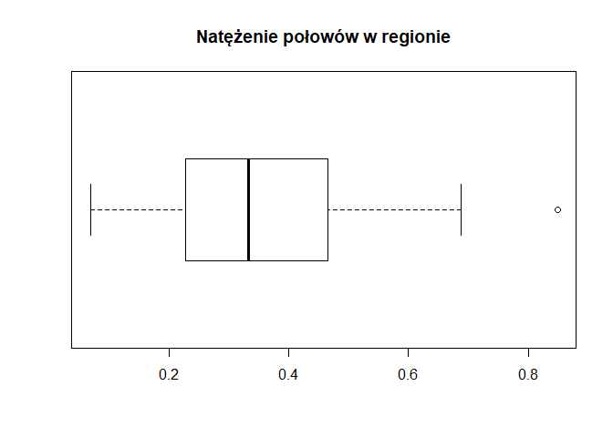
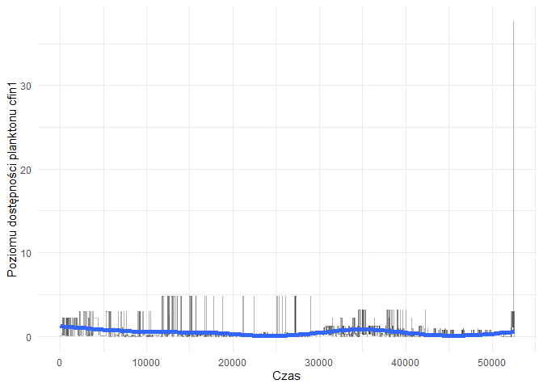

# Biblioteki:

```r
library(reshape2)
library(dplyr)
library(tidyr)
library(knitr)
library(ggplot2)
library(plotly)
library(corrplot)
library(shiny)
library(reshape)
library(caret)
```

# Wczytanie danych i oczyszczanie ich

```r
df <- read.csv("sledzie.csv",header=TRUE,colClasses = c("integer","numeric","numeric","numeric","numeric","numeric","numeric","numeric","numeric","numeric","numeric","numeric","numeric","numeric","integer","numeric"),na.strings = "?")

df <- data.frame(df)
df_no_na <- na.omit(df)
raw_df <- df
for (i in 1:ncol(df)){df[is.na(df[,i]),i] <- mean(df[,i],na.rm = T)}
nrows <- nrow(df)
ncols <- ncol(df)
complete_rows <- sum(complete.cases(raw_df))
n_na_rows <- nrows - complete_rows
```
# Analiza zbioru:
Zbiór danych zawiera 16 atrybutów opisujących 52582 obserwacji. W zbiorze znajdują się 10094 niekompletnych obserwacji.

Atrybuty w zbiorze danych: \
length - długość złowionego śledzia [cm] \
cfin1  - dostępność planktonu [zagęszczenie Calanus finmarchicus gat. 1] \
cfin2  - dostępność planktonu [zagęszczenie Calanus finmarchicus gat. 2] \
chel1  - dostępność planktonu [zagęszczenie Calanus helgolandicus gat. 1] \
chel2  - dostępność planktonu [zagęszczenie Calanus helgolandicus gat. 2] \
lcop1  - dostępność planktonu [zagęszczenie widłonogów  gat. 1] \
lcop2  - dostępność planktonu [zagęszczenie widłonogów  gat. 2] \
fbar   - natężenie połowów w regionie [ułamek pozostawionego narybku] \
recr   - roczny narybek [liczba śledzi] \
cumf   - łączne roczne natężenie połowów w regionie [ułamek pozostawionego narybku] \
totaln - łączna liczba ryb złowionych w ramach połowu [liczba śledzi] \
sst    - temperatura przy powierzchni wody [°C] \
sal    - poziom zasolenia wody [Knudsen ppt] \
xmonth - miesiąc połowu [numer miesiąca] \
nao    - oscylacja północnoatlantycka [mb] \


```r
kable(summary(raw_df), caption = "Podsumowanie zbioru danych")
```


Table: Podsumowanie zbioru danych

           X             length         cfin1             cfin2             chel1            chel2            lcop1              lcop2             fbar             recr              cumf             totaln             sst             sal            xmonth            nao         
---  --------------  -------------  ----------------  ----------------  ---------------  ---------------  -----------------  ---------------  ---------------  ----------------  ----------------  ----------------  --------------  --------------  ---------------  -----------------
     Min.   :    0   Min.   :19.0   Min.   : 0.0000   Min.   : 0.0000   Min.   : 0.000   Min.   : 5.238   Min.   :  0.3074   Min.   : 7.849   Min.   :0.0680   Min.   : 140515   Min.   :0.06833   Min.   : 144137   Min.   :12.77   Min.   :35.40   Min.   : 1.000   Min.   :-4.89000 
     1st Qu.:13145   1st Qu.:24.0   1st Qu.: 0.0000   1st Qu.: 0.2778   1st Qu.: 2.469   1st Qu.:13.427   1st Qu.:  2.5479   1st Qu.:17.808   1st Qu.:0.2270   1st Qu.: 360061   1st Qu.:0.14809   1st Qu.: 306068   1st Qu.:13.60   1st Qu.:35.51   1st Qu.: 5.000   1st Qu.:-1.89000 
     Median :26291   Median :25.5   Median : 0.1111   Median : 0.7012   Median : 5.750   Median :21.673   Median :  7.0000   Median :24.859   Median :0.3320   Median : 421391   Median :0.23191   Median : 539558   Median :13.86   Median :35.51   Median : 8.000   Median : 0.20000 
     Mean   :26291   Mean   :25.3   Mean   : 0.4458   Mean   : 2.0248   Mean   :10.006   Mean   :21.221   Mean   : 12.8108   Mean   :28.419   Mean   :0.3304   Mean   : 520367   Mean   :0.22981   Mean   : 514973   Mean   :13.87   Mean   :35.51   Mean   : 7.258   Mean   :-0.09236 
     3rd Qu.:39436   3rd Qu.:26.5   3rd Qu.: 0.3333   3rd Qu.: 1.7936   3rd Qu.:11.500   3rd Qu.:27.193   3rd Qu.: 21.2315   3rd Qu.:37.232   3rd Qu.:0.4560   3rd Qu.: 724151   3rd Qu.:0.29803   3rd Qu.: 730351   3rd Qu.:14.16   3rd Qu.:35.52   3rd Qu.: 9.000   3rd Qu.: 1.63000 
     Max.   :52581   Max.   :32.5   Max.   :37.6667   Max.   :19.3958   Max.   :75.000   Max.   :57.706   Max.   :115.5833   Max.   :68.736   Max.   :0.8490   Max.   :1565890   Max.   :0.39801   Max.   :1015595   Max.   :14.73   Max.   :35.61   Max.   :12.000   Max.   : 5.08000 
     NA              NA             NA's   :1581      NA's   :1536      NA's   :1555     NA's   :1556     NA's   :1653       NA's   :1591     NA               NA                NA                NA                NA's   :1584    NA              NA               NA               

```r
uniq <- raw_df %>% summarise_each(funs(n_distinct(., na.rm = TRUE)))
```

```
## Warning: funs() is soft deprecated as of dplyr 0.8.0
## Please use a list of either functions or lambdas: 
## 
##   # Simple named list: 
##   list(mean = mean, median = median)
## 
##   # Auto named with `tibble::lst()`: 
##   tibble::lst(mean, median)
## 
##   # Using lambdas
##   list(~ mean(., trim = .2), ~ median(., na.rm = TRUE))
## This warning is displayed once per session.
```

```r
kable(uniq, caption = "Unikalne wartości")
```


Table: Unikalne wartości

     X   length   cfin1   cfin2   chel1   chel2   lcop1   lcop2   fbar   recr   cumf   totaln   sst   sal   xmonth   nao
------  -------  ------  ------  ------  ------  ------  ------  -----  -----  -----  -------  ----  ----  -------  ----
 52582       59      39      48      48      51      48      51     51     52     52       53    51    51       12    45
# Rozkład wartości atrybutów 

```r
boxplot(df_no_na$length, horizontal = TRUE, main="Długość złowionego śledzia [cm]")
```

<!-- -->

```r
boxplot(df_no_na[,3:8], main="Dostępność planktonu", 
        names=c("Calanus finmarchicus", "Calanus finmarchicus", "Calanus helgolandicus", "Calanus helgolandicus", "widłonogi", "widłonogi"))
```

<!-- -->

```r
boxplot(df_no_na$fbar, horizontal=TRUE, main="Natężenie połowów w regionie")
```

<!-- -->

```r
boxplot(df_no_na$recr, horizontal=TRUE, main="Roczny narybek")
```

<!-- -->

```r
boxplot(df_no_na$cumf, horizontal=TRUE, main="Łączne roczne natężenie połowów w regionie")
```

<!-- -->

```r
boxplot(df_no_na$totaln, horizontal=TRUE, main="Łączna liczba ryb złowionych w ramach połowu")
```

<!-- -->

```r
boxplot(df_no_na$sst, horizontal=TRUE, main="Temperatura przy powierzchni wody")
```

<!-- -->

```r
boxplot(df_no_na$sal, horizontal=TRUE, main="Poziom zasolenia wody")
```

<!-- -->

```r
boxplot(df_no_na$nao, horizontal=TRUE, main="Oscylacja północnoatlantycka")
```

<!-- -->


# Analiza brakujących wartości.

Brakujące wartości występują tylko w 7 atrybutach: \
- dostępność planktonu -> cfin1, cfin2, chel1, chel2, lcop1, lcop2, \
- temperatura przy powierzchni wody -> sst. \


# Korelacja między atrybutami

```r
correlation <- cor(df)
corrplot(correlation,type="upper",tl.col = "black", tl.srt = 45)
```

<!-- -->


# Zmiana rozmiaru śledzia w czasie

```r
partition <- createDataPartition(y=raw_df$length, p=.05, list=FALSE)
dfPartition <- raw_df[partition, ]
p <- ggplot(dfPartition, aes(x=X, y=length)) + geom_point() + geom_smooth() + theme_bw()
ggplotly(p)
```

```
## `geom_smooth()` using method = 'gam' and formula 'y ~ s(x, bs = "cs")'
```

<!--html_preserve--><div id="htmlwidget-0b328c945441addf8971" style="width:672px;height:480px;" class="plotly html-widget"></div>
<script type="application/json" data-for="htmlwidget-0b328c945441addf8971">{"x":{"data":[{"x":[23,24,25,46,81,89,106,182,222,244,250,260,315,325,359,457,470,484,517,519,554,561,569,580,584,594,609,624,631,632,648,654,664,675,688,711,712,736,746,756,773,777,783,793,805,814,828,837,850,897,900,971,1002,1034,1051,1055,1086,1095,1102,1114,1125,1162,1188,1202,1249,1294,1302,1303,1311,1324,1333,1400,1426,1432,1442,1462,1463,1475,1478,1479,1504,1533,1541,1542,1552,1570,1609,1636,1639,1643,1682,1693,1711,1715,1722,1732,1739,1785,1786,1811,1841,1849,1855,1897,1901,1918,1936,1977,1978,1979,1985,2033,2040,2046,2070,2074,2085,2088,2094,2116,2129,2152,2159,2185,2204,2223,2238,2245,2258,2280,2287,2291,2301,2318,2323,2401,2404,2415,2472,2483,2518,2530,2532,2541,2543,2580,2586,2592,2614,2619,2631,2639,2662,2683,2702,2718,2728,2729,2742,2746,2750,2755,2786,2789,2813,2838,2857,2886,2900,2906,2907,2924,2935,3001,3038,3053,3063,3091,3101,3104,3116,3133,3179,3198,3285,3308,3328,3339,3353,3363,3412,3417,3422,3425,3429,3458,3463,3484,3492,3514,3515,3521,3557,3558,3577,3596,3603,3606,3649,3661,3678,3706,3720,3725,3732,3748,3805,3812,3816,3837,3937,3963,3971,4019,4026,4035,4044,4054,4074,4078,4086,4131,4351,4408,4505,4510,4513,4521,4522,4535,4579,4598,4613,4668,4778,4780,4783,4794,4804,4816,4819,4822,4851,4884,4887,4908,4910,4914,4915,4923,4925,4933,4940,4950,4956,4982,4989,5018,5024,5075,5096,5100,5114,5135,5136,5180,5191,5193,5221,5232,5241,5251,5278,5392,5400,5409,5437,5440,5472,5549,5578,5628,5635,5683,5696,5709,5728,5814,5830,5866,5887,5899,6014,6027,6066,6079,6088,6112,6113,6133,6135,6144,6147,6155,6175,6184,6190,6201,6209,6302,6317,6342,6371,6380,6404,6411,6467,6491,6511,6520,6552,6579,6580,6589,6598,6627,6631,6664,6668,6690,6713,6726,6732,6772,6787,6799,6813,6825,6851,6888,6906,6907,6912,6946,6985,6988,7001,7016,7020,7040,7062,7071,7081,7098,7107,7120,7133,7143,7170,7214,7228,7269,7270,7280,7296,7331,7339,7345,7348,7350,7413,7427,7451,7465,7477,7507,7516,7543,7548,7594,7598,7608,7695,7698,7708,7714,7717,7721,7722,7733,7758,7789,7850,7864,7886,7889,7901,7904,7909,7923,7982,7985,7996,8022,8034,8121,8193,8199,8220,8240,8249,8261,8317,8323,8326,8353,8367,8370,8372,8373,8391,8412,8420,8451,8455,8505,8522,8543,8559,8567,8588,8592,8595,8597,8620,8628,8633,8648,8695,8703,8762,8768,8778,8781,8855,8930,8967,9014,9073,9076,9086,9099,9139,9176,9178,9199,9291,9314,9348,9396,9403,9421,9425,9436,9441,9500,9511,9561,9580,9596,9611,9620,9641,9707,9717,9736,9743,9756,9765,9767,9786,9837,9842,9844,9873,9891,9909,9929,9992,9995,10011,10021,10023,10024,10039,10057,10059,10077,10100,10124,10139,10141,10142,10181,10192,10196,10212,10312,10317,10333,10356,10375,10397,10419,10422,10423,10428,10443,10446,10447,10478,10500,10535,10540,10542,10595,10596,10619,10638,10707,10724,10767,10784,10809,10812,10850,10891,10907,10989,11010,11014,11062,11070,11072,11085,11090,11093,11130,11151,11158,11184,11239,11248,11272,11280,11312,11404,11413,11455,11463,11506,11520,11533,11551,11555,11571,11611,11616,11636,11638,11644,11645,11651,11655,11675,11682,11696,11713,11722,11724,11732,11737,11745,11801,11820,11826,11851,11857,11865,11919,11946,11954,11961,11963,11974,12017,12030,12081,12090,12133,12178,12183,12188,12191,12193,12196,12200,12204,12220,12231,12242,12244,12249,12258,12260,12271,12305,12369,12378,12407,12432,12471,12485,12497,12504,12511,12550,12580,12606,12611,12616,12628,12634,12659,12837,12844,12850,12868,12880,12904,12908,12910,12913,12923,12931,12940,12944,12949,12953,12955,12958,12969,12973,13022,13046,13156,13162,13164,13182,13183,13231,13302,13372,13387,13392,13408,13410,13415,13427,13436,13474,13528,13529,13541,13568,13590,13630,13631,13637,13639,13667,13671,13677,13681,13718,13809,13820,13851,13853,13904,13905,13916,13945,13961,13992,14021,14062,14086,14103,14109,14113,14142,14169,14211,14219,14270,14279,14291,14326,14358,14371,14373,14397,14420,14435,14445,14448,14452,14476,14525,14527,14551,14561,14588,14612,14613,14628,14634,14644,14733,14754,14758,14777,14780,14808,14841,14861,14893,14899,14910,14932,14954,14955,14995,15006,15023,15027,15044,15093,15103,15135,15154,15178,15206,15239,15243,15262,15303,15336,15344,15353,15384,15391,15401,15440,15457,15475,15492,15520,15528,15561,15564,15591,15595,15597,15609,15622,15677,15685,15692,15735,15740,15753,15796,15834,15843,15852,15863,15871,15886,15953,15969,15982,16088,16097,16223,16230,16251,16281,16305,16341,16353,16354,16364,16370,16400,16408,16428,16453,16479,16482,16520,16523,16589,16623,16636,16654,16661,16681,16737,16741,16759,16770,16774,16831,16834,16837,16839,16893,16910,16933,16945,16965,16987,17013,17051,17052,17082,17098,17101,17103,17135,17175,17181,17197,17243,17283,17294,17307,17347,17352,17374,17451,17466,17469,17491,17516,17584,17608,17623,17639,17647,17654,17663,17680,17730,17771,17779,17780,17809,17918,17929,17931,17944,17957,17974,17975,17988,17996,18001,18017,18023,18041,18090,18106,18107,18137,18150,18151,18159,18188,18196,18224,18237,18240,18248,18271,18274,18321,18329,18369,18374,18396,18397,18404,18405,18446,18448,18455,18460,18464,18465,18475,18481,18483,18495,18606,18636,18643,18692,18695,18701,18710,18714,18722,18730,18739,18744,18749,18760,18765,18773,18794,18796,18809,18828,18845,18904,18908,18928,18982,18988,19002,19008,19031,19057,19087,19098,19102,19184,19295,19298,19335,19350,19353,19407,19415,19439,19454,19472,19535,19543,19569,19570,19622,19649,19651,19666,19674,19684,19706,19734,19760,19766,19778,19783,19788,19789,19817,19822,19860,19864,19876,19904,19911,19914,19939,19944,19976,19983,20006,20028,20062,20063,20079,20247,20264,20266,20270,20291,20345,20346,20354,20365,20379,20397,20432,20463,20481,20492,20502,20510,20518,20539,20552,20575,20590,20621,20622,20632,20650,20651,20672,20679,20695,20704,20708,20753,20767,20771,20774,20805,20855,20863,20874,20903,20905,20907,20912,20917,20945,20970,21003,21009,21023,21059,21089,21097,21105,21107,21120,21132,21148,21156,21214,21248,21299,21308,21335,21346,21350,21356,21358,21452,21456,21474,21477,21486,21512,21521,21534,21541,21566,21575,21577,21605,21607,21642,21643,21653,21660,21673,21692,21700,21708,21711,21777,21780,21801,21807,21853,21882,21886,21889,21898,21913,21924,21935,21955,21964,21984,21985,21987,22021,22076,22091,22157,22160,22175,22192,22194,22225,22235,22242,22244,22249,22317,22332,22356,22362,22383,22421,22457,22527,22546,22553,22605,22611,22640,22646,22680,22682,22699,22701,22703,22731,22778,22843,22845,22882,22883,22891,22920,22930,22946,22970,22982,22989,23030,23033,23100,23124,23132,23133,23263,23295,23303,23308,23313,23343,23372,23389,23405,23459,23475,23487,23493,23505,23521,23522,23523,23565,23583,23607,23618,23633,23639,23668,23687,23689,23737,23809,23827,23850,23859,23861,23880,23883,23906,23917,23959,23963,23965,23973,23978,24004,24052,24071,24072,24101,24103,24109,24133,24162,24165,24166,24262,24292,24296,24297,24304,24311,24344,24361,24363,24364,24393,24412,24432,24456,24472,24504,24535,24543,24553,24559,24562,24586,24596,24598,24600,24612,24613,24708,24743,24772,24801,24879,24884,24894,24904,24932,24959,24974,25002,25009,25017,25034,25080,25084,25155,25156,25179,25238,25245,25259,25281,25285,25305,25327,25338,25348,25366,25373,25389,25392,25393,25399,25400,25403,25424,25434,25444,25462,25485,25556,25612,25618,25620,25632,25648,25687,25705,25711,25712,25776,25779,25798,25819,25857,25866,26060,26067,26093,26097,26127,26129,26140,26145,26164,26210,26211,26215,26217,26221,26229,26256,26283,26300,26302,26351,26389,26396,26419,26421,26422,26448,26457,26485,26504,26512,26516,26542,26561,26572,26579,26602,26609,26632,26640,26651,26662,26676,26679,26686,26711,26716,26725,26731,26738,26743,26753,26775,26794,26801,26835,26838,26846,26882,26985,27007,27020,27050,27067,27075,27087,27091,27117,27118,27121,27123,27184,27234,27235,27241,27256,27285,27304,27316,27331,27397,27405,27452,27474,27481,27488,27508,27516,27517,27520,27532,27613,27638,27670,27674,27711,27727,27750,27758,27765,27827,27828,27898,27901,27941,27984,27993,28040,28067,28096,28116,28122,28130,28139,28168,28174,28183,28190,28222,28231,28246,28270,28273,28284,28290,28305,28310,28411,28419,28421,28447,28485,28538,28587,28588,28601,28605,28612,28625,28663,28816,28850,28898,28929,28932,28942,28945,28952,28958,28960,28978,28998,29061,29110,29121,29165,29177,29188,29192,29219,29228,29257,29350,29368,29394,29395,29415,29454,29469,29498,29499,29516,29521,29572,29595,29610,29622,29637,29640,29722,29749,29755,29764,29781,29782,29784,29786,29800,29807,29809,29820,29840,29899,29919,29927,29930,29986,29991,29996,30062,30068,30078,30079,30084,30085,30094,30201,30219,30252,30289,30316,30327,30354,30385,30386,30392,30411,30418,30419,30440,30446,30466,30473,30483,30489,30502,30522,30530,30536,30541,30551,30553,30560,30571,30617,30642,30656,30677,30693,30695,30699,30702,30734,30740,30742,30746,30774,30778,30786,30853,30863,30866,30920,30921,30925,30930,30942,30957,31002,31043,31054,31059,31070,31075,31082,31098,31136,31140,31178,31190,31195,31203,31217,31220,31241,31280,31298,31329,31333,31341,31347,31353,31382,31394,31417,31456,31525,31546,31558,31581,31603,31606,31631,31639,31644,31671,31673,31690,31743,31745,31750,31829,31859,31883,31893,31917,31933,31954,31967,31982,31990,31991,32005,32011,32028,32034,32056,32065,32069,32082,32116,32118,32123,32127,32156,32157,32178,32179,32213,32220,32257,32299,32308,32326,32333,32337,32347,32366,32386,32398,32467,32473,32490,32494,32529,32530,32538,32553,32599,32621,32663,32690,32719,32759,32793,32804,32809,32816,32820,32823,32830,32836,32840,32880,32940,32974,32977,32980,32983,33003,33013,33014,33015,33024,33029,33031,33038,33045,33084,33086,33132,33197,33200,33257,33258,33310,33314,33346,33414,33447,33470,33471,33485,33512,33522,33533,33543,33591,33606,33614,33632,33678,33718,33767,33775,33815,33817,33822,33847,33872,33907,33930,33932,33933,33948,33961,33977,34001,34020,34054,34140,34153,34154,34161,34164,34184,34263,34272,34277,34279,34300,34346,34347,34385,34450,34477,34485,34509,34520,34529,34563,34575,34578,34598,34601,34602,34678,34714,34727,34741,34749,34780,34792,34809,34824,34825,34882,34902,34936,34967,34974,34996,34997,34998,35051,35087,35111,35122,35147,35157,35225,35251,35261,35279,35293,35333,35399,35411,35464,35475,35479,35483,35517,35534,35551,35593,35635,35650,35673,35685,35726,35730,35742,35799,35833,35865,35881,35906,35923,35924,35925,35928,35934,35959,35976,35995,36000,36040,36043,36087,36094,36110,36115,36130,36141,36143,36163,36166,36167,36189,36224,36225,36238,36249,36261,36264,36326,36331,36343,36348,36356,36368,36376,36395,36396,36421,36444,36462,36515,36521,36537,36570,36580,36608,36643,36674,36687,36720,36722,36740,36770,36786,36809,36873,36874,36877,36882,36893,36902,36912,36925,36934,36964,36976,36977,37001,37010,37021,37026,37030,37041,37067,37075,37113,37116,37136,37140,37179,37233,37263,37278,37288,37351,37360,37377,37389,37402,37410,37411,37416,37446,37474,37480,37482,37516,37524,37525,37564,37580,37586,37595,37604,37608,37618,37619,37626,37638,37639,37641,37643,37658,37660,37679,37693,37697,37702,37706,37710,37735,37747,37764,37784,37824,37844,37865,37868,37872,37892,37904,37932,37953,37956,37959,37989,38023,38048,38084,38088,38099,38129,38140,38146,38212,38222,38276,38311,38392,38437,38468,38490,38511,38521,38549,38552,38559,38582,38595,38602,38612,38629,38641,38668,38671,38691,38693,38745,38762,38765,38770,38831,38846,38853,38889,38890,38906,38942,38947,38949,38950,38966,38969,38979,38992,39000,39008,39049,39053,39075,39126,39176,39197,39286,39322,39323,39354,39412,39415,39427,39467,39477,39478,39494,39501,39527,39538,39557,39559,39579,39608,39625,39634,39652,39655,39662,39668,39672,39692,39707,39777,39789,39802,39803,39819,39842,39848,39849,39856,39863,39908,39913,39914,39921,40021,40037,40061,40099,40109,40183,40185,40209,40228,40248,40291,40310,40369,40378,40409,40463,40528,40533,40583,40614,40638,40639,40644,40647,40669,40681,40745,40776,40785,40822,40830,40835,40866,40885,40899,40955,40956,40967,40977,40979,40996,41001,41006,41024,41048,41055,41056,41129,41133,41144,41171,41199,41214,41217,41248,41266,41292,41293,41312,41331,41335,41344,41358,41359,41366,41373,41385,41402,41424,41524,41580,41594,41596,41640,41646,41684,41702,41704,41762,41805,41810,41832,41848,41881,41918,41964,41985,41996,42102,42117,42186,42277,42285,42289,42312,42325,42394,42419,42425,42428,42491,42548,42550,42603,42612,42632,42641,42652,42690,42795,42800,42808,42839,42865,42883,42908,42914,42954,42957,42994,43004,43041,43051,43063,43164,43202,43208,43223,43264,43283,43316,43329,43335,43336,43355,43374,43394,43399,43412,43414,43423,43439,43453,43465,43466,43474,43480,43490,43494,43608,43625,43648,43652,43666,43686,43723,43729,43730,43792,43819,43870,43885,43901,43959,43961,43976,43979,43986,43995,44017,44022,44025,44067,44075,44099,44120,44129,44134,44162,44187,44205,44248,44260,44289,44295,44296,44310,44328,44356,44375,44402,44414,44432,44459,44469,44473,44479,44535,44551,44557,44574,44582,44584,44586,44594,44611,44635,44646,44654,44660,44701,44704,44705,44739,44757,44775,44794,44815,44842,44852,44860,44863,44883,44884,44885,44896,44910,44916,44922,44925,44953,44960,44982,44989,44994,45020,45061,45069,45078,45093,45171,45180,45223,45227,45240,45245,45252,45259,45314,45322,45341,45365,45373,45379,45400,45464,45466,45491,45503,45518,45529,45560,45572,45574,45576,45589,45647,45663,45666,45668,45672,45696,45703,45712,45775,45797,45815,45855,45857,45863,45872,45894,45899,45938,45943,45954,45976,45988,46018,46024,46063,46080,46085,46141,46145,46172,46192,46227,46230,46255,46257,46308,46311,46313,46317,46352,46382,46415,46416,46417,46421,46435,46437,46499,46576,46591,46593,46668,46672,46675,46680,46689,46709,46762,46781,46803,46836,46854,46873,46874,46928,46931,46992,47019,47026,47041,47065,47075,47088,47107,47129,47136,47168,47173,47182,47198,47201,47222,47234,47236,47267,47330,47347,47381,47394,47395,47399,47412,47428,47436,47438,47439,47440,47466,47511,47564,47581,47613,47622,47624,47633,47642,47643,47659,47665,47666,47677,47698,47700,47712,47718,47743,47745,47762,47792,47860,47887,47906,47949,47959,47965,47967,47977,47991,47996,48033,48105,48128,48131,48206,48217,48230,48232,48247,48273,48283,48315,48334,48346,48352,48423,48434,48435,48460,48461,48478,48485,48503,48507,48524,48527,48543,48560,48566,48580,48582,48594,48607,48621,48648,48669,48670,48733,48746,48782,48805,48811,48832,48854,48900,48910,48919,48922,48938,48949,48973,48976,48989,49022,49081,49105,49111,49130,49147,49190,49194,49233,49237,49244,49247,49288,49312,49325,49347,49401,49409,49489,49506,49520,49525,49530,49548,49579,49583,49654,49712,49743,49761,49781,49790,49827,49863,49875,49890,49895,49926,49952,50013,50051,50063,50074,50085,50100,50103,50120,50138,50227,50231,50262,50268,50275,50290,50295,50297,50304,50369,50391,50437,50466,50472,50512,50516,50538,50592,50614,50671,50714,50717,50728,50744,50764,50766,50770,50790,50823,50824,50883,50895,50897,50912,50917,50977,50996,51010,51034,51067,51104,51129,51148,51177,51231,51236,51271,51375,51413,51480,51506,51578,51609,51636,51650,51687,51728,51740,51747,51777,51799,51840,51851,51876,51884,51951,51960,51971,51979,52009,52014,52083,52091,52118,52152,52161,52164,52165,52176,52196,52217,52236,52276,52294,52296,52312,52329,52365,52368,52400,52442,52453,52463,52506,52512,52520,52522,52524,52533,52536,52552,52561],"y":[22.5,21.5,23,22.5,23.5,24,23.5,23,22,21.5,21,23.5,26,24,25,24,22,27.5,22.5,25,25.5,24,26,21.5,24.5,24,25,22,23,24.5,23.5,22.5,23.5,24.5,24,21.5,25,25.5,27,26.5,26.5,26.5,24.5,21,26,24.5,26,24,25,22.5,24.5,21.5,25.5,22.5,27,28.5,25.5,25,25,24.5,25,25.5,26,25.5,21,27,26,24.5,25,26.5,25.5,26.5,26,25,24.5,25,23.5,25,24.5,25,25.5,26.5,26,27,26,25.5,25.5,26,24.5,26.5,26.5,25,26,24.5,27,26.5,25,23.5,26.5,26,24.5,24,23,27,26.5,27.5,24,24,24,24.5,26,28,22.5,26,26,27.5,26,23,24,25.5,27,27,26,21.5,25,24.5,21,24,24.5,24.5,21,24.5,26,26.5,25,23,25.5,28.5,26,23.5,25,24.5,26,26,25.5,25,26,25.5,26,26.5,24.5,26.5,27,26,27.5,23,22.5,22.5,26,26.5,23,23,27,25.5,27.5,26.5,24.5,25,24.5,26,25.5,25.5,26.5,26,23,24,25.5,21.5,23.5,27,22.5,24,22.5,22,25,25,25.5,24,26,25.5,24.5,25.5,22.5,27.5,24.5,23.5,24,26,25,24.5,25.5,23.5,25,26.5,24,25,24.5,24.5,26,25.5,25,21.5,26,26,27,24,21,21,20,25.5,24,24.5,28.5,25.5,26.5,27,25.5,26,25.5,25.5,26,25,26.5,23.5,23.5,24,21.5,24.5,25.5,24,26,26.5,26,25.5,24.5,25,24.5,25.5,25.5,25,25.5,26,26.5,23,21.5,25,26,26,26,26.5,25.5,25,24.5,26.5,28,26,27,27,25.5,26.5,26,24,24.5,27,25.5,25.5,27,24.5,26,23,23.5,23,21,24,26,26.5,27,24.5,24,26,25.5,21,21,22.5,27,23.5,23,23.5,25,24.5,27,25.5,23.5,25.5,27.5,24,26.5,26.5,25,26,24,26,24.5,24.5,26,26,27.5,27,25.5,26,23.5,25.5,21.5,25,23.5,26,25.5,26.5,27,27,25.5,24,23.5,22,22.5,25.5,26.5,25.5,28.5,25.5,25.5,23,25.5,23,23.5,24.5,26.5,27,23.5,25,24.5,25.5,23,25.5,25,24.5,25.5,23,26,26,24,27.5,26,26,23.5,25.5,23.5,25,25.5,24.5,24.5,26.5,24,27.5,25.5,26,24,24,25,24.5,26.5,25,24,27,24.5,25.5,24.5,23.5,24,24.5,29.5,25,25,26.5,25,23,27,24.5,26.5,26,25,27.5,26.5,24,25.5,27.5,26.5,24.5,24,26.5,26,26.5,24.5,25.5,25.5,27.5,25,25,25.5,24.5,25.5,26.5,27,25.5,28,25.5,25,26.5,25,25,27.5,26.5,28.5,24,25.5,26,26.5,25,26.5,23,24.5,26,24.5,26,26.5,26,27,27,26.5,25.5,27,25,27,26.5,25,27.5,21.5,26,27,28,27,26.5,27,23.5,27.5,26,25,23,27.5,23.5,26.5,26,24,27,25,24,25.5,26,27.5,24.5,25,26.5,27,23,26.5,27,25,25.5,27.5,27,28,27,25,26,26.5,27,23.5,24.5,25.5,25.5,25,26.5,28,26.5,23.5,26.5,25.5,28.5,28,25,26.5,27,26.5,27.5,26.5,26.5,28,26,27.5,28.5,25.5,25,26,26.5,27.5,26.5,27,27.5,28,27,25,27,26.5,24.5,25,25,25.5,27.5,26.5,27,28.5,27.5,26.5,27.5,27,27,26,26.5,26.5,28.5,28,26,25.5,24.5,27.5,26,24.5,24,26.5,26,26,27.5,26.5,26.5,26.5,27,28,28,27.5,25.5,26.5,24.5,26.5,24.5,27,26.5,25.5,26,25,25,28,25,25.5,26,28.5,28,28,25.5,25.5,27.5,26,26,25.5,26,26,24.5,26,24,23,26.5,25,24.5,26.5,24,24.5,26.5,27,26,25,25.5,28,27.5,27,25.5,26.5,26,25,25.5,26,27,26,27.5,27,27,26.5,26.5,25.5,26,24.5,27,25,25.5,24,26.5,24.5,26,25.5,27,24,25.5,26.5,24.5,26.5,25,25,26,28.5,27,25,25.5,24.5,26.5,28.5,27,25,25.5,28,26.5,26.5,27,27.5,27,26,27,26,27,27,27,26,26.5,28.5,26,27.5,25.5,25.5,24.5,24,25,24,27.5,27,25.5,25.5,26.5,25,24.5,28,26,27.5,26.5,27,26.5,26,27.5,24.5,27,24.5,26,25,26,24,25.5,26,26.5,26.5,27,27.5,26.5,27.5,26,26.5,24.5,28,26,26.5,27.5,27,27,25.5,27.5,26.5,25.5,25,24.5,27.5,25.5,28,24,27.5,28,27.5,27.5,26.5,26,25.5,24.5,26.5,26,26.5,26.5,27.5,26.5,27.5,27.5,27.5,26,25,26.5,27.5,26,24.5,26,28,28,27,26.5,26.5,27,28,26.5,28.5,26,26.5,26,26.5,25,26.5,26.5,26,26.5,26,24.5,26,28,26,25.5,24.5,29,29.5,27,25.5,27.5,26.5,27.5,27.5,26.5,26.5,26,26,26,28,27,26.5,26.5,27,29.5,28,26,26,24.5,26,26,26.5,25.5,27.5,26,25,28,28,27,25.5,24.5,28,29,28.5,29,26.5,29,28,28,28.5,27,27,26,27,24.5,27.5,27.5,27,27.5,29.5,27.5,29,28.5,26.5,25.5,26.5,26.5,28,30,26,27,25.5,26.5,29.5,27.5,25,26.5,26,26,26.5,28,27,27.5,27,26,27.5,26.5,29,25.5,27,28.5,27,27,26.5,26.5,28.5,27.5,26,27,28,26,28,27.5,28,27.5,23.5,27.5,28.5,27,26,25,27.5,28,27,28,26.5,27,27.5,25.5,27.5,27.5,28,27,27,25.5,27.5,26.5,27.5,28.5,28,27.5,25,25,26.5,27.5,28,27.5,27,27,28.5,27.5,28,28,25.5,28,26,27.5,23.5,27.5,28,26.5,26.5,26.5,26,26.5,28,24.5,26.5,27,27,26,27.5,26.5,28,23.5,28.5,31.5,27.5,28,27.5,27,27.5,26.5,26,27,28.5,24,23.5,26.5,28.5,23.5,26.5,25,28,29,27.5,28,28.5,28,27.5,28,26.5,27,26.5,27.5,25.5,26,27,26,26,28,26,26.5,25.5,27,25.5,27,26,26.5,27,24.5,26,26,26,25,27.5,26.5,25.5,27,25.5,25.5,23,26,28,26,24.5,25,27.5,28.5,26,24.5,25,26,25.5,25.5,27,30,28,25,25.5,28,27,26.5,27,25.5,27.5,25.5,26.5,25,27.5,26.5,24.5,26,26.5,26.5,25.5,25.5,28,27,26.5,26,25,26,23.5,26.5,24.5,25.5,27.5,26.5,26.5,25.5,26,26,25.5,28,27.5,26.5,26.5,26,26.5,29.5,26.5,24.5,24,24,25.5,26.5,26.5,26.5,27,28,25,25,29,24,26.5,29,28,28,29,26.5,29,28,27,27.5,28,28.5,23.5,25,24,26,24,24.5,24.5,28.5,27.5,25,24.5,26,24,23,25.5,26,23.5,24.8,28.5,26.5,28.5,25.5,23,24.5,24,24.5,23.5,25,23.3,23,24.5,24,23.5,23,24,23.5,25.5,26.5,25.5,25.5,25,24.5,24,23.5,24,24,24.5,24,24,25.5,23.5,23,24,25,27,26.5,24,25,24,22.5,24.5,24.5,27.5,25,24,25,25,26,27.5,25.5,24.5,28,24.5,24,26,27,24.5,28,28.5,28,29,29,27.5,25.5,26.5,25,26,26,25.5,26.5,26.5,27,27.5,27.5,25,27,26,28.5,26.5,26,26.5,27,25.5,26.5,28,27.5,28.5,24.5,28,25,27.5,25.5,27.5,26.5,27,28.5,26.5,26,28,26,24.5,28.5,27,28.5,27.5,26,27,27,23.5,27,27.5,24.5,25,25,25.5,26,25,24,24.5,24,25,26,26.5,26,23.5,25,25.5,25,26,27,25.5,25.5,25.5,26.5,25,25.5,27.5,27,26,23.5,27,27,28.5,27,26.5,24.5,24,24,21.5,27,28,27,23.5,26.5,23.5,23,27,26,25.5,27,25.5,24.5,26.5,28.5,28,24,25,27.5,25.5,27,27,26,25.5,28,27,27.5,27.5,28,26,25.5,26.5,27,27,27,27.5,25.5,24,28.5,27.5,27,26.5,28.5,28,28,29,27.5,26.5,28,27.5,27,26.5,23,26,29,27,28,25.5,29.5,26,25.5,24.5,26,26,27,27.5,28.5,27.5,28,27.5,26.5,27,26.5,25.5,25.5,27,27.5,26.5,26.5,27.5,24.5,25.5,25,27.5,24,26.5,26.5,25.5,24,25,24.5,25,23.5,20.5,26,22.5,24.5,24,26,25.5,26.5,24,26,24.5,25,25,23,27.5,24.5,25,28.5,22.5,24,24.5,23.5,22.5,28,26.5,26,26.5,23.5,24,23.5,24,25,28,29.5,24.5,28.5,21.5,22.5,23,28,23,23,22,22,27,27,26.5,25,27.5,21.5,28,28.5,24.5,26,26,28,27.5,28,26,26.5,22,21.5,27,26,25,23,27,25,28,26,24,23,24.5,25,26,25,24.5,24,24,23.5,23,24.5,26,25,24,26.5,25.5,26,26,26,27.5,26.5,25,28,25.5,27,27,25,27.5,24.5,26,25,24,24,27,25.5,23.5,23.5,27,27,25.5,26,28.5,24.5,25,26.5,28,27,25.5,24,26,29,27,23,25,25.5,28,28,27,27,27,29,28.5,27,25.5,28,27.5,25.5,26,28,25.5,26,26.5,24.5,25,25.5,25.5,26.5,27.5,28,26.5,27,26.5,28,24,24.5,27,25,27,27,26,26,23.5,27,26.5,22.5,26,25.5,26,27,26,25.5,25.5,24,25.5,27,28,25.5,26,24.5,24,27,28,26,26.5,24,27,28,27.5,27,26.5,26,26.5,29.5,24,27,26.5,24.5,26,26,23.5,27,27.5,22,26,26,25.5,28,22,26,26,24.5,26,24.5,24,24.5,24.5,24,25.5,25.5,24.5,26,23.5,25.5,26,26,28.5,26.5,26,28,27,27,27,27,25,26.5,27.5,24.5,26,28.5,26.5,25.5,24.5,25,24.5,28,25.5,24.5,25,26.5,25.5,27.5,23.5,23.5,22.5,26.5,23.5,26.5,24.5,24.5,25,26.5,25,26.5,26.5,26.5,25,23.5,23.5,23.5,23,24.5,27.5,24.5,26.5,25,26.5,26,25.5,25.5,23.5,24,25.5,25,28,25.5,26,26,23.5,26.5,25,29,24.5,27.5,27,25.5,25,23,26,25.5,24.5,27.5,26.5,27,24,27.5,27.5,28.5,23.5,24.5,25.5,24.5,25.5,26,24,25,24.5,27,25.5,26.5,27.5,25,25,23.5,27,23,26,25.5,26,24,25.5,26,24.5,24.5,25,25,27,27,26.5,25.5,24.5,25,25,25,25,26,28.5,25,25.5,22.5,23,25.5,25,24,24.5,24.5,25,24.5,24,25,26.5,24.5,22.5,23.5,24,27,25.5,27,24.5,24,22.5,23,25.5,28,26,25,26,26.5,25,27,26,26,25,25.5,26,25.5,25.5,28.5,27,27,26,25,22.5,23,22.5,24,23.5,26,25,23,23,23.5,23,24,21.5,23,26,22,26.5,26,26,22.5,26,26,25,24,25.5,24.5,26,27,24.5,24.5,26,26.5,26.5,24.5,25.5,24,27,27,26,27.5,25.5,24.5,28,24,25.5,25,25.5,24.5,25.5,25,23.5,23,25.5,25,25.5,26.5,24.5,23,26,24,26,23.5,26,25.5,26.5,25,25.5,25,26.5,25.5,25.5,24,25.5,24,25.5,24.5,24,26.5,24,24.5,25,24,24.5,25.5,25,24.5,25.5,24,26,26.5,25,25,24.5,25,25,25,25.5,26,25.5,26.5,25.5,26,25,25,25,24.5,26.5,26,26.5,26.5,27,24.5,24.5,26.5,25.5,27.5,25,25,24,27,26,23,24.5,25,25.5,24.5,24.5,27,26.5,22.5,23.5,25,25.5,25.5,25,25.5,21,26.5,23.5,25,25,25.5,25,22.5,24,27,25.5,24.5,25,24.5,23,25,26.5,23.5,24,24,25,24.5,25,25.5,25,25,25,26,24,26.5,25,24,24,23,22,24.5,25.5,24.5,27,24,22.5,24,25.5,27,24,26.5,25,25.5,27.5,24.5,24,25,26.5,24.5,25,25,25,23.5,24.5,25,26,26,24.5,25,25.5,24.5,24.5,25.5,26,24.5,23,25.5,23.5,26,25.5,25.5,25.5,26.5,25.5,25.5,24,26,25.5,26,24.5,26,24,26,23,22.5,24.5,24.5,23.5,25,27.5,22,23.5,22.5,25.5,23.5,25,24.5,23.5,26.5,22.5,22,25,27,24.5,25.5,24.5,25.5,23.5,24,26,24,25,25.5,25,25,24,22.5,22.5,22.5,24.5,22.5,24,25.5,24.5,26.5,24,26,26,24.5,25.5,24,23.5,24.5,25,25.5,27,25,24.5,24,24,23,24.5,26,25,26,25,23.5,25,24,24,25,22.5,23,26,24,23,23.5,23,24,23,22.5,25,23,23.5,25.5,25.5,23.5,25.5,25.5,24.5,24,24.5,24.5,26,25,26.3,25,23.5,25.5,24.5,24.5,25,25,22.5,23,25.5,24,26.5,23.5,24.5,23,25.5,24.5,25.5,25,24.5,23.5,23.5,24.5,25,26,26.5,23,23,21,21.5,23,23.5,23.5,24.5,22,25.5,22.5,22,22.5,22,23.5,25,24,23,24,23,25,21.5,24,25,24.5,23,25,25,25,25.5,23.5,23.5,24.5,24.5,22,24.5,25,26,25.5,25,24.5,25.5,24,25,26,21.5,22.5,25.5,25,23.5,25.5,25,24,25,22.5,25,23.5,23,24.5,25.5,25.5,23.5,23,21.5,22,22.5,25,24,26,23.5,22,24,25.5,25.5,24.5,25,26.5,24.5,25,25,26,23.5,25,24.5,24,25.5,26.5,25,25.5,24,26,25.5,24.5,26,24.5,24,24,23.5,25.5,25.5,26,25.5,26.5,25.5,26.5,26.5,25,22,26,25,24.5,25,26,25,26.5,26,25,25.5,23,24,24.5,26.5,25,23.5,26.5,23.5,26,24,25,23,24,23.5,25,23.5,24.5,26,24,22.5,24.5,23,23,23,24,23,23,22.5,23.5,24.5,22.5,24,24,22,23,22.5,23,21.5,24.5,24,24.5,23.5,25.5,24.5,24,24,24,22,22,22.5,22.5,22,25.5,24.5,21,23.5,25,24,22,24.5,23.5,21.5,23,22.5,27,23.5,23.5,23.5,24,24,25,22.5,25,24,24.5,24.5,24.5,25,26,25,24,25,25.5,24,23,24,23,22,22.5,24.5,23.5,25,22,22.5,22.5,23,22.5,24,25.5,23,25,24.5,25,24,25,23,23,24,24,23,22,24,22,23,24,23.5,23.5,23.5,24,22,25,23.5,25,23.5,23,24,24.5,23.5,25,24,22.5,21.5,22,22.5,23.5,25.5,25,24.5,25,22,24.5,24,23,24.5,25.5,24,23,23.5,22.5,22.5,23.5,23.5,23.5,25,21.5,23.5,23.5,25.5,25.5,23,25,26,22.5,24,25.5,25.5,23,26,26,25,25,26,24,22.5,24,24,26.5,25.5,26.5,22,22,23,22.5,26.5,23,22,23.5,22.5,21.5,26,24.5,22.5,23,23,24,22.5,24,22,25,25.5,26,25,25,24.5,22.5,24,23,24.5,25.5,22.5,23,24.5,22.5,23,24,23,23,23.5,24,23,26.5,25,23.5,24,22.5,24,24,26,23,26,22.5,25,24.5,25,23.5,22.5,24.5,21.5,21.5,24.5,24.5,22,24.5,22.5,22.5,24,24.5,26,24.5,23.5,23,24.5,24,22,23,23,24.5,25,23.5,24.5,26,26,24.5,24,25.5,25,25,26,24,25,25.5,24.5,23.5,24,24.5,25,25,23.5,26,24,24,24.5,25.5,24.5,23,24,27,21.5,26,25,24.5,22,23,24,21,23,21.5,22.5,24,23.5,25,26,24,25,23,26.5,22,24,24.5,25.5,22.5,24,24.5,23,24,24,25.5,25.5,23,22.5,23,25,24,24,24,24,23.5,22.5,23.5,23,22.5,23.5,24.5,23,23,23.5,24,23.5,22.5,24.5,24,24.5,22,26,23.5,26,25,23,25,24,23.5,22.5,25,24.5,24,25.5,24,25,23,23,24,23.5,23.5,22.5,24.5,25,24.5,24,24.5,25.5,22.5,25,24,25.5,25,22.5,24.5,25,25,24.5,22.5,24.5,23.5,22.5,22,23.5,24.5,24,22.5,22,22.5,23.5,23.5,21.5,23.5,24,23,21.5,22,25,24.5,22.5,25.5,21.5,24,23,21.5,23.5,24.5,23,23.5,24.5,24,23.5,24.5,24.5,24,26.5,25.5,25.5,24.5,25.5,24.5,26,24.5,27,24.5,24,26,25,25,25.5,25,25.5,24,24,23],"text":["X:    23<br />length: 22.5","X:    24<br />length: 21.5","X:    25<br />length: 23.0","X:    46<br />length: 22.5","X:    81<br />length: 23.5","X:    89<br />length: 24.0","X:   106<br />length: 23.5","X:   182<br />length: 23.0","X:   222<br />length: 22.0","X:   244<br />length: 21.5","X:   250<br />length: 21.0","X:   260<br />length: 23.5","X:   315<br />length: 26.0","X:   325<br />length: 24.0","X:   359<br />length: 25.0","X:   457<br />length: 24.0","X:   470<br />length: 22.0","X:   484<br />length: 27.5","X:   517<br />length: 22.5","X:   519<br />length: 25.0","X:   554<br />length: 25.5","X:   561<br />length: 24.0","X:   569<br />length: 26.0","X:   580<br />length: 21.5","X:   584<br />length: 24.5","X:   594<br />length: 24.0","X:   609<br />length: 25.0","X:   624<br />length: 22.0","X:   631<br />length: 23.0","X:   632<br />length: 24.5","X:   648<br />length: 23.5","X:   654<br />length: 22.5","X:   664<br />length: 23.5","X:   675<br />length: 24.5","X:   688<br />length: 24.0","X:   711<br />length: 21.5","X:   712<br />length: 25.0","X:   736<br />length: 25.5","X:   746<br />length: 27.0","X:   756<br />length: 26.5","X:   773<br />length: 26.5","X:   777<br />length: 26.5","X:   783<br />length: 24.5","X:   793<br />length: 21.0","X:   805<br />length: 26.0","X:   814<br />length: 24.5","X:   828<br />length: 26.0","X:   837<br />length: 24.0","X:   850<br />length: 25.0","X:   897<br />length: 22.5","X:   900<br />length: 24.5","X:   971<br />length: 21.5","X:  1002<br />length: 25.5","X:  1034<br />length: 22.5","X:  1051<br />length: 27.0","X:  1055<br />length: 28.5","X:  1086<br />length: 25.5","X:  1095<br />length: 25.0","X:  1102<br />length: 25.0","X:  1114<br />length: 24.5","X:  1125<br />length: 25.0","X:  1162<br />length: 25.5","X:  1188<br />length: 26.0","X:  1202<br />length: 25.5","X:  1249<br />length: 21.0","X:  1294<br />length: 27.0","X:  1302<br />length: 26.0","X:  1303<br />length: 24.5","X:  1311<br />length: 25.0","X:  1324<br />length: 26.5","X:  1333<br />length: 25.5","X:  1400<br />length: 26.5","X:  1426<br />length: 26.0","X:  1432<br />length: 25.0","X:  1442<br />length: 24.5","X:  1462<br />length: 25.0","X:  1463<br />length: 23.5","X:  1475<br />length: 25.0","X:  1478<br />length: 24.5","X:  1479<br />length: 25.0","X:  1504<br />length: 25.5","X:  1533<br />length: 26.5","X:  1541<br />length: 26.0","X:  1542<br />length: 27.0","X:  1552<br />length: 26.0","X:  1570<br />length: 25.5","X:  1609<br />length: 25.5","X:  1636<br />length: 26.0","X:  1639<br />length: 24.5","X:  1643<br />length: 26.5","X:  1682<br />length: 26.5","X:  1693<br />length: 25.0","X:  1711<br />length: 26.0","X:  1715<br />length: 24.5","X:  1722<br />length: 27.0","X:  1732<br />length: 26.5","X:  1739<br />length: 25.0","X:  1785<br />length: 23.5","X:  1786<br />length: 26.5","X:  1811<br />length: 26.0","X:  1841<br />length: 24.5","X:  1849<br />length: 24.0","X:  1855<br />length: 23.0","X:  1897<br />length: 27.0","X:  1901<br />length: 26.5","X:  1918<br />length: 27.5","X:  1936<br />length: 24.0","X:  1977<br />length: 24.0","X:  1978<br />length: 24.0","X:  1979<br />length: 24.5","X:  1985<br />length: 26.0","X:  2033<br />length: 28.0","X:  2040<br />length: 22.5","X:  2046<br />length: 26.0","X:  2070<br />length: 26.0","X:  2074<br />length: 27.5","X:  2085<br />length: 26.0","X:  2088<br />length: 23.0","X:  2094<br />length: 24.0","X:  2116<br />length: 25.5","X:  2129<br />length: 27.0","X:  2152<br />length: 27.0","X:  2159<br />length: 26.0","X:  2185<br />length: 21.5","X:  2204<br />length: 25.0","X:  2223<br />length: 24.5","X:  2238<br />length: 21.0","X:  2245<br />length: 24.0","X:  2258<br />length: 24.5","X:  2280<br />length: 24.5","X:  2287<br />length: 21.0","X:  2291<br />length: 24.5","X:  2301<br />length: 26.0","X:  2318<br />length: 26.5","X:  2323<br />length: 25.0","X:  2401<br />length: 23.0","X:  2404<br />length: 25.5","X:  2415<br />length: 28.5","X:  2472<br />length: 26.0","X:  2483<br />length: 23.5","X:  2518<br />length: 25.0","X:  2530<br />length: 24.5","X:  2532<br />length: 26.0","X:  2541<br />length: 26.0","X:  2543<br />length: 25.5","X:  2580<br />length: 25.0","X:  2586<br />length: 26.0","X:  2592<br />length: 25.5","X:  2614<br />length: 26.0","X:  2619<br />length: 26.5","X:  2631<br />length: 24.5","X:  2639<br />length: 26.5","X:  2662<br />length: 27.0","X:  2683<br />length: 26.0","X:  2702<br />length: 27.5","X:  2718<br />length: 23.0","X:  2728<br />length: 22.5","X:  2729<br />length: 22.5","X:  2742<br />length: 26.0","X:  2746<br />length: 26.5","X:  2750<br />length: 23.0","X:  2755<br />length: 23.0","X:  2786<br />length: 27.0","X:  2789<br />length: 25.5","X:  2813<br />length: 27.5","X:  2838<br />length: 26.5","X:  2857<br />length: 24.5","X:  2886<br />length: 25.0","X:  2900<br />length: 24.5","X:  2906<br />length: 26.0","X:  2907<br />length: 25.5","X:  2924<br />length: 25.5","X:  2935<br />length: 26.5","X:  3001<br />length: 26.0","X:  3038<br />length: 23.0","X:  3053<br />length: 24.0","X:  3063<br />length: 25.5","X:  3091<br />length: 21.5","X:  3101<br />length: 23.5","X:  3104<br />length: 27.0","X:  3116<br />length: 22.5","X:  3133<br />length: 24.0","X:  3179<br />length: 22.5","X:  3198<br />length: 22.0","X:  3285<br />length: 25.0","X:  3308<br />length: 25.0","X:  3328<br />length: 25.5","X:  3339<br />length: 24.0","X:  3353<br />length: 26.0","X:  3363<br />length: 25.5","X:  3412<br />length: 24.5","X:  3417<br />length: 25.5","X:  3422<br />length: 22.5","X:  3425<br />length: 27.5","X:  3429<br />length: 24.5","X:  3458<br />length: 23.5","X:  3463<br />length: 24.0","X:  3484<br />length: 26.0","X:  3492<br />length: 25.0","X:  3514<br />length: 24.5","X:  3515<br />length: 25.5","X:  3521<br />length: 23.5","X:  3557<br />length: 25.0","X:  3558<br />length: 26.5","X:  3577<br />length: 24.0","X:  3596<br />length: 25.0","X:  3603<br />length: 24.5","X:  3606<br />length: 24.5","X:  3649<br />length: 26.0","X:  3661<br />length: 25.5","X:  3678<br />length: 25.0","X:  3706<br />length: 21.5","X:  3720<br />length: 26.0","X:  3725<br />length: 26.0","X:  3732<br />length: 27.0","X:  3748<br />length: 24.0","X:  3805<br />length: 21.0","X:  3812<br />length: 21.0","X:  3816<br />length: 20.0","X:  3837<br />length: 25.5","X:  3937<br />length: 24.0","X:  3963<br />length: 24.5","X:  3971<br />length: 28.5","X:  4019<br />length: 25.5","X:  4026<br />length: 26.5","X:  4035<br />length: 27.0","X:  4044<br />length: 25.5","X:  4054<br />length: 26.0","X:  4074<br />length: 25.5","X:  4078<br />length: 25.5","X:  4086<br />length: 26.0","X:  4131<br />length: 25.0","X:  4351<br />length: 26.5","X:  4408<br />length: 23.5","X:  4505<br />length: 23.5","X:  4510<br />length: 24.0","X:  4513<br />length: 21.5","X:  4521<br />length: 24.5","X:  4522<br />length: 25.5","X:  4535<br />length: 24.0","X:  4579<br />length: 26.0","X:  4598<br />length: 26.5","X:  4613<br />length: 26.0","X:  4668<br />length: 25.5","X:  4778<br />length: 24.5","X:  4780<br />length: 25.0","X:  4783<br />length: 24.5","X:  4794<br />length: 25.5","X:  4804<br />length: 25.5","X:  4816<br />length: 25.0","X:  4819<br />length: 25.5","X:  4822<br />length: 26.0","X:  4851<br />length: 26.5","X:  4884<br />length: 23.0","X:  4887<br />length: 21.5","X:  4908<br />length: 25.0","X:  4910<br />length: 26.0","X:  4914<br />length: 26.0","X:  4915<br />length: 26.0","X:  4923<br />length: 26.5","X:  4925<br />length: 25.5","X:  4933<br />length: 25.0","X:  4940<br />length: 24.5","X:  4950<br />length: 26.5","X:  4956<br />length: 28.0","X:  4982<br />length: 26.0","X:  4989<br />length: 27.0","X:  5018<br />length: 27.0","X:  5024<br />length: 25.5","X:  5075<br />length: 26.5","X:  5096<br />length: 26.0","X:  5100<br />length: 24.0","X:  5114<br />length: 24.5","X:  5135<br />length: 27.0","X:  5136<br />length: 25.5","X:  5180<br />length: 25.5","X:  5191<br />length: 27.0","X:  5193<br />length: 24.5","X:  5221<br />length: 26.0","X:  5232<br />length: 23.0","X:  5241<br />length: 23.5","X:  5251<br />length: 23.0","X:  5278<br />length: 21.0","X:  5392<br />length: 24.0","X:  5400<br />length: 26.0","X:  5409<br />length: 26.5","X:  5437<br />length: 27.0","X:  5440<br />length: 24.5","X:  5472<br />length: 24.0","X:  5549<br />length: 26.0","X:  5578<br />length: 25.5","X:  5628<br />length: 21.0","X:  5635<br />length: 21.0","X:  5683<br />length: 22.5","X:  5696<br />length: 27.0","X:  5709<br />length: 23.5","X:  5728<br />length: 23.0","X:  5814<br />length: 23.5","X:  5830<br />length: 25.0","X:  5866<br />length: 24.5","X:  5887<br />length: 27.0","X:  5899<br />length: 25.5","X:  6014<br />length: 23.5","X:  6027<br />length: 25.5","X:  6066<br />length: 27.5","X:  6079<br />length: 24.0","X:  6088<br />length: 26.5","X:  6112<br />length: 26.5","X:  6113<br />length: 25.0","X:  6133<br />length: 26.0","X:  6135<br />length: 24.0","X:  6144<br />length: 26.0","X:  6147<br />length: 24.5","X:  6155<br />length: 24.5","X:  6175<br />length: 26.0","X:  6184<br />length: 26.0","X:  6190<br />length: 27.5","X:  6201<br />length: 27.0","X:  6209<br />length: 25.5","X:  6302<br />length: 26.0","X:  6317<br />length: 23.5","X:  6342<br />length: 25.5","X:  6371<br />length: 21.5","X:  6380<br />length: 25.0","X:  6404<br />length: 23.5","X:  6411<br />length: 26.0","X:  6467<br />length: 25.5","X:  6491<br />length: 26.5","X:  6511<br />length: 27.0","X:  6520<br />length: 27.0","X:  6552<br />length: 25.5","X:  6579<br />length: 24.0","X:  6580<br />length: 23.5","X:  6589<br />length: 22.0","X:  6598<br />length: 22.5","X:  6627<br />length: 25.5","X:  6631<br />length: 26.5","X:  6664<br />length: 25.5","X:  6668<br />length: 28.5","X:  6690<br />length: 25.5","X:  6713<br />length: 25.5","X:  6726<br />length: 23.0","X:  6732<br />length: 25.5","X:  6772<br />length: 23.0","X:  6787<br />length: 23.5","X:  6799<br />length: 24.5","X:  6813<br />length: 26.5","X:  6825<br />length: 27.0","X:  6851<br />length: 23.5","X:  6888<br />length: 25.0","X:  6906<br />length: 24.5","X:  6907<br />length: 25.5","X:  6912<br />length: 23.0","X:  6946<br />length: 25.5","X:  6985<br />length: 25.0","X:  6988<br />length: 24.5","X:  7001<br />length: 25.5","X:  7016<br />length: 23.0","X:  7020<br />length: 26.0","X:  7040<br />length: 26.0","X:  7062<br />length: 24.0","X:  7071<br />length: 27.5","X:  7081<br />length: 26.0","X:  7098<br />length: 26.0","X:  7107<br />length: 23.5","X:  7120<br />length: 25.5","X:  7133<br />length: 23.5","X:  7143<br />length: 25.0","X:  7170<br />length: 25.5","X:  7214<br />length: 24.5","X:  7228<br />length: 24.5","X:  7269<br />length: 26.5","X:  7270<br />length: 24.0","X:  7280<br />length: 27.5","X:  7296<br />length: 25.5","X:  7331<br />length: 26.0","X:  7339<br />length: 24.0","X:  7345<br />length: 24.0","X:  7348<br />length: 25.0","X:  7350<br />length: 24.5","X:  7413<br />length: 26.5","X:  7427<br />length: 25.0","X:  7451<br />length: 24.0","X:  7465<br />length: 27.0","X:  7477<br />length: 24.5","X:  7507<br />length: 25.5","X:  7516<br />length: 24.5","X:  7543<br />length: 23.5","X:  7548<br />length: 24.0","X:  7594<br />length: 24.5","X:  7598<br />length: 29.5","X:  7608<br />length: 25.0","X:  7695<br />length: 25.0","X:  7698<br />length: 26.5","X:  7708<br />length: 25.0","X:  7714<br />length: 23.0","X:  7717<br />length: 27.0","X:  7721<br />length: 24.5","X:  7722<br />length: 26.5","X:  7733<br />length: 26.0","X:  7758<br />length: 25.0","X:  7789<br />length: 27.5","X:  7850<br />length: 26.5","X:  7864<br />length: 24.0","X:  7886<br />length: 25.5","X:  7889<br />length: 27.5","X:  7901<br />length: 26.5","X:  7904<br />length: 24.5","X:  7909<br />length: 24.0","X:  7923<br />length: 26.5","X:  7982<br />length: 26.0","X:  7985<br />length: 26.5","X:  7996<br />length: 24.5","X:  8022<br />length: 25.5","X:  8034<br />length: 25.5","X:  8121<br />length: 27.5","X:  8193<br />length: 25.0","X:  8199<br />length: 25.0","X:  8220<br />length: 25.5","X:  8240<br />length: 24.5","X:  8249<br />length: 25.5","X:  8261<br />length: 26.5","X:  8317<br />length: 27.0","X:  8323<br />length: 25.5","X:  8326<br />length: 28.0","X:  8353<br />length: 25.5","X:  8367<br />length: 25.0","X:  8370<br />length: 26.5","X:  8372<br />length: 25.0","X:  8373<br />length: 25.0","X:  8391<br />length: 27.5","X:  8412<br />length: 26.5","X:  8420<br />length: 28.5","X:  8451<br />length: 24.0","X:  8455<br />length: 25.5","X:  8505<br />length: 26.0","X:  8522<br />length: 26.5","X:  8543<br />length: 25.0","X:  8559<br />length: 26.5","X:  8567<br />length: 23.0","X:  8588<br />length: 24.5","X:  8592<br />length: 26.0","X:  8595<br />length: 24.5","X:  8597<br />length: 26.0","X:  8620<br />length: 26.5","X:  8628<br />length: 26.0","X:  8633<br />length: 27.0","X:  8648<br />length: 27.0","X:  8695<br />length: 26.5","X:  8703<br />length: 25.5","X:  8762<br />length: 27.0","X:  8768<br />length: 25.0","X:  8778<br />length: 27.0","X:  8781<br />length: 26.5","X:  8855<br />length: 25.0","X:  8930<br />length: 27.5","X:  8967<br />length: 21.5","X:  9014<br />length: 26.0","X:  9073<br />length: 27.0","X:  9076<br />length: 28.0","X:  9086<br />length: 27.0","X:  9099<br />length: 26.5","X:  9139<br />length: 27.0","X:  9176<br />length: 23.5","X:  9178<br />length: 27.5","X:  9199<br />length: 26.0","X:  9291<br />length: 25.0","X:  9314<br />length: 23.0","X:  9348<br />length: 27.5","X:  9396<br />length: 23.5","X:  9403<br />length: 26.5","X:  9421<br />length: 26.0","X:  9425<br />length: 24.0","X:  9436<br />length: 27.0","X:  9441<br />length: 25.0","X:  9500<br />length: 24.0","X:  9511<br />length: 25.5","X:  9561<br />length: 26.0","X:  9580<br />length: 27.5","X:  9596<br />length: 24.5","X:  9611<br />length: 25.0","X:  9620<br />length: 26.5","X:  9641<br />length: 27.0","X:  9707<br />length: 23.0","X:  9717<br />length: 26.5","X:  9736<br />length: 27.0","X:  9743<br />length: 25.0","X:  9756<br />length: 25.5","X:  9765<br />length: 27.5","X:  9767<br />length: 27.0","X:  9786<br />length: 28.0","X:  9837<br />length: 27.0","X:  9842<br />length: 25.0","X:  9844<br />length: 26.0","X:  9873<br />length: 26.5","X:  9891<br />length: 27.0","X:  9909<br />length: 23.5","X:  9929<br />length: 24.5","X:  9992<br />length: 25.5","X:  9995<br />length: 25.5","X: 10011<br />length: 25.0","X: 10021<br />length: 26.5","X: 10023<br />length: 28.0","X: 10024<br />length: 26.5","X: 10039<br />length: 23.5","X: 10057<br />length: 26.5","X: 10059<br />length: 25.5","X: 10077<br />length: 28.5","X: 10100<br />length: 28.0","X: 10124<br />length: 25.0","X: 10139<br />length: 26.5","X: 10141<br />length: 27.0","X: 10142<br />length: 26.5","X: 10181<br />length: 27.5","X: 10192<br />length: 26.5","X: 10196<br />length: 26.5","X: 10212<br />length: 28.0","X: 10312<br />length: 26.0","X: 10317<br />length: 27.5","X: 10333<br />length: 28.5","X: 10356<br />length: 25.5","X: 10375<br />length: 25.0","X: 10397<br />length: 26.0","X: 10419<br />length: 26.5","X: 10422<br />length: 27.5","X: 10423<br />length: 26.5","X: 10428<br />length: 27.0","X: 10443<br />length: 27.5","X: 10446<br />length: 28.0","X: 10447<br />length: 27.0","X: 10478<br />length: 25.0","X: 10500<br />length: 27.0","X: 10535<br />length: 26.5","X: 10540<br />length: 24.5","X: 10542<br />length: 25.0","X: 10595<br />length: 25.0","X: 10596<br />length: 25.5","X: 10619<br />length: 27.5","X: 10638<br />length: 26.5","X: 10707<br />length: 27.0","X: 10724<br />length: 28.5","X: 10767<br />length: 27.5","X: 10784<br />length: 26.5","X: 10809<br />length: 27.5","X: 10812<br />length: 27.0","X: 10850<br />length: 27.0","X: 10891<br />length: 26.0","X: 10907<br />length: 26.5","X: 10989<br />length: 26.5","X: 11010<br />length: 28.5","X: 11014<br />length: 28.0","X: 11062<br />length: 26.0","X: 11070<br />length: 25.5","X: 11072<br />length: 24.5","X: 11085<br />length: 27.5","X: 11090<br />length: 26.0","X: 11093<br />length: 24.5","X: 11130<br />length: 24.0","X: 11151<br />length: 26.5","X: 11158<br />length: 26.0","X: 11184<br />length: 26.0","X: 11239<br />length: 27.5","X: 11248<br />length: 26.5","X: 11272<br />length: 26.5","X: 11280<br />length: 26.5","X: 11312<br />length: 27.0","X: 11404<br />length: 28.0","X: 11413<br />length: 28.0","X: 11455<br />length: 27.5","X: 11463<br />length: 25.5","X: 11506<br />length: 26.5","X: 11520<br />length: 24.5","X: 11533<br />length: 26.5","X: 11551<br />length: 24.5","X: 11555<br />length: 27.0","X: 11571<br />length: 26.5","X: 11611<br />length: 25.5","X: 11616<br />length: 26.0","X: 11636<br />length: 25.0","X: 11638<br />length: 25.0","X: 11644<br />length: 28.0","X: 11645<br />length: 25.0","X: 11651<br />length: 25.5","X: 11655<br />length: 26.0","X: 11675<br />length: 28.5","X: 11682<br />length: 28.0","X: 11696<br />length: 28.0","X: 11713<br />length: 25.5","X: 11722<br />length: 25.5","X: 11724<br />length: 27.5","X: 11732<br />length: 26.0","X: 11737<br />length: 26.0","X: 11745<br />length: 25.5","X: 11801<br />length: 26.0","X: 11820<br />length: 26.0","X: 11826<br />length: 24.5","X: 11851<br />length: 26.0","X: 11857<br />length: 24.0","X: 11865<br />length: 23.0","X: 11919<br />length: 26.5","X: 11946<br />length: 25.0","X: 11954<br />length: 24.5","X: 11961<br />length: 26.5","X: 11963<br />length: 24.0","X: 11974<br />length: 24.5","X: 12017<br />length: 26.5","X: 12030<br />length: 27.0","X: 12081<br />length: 26.0","X: 12090<br />length: 25.0","X: 12133<br />length: 25.5","X: 12178<br />length: 28.0","X: 12183<br />length: 27.5","X: 12188<br />length: 27.0","X: 12191<br />length: 25.5","X: 12193<br />length: 26.5","X: 12196<br />length: 26.0","X: 12200<br />length: 25.0","X: 12204<br />length: 25.5","X: 12220<br />length: 26.0","X: 12231<br />length: 27.0","X: 12242<br />length: 26.0","X: 12244<br />length: 27.5","X: 12249<br />length: 27.0","X: 12258<br />length: 27.0","X: 12260<br />length: 26.5","X: 12271<br />length: 26.5","X: 12305<br />length: 25.5","X: 12369<br />length: 26.0","X: 12378<br />length: 24.5","X: 12407<br />length: 27.0","X: 12432<br />length: 25.0","X: 12471<br />length: 25.5","X: 12485<br />length: 24.0","X: 12497<br />length: 26.5","X: 12504<br />length: 24.5","X: 12511<br />length: 26.0","X: 12550<br />length: 25.5","X: 12580<br />length: 27.0","X: 12606<br />length: 24.0","X: 12611<br />length: 25.5","X: 12616<br />length: 26.5","X: 12628<br />length: 24.5","X: 12634<br />length: 26.5","X: 12659<br />length: 25.0","X: 12837<br />length: 25.0","X: 12844<br />length: 26.0","X: 12850<br />length: 28.5","X: 12868<br />length: 27.0","X: 12880<br />length: 25.0","X: 12904<br />length: 25.5","X: 12908<br />length: 24.5","X: 12910<br />length: 26.5","X: 12913<br />length: 28.5","X: 12923<br />length: 27.0","X: 12931<br />length: 25.0","X: 12940<br />length: 25.5","X: 12944<br />length: 28.0","X: 12949<br />length: 26.5","X: 12953<br />length: 26.5","X: 12955<br />length: 27.0","X: 12958<br />length: 27.5","X: 12969<br />length: 27.0","X: 12973<br />length: 26.0","X: 13022<br />length: 27.0","X: 13046<br />length: 26.0","X: 13156<br />length: 27.0","X: 13162<br />length: 27.0","X: 13164<br />length: 27.0","X: 13182<br />length: 26.0","X: 13183<br />length: 26.5","X: 13231<br />length: 28.5","X: 13302<br />length: 26.0","X: 13372<br />length: 27.5","X: 13387<br />length: 25.5","X: 13392<br />length: 25.5","X: 13408<br />length: 24.5","X: 13410<br />length: 24.0","X: 13415<br />length: 25.0","X: 13427<br />length: 24.0","X: 13436<br />length: 27.5","X: 13474<br />length: 27.0","X: 13528<br />length: 25.5","X: 13529<br />length: 25.5","X: 13541<br />length: 26.5","X: 13568<br />length: 25.0","X: 13590<br />length: 24.5","X: 13630<br />length: 28.0","X: 13631<br />length: 26.0","X: 13637<br />length: 27.5","X: 13639<br />length: 26.5","X: 13667<br />length: 27.0","X: 13671<br />length: 26.5","X: 13677<br />length: 26.0","X: 13681<br />length: 27.5","X: 13718<br />length: 24.5","X: 13809<br />length: 27.0","X: 13820<br />length: 24.5","X: 13851<br />length: 26.0","X: 13853<br />length: 25.0","X: 13904<br />length: 26.0","X: 13905<br />length: 24.0","X: 13916<br />length: 25.5","X: 13945<br />length: 26.0","X: 13961<br />length: 26.5","X: 13992<br />length: 26.5","X: 14021<br />length: 27.0","X: 14062<br />length: 27.5","X: 14086<br />length: 26.5","X: 14103<br />length: 27.5","X: 14109<br />length: 26.0","X: 14113<br />length: 26.5","X: 14142<br />length: 24.5","X: 14169<br />length: 28.0","X: 14211<br />length: 26.0","X: 14219<br />length: 26.5","X: 14270<br />length: 27.5","X: 14279<br />length: 27.0","X: 14291<br />length: 27.0","X: 14326<br />length: 25.5","X: 14358<br />length: 27.5","X: 14371<br />length: 26.5","X: 14373<br />length: 25.5","X: 14397<br />length: 25.0","X: 14420<br />length: 24.5","X: 14435<br />length: 27.5","X: 14445<br />length: 25.5","X: 14448<br />length: 28.0","X: 14452<br />length: 24.0","X: 14476<br />length: 27.5","X: 14525<br />length: 28.0","X: 14527<br />length: 27.5","X: 14551<br />length: 27.5","X: 14561<br />length: 26.5","X: 14588<br />length: 26.0","X: 14612<br />length: 25.5","X: 14613<br />length: 24.5","X: 14628<br />length: 26.5","X: 14634<br />length: 26.0","X: 14644<br />length: 26.5","X: 14733<br />length: 26.5","X: 14754<br />length: 27.5","X: 14758<br />length: 26.5","X: 14777<br />length: 27.5","X: 14780<br />length: 27.5","X: 14808<br />length: 27.5","X: 14841<br />length: 26.0","X: 14861<br />length: 25.0","X: 14893<br />length: 26.5","X: 14899<br />length: 27.5","X: 14910<br />length: 26.0","X: 14932<br />length: 24.5","X: 14954<br />length: 26.0","X: 14955<br />length: 28.0","X: 14995<br />length: 28.0","X: 15006<br />length: 27.0","X: 15023<br />length: 26.5","X: 15027<br />length: 26.5","X: 15044<br />length: 27.0","X: 15093<br />length: 28.0","X: 15103<br />length: 26.5","X: 15135<br />length: 28.5","X: 15154<br />length: 26.0","X: 15178<br />length: 26.5","X: 15206<br />length: 26.0","X: 15239<br />length: 26.5","X: 15243<br />length: 25.0","X: 15262<br />length: 26.5","X: 15303<br />length: 26.5","X: 15336<br />length: 26.0","X: 15344<br />length: 26.5","X: 15353<br />length: 26.0","X: 15384<br />length: 24.5","X: 15391<br />length: 26.0","X: 15401<br />length: 28.0","X: 15440<br />length: 26.0","X: 15457<br />length: 25.5","X: 15475<br />length: 24.5","X: 15492<br />length: 29.0","X: 15520<br />length: 29.5","X: 15528<br />length: 27.0","X: 15561<br />length: 25.5","X: 15564<br />length: 27.5","X: 15591<br />length: 26.5","X: 15595<br />length: 27.5","X: 15597<br />length: 27.5","X: 15609<br />length: 26.5","X: 15622<br />length: 26.5","X: 15677<br />length: 26.0","X: 15685<br />length: 26.0","X: 15692<br />length: 26.0","X: 15735<br />length: 28.0","X: 15740<br />length: 27.0","X: 15753<br />length: 26.5","X: 15796<br />length: 26.5","X: 15834<br />length: 27.0","X: 15843<br />length: 29.5","X: 15852<br />length: 28.0","X: 15863<br />length: 26.0","X: 15871<br />length: 26.0","X: 15886<br />length: 24.5","X: 15953<br />length: 26.0","X: 15969<br />length: 26.0","X: 15982<br />length: 26.5","X: 16088<br />length: 25.5","X: 16097<br />length: 27.5","X: 16223<br />length: 26.0","X: 16230<br />length: 25.0","X: 16251<br />length: 28.0","X: 16281<br />length: 28.0","X: 16305<br />length: 27.0","X: 16341<br />length: 25.5","X: 16353<br />length: 24.5","X: 16354<br />length: 28.0","X: 16364<br />length: 29.0","X: 16370<br />length: 28.5","X: 16400<br />length: 29.0","X: 16408<br />length: 26.5","X: 16428<br />length: 29.0","X: 16453<br />length: 28.0","X: 16479<br />length: 28.0","X: 16482<br />length: 28.5","X: 16520<br />length: 27.0","X: 16523<br />length: 27.0","X: 16589<br />length: 26.0","X: 16623<br />length: 27.0","X: 16636<br />length: 24.5","X: 16654<br />length: 27.5","X: 16661<br />length: 27.5","X: 16681<br />length: 27.0","X: 16737<br />length: 27.5","X: 16741<br />length: 29.5","X: 16759<br />length: 27.5","X: 16770<br />length: 29.0","X: 16774<br />length: 28.5","X: 16831<br />length: 26.5","X: 16834<br />length: 25.5","X: 16837<br />length: 26.5","X: 16839<br />length: 26.5","X: 16893<br />length: 28.0","X: 16910<br />length: 30.0","X: 16933<br />length: 26.0","X: 16945<br />length: 27.0","X: 16965<br />length: 25.5","X: 16987<br />length: 26.5","X: 17013<br />length: 29.5","X: 17051<br />length: 27.5","X: 17052<br />length: 25.0","X: 17082<br />length: 26.5","X: 17098<br />length: 26.0","X: 17101<br />length: 26.0","X: 17103<br />length: 26.5","X: 17135<br />length: 28.0","X: 17175<br />length: 27.0","X: 17181<br />length: 27.5","X: 17197<br />length: 27.0","X: 17243<br />length: 26.0","X: 17283<br />length: 27.5","X: 17294<br />length: 26.5","X: 17307<br />length: 29.0","X: 17347<br />length: 25.5","X: 17352<br />length: 27.0","X: 17374<br />length: 28.5","X: 17451<br />length: 27.0","X: 17466<br />length: 27.0","X: 17469<br />length: 26.5","X: 17491<br />length: 26.5","X: 17516<br />length: 28.5","X: 17584<br />length: 27.5","X: 17608<br />length: 26.0","X: 17623<br />length: 27.0","X: 17639<br />length: 28.0","X: 17647<br />length: 26.0","X: 17654<br />length: 28.0","X: 17663<br />length: 27.5","X: 17680<br />length: 28.0","X: 17730<br />length: 27.5","X: 17771<br />length: 23.5","X: 17779<br />length: 27.5","X: 17780<br />length: 28.5","X: 17809<br />length: 27.0","X: 17918<br />length: 26.0","X: 17929<br />length: 25.0","X: 17931<br />length: 27.5","X: 17944<br />length: 28.0","X: 17957<br />length: 27.0","X: 17974<br />length: 28.0","X: 17975<br />length: 26.5","X: 17988<br />length: 27.0","X: 17996<br />length: 27.5","X: 18001<br />length: 25.5","X: 18017<br />length: 27.5","X: 18023<br />length: 27.5","X: 18041<br />length: 28.0","X: 18090<br />length: 27.0","X: 18106<br />length: 27.0","X: 18107<br />length: 25.5","X: 18137<br />length: 27.5","X: 18150<br />length: 26.5","X: 18151<br />length: 27.5","X: 18159<br />length: 28.5","X: 18188<br />length: 28.0","X: 18196<br />length: 27.5","X: 18224<br />length: 25.0","X: 18237<br />length: 25.0","X: 18240<br />length: 26.5","X: 18248<br />length: 27.5","X: 18271<br />length: 28.0","X: 18274<br />length: 27.5","X: 18321<br />length: 27.0","X: 18329<br />length: 27.0","X: 18369<br />length: 28.5","X: 18374<br />length: 27.5","X: 18396<br />length: 28.0","X: 18397<br />length: 28.0","X: 18404<br />length: 25.5","X: 18405<br />length: 28.0","X: 18446<br />length: 26.0","X: 18448<br />length: 27.5","X: 18455<br />length: 23.5","X: 18460<br />length: 27.5","X: 18464<br />length: 28.0","X: 18465<br />length: 26.5","X: 18475<br />length: 26.5","X: 18481<br />length: 26.5","X: 18483<br />length: 26.0","X: 18495<br />length: 26.5","X: 18606<br />length: 28.0","X: 18636<br />length: 24.5","X: 18643<br />length: 26.5","X: 18692<br />length: 27.0","X: 18695<br />length: 27.0","X: 18701<br />length: 26.0","X: 18710<br />length: 27.5","X: 18714<br />length: 26.5","X: 18722<br />length: 28.0","X: 18730<br />length: 23.5","X: 18739<br />length: 28.5","X: 18744<br />length: 31.5","X: 18749<br />length: 27.5","X: 18760<br />length: 28.0","X: 18765<br />length: 27.5","X: 18773<br />length: 27.0","X: 18794<br />length: 27.5","X: 18796<br />length: 26.5","X: 18809<br />length: 26.0","X: 18828<br />length: 27.0","X: 18845<br />length: 28.5","X: 18904<br />length: 24.0","X: 18908<br />length: 23.5","X: 18928<br />length: 26.5","X: 18982<br />length: 28.5","X: 18988<br />length: 23.5","X: 19002<br />length: 26.5","X: 19008<br />length: 25.0","X: 19031<br />length: 28.0","X: 19057<br />length: 29.0","X: 19087<br />length: 27.5","X: 19098<br />length: 28.0","X: 19102<br />length: 28.5","X: 19184<br />length: 28.0","X: 19295<br />length: 27.5","X: 19298<br />length: 28.0","X: 19335<br />length: 26.5","X: 19350<br />length: 27.0","X: 19353<br />length: 26.5","X: 19407<br />length: 27.5","X: 19415<br />length: 25.5","X: 19439<br />length: 26.0","X: 19454<br />length: 27.0","X: 19472<br />length: 26.0","X: 19535<br />length: 26.0","X: 19543<br />length: 28.0","X: 19569<br />length: 26.0","X: 19570<br />length: 26.5","X: 19622<br />length: 25.5","X: 19649<br />length: 27.0","X: 19651<br />length: 25.5","X: 19666<br />length: 27.0","X: 19674<br />length: 26.0","X: 19684<br />length: 26.5","X: 19706<br />length: 27.0","X: 19734<br />length: 24.5","X: 19760<br />length: 26.0","X: 19766<br />length: 26.0","X: 19778<br />length: 26.0","X: 19783<br />length: 25.0","X: 19788<br />length: 27.5","X: 19789<br />length: 26.5","X: 19817<br />length: 25.5","X: 19822<br />length: 27.0","X: 19860<br />length: 25.5","X: 19864<br />length: 25.5","X: 19876<br />length: 23.0","X: 19904<br />length: 26.0","X: 19911<br />length: 28.0","X: 19914<br />length: 26.0","X: 19939<br />length: 24.5","X: 19944<br />length: 25.0","X: 19976<br />length: 27.5","X: 19983<br />length: 28.5","X: 20006<br />length: 26.0","X: 20028<br />length: 24.5","X: 20062<br />length: 25.0","X: 20063<br />length: 26.0","X: 20079<br />length: 25.5","X: 20247<br />length: 25.5","X: 20264<br />length: 27.0","X: 20266<br />length: 30.0","X: 20270<br />length: 28.0","X: 20291<br />length: 25.0","X: 20345<br />length: 25.5","X: 20346<br />length: 28.0","X: 20354<br />length: 27.0","X: 20365<br />length: 26.5","X: 20379<br />length: 27.0","X: 20397<br />length: 25.5","X: 20432<br />length: 27.5","X: 20463<br />length: 25.5","X: 20481<br />length: 26.5","X: 20492<br />length: 25.0","X: 20502<br />length: 27.5","X: 20510<br />length: 26.5","X: 20518<br />length: 24.5","X: 20539<br />length: 26.0","X: 20552<br />length: 26.5","X: 20575<br />length: 26.5","X: 20590<br />length: 25.5","X: 20621<br />length: 25.5","X: 20622<br />length: 28.0","X: 20632<br />length: 27.0","X: 20650<br />length: 26.5","X: 20651<br />length: 26.0","X: 20672<br />length: 25.0","X: 20679<br />length: 26.0","X: 20695<br />length: 23.5","X: 20704<br />length: 26.5","X: 20708<br />length: 24.5","X: 20753<br />length: 25.5","X: 20767<br />length: 27.5","X: 20771<br />length: 26.5","X: 20774<br />length: 26.5","X: 20805<br />length: 25.5","X: 20855<br />length: 26.0","X: 20863<br />length: 26.0","X: 20874<br />length: 25.5","X: 20903<br />length: 28.0","X: 20905<br />length: 27.5","X: 20907<br />length: 26.5","X: 20912<br />length: 26.5","X: 20917<br />length: 26.0","X: 20945<br />length: 26.5","X: 20970<br />length: 29.5","X: 21003<br />length: 26.5","X: 21009<br />length: 24.5","X: 21023<br />length: 24.0","X: 21059<br />length: 24.0","X: 21089<br />length: 25.5","X: 21097<br />length: 26.5","X: 21105<br />length: 26.5","X: 21107<br />length: 26.5","X: 21120<br />length: 27.0","X: 21132<br />length: 28.0","X: 21148<br />length: 25.0","X: 21156<br />length: 25.0","X: 21214<br />length: 29.0","X: 21248<br />length: 24.0","X: 21299<br />length: 26.5","X: 21308<br />length: 29.0","X: 21335<br />length: 28.0","X: 21346<br />length: 28.0","X: 21350<br />length: 29.0","X: 21356<br />length: 26.5","X: 21358<br />length: 29.0","X: 21452<br />length: 28.0","X: 21456<br />length: 27.0","X: 21474<br />length: 27.5","X: 21477<br />length: 28.0","X: 21486<br />length: 28.5","X: 21512<br />length: 23.5","X: 21521<br />length: 25.0","X: 21534<br />length: 24.0","X: 21541<br />length: 26.0","X: 21566<br />length: 24.0","X: 21575<br />length: 24.5","X: 21577<br />length: 24.5","X: 21605<br />length: 28.5","X: 21607<br />length: 27.5","X: 21642<br />length: 25.0","X: 21643<br />length: 24.5","X: 21653<br />length: 26.0","X: 21660<br />length: 24.0","X: 21673<br />length: 23.0","X: 21692<br />length: 25.5","X: 21700<br />length: 26.0","X: 21708<br />length: 23.5","X: 21711<br />length: 24.8","X: 21777<br />length: 28.5","X: 21780<br />length: 26.5","X: 21801<br />length: 28.5","X: 21807<br />length: 25.5","X: 21853<br />length: 23.0","X: 21882<br />length: 24.5","X: 21886<br />length: 24.0","X: 21889<br />length: 24.5","X: 21898<br />length: 23.5","X: 21913<br />length: 25.0","X: 21924<br />length: 23.3","X: 21935<br />length: 23.0","X: 21955<br />length: 24.5","X: 21964<br />length: 24.0","X: 21984<br />length: 23.5","X: 21985<br />length: 23.0","X: 21987<br />length: 24.0","X: 22021<br />length: 23.5","X: 22076<br />length: 25.5","X: 22091<br />length: 26.5","X: 22157<br />length: 25.5","X: 22160<br />length: 25.5","X: 22175<br />length: 25.0","X: 22192<br />length: 24.5","X: 22194<br />length: 24.0","X: 22225<br />length: 23.5","X: 22235<br />length: 24.0","X: 22242<br />length: 24.0","X: 22244<br />length: 24.5","X: 22249<br />length: 24.0","X: 22317<br />length: 24.0","X: 22332<br />length: 25.5","X: 22356<br />length: 23.5","X: 22362<br />length: 23.0","X: 22383<br />length: 24.0","X: 22421<br />length: 25.0","X: 22457<br />length: 27.0","X: 22527<br />length: 26.5","X: 22546<br />length: 24.0","X: 22553<br />length: 25.0","X: 22605<br />length: 24.0","X: 22611<br />length: 22.5","X: 22640<br />length: 24.5","X: 22646<br />length: 24.5","X: 22680<br />length: 27.5","X: 22682<br />length: 25.0","X: 22699<br />length: 24.0","X: 22701<br />length: 25.0","X: 22703<br />length: 25.0","X: 22731<br />length: 26.0","X: 22778<br />length: 27.5","X: 22843<br />length: 25.5","X: 22845<br />length: 24.5","X: 22882<br />length: 28.0","X: 22883<br />length: 24.5","X: 22891<br />length: 24.0","X: 22920<br />length: 26.0","X: 22930<br />length: 27.0","X: 22946<br />length: 24.5","X: 22970<br />length: 28.0","X: 22982<br />length: 28.5","X: 22989<br />length: 28.0","X: 23030<br />length: 29.0","X: 23033<br />length: 29.0","X: 23100<br />length: 27.5","X: 23124<br />length: 25.5","X: 23132<br />length: 26.5","X: 23133<br />length: 25.0","X: 23263<br />length: 26.0","X: 23295<br />length: 26.0","X: 23303<br />length: 25.5","X: 23308<br />length: 26.5","X: 23313<br />length: 26.5","X: 23343<br />length: 27.0","X: 23372<br />length: 27.5","X: 23389<br />length: 27.5","X: 23405<br />length: 25.0","X: 23459<br />length: 27.0","X: 23475<br />length: 26.0","X: 23487<br />length: 28.5","X: 23493<br />length: 26.5","X: 23505<br />length: 26.0","X: 23521<br />length: 26.5","X: 23522<br />length: 27.0","X: 23523<br />length: 25.5","X: 23565<br />length: 26.5","X: 23583<br />length: 28.0","X: 23607<br />length: 27.5","X: 23618<br />length: 28.5","X: 23633<br />length: 24.5","X: 23639<br />length: 28.0","X: 23668<br />length: 25.0","X: 23687<br />length: 27.5","X: 23689<br />length: 25.5","X: 23737<br />length: 27.5","X: 23809<br />length: 26.5","X: 23827<br />length: 27.0","X: 23850<br />length: 28.5","X: 23859<br />length: 26.5","X: 23861<br />length: 26.0","X: 23880<br />length: 28.0","X: 23883<br />length: 26.0","X: 23906<br />length: 24.5","X: 23917<br />length: 28.5","X: 23959<br />length: 27.0","X: 23963<br />length: 28.5","X: 23965<br />length: 27.5","X: 23973<br />length: 26.0","X: 23978<br />length: 27.0","X: 24004<br />length: 27.0","X: 24052<br />length: 23.5","X: 24071<br />length: 27.0","X: 24072<br />length: 27.5","X: 24101<br />length: 24.5","X: 24103<br />length: 25.0","X: 24109<br />length: 25.0","X: 24133<br />length: 25.5","X: 24162<br />length: 26.0","X: 24165<br />length: 25.0","X: 24166<br />length: 24.0","X: 24262<br />length: 24.5","X: 24292<br />length: 24.0","X: 24296<br />length: 25.0","X: 24297<br />length: 26.0","X: 24304<br />length: 26.5","X: 24311<br />length: 26.0","X: 24344<br />length: 23.5","X: 24361<br />length: 25.0","X: 24363<br />length: 25.5","X: 24364<br />length: 25.0","X: 24393<br />length: 26.0","X: 24412<br />length: 27.0","X: 24432<br />length: 25.5","X: 24456<br />length: 25.5","X: 24472<br />length: 25.5","X: 24504<br />length: 26.5","X: 24535<br />length: 25.0","X: 24543<br />length: 25.5","X: 24553<br />length: 27.5","X: 24559<br />length: 27.0","X: 24562<br />length: 26.0","X: 24586<br />length: 23.5","X: 24596<br />length: 27.0","X: 24598<br />length: 27.0","X: 24600<br />length: 28.5","X: 24612<br />length: 27.0","X: 24613<br />length: 26.5","X: 24708<br />length: 24.5","X: 24743<br />length: 24.0","X: 24772<br />length: 24.0","X: 24801<br />length: 21.5","X: 24879<br />length: 27.0","X: 24884<br />length: 28.0","X: 24894<br />length: 27.0","X: 24904<br />length: 23.5","X: 24932<br />length: 26.5","X: 24959<br />length: 23.5","X: 24974<br />length: 23.0","X: 25002<br />length: 27.0","X: 25009<br />length: 26.0","X: 25017<br />length: 25.5","X: 25034<br />length: 27.0","X: 25080<br />length: 25.5","X: 25084<br />length: 24.5","X: 25155<br />length: 26.5","X: 25156<br />length: 28.5","X: 25179<br />length: 28.0","X: 25238<br />length: 24.0","X: 25245<br />length: 25.0","X: 25259<br />length: 27.5","X: 25281<br />length: 25.5","X: 25285<br />length: 27.0","X: 25305<br />length: 27.0","X: 25327<br />length: 26.0","X: 25338<br />length: 25.5","X: 25348<br />length: 28.0","X: 25366<br />length: 27.0","X: 25373<br />length: 27.5","X: 25389<br />length: 27.5","X: 25392<br />length: 28.0","X: 25393<br />length: 26.0","X: 25399<br />length: 25.5","X: 25400<br />length: 26.5","X: 25403<br />length: 27.0","X: 25424<br />length: 27.0","X: 25434<br />length: 27.0","X: 25444<br />length: 27.5","X: 25462<br />length: 25.5","X: 25485<br />length: 24.0","X: 25556<br />length: 28.5","X: 25612<br />length: 27.5","X: 25618<br />length: 27.0","X: 25620<br />length: 26.5","X: 25632<br />length: 28.5","X: 25648<br />length: 28.0","X: 25687<br />length: 28.0","X: 25705<br />length: 29.0","X: 25711<br />length: 27.5","X: 25712<br />length: 26.5","X: 25776<br />length: 28.0","X: 25779<br />length: 27.5","X: 25798<br />length: 27.0","X: 25819<br />length: 26.5","X: 25857<br />length: 23.0","X: 25866<br />length: 26.0","X: 26060<br />length: 29.0","X: 26067<br />length: 27.0","X: 26093<br />length: 28.0","X: 26097<br />length: 25.5","X: 26127<br />length: 29.5","X: 26129<br />length: 26.0","X: 26140<br />length: 25.5","X: 26145<br />length: 24.5","X: 26164<br />length: 26.0","X: 26210<br />length: 26.0","X: 26211<br />length: 27.0","X: 26215<br />length: 27.5","X: 26217<br />length: 28.5","X: 26221<br />length: 27.5","X: 26229<br />length: 28.0","X: 26256<br />length: 27.5","X: 26283<br />length: 26.5","X: 26300<br />length: 27.0","X: 26302<br />length: 26.5","X: 26351<br />length: 25.5","X: 26389<br />length: 25.5","X: 26396<br />length: 27.0","X: 26419<br />length: 27.5","X: 26421<br />length: 26.5","X: 26422<br />length: 26.5","X: 26448<br />length: 27.5","X: 26457<br />length: 24.5","X: 26485<br />length: 25.5","X: 26504<br />length: 25.0","X: 26512<br />length: 27.5","X: 26516<br />length: 24.0","X: 26542<br />length: 26.5","X: 26561<br />length: 26.5","X: 26572<br />length: 25.5","X: 26579<br />length: 24.0","X: 26602<br />length: 25.0","X: 26609<br />length: 24.5","X: 26632<br />length: 25.0","X: 26640<br />length: 23.5","X: 26651<br />length: 20.5","X: 26662<br />length: 26.0","X: 26676<br />length: 22.5","X: 26679<br />length: 24.5","X: 26686<br />length: 24.0","X: 26711<br />length: 26.0","X: 26716<br />length: 25.5","X: 26725<br />length: 26.5","X: 26731<br />length: 24.0","X: 26738<br />length: 26.0","X: 26743<br />length: 24.5","X: 26753<br />length: 25.0","X: 26775<br />length: 25.0","X: 26794<br />length: 23.0","X: 26801<br />length: 27.5","X: 26835<br />length: 24.5","X: 26838<br />length: 25.0","X: 26846<br />length: 28.5","X: 26882<br />length: 22.5","X: 26985<br />length: 24.0","X: 27007<br />length: 24.5","X: 27020<br />length: 23.5","X: 27050<br />length: 22.5","X: 27067<br />length: 28.0","X: 27075<br />length: 26.5","X: 27087<br />length: 26.0","X: 27091<br />length: 26.5","X: 27117<br />length: 23.5","X: 27118<br />length: 24.0","X: 27121<br />length: 23.5","X: 27123<br />length: 24.0","X: 27184<br />length: 25.0","X: 27234<br />length: 28.0","X: 27235<br />length: 29.5","X: 27241<br />length: 24.5","X: 27256<br />length: 28.5","X: 27285<br />length: 21.5","X: 27304<br />length: 22.5","X: 27316<br />length: 23.0","X: 27331<br />length: 28.0","X: 27397<br />length: 23.0","X: 27405<br />length: 23.0","X: 27452<br />length: 22.0","X: 27474<br />length: 22.0","X: 27481<br />length: 27.0","X: 27488<br />length: 27.0","X: 27508<br />length: 26.5","X: 27516<br />length: 25.0","X: 27517<br />length: 27.5","X: 27520<br />length: 21.5","X: 27532<br />length: 28.0","X: 27613<br />length: 28.5","X: 27638<br />length: 24.5","X: 27670<br />length: 26.0","X: 27674<br />length: 26.0","X: 27711<br />length: 28.0","X: 27727<br />length: 27.5","X: 27750<br />length: 28.0","X: 27758<br />length: 26.0","X: 27765<br />length: 26.5","X: 27827<br />length: 22.0","X: 27828<br />length: 21.5","X: 27898<br />length: 27.0","X: 27901<br />length: 26.0","X: 27941<br />length: 25.0","X: 27984<br />length: 23.0","X: 27993<br />length: 27.0","X: 28040<br />length: 25.0","X: 28067<br />length: 28.0","X: 28096<br />length: 26.0","X: 28116<br />length: 24.0","X: 28122<br />length: 23.0","X: 28130<br />length: 24.5","X: 28139<br />length: 25.0","X: 28168<br />length: 26.0","X: 28174<br />length: 25.0","X: 28183<br />length: 24.5","X: 28190<br />length: 24.0","X: 28222<br />length: 24.0","X: 28231<br />length: 23.5","X: 28246<br />length: 23.0","X: 28270<br />length: 24.5","X: 28273<br />length: 26.0","X: 28284<br />length: 25.0","X: 28290<br />length: 24.0","X: 28305<br />length: 26.5","X: 28310<br />length: 25.5","X: 28411<br />length: 26.0","X: 28419<br />length: 26.0","X: 28421<br />length: 26.0","X: 28447<br />length: 27.5","X: 28485<br />length: 26.5","X: 28538<br />length: 25.0","X: 28587<br />length: 28.0","X: 28588<br />length: 25.5","X: 28601<br />length: 27.0","X: 28605<br />length: 27.0","X: 28612<br />length: 25.0","X: 28625<br />length: 27.5","X: 28663<br />length: 24.5","X: 28816<br />length: 26.0","X: 28850<br />length: 25.0","X: 28898<br />length: 24.0","X: 28929<br />length: 24.0","X: 28932<br />length: 27.0","X: 28942<br />length: 25.5","X: 28945<br />length: 23.5","X: 28952<br />length: 23.5","X: 28958<br />length: 27.0","X: 28960<br />length: 27.0","X: 28978<br />length: 25.5","X: 28998<br />length: 26.0","X: 29061<br />length: 28.5","X: 29110<br />length: 24.5","X: 29121<br />length: 25.0","X: 29165<br />length: 26.5","X: 29177<br />length: 28.0","X: 29188<br />length: 27.0","X: 29192<br />length: 25.5","X: 29219<br />length: 24.0","X: 29228<br />length: 26.0","X: 29257<br />length: 29.0","X: 29350<br />length: 27.0","X: 29368<br />length: 23.0","X: 29394<br />length: 25.0","X: 29395<br />length: 25.5","X: 29415<br />length: 28.0","X: 29454<br />length: 28.0","X: 29469<br />length: 27.0","X: 29498<br />length: 27.0","X: 29499<br />length: 27.0","X: 29516<br />length: 29.0","X: 29521<br />length: 28.5","X: 29572<br />length: 27.0","X: 29595<br />length: 25.5","X: 29610<br />length: 28.0","X: 29622<br />length: 27.5","X: 29637<br />length: 25.5","X: 29640<br />length: 26.0","X: 29722<br />length: 28.0","X: 29749<br />length: 25.5","X: 29755<br />length: 26.0","X: 29764<br />length: 26.5","X: 29781<br />length: 24.5","X: 29782<br />length: 25.0","X: 29784<br />length: 25.5","X: 29786<br />length: 25.5","X: 29800<br />length: 26.5","X: 29807<br />length: 27.5","X: 29809<br />length: 28.0","X: 29820<br />length: 26.5","X: 29840<br />length: 27.0","X: 29899<br />length: 26.5","X: 29919<br />length: 28.0","X: 29927<br />length: 24.0","X: 29930<br />length: 24.5","X: 29986<br />length: 27.0","X: 29991<br />length: 25.0","X: 29996<br />length: 27.0","X: 30062<br />length: 27.0","X: 30068<br />length: 26.0","X: 30078<br />length: 26.0","X: 30079<br />length: 23.5","X: 30084<br />length: 27.0","X: 30085<br />length: 26.5","X: 30094<br />length: 22.5","X: 30201<br />length: 26.0","X: 30219<br />length: 25.5","X: 30252<br />length: 26.0","X: 30289<br />length: 27.0","X: 30316<br />length: 26.0","X: 30327<br />length: 25.5","X: 30354<br />length: 25.5","X: 30385<br />length: 24.0","X: 30386<br />length: 25.5","X: 30392<br />length: 27.0","X: 30411<br />length: 28.0","X: 30418<br />length: 25.5","X: 30419<br />length: 26.0","X: 30440<br />length: 24.5","X: 30446<br />length: 24.0","X: 30466<br />length: 27.0","X: 30473<br />length: 28.0","X: 30483<br />length: 26.0","X: 30489<br />length: 26.5","X: 30502<br />length: 24.0","X: 30522<br />length: 27.0","X: 30530<br />length: 28.0","X: 30536<br />length: 27.5","X: 30541<br />length: 27.0","X: 30551<br />length: 26.5","X: 30553<br />length: 26.0","X: 30560<br />length: 26.5","X: 30571<br />length: 29.5","X: 30617<br />length: 24.0","X: 30642<br />length: 27.0","X: 30656<br />length: 26.5","X: 30677<br />length: 24.5","X: 30693<br />length: 26.0","X: 30695<br />length: 26.0","X: 30699<br />length: 23.5","X: 30702<br />length: 27.0","X: 30734<br />length: 27.5","X: 30740<br />length: 22.0","X: 30742<br />length: 26.0","X: 30746<br />length: 26.0","X: 30774<br />length: 25.5","X: 30778<br />length: 28.0","X: 30786<br />length: 22.0","X: 30853<br />length: 26.0","X: 30863<br />length: 26.0","X: 30866<br />length: 24.5","X: 30920<br />length: 26.0","X: 30921<br />length: 24.5","X: 30925<br />length: 24.0","X: 30930<br />length: 24.5","X: 30942<br />length: 24.5","X: 30957<br />length: 24.0","X: 31002<br />length: 25.5","X: 31043<br />length: 25.5","X: 31054<br />length: 24.5","X: 31059<br />length: 26.0","X: 31070<br />length: 23.5","X: 31075<br />length: 25.5","X: 31082<br />length: 26.0","X: 31098<br />length: 26.0","X: 31136<br />length: 28.5","X: 31140<br />length: 26.5","X: 31178<br />length: 26.0","X: 31190<br />length: 28.0","X: 31195<br />length: 27.0","X: 31203<br />length: 27.0","X: 31217<br />length: 27.0","X: 31220<br />length: 27.0","X: 31241<br />length: 25.0","X: 31280<br />length: 26.5","X: 31298<br />length: 27.5","X: 31329<br />length: 24.5","X: 31333<br />length: 26.0","X: 31341<br />length: 28.5","X: 31347<br />length: 26.5","X: 31353<br />length: 25.5","X: 31382<br />length: 24.5","X: 31394<br />length: 25.0","X: 31417<br />length: 24.5","X: 31456<br />length: 28.0","X: 31525<br />length: 25.5","X: 31546<br />length: 24.5","X: 31558<br />length: 25.0","X: 31581<br />length: 26.5","X: 31603<br />length: 25.5","X: 31606<br />length: 27.5","X: 31631<br />length: 23.5","X: 31639<br />length: 23.5","X: 31644<br />length: 22.5","X: 31671<br />length: 26.5","X: 31673<br />length: 23.5","X: 31690<br />length: 26.5","X: 31743<br />length: 24.5","X: 31745<br />length: 24.5","X: 31750<br />length: 25.0","X: 31829<br />length: 26.5","X: 31859<br />length: 25.0","X: 31883<br />length: 26.5","X: 31893<br />length: 26.5","X: 31917<br />length: 26.5","X: 31933<br />length: 25.0","X: 31954<br />length: 23.5","X: 31967<br />length: 23.5","X: 31982<br />length: 23.5","X: 31990<br />length: 23.0","X: 31991<br />length: 24.5","X: 32005<br />length: 27.5","X: 32011<br />length: 24.5","X: 32028<br />length: 26.5","X: 32034<br />length: 25.0","X: 32056<br />length: 26.5","X: 32065<br />length: 26.0","X: 32069<br />length: 25.5","X: 32082<br />length: 25.5","X: 32116<br />length: 23.5","X: 32118<br />length: 24.0","X: 32123<br />length: 25.5","X: 32127<br />length: 25.0","X: 32156<br />length: 28.0","X: 32157<br />length: 25.5","X: 32178<br />length: 26.0","X: 32179<br />length: 26.0","X: 32213<br />length: 23.5","X: 32220<br />length: 26.5","X: 32257<br />length: 25.0","X: 32299<br />length: 29.0","X: 32308<br />length: 24.5","X: 32326<br />length: 27.5","X: 32333<br />length: 27.0","X: 32337<br />length: 25.5","X: 32347<br />length: 25.0","X: 32366<br />length: 23.0","X: 32386<br />length: 26.0","X: 32398<br />length: 25.5","X: 32467<br />length: 24.5","X: 32473<br />length: 27.5","X: 32490<br />length: 26.5","X: 32494<br />length: 27.0","X: 32529<br />length: 24.0","X: 32530<br />length: 27.5","X: 32538<br />length: 27.5","X: 32553<br />length: 28.5","X: 32599<br />length: 23.5","X: 32621<br />length: 24.5","X: 32663<br />length: 25.5","X: 32690<br />length: 24.5","X: 32719<br />length: 25.5","X: 32759<br />length: 26.0","X: 32793<br />length: 24.0","X: 32804<br />length: 25.0","X: 32809<br />length: 24.5","X: 32816<br />length: 27.0","X: 32820<br />length: 25.5","X: 32823<br />length: 26.5","X: 32830<br />length: 27.5","X: 32836<br />length: 25.0","X: 32840<br />length: 25.0","X: 32880<br />length: 23.5","X: 32940<br />length: 27.0","X: 32974<br />length: 23.0","X: 32977<br />length: 26.0","X: 32980<br />length: 25.5","X: 32983<br />length: 26.0","X: 33003<br />length: 24.0","X: 33013<br />length: 25.5","X: 33014<br />length: 26.0","X: 33015<br />length: 24.5","X: 33024<br />length: 24.5","X: 33029<br />length: 25.0","X: 33031<br />length: 25.0","X: 33038<br />length: 27.0","X: 33045<br />length: 27.0","X: 33084<br />length: 26.5","X: 33086<br />length: 25.5","X: 33132<br />length: 24.5","X: 33197<br />length: 25.0","X: 33200<br />length: 25.0","X: 33257<br />length: 25.0","X: 33258<br />length: 25.0","X: 33310<br />length: 26.0","X: 33314<br />length: 28.5","X: 33346<br />length: 25.0","X: 33414<br />length: 25.5","X: 33447<br />length: 22.5","X: 33470<br />length: 23.0","X: 33471<br />length: 25.5","X: 33485<br />length: 25.0","X: 33512<br />length: 24.0","X: 33522<br />length: 24.5","X: 33533<br />length: 24.5","X: 33543<br />length: 25.0","X: 33591<br />length: 24.5","X: 33606<br />length: 24.0","X: 33614<br />length: 25.0","X: 33632<br />length: 26.5","X: 33678<br />length: 24.5","X: 33718<br />length: 22.5","X: 33767<br />length: 23.5","X: 33775<br />length: 24.0","X: 33815<br />length: 27.0","X: 33817<br />length: 25.5","X: 33822<br />length: 27.0","X: 33847<br />length: 24.5","X: 33872<br />length: 24.0","X: 33907<br />length: 22.5","X: 33930<br />length: 23.0","X: 33932<br />length: 25.5","X: 33933<br />length: 28.0","X: 33948<br />length: 26.0","X: 33961<br />length: 25.0","X: 33977<br />length: 26.0","X: 34001<br />length: 26.5","X: 34020<br />length: 25.0","X: 34054<br />length: 27.0","X: 34140<br />length: 26.0","X: 34153<br />length: 26.0","X: 34154<br />length: 25.0","X: 34161<br />length: 25.5","X: 34164<br />length: 26.0","X: 34184<br />length: 25.5","X: 34263<br />length: 25.5","X: 34272<br />length: 28.5","X: 34277<br />length: 27.0","X: 34279<br />length: 27.0","X: 34300<br />length: 26.0","X: 34346<br />length: 25.0","X: 34347<br />length: 22.5","X: 34385<br />length: 23.0","X: 34450<br />length: 22.5","X: 34477<br />length: 24.0","X: 34485<br />length: 23.5","X: 34509<br />length: 26.0","X: 34520<br />length: 25.0","X: 34529<br />length: 23.0","X: 34563<br />length: 23.0","X: 34575<br />length: 23.5","X: 34578<br />length: 23.0","X: 34598<br />length: 24.0","X: 34601<br />length: 21.5","X: 34602<br />length: 23.0","X: 34678<br />length: 26.0","X: 34714<br />length: 22.0","X: 34727<br />length: 26.5","X: 34741<br />length: 26.0","X: 34749<br />length: 26.0","X: 34780<br />length: 22.5","X: 34792<br />length: 26.0","X: 34809<br />length: 26.0","X: 34824<br />length: 25.0","X: 34825<br />length: 24.0","X: 34882<br />length: 25.5","X: 34902<br />length: 24.5","X: 34936<br />length: 26.0","X: 34967<br />length: 27.0","X: 34974<br />length: 24.5","X: 34996<br />length: 24.5","X: 34997<br />length: 26.0","X: 34998<br />length: 26.5","X: 35051<br />length: 26.5","X: 35087<br />length: 24.5","X: 35111<br />length: 25.5","X: 35122<br />length: 24.0","X: 35147<br />length: 27.0","X: 35157<br />length: 27.0","X: 35225<br />length: 26.0","X: 35251<br />length: 27.5","X: 35261<br />length: 25.5","X: 35279<br />length: 24.5","X: 35293<br />length: 28.0","X: 35333<br />length: 24.0","X: 35399<br />length: 25.5","X: 35411<br />length: 25.0","X: 35464<br />length: 25.5","X: 35475<br />length: 24.5","X: 35479<br />length: 25.5","X: 35483<br />length: 25.0","X: 35517<br />length: 23.5","X: 35534<br />length: 23.0","X: 35551<br />length: 25.5","X: 35593<br />length: 25.0","X: 35635<br />length: 25.5","X: 35650<br />length: 26.5","X: 35673<br />length: 24.5","X: 35685<br />length: 23.0","X: 35726<br />length: 26.0","X: 35730<br />length: 24.0","X: 35742<br />length: 26.0","X: 35799<br />length: 23.5","X: 35833<br />length: 26.0","X: 35865<br />length: 25.5","X: 35881<br />length: 26.5","X: 35906<br />length: 25.0","X: 35923<br />length: 25.5","X: 35924<br />length: 25.0","X: 35925<br />length: 26.5","X: 35928<br />length: 25.5","X: 35934<br />length: 25.5","X: 35959<br />length: 24.0","X: 35976<br />length: 25.5","X: 35995<br />length: 24.0","X: 36000<br />length: 25.5","X: 36040<br />length: 24.5","X: 36043<br />length: 24.0","X: 36087<br />length: 26.5","X: 36094<br />length: 24.0","X: 36110<br />length: 24.5","X: 36115<br />length: 25.0","X: 36130<br />length: 24.0","X: 36141<br />length: 24.5","X: 36143<br />length: 25.5","X: 36163<br />length: 25.0","X: 36166<br />length: 24.5","X: 36167<br />length: 25.5","X: 36189<br />length: 24.0","X: 36224<br />length: 26.0","X: 36225<br />length: 26.5","X: 36238<br />length: 25.0","X: 36249<br />length: 25.0","X: 36261<br />length: 24.5","X: 36264<br />length: 25.0","X: 36326<br />length: 25.0","X: 36331<br />length: 25.0","X: 36343<br />length: 25.5","X: 36348<br />length: 26.0","X: 36356<br />length: 25.5","X: 36368<br />length: 26.5","X: 36376<br />length: 25.5","X: 36395<br />length: 26.0","X: 36396<br />length: 25.0","X: 36421<br />length: 25.0","X: 36444<br />length: 25.0","X: 36462<br />length: 24.5","X: 36515<br />length: 26.5","X: 36521<br />length: 26.0","X: 36537<br />length: 26.5","X: 36570<br />length: 26.5","X: 36580<br />length: 27.0","X: 36608<br />length: 24.5","X: 36643<br />length: 24.5","X: 36674<br />length: 26.5","X: 36687<br />length: 25.5","X: 36720<br />length: 27.5","X: 36722<br />length: 25.0","X: 36740<br />length: 25.0","X: 36770<br />length: 24.0","X: 36786<br />length: 27.0","X: 36809<br />length: 26.0","X: 36873<br />length: 23.0","X: 36874<br />length: 24.5","X: 36877<br />length: 25.0","X: 36882<br />length: 25.5","X: 36893<br />length: 24.5","X: 36902<br />length: 24.5","X: 36912<br />length: 27.0","X: 36925<br />length: 26.5","X: 36934<br />length: 22.5","X: 36964<br />length: 23.5","X: 36976<br />length: 25.0","X: 36977<br />length: 25.5","X: 37001<br />length: 25.5","X: 37010<br />length: 25.0","X: 37021<br />length: 25.5","X: 37026<br />length: 21.0","X: 37030<br />length: 26.5","X: 37041<br />length: 23.5","X: 37067<br />length: 25.0","X: 37075<br />length: 25.0","X: 37113<br />length: 25.5","X: 37116<br />length: 25.0","X: 37136<br />length: 22.5","X: 37140<br />length: 24.0","X: 37179<br />length: 27.0","X: 37233<br />length: 25.5","X: 37263<br />length: 24.5","X: 37278<br />length: 25.0","X: 37288<br />length: 24.5","X: 37351<br />length: 23.0","X: 37360<br />length: 25.0","X: 37377<br />length: 26.5","X: 37389<br />length: 23.5","X: 37402<br />length: 24.0","X: 37410<br />length: 24.0","X: 37411<br />length: 25.0","X: 37416<br />length: 24.5","X: 37446<br />length: 25.0","X: 37474<br />length: 25.5","X: 37480<br />length: 25.0","X: 37482<br />length: 25.0","X: 37516<br />length: 25.0","X: 37524<br />length: 26.0","X: 37525<br />length: 24.0","X: 37564<br />length: 26.5","X: 37580<br />length: 25.0","X: 37586<br />length: 24.0","X: 37595<br />length: 24.0","X: 37604<br />length: 23.0","X: 37608<br />length: 22.0","X: 37618<br />length: 24.5","X: 37619<br />length: 25.5","X: 37626<br />length: 24.5","X: 37638<br />length: 27.0","X: 37639<br />length: 24.0","X: 37641<br />length: 22.5","X: 37643<br />length: 24.0","X: 37658<br />length: 25.5","X: 37660<br />length: 27.0","X: 37679<br />length: 24.0","X: 37693<br />length: 26.5","X: 37697<br />length: 25.0","X: 37702<br />length: 25.5","X: 37706<br />length: 27.5","X: 37710<br />length: 24.5","X: 37735<br />length: 24.0","X: 37747<br />length: 25.0","X: 37764<br />length: 26.5","X: 37784<br />length: 24.5","X: 37824<br />length: 25.0","X: 37844<br />length: 25.0","X: 37865<br />length: 25.0","X: 37868<br />length: 23.5","X: 37872<br />length: 24.5","X: 37892<br />length: 25.0","X: 37904<br />length: 26.0","X: 37932<br />length: 26.0","X: 37953<br />length: 24.5","X: 37956<br />length: 25.0","X: 37959<br />length: 25.5","X: 37989<br />length: 24.5","X: 38023<br />length: 24.5","X: 38048<br />length: 25.5","X: 38084<br />length: 26.0","X: 38088<br />length: 24.5","X: 38099<br />length: 23.0","X: 38129<br />length: 25.5","X: 38140<br />length: 23.5","X: 38146<br />length: 26.0","X: 38212<br />length: 25.5","X: 38222<br />length: 25.5","X: 38276<br />length: 25.5","X: 38311<br />length: 26.5","X: 38392<br />length: 25.5","X: 38437<br />length: 25.5","X: 38468<br />length: 24.0","X: 38490<br />length: 26.0","X: 38511<br />length: 25.5","X: 38521<br />length: 26.0","X: 38549<br />length: 24.5","X: 38552<br />length: 26.0","X: 38559<br />length: 24.0","X: 38582<br />length: 26.0","X: 38595<br />length: 23.0","X: 38602<br />length: 22.5","X: 38612<br />length: 24.5","X: 38629<br />length: 24.5","X: 38641<br />length: 23.5","X: 38668<br />length: 25.0","X: 38671<br />length: 27.5","X: 38691<br />length: 22.0","X: 38693<br />length: 23.5","X: 38745<br />length: 22.5","X: 38762<br />length: 25.5","X: 38765<br />length: 23.5","X: 38770<br />length: 25.0","X: 38831<br />length: 24.5","X: 38846<br />length: 23.5","X: 38853<br />length: 26.5","X: 38889<br />length: 22.5","X: 38890<br />length: 22.0","X: 38906<br />length: 25.0","X: 38942<br />length: 27.0","X: 38947<br />length: 24.5","X: 38949<br />length: 25.5","X: 38950<br />length: 24.5","X: 38966<br />length: 25.5","X: 38969<br />length: 23.5","X: 38979<br />length: 24.0","X: 38992<br />length: 26.0","X: 39000<br />length: 24.0","X: 39008<br />length: 25.0","X: 39049<br />length: 25.5","X: 39053<br />length: 25.0","X: 39075<br />length: 25.0","X: 39126<br />length: 24.0","X: 39176<br />length: 22.5","X: 39197<br />length: 22.5","X: 39286<br />length: 22.5","X: 39322<br />length: 24.5","X: 39323<br />length: 22.5","X: 39354<br />length: 24.0","X: 39412<br />length: 25.5","X: 39415<br />length: 24.5","X: 39427<br />length: 26.5","X: 39467<br />length: 24.0","X: 39477<br />length: 26.0","X: 39478<br />length: 26.0","X: 39494<br />length: 24.5","X: 39501<br />length: 25.5","X: 39527<br />length: 24.0","X: 39538<br />length: 23.5","X: 39557<br />length: 24.5","X: 39559<br />length: 25.0","X: 39579<br />length: 25.5","X: 39608<br />length: 27.0","X: 39625<br />length: 25.0","X: 39634<br />length: 24.5","X: 39652<br />length: 24.0","X: 39655<br />length: 24.0","X: 39662<br />length: 23.0","X: 39668<br />length: 24.5","X: 39672<br />length: 26.0","X: 39692<br />length: 25.0","X: 39707<br />length: 26.0","X: 39777<br />length: 25.0","X: 39789<br />length: 23.5","X: 39802<br />length: 25.0","X: 39803<br />length: 24.0","X: 39819<br />length: 24.0","X: 39842<br />length: 25.0","X: 39848<br />length: 22.5","X: 39849<br />length: 23.0","X: 39856<br />length: 26.0","X: 39863<br />length: 24.0","X: 39908<br />length: 23.0","X: 39913<br />length: 23.5","X: 39914<br />length: 23.0","X: 39921<br />length: 24.0","X: 40021<br />length: 23.0","X: 40037<br />length: 22.5","X: 40061<br />length: 25.0","X: 40099<br />length: 23.0","X: 40109<br />length: 23.5","X: 40183<br />length: 25.5","X: 40185<br />length: 25.5","X: 40209<br />length: 23.5","X: 40228<br />length: 25.5","X: 40248<br />length: 25.5","X: 40291<br />length: 24.5","X: 40310<br />length: 24.0","X: 40369<br />length: 24.5","X: 40378<br />length: 24.5","X: 40409<br />length: 26.0","X: 40463<br />length: 25.0","X: 40528<br />length: 26.3","X: 40533<br />length: 25.0","X: 40583<br />length: 23.5","X: 40614<br />length: 25.5","X: 40638<br />length: 24.5","X: 40639<br />length: 24.5","X: 40644<br />length: 25.0","X: 40647<br />length: 25.0","X: 40669<br />length: 22.5","X: 40681<br />length: 23.0","X: 40745<br />length: 25.5","X: 40776<br />length: 24.0","X: 40785<br />length: 26.5","X: 40822<br />length: 23.5","X: 40830<br />length: 24.5","X: 40835<br />length: 23.0","X: 40866<br />length: 25.5","X: 40885<br />length: 24.5","X: 40899<br />length: 25.5","X: 40955<br />length: 25.0","X: 40956<br />length: 24.5","X: 40967<br />length: 23.5","X: 40977<br />length: 23.5","X: 40979<br />length: 24.5","X: 40996<br />length: 25.0","X: 41001<br />length: 26.0","X: 41006<br />length: 26.5","X: 41024<br />length: 23.0","X: 41048<br />length: 23.0","X: 41055<br />length: 21.0","X: 41056<br />length: 21.5","X: 41129<br />length: 23.0","X: 41133<br />length: 23.5","X: 41144<br />length: 23.5","X: 41171<br />length: 24.5","X: 41199<br />length: 22.0","X: 41214<br />length: 25.5","X: 41217<br />length: 22.5","X: 41248<br />length: 22.0","X: 41266<br />length: 22.5","X: 41292<br />length: 22.0","X: 41293<br />length: 23.5","X: 41312<br />length: 25.0","X: 41331<br />length: 24.0","X: 41335<br />length: 23.0","X: 41344<br />length: 24.0","X: 41358<br />length: 23.0","X: 41359<br />length: 25.0","X: 41366<br />length: 21.5","X: 41373<br />length: 24.0","X: 41385<br />length: 25.0","X: 41402<br />length: 24.5","X: 41424<br />length: 23.0","X: 41524<br />length: 25.0","X: 41580<br />length: 25.0","X: 41594<br />length: 25.0","X: 41596<br />length: 25.5","X: 41640<br />length: 23.5","X: 41646<br />length: 23.5","X: 41684<br />length: 24.5","X: 41702<br />length: 24.5","X: 41704<br />length: 22.0","X: 41762<br />length: 24.5","X: 41805<br />length: 25.0","X: 41810<br />length: 26.0","X: 41832<br />length: 25.5","X: 41848<br />length: 25.0","X: 41881<br />length: 24.5","X: 41918<br />length: 25.5","X: 41964<br />length: 24.0","X: 41985<br />length: 25.0","X: 41996<br />length: 26.0","X: 42102<br />length: 21.5","X: 42117<br />length: 22.5","X: 42186<br />length: 25.5","X: 42277<br />length: 25.0","X: 42285<br />length: 23.5","X: 42289<br />length: 25.5","X: 42312<br />length: 25.0","X: 42325<br />length: 24.0","X: 42394<br />length: 25.0","X: 42419<br />length: 22.5","X: 42425<br />length: 25.0","X: 42428<br />length: 23.5","X: 42491<br />length: 23.0","X: 42548<br />length: 24.5","X: 42550<br />length: 25.5","X: 42603<br />length: 25.5","X: 42612<br />length: 23.5","X: 42632<br />length: 23.0","X: 42641<br />length: 21.5","X: 42652<br />length: 22.0","X: 42690<br />length: 22.5","X: 42795<br />length: 25.0","X: 42800<br />length: 24.0","X: 42808<br />length: 26.0","X: 42839<br />length: 23.5","X: 42865<br />length: 22.0","X: 42883<br />length: 24.0","X: 42908<br />length: 25.5","X: 42914<br />length: 25.5","X: 42954<br />length: 24.5","X: 42957<br />length: 25.0","X: 42994<br />length: 26.5","X: 43004<br />length: 24.5","X: 43041<br />length: 25.0","X: 43051<br />length: 25.0","X: 43063<br />length: 26.0","X: 43164<br />length: 23.5","X: 43202<br />length: 25.0","X: 43208<br />length: 24.5","X: 43223<br />length: 24.0","X: 43264<br />length: 25.5","X: 43283<br />length: 26.5","X: 43316<br />length: 25.0","X: 43329<br />length: 25.5","X: 43335<br />length: 24.0","X: 43336<br />length: 26.0","X: 43355<br />length: 25.5","X: 43374<br />length: 24.5","X: 43394<br />length: 26.0","X: 43399<br />length: 24.5","X: 43412<br />length: 24.0","X: 43414<br />length: 24.0","X: 43423<br />length: 23.5","X: 43439<br />length: 25.5","X: 43453<br />length: 25.5","X: 43465<br />length: 26.0","X: 43466<br />length: 25.5","X: 43474<br />length: 26.5","X: 43480<br />length: 25.5","X: 43490<br />length: 26.5","X: 43494<br />length: 26.5","X: 43608<br />length: 25.0","X: 43625<br />length: 22.0","X: 43648<br />length: 26.0","X: 43652<br />length: 25.0","X: 43666<br />length: 24.5","X: 43686<br />length: 25.0","X: 43723<br />length: 26.0","X: 43729<br />length: 25.0","X: 43730<br />length: 26.5","X: 43792<br />length: 26.0","X: 43819<br />length: 25.0","X: 43870<br />length: 25.5","X: 43885<br />length: 23.0","X: 43901<br />length: 24.0","X: 43959<br />length: 24.5","X: 43961<br />length: 26.5","X: 43976<br />length: 25.0","X: 43979<br />length: 23.5","X: 43986<br />length: 26.5","X: 43995<br />length: 23.5","X: 44017<br />length: 26.0","X: 44022<br />length: 24.0","X: 44025<br />length: 25.0","X: 44067<br />length: 23.0","X: 44075<br />length: 24.0","X: 44099<br />length: 23.5","X: 44120<br />length: 25.0","X: 44129<br />length: 23.5","X: 44134<br />length: 24.5","X: 44162<br />length: 26.0","X: 44187<br />length: 24.0","X: 44205<br />length: 22.5","X: 44248<br />length: 24.5","X: 44260<br />length: 23.0","X: 44289<br />length: 23.0","X: 44295<br />length: 23.0","X: 44296<br />length: 24.0","X: 44310<br />length: 23.0","X: 44328<br />length: 23.0","X: 44356<br />length: 22.5","X: 44375<br />length: 23.5","X: 44402<br />length: 24.5","X: 44414<br />length: 22.5","X: 44432<br />length: 24.0","X: 44459<br />length: 24.0","X: 44469<br />length: 22.0","X: 44473<br />length: 23.0","X: 44479<br />length: 22.5","X: 44535<br />length: 23.0","X: 44551<br />length: 21.5","X: 44557<br />length: 24.5","X: 44574<br />length: 24.0","X: 44582<br />length: 24.5","X: 44584<br />length: 23.5","X: 44586<br />length: 25.5","X: 44594<br />length: 24.5","X: 44611<br />length: 24.0","X: 44635<br />length: 24.0","X: 44646<br />length: 24.0","X: 44654<br />length: 22.0","X: 44660<br />length: 22.0","X: 44701<br />length: 22.5","X: 44704<br />length: 22.5","X: 44705<br />length: 22.0","X: 44739<br />length: 25.5","X: 44757<br />length: 24.5","X: 44775<br />length: 21.0","X: 44794<br />length: 23.5","X: 44815<br />length: 25.0","X: 44842<br />length: 24.0","X: 44852<br />length: 22.0","X: 44860<br />length: 24.5","X: 44863<br />length: 23.5","X: 44883<br />length: 21.5","X: 44884<br />length: 23.0","X: 44885<br />length: 22.5","X: 44896<br />length: 27.0","X: 44910<br />length: 23.5","X: 44916<br />length: 23.5","X: 44922<br />length: 23.5","X: 44925<br />length: 24.0","X: 44953<br />length: 24.0","X: 44960<br />length: 25.0","X: 44982<br />length: 22.5","X: 44989<br />length: 25.0","X: 44994<br />length: 24.0","X: 45020<br />length: 24.5","X: 45061<br />length: 24.5","X: 45069<br />length: 24.5","X: 45078<br />length: 25.0","X: 45093<br />length: 26.0","X: 45171<br />length: 25.0","X: 45180<br />length: 24.0","X: 45223<br />length: 25.0","X: 45227<br />length: 25.5","X: 45240<br />length: 24.0","X: 45245<br />length: 23.0","X: 45252<br />length: 24.0","X: 45259<br />length: 23.0","X: 45314<br />length: 22.0","X: 45322<br />length: 22.5","X: 45341<br />length: 24.5","X: 45365<br />length: 23.5","X: 45373<br />length: 25.0","X: 45379<br />length: 22.0","X: 45400<br />length: 22.5","X: 45464<br />length: 22.5","X: 45466<br />length: 23.0","X: 45491<br />length: 22.5","X: 45503<br />length: 24.0","X: 45518<br />length: 25.5","X: 45529<br />length: 23.0","X: 45560<br />length: 25.0","X: 45572<br />length: 24.5","X: 45574<br />length: 25.0","X: 45576<br />length: 24.0","X: 45589<br />length: 25.0","X: 45647<br />length: 23.0","X: 45663<br />length: 23.0","X: 45666<br />length: 24.0","X: 45668<br />length: 24.0","X: 45672<br />length: 23.0","X: 45696<br />length: 22.0","X: 45703<br />length: 24.0","X: 45712<br />length: 22.0","X: 45775<br />length: 23.0","X: 45797<br />length: 24.0","X: 45815<br />length: 23.5","X: 45855<br />length: 23.5","X: 45857<br />length: 23.5","X: 45863<br />length: 24.0","X: 45872<br />length: 22.0","X: 45894<br />length: 25.0","X: 45899<br />length: 23.5","X: 45938<br />length: 25.0","X: 45943<br />length: 23.5","X: 45954<br />length: 23.0","X: 45976<br />length: 24.0","X: 45988<br />length: 24.5","X: 46018<br />length: 23.5","X: 46024<br />length: 25.0","X: 46063<br />length: 24.0","X: 46080<br />length: 22.5","X: 46085<br />length: 21.5","X: 46141<br />length: 22.0","X: 46145<br />length: 22.5","X: 46172<br />length: 23.5","X: 46192<br />length: 25.5","X: 46227<br />length: 25.0","X: 46230<br />length: 24.5","X: 46255<br />length: 25.0","X: 46257<br />length: 22.0","X: 46308<br />length: 24.5","X: 46311<br />length: 24.0","X: 46313<br />length: 23.0","X: 46317<br />length: 24.5","X: 46352<br />length: 25.5","X: 46382<br />length: 24.0","X: 46415<br />length: 23.0","X: 46416<br />length: 23.5","X: 46417<br />length: 22.5","X: 46421<br />length: 22.5","X: 46435<br />length: 23.5","X: 46437<br />length: 23.5","X: 46499<br />length: 23.5","X: 46576<br />length: 25.0","X: 46591<br />length: 21.5","X: 46593<br />length: 23.5","X: 46668<br />length: 23.5","X: 46672<br />length: 25.5","X: 46675<br />length: 25.5","X: 46680<br />length: 23.0","X: 46689<br />length: 25.0","X: 46709<br />length: 26.0","X: 46762<br />length: 22.5","X: 46781<br />length: 24.0","X: 46803<br />length: 25.5","X: 46836<br />length: 25.5","X: 46854<br />length: 23.0","X: 46873<br />length: 26.0","X: 46874<br />length: 26.0","X: 46928<br />length: 25.0","X: 46931<br />length: 25.0","X: 46992<br />length: 26.0","X: 47019<br />length: 24.0","X: 47026<br />length: 22.5","X: 47041<br />length: 24.0","X: 47065<br />length: 24.0","X: 47075<br />length: 26.5","X: 47088<br />length: 25.5","X: 47107<br />length: 26.5","X: 47129<br />length: 22.0","X: 47136<br />length: 22.0","X: 47168<br />length: 23.0","X: 47173<br />length: 22.5","X: 47182<br />length: 26.5","X: 47198<br />length: 23.0","X: 47201<br />length: 22.0","X: 47222<br />length: 23.5","X: 47234<br />length: 22.5","X: 47236<br />length: 21.5","X: 47267<br />length: 26.0","X: 47330<br />length: 24.5","X: 47347<br />length: 22.5","X: 47381<br />length: 23.0","X: 47394<br />length: 23.0","X: 47395<br />length: 24.0","X: 47399<br />length: 22.5","X: 47412<br />length: 24.0","X: 47428<br />length: 22.0","X: 47436<br />length: 25.0","X: 47438<br />length: 25.5","X: 47439<br />length: 26.0","X: 47440<br />length: 25.0","X: 47466<br />length: 25.0","X: 47511<br />length: 24.5","X: 47564<br />length: 22.5","X: 47581<br />length: 24.0","X: 47613<br />length: 23.0","X: 47622<br />length: 24.5","X: 47624<br />length: 25.5","X: 47633<br />length: 22.5","X: 47642<br />length: 23.0","X: 47643<br />length: 24.5","X: 47659<br />length: 22.5","X: 47665<br />length: 23.0","X: 47666<br />length: 24.0","X: 47677<br />length: 23.0","X: 47698<br />length: 23.0","X: 47700<br />length: 23.5","X: 47712<br />length: 24.0","X: 47718<br />length: 23.0","X: 47743<br />length: 26.5","X: 47745<br />length: 25.0","X: 47762<br />length: 23.5","X: 47792<br />length: 24.0","X: 47860<br />length: 22.5","X: 47887<br />length: 24.0","X: 47906<br />length: 24.0","X: 47949<br />length: 26.0","X: 47959<br />length: 23.0","X: 47965<br />length: 26.0","X: 47967<br />length: 22.5","X: 47977<br />length: 25.0","X: 47991<br />length: 24.5","X: 47996<br />length: 25.0","X: 48033<br />length: 23.5","X: 48105<br />length: 22.5","X: 48128<br />length: 24.5","X: 48131<br />length: 21.5","X: 48206<br />length: 21.5","X: 48217<br />length: 24.5","X: 48230<br />length: 24.5","X: 48232<br />length: 22.0","X: 48247<br />length: 24.5","X: 48273<br />length: 22.5","X: 48283<br />length: 22.5","X: 48315<br />length: 24.0","X: 48334<br />length: 24.5","X: 48346<br />length: 26.0","X: 48352<br />length: 24.5","X: 48423<br />length: 23.5","X: 48434<br />length: 23.0","X: 48435<br />length: 24.5","X: 48460<br />length: 24.0","X: 48461<br />length: 22.0","X: 48478<br />length: 23.0","X: 48485<br />length: 23.0","X: 48503<br />length: 24.5","X: 48507<br />length: 25.0","X: 48524<br />length: 23.5","X: 48527<br />length: 24.5","X: 48543<br />length: 26.0","X: 48560<br />length: 26.0","X: 48566<br />length: 24.5","X: 48580<br />length: 24.0","X: 48582<br />length: 25.5","X: 48594<br />length: 25.0","X: 48607<br />length: 25.0","X: 48621<br />length: 26.0","X: 48648<br />length: 24.0","X: 48669<br />length: 25.0","X: 48670<br />length: 25.5","X: 48733<br />length: 24.5","X: 48746<br />length: 23.5","X: 48782<br />length: 24.0","X: 48805<br />length: 24.5","X: 48811<br />length: 25.0","X: 48832<br />length: 25.0","X: 48854<br />length: 23.5","X: 48900<br />length: 26.0","X: 48910<br />length: 24.0","X: 48919<br />length: 24.0","X: 48922<br />length: 24.5","X: 48938<br />length: 25.5","X: 48949<br />length: 24.5","X: 48973<br />length: 23.0","X: 48976<br />length: 24.0","X: 48989<br />length: 27.0","X: 49022<br />length: 21.5","X: 49081<br />length: 26.0","X: 49105<br />length: 25.0","X: 49111<br />length: 24.5","X: 49130<br />length: 22.0","X: 49147<br />length: 23.0","X: 49190<br />length: 24.0","X: 49194<br />length: 21.0","X: 49233<br />length: 23.0","X: 49237<br />length: 21.5","X: 49244<br />length: 22.5","X: 49247<br />length: 24.0","X: 49288<br />length: 23.5","X: 49312<br />length: 25.0","X: 49325<br />length: 26.0","X: 49347<br />length: 24.0","X: 49401<br />length: 25.0","X: 49409<br />length: 23.0","X: 49489<br />length: 26.5","X: 49506<br />length: 22.0","X: 49520<br />length: 24.0","X: 49525<br />length: 24.5","X: 49530<br />length: 25.5","X: 49548<br />length: 22.5","X: 49579<br />length: 24.0","X: 49583<br />length: 24.5","X: 49654<br />length: 23.0","X: 49712<br />length: 24.0","X: 49743<br />length: 24.0","X: 49761<br />length: 25.5","X: 49781<br />length: 25.5","X: 49790<br />length: 23.0","X: 49827<br />length: 22.5","X: 49863<br />length: 23.0","X: 49875<br />length: 25.0","X: 49890<br />length: 24.0","X: 49895<br />length: 24.0","X: 49926<br />length: 24.0","X: 49952<br />length: 24.0","X: 50013<br />length: 23.5","X: 50051<br />length: 22.5","X: 50063<br />length: 23.5","X: 50074<br />length: 23.0","X: 50085<br />length: 22.5","X: 50100<br />length: 23.5","X: 50103<br />length: 24.5","X: 50120<br />length: 23.0","X: 50138<br />length: 23.0","X: 50227<br />length: 23.5","X: 50231<br />length: 24.0","X: 50262<br />length: 23.5","X: 50268<br />length: 22.5","X: 50275<br />length: 24.5","X: 50290<br />length: 24.0","X: 50295<br />length: 24.5","X: 50297<br />length: 22.0","X: 50304<br />length: 26.0","X: 50369<br />length: 23.5","X: 50391<br />length: 26.0","X: 50437<br />length: 25.0","X: 50466<br />length: 23.0","X: 50472<br />length: 25.0","X: 50512<br />length: 24.0","X: 50516<br />length: 23.5","X: 50538<br />length: 22.5","X: 50592<br />length: 25.0","X: 50614<br />length: 24.5","X: 50671<br />length: 24.0","X: 50714<br />length: 25.5","X: 50717<br />length: 24.0","X: 50728<br />length: 25.0","X: 50744<br />length: 23.0","X: 50764<br />length: 23.0","X: 50766<br />length: 24.0","X: 50770<br />length: 23.5","X: 50790<br />length: 23.5","X: 50823<br />length: 22.5","X: 50824<br />length: 24.5","X: 50883<br />length: 25.0","X: 50895<br />length: 24.5","X: 50897<br />length: 24.0","X: 50912<br />length: 24.5","X: 50917<br />length: 25.5","X: 50977<br />length: 22.5","X: 50996<br />length: 25.0","X: 51010<br />length: 24.0","X: 51034<br />length: 25.5","X: 51067<br />length: 25.0","X: 51104<br />length: 22.5","X: 51129<br />length: 24.5","X: 51148<br />length: 25.0","X: 51177<br />length: 25.0","X: 51231<br />length: 24.5","X: 51236<br />length: 22.5","X: 51271<br />length: 24.5","X: 51375<br />length: 23.5","X: 51413<br />length: 22.5","X: 51480<br />length: 22.0","X: 51506<br />length: 23.5","X: 51578<br />length: 24.5","X: 51609<br />length: 24.0","X: 51636<br />length: 22.5","X: 51650<br />length: 22.0","X: 51687<br />length: 22.5","X: 51728<br />length: 23.5","X: 51740<br />length: 23.5","X: 51747<br />length: 21.5","X: 51777<br />length: 23.5","X: 51799<br />length: 24.0","X: 51840<br />length: 23.0","X: 51851<br />length: 21.5","X: 51876<br />length: 22.0","X: 51884<br />length: 25.0","X: 51951<br />length: 24.5","X: 51960<br />length: 22.5","X: 51971<br />length: 25.5","X: 51979<br />length: 21.5","X: 52009<br />length: 24.0","X: 52014<br />length: 23.0","X: 52083<br />length: 21.5","X: 52091<br />length: 23.5","X: 52118<br />length: 24.5","X: 52152<br />length: 23.0","X: 52161<br />length: 23.5","X: 52164<br />length: 24.5","X: 52165<br />length: 24.0","X: 52176<br />length: 23.5","X: 52196<br />length: 24.5","X: 52217<br />length: 24.5","X: 52236<br />length: 24.0","X: 52276<br />length: 26.5","X: 52294<br />length: 25.5","X: 52296<br />length: 25.5","X: 52312<br />length: 24.5","X: 52329<br />length: 25.5","X: 52365<br />length: 24.5","X: 52368<br />length: 26.0","X: 52400<br />length: 24.5","X: 52442<br />length: 27.0","X: 52453<br />length: 24.5","X: 52463<br />length: 24.0","X: 52506<br />length: 26.0","X: 52512<br />length: 25.0","X: 52520<br />length: 25.0","X: 52522<br />length: 25.5","X: 52524<br />length: 25.0","X: 52533<br />length: 25.5","X: 52536<br />length: 24.0","X: 52552<br />length: 24.0","X: 52561<br />length: 23.0"],"type":"scatter","mode":"markers","marker":{"autocolorscale":false,"color":"rgba(0,0,0,1)","opacity":1,"size":5.66929133858268,"symbol":"circle","line":{"width":1.88976377952756,"color":"rgba(0,0,0,1)"}},"hoveron":"points","showlegend":false,"xaxis":"x","yaxis":"y","hoverinfo":"text","frame":null},{"x":[23,688.037974683544,1353.07594936709,2018.11392405063,2683.15189873418,3348.18987341772,4013.22784810127,4678.26582278481,5343.30379746835,6008.3417721519,6673.37974683544,7338.41772151899,8003.45569620253,8668.49367088608,9333.53164556962,9998.56962025317,10663.6075949367,11328.6455696203,11993.6835443038,12658.7215189873,13323.7594936709,13988.7974683544,14653.835443038,15318.8734177215,15983.9113924051,16648.9493670886,17313.9873417722,17979.0253164557,18644.0632911392,19309.1012658228,19974.1392405063,20639.1772151899,21304.2151898734,21969.253164557,22634.2911392405,23299.3291139241,23964.3670886076,24629.4050632911,25294.4430379747,25959.4810126582,26624.5189873418,27289.5569620253,27954.5949367089,28619.6329113924,29284.6708860759,29949.7088607595,30614.746835443,31279.7848101266,31944.8227848101,32609.8607594937,33274.8987341772,33939.9367088608,34604.9746835443,35270.0126582279,35935.0506329114,36600.0886075949,37265.1265822785,37930.164556962,38595.2025316456,39260.2405063291,39925.2784810127,40590.3164556962,41255.3544303797,41920.3924050633,42585.4303797468,43250.4683544304,43915.5063291139,44580.5443037975,45245.582278481,45910.6202531646,46575.6582278481,47240.6962025316,47905.7341772152,48570.7721518987,49235.8101265823,49900.8481012658,50565.8860759494,51230.9240506329,51895.9620253165,52561],"y":[24.4954314433027,24.5788307629614,24.6625289901171,24.7468250322666,24.8320177969069,24.9184061915347,25.006289123647,25.0959655007408,25.1877342303128,25.2818823158708,25.3784810600016,25.4774141175504,25.578558884173,25.6817927555252,25.7869931272626,25.894037395041,26.0028029545162,26.113167201344,26.2249365857255,26.3360938012904,26.4426842694617,26.5406597371293,26.6259719511833,26.6945726585136,26.74241360601,26.7654465405625,26.759623209061,26.7209542650192,26.6496998829076,26.5531548474336,26.4392746216057,26.3160146684327,26.1913304509231,26.0731774320857,25.9695110749291,25.888286842462,25.8354275388545,25.8076709657775,25.7991617726174,25.8040444546518,25.8164635071581,25.8305634254136,25.8404887046958,25.8403838402821,25.8243936650153,25.7884388880513,25.7343601266394,25.6652300331358,25.5841212598967,25.4941064592781,25.3982582836362,25.2996493853272,25.2013524167072,25.1062323507927,25.0150231069673,24.9272072644878,24.8422514551684,24.7596223108235,24.6787864632674,24.5992105443145,24.520361185779,24.4417160585809,24.3634712111955,24.2869696491787,24.2136570595881,24.1449791294813,24.0823815459161,24.02730999595,23.9812101666407,23.9455277450458,23.921689609401,23.91006261026,23.9094087780876,23.9183564670127,23.9355340311642,23.9595698246711,23.9890922016623,24.0227295162667,24.0591101226133,24.0968623748309],"text":["X:    23.000<br />length: 24.49543","X:   688.038<br />length: 24.57883","X:  1353.076<br />length: 24.66253","X:  2018.114<br />length: 24.74683","X:  2683.152<br />length: 24.83202","X:  3348.190<br />length: 24.91841","X:  4013.228<br />length: 25.00629","X:  4678.266<br />length: 25.09597","X:  5343.304<br />length: 25.18773","X:  6008.342<br />length: 25.28188","X:  6673.380<br />length: 25.37848","X:  7338.418<br />length: 25.47741","X:  8003.456<br />length: 25.57856","X:  8668.494<br />length: 25.68179","X:  9333.532<br />length: 25.78699","X:  9998.570<br />length: 25.89404","X: 10663.608<br />length: 26.00280","X: 11328.646<br />length: 26.11317","X: 11993.684<br />length: 26.22494","X: 12658.722<br />length: 26.33609","X: 13323.759<br />length: 26.44268","X: 13988.797<br />length: 26.54066","X: 14653.835<br />length: 26.62597","X: 15318.873<br />length: 26.69457","X: 15983.911<br />length: 26.74241","X: 16648.949<br />length: 26.76545","X: 17313.987<br />length: 26.75962","X: 17979.025<br />length: 26.72095","X: 18644.063<br />length: 26.64970","X: 19309.101<br />length: 26.55315","X: 19974.139<br />length: 26.43927","X: 20639.177<br />length: 26.31601","X: 21304.215<br />length: 26.19133","X: 21969.253<br />length: 26.07318","X: 22634.291<br />length: 25.96951","X: 23299.329<br />length: 25.88829","X: 23964.367<br />length: 25.83543","X: 24629.405<br />length: 25.80767","X: 25294.443<br />length: 25.79916","X: 25959.481<br />length: 25.80404","X: 26624.519<br />length: 25.81646","X: 27289.557<br />length: 25.83056","X: 27954.595<br />length: 25.84049","X: 28619.633<br />length: 25.84038","X: 29284.671<br />length: 25.82439","X: 29949.709<br />length: 25.78844","X: 30614.747<br />length: 25.73436","X: 31279.785<br />length: 25.66523","X: 31944.823<br />length: 25.58412","X: 32609.861<br />length: 25.49411","X: 33274.899<br />length: 25.39826","X: 33939.937<br />length: 25.29965","X: 34604.975<br />length: 25.20135","X: 35270.013<br />length: 25.10623","X: 35935.051<br />length: 25.01502","X: 36600.089<br />length: 24.92721","X: 37265.127<br />length: 24.84225","X: 37930.165<br />length: 24.75962","X: 38595.203<br />length: 24.67879","X: 39260.241<br />length: 24.59921","X: 39925.278<br />length: 24.52036","X: 40590.316<br />length: 24.44172","X: 41255.354<br />length: 24.36347","X: 41920.392<br />length: 24.28697","X: 42585.430<br />length: 24.21366","X: 43250.468<br />length: 24.14498","X: 43915.506<br />length: 24.08238","X: 44580.544<br />length: 24.02731","X: 45245.582<br />length: 23.98121","X: 45910.620<br />length: 23.94553","X: 46575.658<br />length: 23.92169","X: 47240.696<br />length: 23.91006","X: 47905.734<br />length: 23.90941","X: 48570.772<br />length: 23.91836","X: 49235.810<br />length: 23.93553","X: 49900.848<br />length: 23.95957","X: 50565.886<br />length: 23.98909","X: 51230.924<br />length: 24.02273","X: 51895.962<br />length: 24.05911","X: 52561.000<br />length: 24.09686"],"type":"scatter","mode":"lines","name":"fitted values","line":{"width":3.77952755905512,"color":"rgba(51,102,255,1)","dash":"solid"},"hoveron":"points","showlegend":false,"xaxis":"x","yaxis":"y","hoverinfo":"text","frame":null},{"x":[23,688.037974683544,1353.07594936709,2018.11392405063,2683.15189873418,3348.18987341772,4013.22784810127,4678.26582278481,5343.30379746835,6008.3417721519,6673.37974683544,7338.41772151899,8003.45569620253,8668.49367088608,9333.53164556962,9998.56962025317,10663.6075949367,11328.6455696203,11993.6835443038,12658.7215189873,13323.7594936709,13988.7974683544,14653.835443038,15318.8734177215,15983.9113924051,16648.9493670886,17313.9873417722,17979.0253164557,18644.0632911392,19309.1012658228,19974.1392405063,20639.1772151899,21304.2151898734,21969.253164557,22634.2911392405,23299.3291139241,23964.3670886076,24629.4050632911,25294.4430379747,25959.4810126582,26624.5189873418,27289.5569620253,27954.5949367089,28619.6329113924,29284.6708860759,29949.7088607595,30614.746835443,31279.7848101266,31944.8227848101,32609.8607594937,33274.8987341772,33939.9367088608,34604.9746835443,35270.0126582279,35935.0506329114,36600.0886075949,37265.1265822785,37930.164556962,38595.2025316456,39260.2405063291,39925.2784810127,40590.3164556962,41255.3544303797,41920.3924050633,42585.4303797468,43250.4683544304,43915.5063291139,44580.5443037975,45245.582278481,45910.6202531646,46575.6582278481,47240.6962025316,47905.7341772152,48570.7721518987,49235.8101265823,49900.8481012658,50565.8860759494,51230.9240506329,51895.9620253165,52561,52561,52561,51895.9620253165,51230.9240506329,50565.8860759494,49900.8481012658,49235.8101265823,48570.7721518987,47905.7341772152,47240.6962025316,46575.6582278481,45910.6202531646,45245.582278481,44580.5443037975,43915.5063291139,43250.4683544304,42585.4303797468,41920.3924050633,41255.3544303797,40590.3164556962,39925.2784810127,39260.2405063291,38595.2025316456,37930.164556962,37265.1265822785,36600.0886075949,35935.0506329114,35270.0126582279,34604.9746835443,33939.9367088608,33274.8987341772,32609.8607594937,31944.8227848101,31279.7848101266,30614.746835443,29949.7088607595,29284.6708860759,28619.6329113924,27954.5949367089,27289.5569620253,26624.5189873418,25959.4810126582,25294.4430379747,24629.4050632911,23964.3670886076,23299.3291139241,22634.2911392405,21969.253164557,21304.2151898734,20639.1772151899,19974.1392405063,19309.1012658228,18644.0632911392,17979.0253164557,17313.9873417722,16648.9493670886,15983.9113924051,15318.8734177215,14653.835443038,13988.7974683544,13323.7594936709,12658.7215189873,11993.6835443038,11328.6455696203,10663.6075949367,9998.56962025317,9333.53164556962,8668.49367088608,8003.45569620253,7338.41772151899,6673.37974683544,6008.3417721519,5343.30379746835,4678.26582278481,4013.22784810127,3348.18987341772,2683.15189873418,2018.11392405063,1353.07594936709,688.037974683544,23,23],"y":[24.1883028907765,24.3258124951857,24.4563801087432,24.5757096903157,24.6797885494618,24.7686797554637,24.8485247512019,24.9275647489538,25.0122187129671,25.1063093817397,25.2095972457319,25.3186691005476,25.4292843388801,25.5374430257271,25.6410603391706,25.7411763717932,25.8412382544857,25.9453220723723,26.0566844592363,26.173500170025,26.2886199561799,26.3939883081114,26.4820094891304,26.5472028051498,26.5870736228161,26.6011719845453,26.5894621889421,26.5512450103222,26.4871201490905,26.4006598692916,26.29506214141,26.174222690709,26.0448951267536,25.9175182178297,25.8046030104361,25.7186692732169,25.6683417202719,25.6483593712184,25.6487573380555,25.6593217400932,25.6712718471203,25.6789460764562,25.6796689495934,25.6719710428166,25.6539910831325,25.6233653455613,25.5788465500816,25.5186506978261,25.4412639643736,25.3477041073678,25.2429114840381,25.1344752233118,25.0303661702885,24.9370114750495,24.8540201213941,24.7764305553825,24.6985872671734,24.616069474756,24.5280293436614,24.4374052922842,24.3487417776608,24.2662002344505,24.1916965360757,24.124107501779,24.0611165389658,24.0001013886645,23.9394648306952,23.8802460362415,23.8264050007912,23.7833726438501,23.7563862993352,23.7473184589426,23.7528986019741,23.767608475167,23.7843234140468,23.7962474737995,23.7999617270095,23.795896206515,23.7860314113675,23.772167078464,23.772167078464,24.4215576711978,24.3321888338591,24.2495628260185,24.1782226763152,24.1228921755427,24.0867446482817,24.0691044588584,24.0659189542012,24.0728067615775,24.0869929194669,24.1076828462416,24.1360153324902,24.1743739556585,24.225298261137,24.2898568702981,24.3661975802103,24.4498317965784,24.5352458863153,24.6172318827112,24.6919805938972,24.7610157963448,24.8295435828735,24.9031751468911,24.9859156431634,25.0779839735931,25.1760260925405,25.2754532265359,25.3723386631259,25.4648235473426,25.5536050832344,25.6405088111884,25.7269785554198,25.8118093684456,25.8898737031973,25.9535124305413,25.994796246898,26.0087966377475,26.0013084597982,25.982180774371,25.9616551671958,25.9487671692104,25.9495662071793,25.9669825603365,26.0025133574371,26.0579044117071,26.1344191394222,26.2288366463418,26.3377657750927,26.4578066461563,26.5834871018014,26.7056498255755,26.8122796167247,26.8906635197163,26.92978422918,26.9297210965797,26.8977535892039,26.8419425118774,26.7699344132363,26.6873311661473,26.5967485827434,26.4986874325558,26.3931887122147,26.2810123303156,26.1643676545468,26.0468984182889,25.9329259153546,25.8261424853233,25.727833429466,25.6361591345532,25.5473648742713,25.457455250002,25.3632497476585,25.2643662525277,25.1640534960921,25.0681326276056,24.9842470443519,24.9179403742176,24.8686778714911,24.8318490307372,24.8025599958288,24.1883028907765],"text":["X:    23.000<br />length: 24.49543","X:   688.038<br />length: 24.57883","X:  1353.076<br />length: 24.66253","X:  2018.114<br />length: 24.74683","X:  2683.152<br />length: 24.83202","X:  3348.190<br />length: 24.91841","X:  4013.228<br />length: 25.00629","X:  4678.266<br />length: 25.09597","X:  5343.304<br />length: 25.18773","X:  6008.342<br />length: 25.28188","X:  6673.380<br />length: 25.37848","X:  7338.418<br />length: 25.47741","X:  8003.456<br />length: 25.57856","X:  8668.494<br />length: 25.68179","X:  9333.532<br />length: 25.78699","X:  9998.570<br />length: 25.89404","X: 10663.608<br />length: 26.00280","X: 11328.646<br />length: 26.11317","X: 11993.684<br />length: 26.22494","X: 12658.722<br />length: 26.33609","X: 13323.759<br />length: 26.44268","X: 13988.797<br />length: 26.54066","X: 14653.835<br />length: 26.62597","X: 15318.873<br />length: 26.69457","X: 15983.911<br />length: 26.74241","X: 16648.949<br />length: 26.76545","X: 17313.987<br />length: 26.75962","X: 17979.025<br />length: 26.72095","X: 18644.063<br />length: 26.64970","X: 19309.101<br />length: 26.55315","X: 19974.139<br />length: 26.43927","X: 20639.177<br />length: 26.31601","X: 21304.215<br />length: 26.19133","X: 21969.253<br />length: 26.07318","X: 22634.291<br />length: 25.96951","X: 23299.329<br />length: 25.88829","X: 23964.367<br />length: 25.83543","X: 24629.405<br />length: 25.80767","X: 25294.443<br />length: 25.79916","X: 25959.481<br />length: 25.80404","X: 26624.519<br />length: 25.81646","X: 27289.557<br />length: 25.83056","X: 27954.595<br />length: 25.84049","X: 28619.633<br />length: 25.84038","X: 29284.671<br />length: 25.82439","X: 29949.709<br />length: 25.78844","X: 30614.747<br />length: 25.73436","X: 31279.785<br />length: 25.66523","X: 31944.823<br />length: 25.58412","X: 32609.861<br />length: 25.49411","X: 33274.899<br />length: 25.39826","X: 33939.937<br />length: 25.29965","X: 34604.975<br />length: 25.20135","X: 35270.013<br />length: 25.10623","X: 35935.051<br />length: 25.01502","X: 36600.089<br />length: 24.92721","X: 37265.127<br />length: 24.84225","X: 37930.165<br />length: 24.75962","X: 38595.203<br />length: 24.67879","X: 39260.241<br />length: 24.59921","X: 39925.278<br />length: 24.52036","X: 40590.316<br />length: 24.44172","X: 41255.354<br />length: 24.36347","X: 41920.392<br />length: 24.28697","X: 42585.430<br />length: 24.21366","X: 43250.468<br />length: 24.14498","X: 43915.506<br />length: 24.08238","X: 44580.544<br />length: 24.02731","X: 45245.582<br />length: 23.98121","X: 45910.620<br />length: 23.94553","X: 46575.658<br />length: 23.92169","X: 47240.696<br />length: 23.91006","X: 47905.734<br />length: 23.90941","X: 48570.772<br />length: 23.91836","X: 49235.810<br />length: 23.93553","X: 49900.848<br />length: 23.95957","X: 50565.886<br />length: 23.98909","X: 51230.924<br />length: 24.02273","X: 51895.962<br />length: 24.05911","X: 52561.000<br />length: 24.09686","X: 52561.000<br />length: 24.09686","X: 52561.000<br />length: 24.09686","X: 51895.962<br />length: 24.05911","X: 51230.924<br />length: 24.02273","X: 50565.886<br />length: 23.98909","X: 49900.848<br />length: 23.95957","X: 49235.810<br />length: 23.93553","X: 48570.772<br />length: 23.91836","X: 47905.734<br />length: 23.90941","X: 47240.696<br />length: 23.91006","X: 46575.658<br />length: 23.92169","X: 45910.620<br />length: 23.94553","X: 45245.582<br />length: 23.98121","X: 44580.544<br />length: 24.02731","X: 43915.506<br />length: 24.08238","X: 43250.468<br />length: 24.14498","X: 42585.430<br />length: 24.21366","X: 41920.392<br />length: 24.28697","X: 41255.354<br />length: 24.36347","X: 40590.316<br />length: 24.44172","X: 39925.278<br />length: 24.52036","X: 39260.241<br />length: 24.59921","X: 38595.203<br />length: 24.67879","X: 37930.165<br />length: 24.75962","X: 37265.127<br />length: 24.84225","X: 36600.089<br />length: 24.92721","X: 35935.051<br />length: 25.01502","X: 35270.013<br />length: 25.10623","X: 34604.975<br />length: 25.20135","X: 33939.937<br />length: 25.29965","X: 33274.899<br />length: 25.39826","X: 32609.861<br />length: 25.49411","X: 31944.823<br />length: 25.58412","X: 31279.785<br />length: 25.66523","X: 30614.747<br />length: 25.73436","X: 29949.709<br />length: 25.78844","X: 29284.671<br />length: 25.82439","X: 28619.633<br />length: 25.84038","X: 27954.595<br />length: 25.84049","X: 27289.557<br />length: 25.83056","X: 26624.519<br />length: 25.81646","X: 25959.481<br />length: 25.80404","X: 25294.443<br />length: 25.79916","X: 24629.405<br />length: 25.80767","X: 23964.367<br />length: 25.83543","X: 23299.329<br />length: 25.88829","X: 22634.291<br />length: 25.96951","X: 21969.253<br />length: 26.07318","X: 21304.215<br />length: 26.19133","X: 20639.177<br />length: 26.31601","X: 19974.139<br />length: 26.43927","X: 19309.101<br />length: 26.55315","X: 18644.063<br />length: 26.64970","X: 17979.025<br />length: 26.72095","X: 17313.987<br />length: 26.75962","X: 16648.949<br />length: 26.76545","X: 15983.911<br />length: 26.74241","X: 15318.873<br />length: 26.69457","X: 14653.835<br />length: 26.62597","X: 13988.797<br />length: 26.54066","X: 13323.759<br />length: 26.44268","X: 12658.722<br />length: 26.33609","X: 11993.684<br />length: 26.22494","X: 11328.646<br />length: 26.11317","X: 10663.608<br />length: 26.00280","X:  9998.570<br />length: 25.89404","X:  9333.532<br />length: 25.78699","X:  8668.494<br />length: 25.68179","X:  8003.456<br />length: 25.57856","X:  7338.418<br />length: 25.47741","X:  6673.380<br />length: 25.37848","X:  6008.342<br />length: 25.28188","X:  5343.304<br />length: 25.18773","X:  4678.266<br />length: 25.09597","X:  4013.228<br />length: 25.00629","X:  3348.190<br />length: 24.91841","X:  2683.152<br />length: 24.83202","X:  2018.114<br />length: 24.74683","X:  1353.076<br />length: 24.66253","X:   688.038<br />length: 24.57883","X:    23.000<br />length: 24.49543","X:    23.000<br />length: 24.49543"],"type":"scatter","mode":"lines","line":{"width":3.77952755905512,"color":"transparent","dash":"solid"},"fill":"toself","fillcolor":"rgba(153,153,153,0.4)","hoveron":"points","hoverinfo":"x+y","showlegend":false,"xaxis":"x","yaxis":"y","frame":null}],"layout":{"margin":{"t":26.2283105022831,"r":7.30593607305936,"b":40.1826484018265,"l":48.9497716894977},"plot_bgcolor":"rgba(255,255,255,1)","paper_bgcolor":"rgba(255,255,255,1)","font":{"color":"rgba(0,0,0,1)","family":"","size":14.6118721461187},"xaxis":{"domain":[0,1],"automargin":true,"type":"linear","autorange":false,"range":[-2603.9,55187.9],"tickmode":"array","ticktext":["0","10000","20000","30000","40000","50000"],"tickvals":[0,10000,20000,30000,40000,50000],"categoryorder":"array","categoryarray":["0","10000","20000","30000","40000","50000"],"nticks":null,"ticks":"outside","tickcolor":"rgba(51,51,51,1)","ticklen":3.65296803652968,"tickwidth":0.66417600664176,"showticklabels":true,"tickfont":{"color":"rgba(77,77,77,1)","family":"","size":11.689497716895},"tickangle":-0,"showline":false,"linecolor":null,"linewidth":0,"showgrid":true,"gridcolor":"rgba(235,235,235,1)","gridwidth":0.66417600664176,"zeroline":false,"anchor":"y","title":{"text":"X","font":{"color":"rgba(0,0,0,1)","family":"","size":14.6118721461187}},"hoverformat":".2f"},"yaxis":{"domain":[0,1],"automargin":true,"type":"linear","autorange":false,"range":[19.425,32.075],"tickmode":"array","ticktext":["20.0","22.5","25.0","27.5","30.0"],"tickvals":[20,22.5,25,27.5,30],"categoryorder":"array","categoryarray":["20.0","22.5","25.0","27.5","30.0"],"nticks":null,"ticks":"outside","tickcolor":"rgba(51,51,51,1)","ticklen":3.65296803652968,"tickwidth":0.66417600664176,"showticklabels":true,"tickfont":{"color":"rgba(77,77,77,1)","family":"","size":11.689497716895},"tickangle":-0,"showline":false,"linecolor":null,"linewidth":0,"showgrid":true,"gridcolor":"rgba(235,235,235,1)","gridwidth":0.66417600664176,"zeroline":false,"anchor":"x","title":{"text":"length","font":{"color":"rgba(0,0,0,1)","family":"","size":14.6118721461187}},"hoverformat":".2f"},"shapes":[{"type":"rect","fillcolor":"transparent","line":{"color":"rgba(51,51,51,1)","width":0.66417600664176,"linetype":"solid"},"yref":"paper","xref":"paper","x0":0,"x1":1,"y0":0,"y1":1}],"showlegend":false,"legend":{"bgcolor":"rgba(255,255,255,1)","bordercolor":"transparent","borderwidth":1.88976377952756,"font":{"color":"rgba(0,0,0,1)","family":"","size":11.689497716895}},"hovermode":"closest","barmode":"relative"},"config":{"doubleClick":"reset","showSendToCloud":false},"source":"A","attrs":{"42546d1c6f35":{"x":{},"y":{},"type":"scatter"},"4254667655b3":{"x":{},"y":{}}},"cur_data":"42546d1c6f35","visdat":{"42546d1c6f35":["function (y) ","x"],"4254667655b3":["function (y) ","x"]},"highlight":{"on":"plotly_click","persistent":false,"dynamic":false,"selectize":false,"opacityDim":0.2,"selected":{"opacity":1},"debounce":0},"shinyEvents":["plotly_hover","plotly_click","plotly_selected","plotly_relayout","plotly_brushed","plotly_brushing","plotly_clickannotation","plotly_doubleclick","plotly_deselect","plotly_afterplot","plotly_sunburstclick"],"base_url":"https://plot.ly"},"evals":[],"jsHooks":[]}</script><!--/html_preserve-->

# Regresor 
Sekcję próbującą stworzyć regresor przewidujący rozmiar śledzia (w tej sekcji należy wykorzystać wiedzę z pozostałych punktów oraz wykonać dodatkowe czynności, które mogą poprawić trafność predykcji); dobór parametrów modelu oraz oszacowanie jego skuteczności powinny zostać wykonane za pomocą techniki podziału zbioru na dane uczące, walidujące i testowe; trafność regresji powinna zostać oszacowana na podstawie miar R2 i RMSE.

Dane zostały podzielone na 2 zbiory: zbiór treningowy - zawierający 80 % danych, oraz zbiór testowy - zawierający 20 % danych.

```r
inTraining <- createDataPartition(y=df$length,p=.8,list = F)
training <- df[inTraining]
testing <- df[-inTraining]
```

10.Analizę ważności atrybutów najlepszego znalezionego modelu regresji. Analiza ważności atrybutów powinna stanowić próbę odpowiedzi na pytanie: co sprawia, że rozmiar śledzi zaczął w pewnym momencie maleć.
