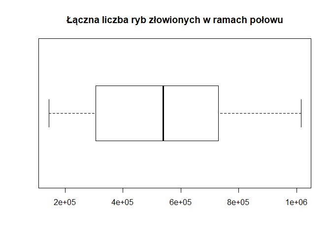

# Biblioteki:

```r
library(reshape2)
library(dplyr)
library(tidyr)
library(knitr)
library(ggplot2)
library(plotly)
library(corrplot)
library(shiny)
library(reshape)
library(caret)
```

# Wczytanie danych


Zbiór pochodzi z pliku "sledzie.csv",zwaiera16 atrybutów opisujących 52582 obserwacji. W zbiorze znajdują się 10094 niekompletnych obserwacji. Wartości puste w zbiorze reprezentowane sa za pomocą '?', a część dziesiętna liczb oddzielona jest kropką. Zbiór posiada nagłówek opisujący nazwy atrybutów.  By dane zostały wczytane poprawnie, do funcji read.csv przekazano takie argumenty jak: nazwa pliku, forma reprezentacji wartości pustych, że zbiór zawiera nagłówek oraz listę prezentującą klasy danych atrybutów.

# Analiza zbioru:
Zbiór danych zawiera 16 atrybutów: \ 

length - długość złowionego śledzia [cm] \
cfin1  - dostępność planktonu [zagęszczenie Calanus finmarchicus gat. 1] \
cfin2  - dostępność planktonu [zagęszczenie Calanus finmarchicus gat. 2] \
chel1  - dostępność planktonu [zagęszczenie Calanus helgolandicus gat. 1] \
chel2  - dostępność planktonu [zagęszczenie Calanus helgolandicus gat. 2] \
lcop1  - dostępność planktonu [zagęszczenie widłonogów  gat. 1] \
lcop2  - dostępność planktonu [zagęszczenie widłonogów  gat. 2] \
fbar   - natężenie połowów w regionie [ułamek pozostawionego narybku] \
recr   - roczny narybek [liczba śledzi] \
cumf   - łączne roczne natężenie połowów w regionie [ułamek pozostawionego narybku] \
totaln - łączna liczba ryb złowionych w ramach połowu [liczba śledzi] \
sst    - temperatura przy powierzchni wody [°C] \
sal    - poziom zasolenia wody [Knudsen ppt] \
xmonth - miesiąc połowu [numer miesiąca] \
nao    - oscylacja północnoatlantycka [mb] \

Kolejne wiersze reprezentują kolejne obserwacje i są ułożone hronologicznie. 


```r
kable(summary(raw_df), caption = "Podsumowanie zbioru danych")
```


Table: Podsumowanie zbioru danych

           X             length         cfin1             cfin2             chel1            chel2            lcop1              lcop2             fbar             recr              cumf             totaln             sst             sal            xmonth            nao         
---  --------------  -------------  ----------------  ----------------  ---------------  ---------------  -----------------  ---------------  ---------------  ----------------  ----------------  ----------------  --------------  --------------  ---------------  -----------------
     Min.   :    0   Min.   :19.0   Min.   : 0.0000   Min.   : 0.0000   Min.   : 0.000   Min.   : 5.238   Min.   :  0.3074   Min.   : 7.849   Min.   :0.0680   Min.   : 140515   Min.   :0.06833   Min.   : 144137   Min.   :12.77   Min.   :35.40   Min.   : 1.000   Min.   :-4.89000 
     1st Qu.:13145   1st Qu.:24.0   1st Qu.: 0.0000   1st Qu.: 0.2778   1st Qu.: 2.469   1st Qu.:13.427   1st Qu.:  2.5479   1st Qu.:17.808   1st Qu.:0.2270   1st Qu.: 360061   1st Qu.:0.14809   1st Qu.: 306068   1st Qu.:13.60   1st Qu.:35.51   1st Qu.: 5.000   1st Qu.:-1.89000 
     Median :26291   Median :25.5   Median : 0.1111   Median : 0.7012   Median : 5.750   Median :21.673   Median :  7.0000   Median :24.859   Median :0.3320   Median : 421391   Median :0.23191   Median : 539558   Median :13.86   Median :35.51   Median : 8.000   Median : 0.20000 
     Mean   :26291   Mean   :25.3   Mean   : 0.4458   Mean   : 2.0248   Mean   :10.006   Mean   :21.221   Mean   : 12.8108   Mean   :28.419   Mean   :0.3304   Mean   : 520367   Mean   :0.22981   Mean   : 514973   Mean   :13.87   Mean   :35.51   Mean   : 7.258   Mean   :-0.09236 
     3rd Qu.:39436   3rd Qu.:26.5   3rd Qu.: 0.3333   3rd Qu.: 1.7936   3rd Qu.:11.500   3rd Qu.:27.193   3rd Qu.: 21.2315   3rd Qu.:37.232   3rd Qu.:0.4560   3rd Qu.: 724151   3rd Qu.:0.29803   3rd Qu.: 730351   3rd Qu.:14.16   3rd Qu.:35.52   3rd Qu.: 9.000   3rd Qu.: 1.63000 
     Max.   :52581   Max.   :32.5   Max.   :37.6667   Max.   :19.3958   Max.   :75.000   Max.   :57.706   Max.   :115.5833   Max.   :68.736   Max.   :0.8490   Max.   :1565890   Max.   :0.39801   Max.   :1015595   Max.   :14.73   Max.   :35.61   Max.   :12.000   Max.   : 5.08000 
     NA              NA             NA's   :1581      NA's   :1536      NA's   :1555     NA's   :1556     NA's   :1653       NA's   :1591     NA               NA                NA                NA                NA's   :1584    NA              NA               NA               

```r
uniq <- raw_df %>% summarise_each(funs(n_distinct(., na.rm = TRUE)))
kable(uniq, caption = "Unikalne wartości")
```


Table: Unikalne wartości

     X   length   cfin1   cfin2   chel1   chel2   lcop1   lcop2   fbar   recr   cumf   totaln   sst   sal   xmonth   nao
------  -------  ------  ------  ------  ------  ------  ------  -----  -----  -----  -------  ----  ----  -------  ----
 52582       59      39      48      48      51      48      51     51     52     52       53    51    51       12    45
# Rozkład wartości atrybutów 

```r
boxplot(df_no_na$length, horizontal = TRUE, main="Długość złowionego śledzia [cm]")
```

<!-- -->

```r
boxplot(df_no_na[,3:8], main="Dostępność planktonu", 
        names=c("cfin1","cfin2","chel1","chel2","lcop1","lcop2"))
```

<!-- -->

```r
boxplot(df_no_na$fbar, horizontal=TRUE, main="Natężenie połowów w regionie")
```

<!-- -->

```r
boxplot(df_no_na$recr, horizontal=TRUE, main="Roczny narybek")
```

<!-- -->

```r
boxplot(df_no_na$cumf, horizontal=TRUE, main="Łączne roczne natężenie połowów w regionie")
```

<!-- -->

```r
boxplot(df_no_na$totaln, horizontal=TRUE, main="Łączna liczba ryb złowionych w ramach połowu")
```

<!-- -->

```r
boxplot(df_no_na$sst, horizontal=TRUE, main="Temperatura przy powierzchni wody")
```

<!-- -->

```r
boxplot(df_no_na$sal, horizontal=TRUE, main="Poziom zasolenia wody")
```

<!-- -->

```r
boxplot(df_no_na$nao, horizontal=TRUE, main="Oscylacja północnoatlantycka")
```

<!-- -->


# Analiza brakujących wartości.


```r
for (i in 1:ncol(df)){df[is.na(df[,i]),i] <- mean(df[,i],na.rm = T)}
```
Brakujące wartości występują tylko w 7 atrybutach: \
- dostępność planktonu -> cfin1, cfin2, chel1, chel2, lcop1, lcop2, \
- temperatura przy powierzchni wody -> sst. \
Łącznie niepełnych obserwacji mamy: 10094, czyli jest to 19.1966833 % całego zbiioru. Usunięcie takiej ilości obserwacji ze względu na braki w jednej cesze może być dużo bardziej szkodliwe niż podmienienie ich na wartości średnie lub mediane danej cechy.
Można by spróbować, ze względu na chronologiczne ułożenie danych, obliczać średnią z wartości poprzedzającej wartość pustą oraz następującej po wartości pustej, jednak to może spowodować duże przekłamanie w danych. Średnia jest bezpieczniejszym rozwiązaniem, która nie psuje tak mocno rozkładu danych.


# Korelacja między atrybutami

```r
correlation <- cor(df_no_na)
corrplot(correlation,type="upper",tl.col = "black", tl.srt = 45)
```

<!-- -->
Największą korelację można zaobserwować między parami: `chel1` - `loop1` ,`chel2` - `loop2`,  `fbar` - `cumf`, `cfin2` - `lcop2` oraz `cumf` - `totaln`.
W stosunku do atrybutu 'length' najwyższą korelacje można zaobserwować z  `sst`, `nao`.
Nao jest to Oscylacja Północnoatlantycka, która jest zjawiskiem meteorologicznym. Występuje w obszarze północnego atlantyku i ma wpływ na klimat otaczających go kontynentów. Jej działalność związana jest z cyrkulacją powietrza i wody, co by tłumaczyło zależność długości śledzia od tych dwóch atrybutów na raz. 
`length` jest także skorelowany z intensywnościa połowów oraz dostępnością planktonu (chel1 - Calanus helgolandicus gat. 1 i lcop1 - widłonogów  gat. 1).

```r
ggplot(df_no_na, aes(x=sst, y=length)) + geom_point() + geom_smooth() + theme_bw()
```

```
## `geom_smooth()` using method = 'gam' and formula 'y ~ s(x, bs = "cs")'
```

<!-- -->


# Zmiana rozmiaru śledzia w czasie

```r
partition <- createDataPartition(y=df_no_na$length, p=.05, list=FALSE)
dfPartition <- df_no_na[partition, ]
p <- ggplot(dfPartition, aes(x=X, y=length)) + geom_point() + geom_smooth() + theme_bw()
ggplotly(p)
```

```
## `geom_smooth()` using method = 'gam' and formula 'y ~ s(x, bs = "cs")'
```

<!--html_preserve--><div id="htmlwidget-7443090cf0cdc72daf2b" style="width:672px;height:480px;" class="plotly html-widget"></div>
<script type="application/json" data-for="htmlwidget-7443090cf0cdc72daf2b">{"x":{"data":[{"x":[58,103,117,179,212,221,231,266,267,302,305,372,374,393,414,425,429,451,488,512,514,527,533,553,563,567,585,632,696,705,709,733,738,756,771,792,840,859,870,932,962,990,1032,1036,1073,1085,1088,1133,1146,1161,1172,1189,1191,1196,1200,1201,1249,1251,1277,1278,1302,1347,1373,1407,1408,1412,1424,1444,1465,1487,1521,1523,1531,1550,1562,1574,1615,1657,1719,1723,1806,1828,1837,1853,1889,1960,1966,1971,1976,1979,2001,2071,2116,2141,2198,2217,2225,2233,2239,2259,2263,2282,2305,2310,2340,2343,2532,2540,2551,2559,2567,2635,2659,2660,2772,2777,2857,2871,2896,2897,2997,3011,3014,3048,3095,3115,3124,3128,3173,3200,3225,3227,3231,3273,3314,3321,3325,3356,3357,3494,3509,3529,3566,3575,3583,3654,3671,3772,3827,3829,3856,3886,3889,3900,3904,3931,4001,4009,4045,4047,4064,4184,4208,4286,4289,4307,4313,4328,4338,4348,4377,4407,4416,4427,4487,4541,4554,4568,4571,4613,4621,4626,4627,4635,4657,4726,4728,4774,4803,4833,4840,4865,4888,4913,4937,4984,4990,4993,5027,5036,5066,5084,5121,5126,5137,5220,5230,5235,5253,5257,5263,5278,5331,5337,5377,5411,5494,5525,5574,5575,5617,5659,5669,5675,5703,5705,5739,5743,5761,5766,5779,5828,5858,5859,5887,5907,5937,5994,6000,6015,6030,6033,6042,6116,6136,6138,6188,6223,6224,6283,6289,6301,6312,6320,6360,6371,6438,6460,6464,6468,6489,6497,6519,6547,6556,6640,6647,6648,6667,6672,6712,6716,6737,6749,6875,6922,6948,6959,6977,7009,7015,7124,7130,7172,7195,7207,7217,7249,7252,7285,7314,7323,7332,7376,7428,7430,7442,7455,7499,7502,7546,7587,7596,7608,7633,7645,7652,7698,7710,7739,7745,7758,7797,7826,7873,7877,7882,7931,7933,7966,8021,8058,8071,8080,8111,8125,8141,8190,8207,8218,8224,8234,8270,8278,8391,8451,8476,8479,8496,8551,8578,8579,8659,8675,8694,8776,8784,8808,8814,8818,8835,8870,8896,8906,8918,8920,8953,8962,8992,9009,9014,9018,9022,9032,9035,9053,9094,9098,9143,9171,9173,9221,9226,9230,9244,9256,9259,9345,9354,9372,9400,9428,9454,9457,9466,9493,9533,9541,9544,9575,9618,9626,9628,9636,9711,9715,9749,9773,9794,9795,9826,9831,9876,9888,9911,9941,9960,9982,9994,10003,10052,10134,10160,10175,10190,10211,10230,10269,10274,10289,10309,10361,10392,10395,10412,10477,10551,10703,10707,10744,10770,10772,10780,10795,10807,10831,10833,10839,10840,10855,10866,10883,10902,10903,10938,10954,10996,11028,11032,11083,11252,11270,11334,11370,11402,11413,11489,11490,11525,11532,11563,11569,11574,11624,11637,11640,11678,11679,11698,11707,11725,11746,11776,11801,11808,11818,11861,11863,11913,11931,11933,11941,11949,11963,11972,11983,12019,12044,12129,12136,12236,12279,12332,12360,12377,12394,12397,12442,12476,12480,12499,12521,12552,12555,12571,12590,12597,12599,12606,12621,12659,12672,12716,12744,12811,12874,12900,12905,12910,12951,12982,13024,13058,13071,13103,13109,13112,13113,13119,13211,13253,13261,13270,13277,13287,13304,13316,13327,13331,13339,13359,13382,13416,13453,13527,13556,13559,13569,13574,13582,13583,13608,13645,13675,13678,13726,13744,13798,13800,13851,13859,13872,13878,13881,13891,13930,13936,13964,13972,13975,13981,13995,14012,14018,14028,14043,14063,14085,14088,14098,14145,14174,14185,14186,14199,14246,14292,14312,14348,14403,14406,14410,14422,14425,14487,14533,14558,14572,14574,14617,14641,14655,14679,14693,14752,14760,14800,14843,14847,14857,14865,14870,14877,14960,14975,14980,15009,15015,15020,15030,15031,15045,15060,15091,15159,15162,15165,15172,15179,15212,15238,15326,15329,15371,15402,15414,15433,15513,15528,15664,15756,15760,15781,15792,15811,15930,15948,15982,16077,16172,16178,16206,16269,16276,16296,16316,16336,16398,16408,16433,16435,16442,16492,16495,16501,16527,16544,16647,16673,16685,16743,16798,16866,16980,16983,16987,16988,16994,17002,17017,17046,17142,17187,17206,17215,17238,17319,17320,17323,17388,17433,17477,17481,17515,17539,17583,17649,17664,17690,17713,17727,17730,17747,17769,17792,17840,17846,17850,17866,17879,17896,17901,17918,17960,17981,18100,18176,18189,18197,18207,18223,18224,18235,18274,18296,18313,18335,18371,18372,18374,18390,18404,18437,18472,18481,18492,18507,18510,18535,18539,18564,18588,18609,18610,18642,18666,18679,18688,18739,18780,18790,18826,18857,18877,18878,18889,18911,18947,18965,19044,19064,19069,19111,19136,19151,19176,19180,19186,19196,19204,19262,19282,19317,19340,19352,19535,19591,19595,19596,19659,19679,19689,19700,19702,19719,19721,19744,19816,19831,19865,19875,19898,19899,19905,19912,19941,19948,19976,19977,19989,20027,20062,20064,20105,20132,20175,20207,20227,20258,20259,20260,20275,20308,20350,20373,20374,20383,20390,20398,20430,20470,20489,20492,20516,20534,20570,20593,20599,20637,20663,20667,20700,20749,20762,20778,20803,20879,20896,20906,20932,20950,20993,21031,21034,21041,21065,21082,21084,21101,21108,21139,21148,21162,21166,21210,21255,21261,21265,21271,21285,21295,21300,21301,21325,21351,21379,21476,21504,21517,21564,21674,21714,21751,21824,21855,21874,21902,21954,21965,22066,22097,22171,22181,22207,22332,22341,22354,22387,22388,22407,22408,22424,22438,22442,22451,22460,22520,22537,22570,22581,22590,22608,22614,22637,22651,22655,22675,22695,22697,22753,22790,22818,22829,22849,22870,22901,22903,22932,23091,23103,23109,23157,23161,23169,23185,23203,23281,23331,23376,23398,23409,23421,23433,23438,23454,23516,23528,23535,23536,23630,23635,23653,23718,23724,23728,23751,23778,23783,23786,23810,23923,23954,23960,24014,24034,24068,24108,24119,24176,24206,24208,24213,24245,24255,24260,24307,24322,24334,24357,24405,24418,24462,24478,24488,24504,24524,24533,24552,24556,24567,24609,24613,24615,24621,24660,24665,24667,24679,24692,24695,24714,24720,24725,24764,24782,24824,24842,24850,24856,24871,24892,24913,24970,25006,25082,25111,25223,25270,25297,25318,25327,25339,25360,25366,25410,25438,25470,25496,25499,25523,25524,25542,25558,25583,25592,25621,25636,25668,25679,25682,25684,25685,25695,25702,25753,25778,25779,25797,25873,25936,25955,26023,26039,26044,26082,26124,26151,26156,26169,26171,26208,26244,26248,26261,26273,26321,26333,26425,26460,26467,26485,26526,26549,26563,26634,26645,26665,26682,26689,26714,26766,26785,26809,26826,26837,26841,26865,26895,26896,26902,26917,26923,27000,27067,27080,27090,27101,27241,27282,27289,27300,27317,27318,27330,27346,27348,27369,27451,27465,27562,27591,27642,27653,27682,27694,27747,27758,27783,27806,27824,27881,27883,27884,27893,27910,27911,27912,27925,27929,27935,27998,28017,28019,28051,28063,28116,28119,28155,28161,28169,28183,28215,28221,28228,28231,28323,28339,28379,28389,28393,28455,28459,28484,28485,28501,28680,28758,28773,28802,28826,28845,28848,28982,28993,29014,29021,29057,29062,29088,29101,29119,29123,29136,29140,29177,29186,29259,29301,29302,29311,29336,29378,29393,29413,29424,29436,29462,29465,29470,29489,29524,29580,29581,29588,29591,29604,29635,29636,29675,29833,29902,29921,29929,29967,29983,30025,30039,30047,30058,30066,30082,30098,30116,30134,30143,30155,30193,30197,30205,30263,30291,30298,30351,30416,30426,30432,30453,30481,30491,30493,30500,30505,30562,30585,30612,30673,30675,30687,30691,30719,30733,30761,30772,30825,30837,30858,30859,30872,30874,30875,30886,30895,30998,31047,31055,31094,31107,31142,31178,31187,31217,31254,31323,31327,31328,31421,31423,31427,31447,31474,31488,31496,31499,31523,31550,31587,31590,31609,31651,31668,31698,31731,31732,31856,31871,31886,31942,31958,32027,32048,32051,32075,32100,32128,32143,32156,32164,32168,32193,32203,32269,32290,32292,32347,32355,32360,32413,32431,32574,32580,32621,32653,32723,32726,32733,32784,32832,32842,32847,32858,32905,32926,32971,33014,33060,33091,33103,33121,33153,33154,33162,33172,33181,33207,33220,33224,33239,33242,33249,33275,33301,33329,33335,33422,33452,33466,33490,33529,33553,33566,33610,33614,33681,33688,33704,33724,33725,33762,33786,33837,33855,33865,33869,33881,33884,33885,33892,33898,33939,34036,34052,34055,34070,34073,34105,34115,34127,34144,34167,34173,34184,34185,34187,34251,34257,34306,34355,34366,34401,34416,34424,34427,34428,34444,34445,34661,34710,34841,34849,34916,34921,34922,34958,34966,35030,35047,35072,35074,35082,35087,35088,35140,35158,35163,35182,35186,35219,35235,35369,35370,35374,35386,35397,35427,35429,35454,35498,35648,35734,35780,35800,35802,35828,35833,35872,35895,35922,35956,36034,36040,36083,36094,36107,36130,36131,36138,36159,36169,36185,36192,36261,36263,36266,36304,36317,36335,36337,36344,36390,36395,36426,36444,36476,36499,36521,36572,36576,36584,36624,36632,36645,36646,36672,36715,36758,36759,36788,36834,36879,36885,36886,36914,36970,36984,37005,37006,37029,37061,37062,37063,37068,37105,37150,37155,37162,37200,37207,37212,37222,37229,37241,37262,37277,37282,37328,37346,37373,37398,37439,37473,37483,37502,37506,37606,37622,37634,37642,37667,37690,37700,37708,37718,37731,37795,37812,37813,37829,37830,37897,37915,37923,37934,37963,37967,38003,38008,38037,38063,38065,38069,38076,38110,38114,38130,38183,38186,38257,38259,38288,38298,38357,38450,38470,38496,38508,38515,38545,38564,38593,38599,38626,38648,38660,38709,38780,38829,38834,38858,38884,38931,38932,39008,39027,39030,39070,39120,39129,39157,39164,39184,39316,39385,39394,39407,39462,39484,39494,39510,39521,39524,39555,39583,39600,39609,39613,39638,39647,39665,39693,39728,39740,39747,39772,39778,39821,39822,39879,40064,40091,40116,40131,40152,40162,40205,40246,40288,40310,40398,40437,40465,40478,40522,40529,40530,40571,40608,40622,40641,40745,40816,40853,40868,40899,40917,40931,40957,40979,40983,41011,41041,41052,41058,41060,41062,41088,41130,41135,41153,41160,41175,41183,41214,41240,41312,41360,41363,41366,41405,41421,41452,41466,41473,41499,41510,41523,41532,41624,41625,41678,41679,41686,41695,41716,41738,41754,41778,41852,41880,41895,41896,41898,41915,42072,42097,42100,42108,42149,42159,42265,42298,42339,42342,42409,42416,42423,42455,42471,42486,42506,42537,42551,42556,42560,42564,42589,42614,42622,42634,42635,42640,42646,42673,42690,42741,42750,42780,42803,42821,42867,42875,42903,42953,42979,42980,42996,43006,43010,43013,43023,43048,43049,43051,43059,43070,43074,43080,43095,43097,43098,43136,43205,43221,43225,43241,43246,43260,43270,43271,43289,43326,43331,43345,43346,43404,43424,43432,43508,43512,43517,43524,43562,43566,43614,43640,43649,43702,43713,43815,43823,43824,43890,43917,43932,43959,43960,43967,43969,44050,44069,44115,44168,44183,44189,44232,44248,44291,44314,44330,44365,44410,44427,44447,44460,44510,44514,44523,44531,44595,44605,44644,44655,44666,44667,44672,44673,44691,44747,44760,44764,44814,44945,44974,44979,44980,45013,45033,45051,45090,45120,45177,45191,45217,45234,45256,45268,45275,45284,45309,45341,45343,45348,45394,45414,45431,45457,45520,45569,45621,45625,45630,45652,45672,45682,45712,45756,45776,45777,45796,45801,45813,45826,45835,45836,45863,45872,45907,45919,45960,46010,46015,46019,46024,46040,46107,46112,46157,46182,46216,46217,46234,46251,46279,46330,46335,46336,46337,46338,46349,46352,46401,46402,46421,46481,46498,46524,46535,46545,46579,46594,46633,46636,46674,46685,46695,46708,46719,46724,46725,46726,46788,46797,46811,46862,46878,46900,46909,46925,46935,46948,46960,46980,47043,47052,47075,47113,47126,47138,47162,47224,47239,47243,47294,47324,47358,47359,47364,47398,47400,47446,47448,47452,47456,47482,47562,47635,47650,47675,47681,47691,47718,47721,47742,47744,47763,47831,47903,47905,47928,47936,47938,47942,47985,48003,48012,48015,48106,48149,48162,48187,48219,48255,48258,48284,48308,48336,48349,48387,48409,48420,48433,48444,48480,48509,48539,48554,48561,48641,48666,48671,48687,48691,48733,48756,48761,48789,48793,48795,48807,48833,48844,48850,48866,48871,48911,48918,48936,48944,48982,49036,49073,49121,49159,49184,49192,49291,49298,49321,49337,49355,49375,49386,49388,49399,49451,49465,49475,49500,49520,49527,49542,49573,49615,49618,49646,49650,49674,49693,49698,49727,49740,49790,49814,49847,49848,49899,49913,49916,49920,49940,49948,49999,50014,50027,50052,50075,50078,50145,50164,50189,50196,50217,50255,50326,50380,50387,50434,50466,50469,50487,50489,50558,50600,50704,50709,50734,50735,50759,50764,50807,50811,50812,50864,50903,50915,50943,50945,50952,50954,50977,50979,50995,51001,51017,51022,51181,51185,51229,51244,51245,51311,51340,51357,51358,51422,51457,51481,51499,51528,51534,51535,51556,51578,51581,51649,51650,51676,51721,51742,51757,51840,51859,51899,51913,51940,51945,51954,51965,51966,52105,52164,52191,52220,52246,52256,52273,52305,52314,52332,52336,52355,52361,52392,52418,52480,52501,52549,52574],"y":[23.5,22.5,22.5,22,21.5,23,23,21.5,22,22,22.5,23.5,22,27,26,25,24.5,20.5,24.5,23.5,21,23.5,22.5,25,26.5,25.5,21.5,24.5,25,25.5,23,26.5,26,26.5,26,23,24.5,24.5,24.5,25.5,26.5,24.5,22.5,22,26,25.5,26.5,26,27,25.5,28,24.5,25,25,26,26.5,21,24.5,24,25.5,26,25.5,27.5,26,26,25.5,26,28,25,26.5,26,27.5,25.5,27,26.5,25,25,24,25,27.5,25.5,27,23.5,24,24,24,25,24,24.5,24.5,25.5,23.5,25.5,26,25,25,25.5,23.5,22.5,25.5,24.5,23,25.5,28,26.5,24.5,26,24.5,25.5,26,25,26.5,25.5,27,25.5,25.5,24.5,29.5,25,27,27,24.5,25.5,25.5,22,22,23.5,23,23.5,20,23,22,23.5,26,24.5,28.5,26.5,24,24,24.5,24,26,22.5,25.5,26,27,27.5,26,27,26.5,23.5,22,26.5,25.5,24,25,24.5,24.5,25.5,24.5,28,26.5,24.5,25,24.5,25,26,23,24,25.5,23.5,26,24.5,26,26.5,25,23.5,25.5,25,26,27,25,23.5,25,24.5,26,25.5,24.5,24.5,27,25.5,23.5,23,24.5,26,25.5,25,26.5,25,24.5,24.5,25,24.5,27,25.5,27.5,26.5,21.5,24,27,21.5,21,24.5,24,27,25.5,26.5,24.5,23,27.5,25,23.5,25,25,26.5,26,25,26,25.5,24,27,25,25,24.5,27,24,24.5,26,24.5,26,25,26,25,25.5,25.5,26,26,26.5,24.5,26,26,25.5,26,25,26.5,21.5,27,26.5,25,27,26.5,25,27.5,25,27,26,26,24.5,25,27.5,25.5,26.5,25.5,26,23.5,23,24,25.5,27,24.5,26.5,24,23.5,27.5,25.5,24.5,25,24,26,27,24.5,26,26.5,25.5,25,24.5,26,26,23.5,26,25,23.5,24,25,24.5,29,26.5,26.5,26,27,26.5,25,27.5,25,24.5,26,24.5,27,25.5,28,28.5,26,26,22.5,27,23.5,27,24.5,25,25.5,25.5,27,24.5,25.5,27.5,24,26,26.5,26,26,24,25,27,27.5,26.5,26,25.5,25.5,24.5,27,25,26,24,25,26,25,20.5,22,26,25.5,26,27,24.5,25,26,26,27,26.5,21,27,26.5,26,26,24.5,23.5,24,26,24,24,24.5,24,23,26.5,26.5,25.5,26,26.5,23,27.5,25,26,25,25.5,26,26,26.5,26,25.5,26,26,25,26,24.5,25,26.5,26.5,24,27.5,24.5,25,25,27,23.5,26.5,26.5,25.5,24.5,27,26,24,26.5,26,26,25,25,25.5,26.5,28,27,27,28,25.5,27,25.5,26,27,28,27.5,27,27,28.5,28.5,26.5,25,26.5,25,27,26.5,27.5,25,26,26,25.5,25.5,28,28,25,28,26,25.5,26.5,28,26.5,25,24.5,27.5,27,25.5,26.5,26.5,24,24.5,27.5,26,27,29,26.5,24.5,27,26,26.5,25.5,26,24,24,25,25.5,27,25.5,24,26,27,26.5,24,24,24.5,26,25.5,25,25.5,26.5,25.5,24.5,27,26,27,28,25.5,24,25.5,25,24.5,28,27,28,25,26,23.5,26.5,27.5,25,26.5,26,27,26,27.5,26.5,25.5,28,26,26.5,26.5,28,25,25.5,25,26.5,27,26,27.5,25,27,24.5,26,27,25.5,24.5,26.5,27.5,26,25.5,27,27,27.5,27,26.5,27.5,25.5,26,26,24,25.5,27.5,26.5,26.5,23,27,25.5,26.5,28.5,26.5,27.5,27,27.5,25.5,26,27.5,27,28,30,24.5,27,26,25,25.5,27.5,27,26,26.5,25.5,27,25.5,25.5,25.5,27,26,28,27.5,27.5,22,27.5,28,25.5,27,29.5,26.5,27.5,26.5,26.5,27,28.5,26,25.5,27.5,26,27,27,27.5,28.5,27,27.5,27,27,25,27,25.5,27,26,24,25.5,26.5,28,28,27,26.5,28,26.5,27.5,27,26.5,26,27,24,27,26,26.5,27,26.5,27,27,29,27,27,27,27,27.5,25.5,29.5,26.5,28,27.5,24.5,25.5,26.5,27.5,28.5,28.5,28.5,28,29.5,27.5,26.5,24.5,26.5,27,26.5,27.5,27,30,27.5,28,28,29.5,27,27.5,27.5,26.5,27.5,26.5,25,27.5,25,27.5,24,27.5,27.5,27,28,28.5,27.5,27.5,27.5,28,25,26.5,26.5,27.5,28.5,24.5,28.5,27.5,24,26,23.5,25,29.5,26.5,27.5,25,25,25.5,25,26,27.5,26.5,27.5,27,26.5,26.5,27.5,25.5,25.5,28,25.5,26.5,27,27.5,26,27,23.5,28,26.5,26.5,27.5,27.5,27,28,26.5,28.5,26.5,26.5,27,27,27.5,26,27,25,27,27.5,27.5,26,28,29.5,25.5,27,28,25.5,27.5,28,26,28,28.5,29,25.5,28,26,26,27.5,26,27,26.5,24.5,26,25.5,26,27,26,27.5,26.5,26.5,26.5,25.5,25.5,27,27,26,25.5,27.5,26.5,26.5,26.5,25,24.5,27,25.5,25.5,28.5,25.5,27,28.5,27,27,26,26.5,29,27,29,24,25,27.5,26.5,26,25,27.5,27,26,25.5,26,25.5,27,25.5,25,22.5,25.5,26,26.5,25.5,23.5,27.5,25,27,23,24.5,25,27,25,26.5,25,24.5,27,25.5,25,26,27,27,25.5,26,26,29,28,25,28,27.5,27.5,28,28,28.5,25.5,23.5,25,24.5,25.8,26,24,23,25.5,23.4,24,23,23.5,25.5,25,25.5,24.5,25.5,23,23,24,24.5,24.5,22,23.5,25.5,22.5,24.5,27,28,26.5,23,24,23,25.5,23.5,26,26,24.5,26,25,23.5,24.5,26.5,27.5,27,25,24.5,25.5,28.5,27,27,28.5,27,26,24.5,28.5,28,25.5,25.5,25,27.5,27,27,27,28,28.5,27.5,27.5,23,23.5,23,28,27,27.5,30,27,27.5,27,28,27.5,28,25.5,28.5,26,26.5,26.5,26,28,26,25,25,25.5,27.5,28.5,23,25,25,25.5,26.5,24.5,26,25.5,24,27,25,25.5,26.5,25,25.5,25.5,25.5,25.5,26,26.5,27,25,24,24,26.5,24.5,24,26,24.5,28.5,28.5,23.5,24.5,24.5,22.5,23,25.5,28,27.5,24,27.5,26.5,27,26.5,24.5,28.5,26,28,26,28.5,28,27,25.5,25.5,28,27.5,25,26,25,26.5,28,26.5,26,26.5,26,28.5,28.5,27.5,27.5,27,23.5,28,29,27,27.5,28,27,27.5,28,27,28.5,28.5,27,28,25,25.5,23.5,26.5,28,28,29,23,23.5,27,25.5,28,26,26,25.5,22,25.5,26.5,24.5,26,26.5,23,24.5,27,24.5,24.5,25,25.5,26.5,25,24,25,25,22.5,24.5,24,23,28,28,27,23,24.5,22,24.5,23,25,23,25,23.5,26,23,23,22.5,25.5,24,24,25,25,26.5,24.5,26,28,24.5,22,27.5,27,26.5,26.5,24.5,25.5,24,24,23.5,23.5,28.5,22.5,22.5,28.5,27.5,24,24.5,26.5,27.5,24.5,24.5,25.5,25,26,23.5,26,25,27.5,27.5,28,21.5,22.5,25,26.5,26,27,28,24.5,27.5,25.5,26.5,25,24.5,27.5,28,28.5,26,28,26,23.5,26.5,26.5,28,25.5,28,23.5,26.5,24.5,22,27.5,25.5,23,25.5,27.5,27.5,25.5,24.5,28,26,27,27,29.5,27.5,27.5,27,27,26,25.5,27,26.5,26.5,27,26,26,26,25,26,27,27,26,23.5,21.5,26.5,24,25,26.5,25,22,26,25.5,24.5,24.5,26,26,25,27,27,24.5,24,25.5,26,22.5,26,25,23,24.5,26,26,24.5,23.5,26.5,26,26.5,26,24.5,27,27.5,26.5,23.5,26,26.5,27,24.5,26,24.5,27,25,26.5,26,29.5,27,23.5,25.5,25.5,26,28.5,25.5,25.5,26.5,25.5,26.5,25.5,26,26,26,26,26.5,25.5,26,24.5,25.5,26,25.5,26,27,25.5,24,22.5,25,25.5,23.5,25.5,27,25,26.5,28,27,26.5,27,26.5,27,27,26.5,25,25,27,25,26.5,25.5,23.5,24.5,24.5,26,26.5,25,25,26,24.5,24.5,25,25.5,22,23.5,26,26.5,21.5,25,24.5,25.5,23.5,25,23.5,24,27,25.5,27.5,24,26.5,26,25,22.5,26.5,25,22.5,26,22.5,25.5,24.5,24.5,23,23,25,25.5,25,23,22.5,23,23.5,23,22,23.5,25.5,23.5,26,26,25.5,26.5,24,26,27.5,25.5,26.5,27,28,27.5,26,25.5,22,28.5,26,25.5,26,24,26.5,29,25.5,25.5,23.5,22.5,22.5,22.5,22.5,25,23,24.5,25.5,24.5,25,25,25.5,26.5,27,26,24,24,23.5,24,27,24,24.5,25.5,24.5,26.5,26.5,24.5,26,25,28.5,25.5,27.5,25,24,27.5,23.5,24.5,26,24,25.5,23.5,23.5,24.5,22,24.5,26,25,26,26.5,24,25.5,24.5,25.5,24,25.5,24,25.5,25.5,26.5,26,25,24.5,24.5,24,24,26,26.5,26,25,24.5,26.5,26,26.5,25,26.5,26.5,26,24.5,26,26.5,24,26,27,25,26.5,27,24.5,26,23.5,26,27,27,25,26,24,25.5,26.5,25.5,26,27.5,25.5,26,25.5,25,26,25,24.5,25,26,26.5,24,24.5,26.5,24.5,25,24.5,26.5,27,25,25,24,25,24,24,24,24,24.5,24.5,26.5,25,26,24,23.5,22.5,23.5,25,25.5,25,26,25.5,25.5,26,23.5,25.5,25.5,26,25,25.5,24,26,26.5,26.5,23.5,23,26,23,24.5,26.5,27,24,25.5,24,24.5,24.5,24.5,23.5,25.5,26.5,24.5,25,22.5,23.5,21.5,23,25.5,21.5,24,27.5,25,25,24.5,27,25.5,25,25.5,26,27.5,25,27,25,24.5,26,24.5,25.5,27.5,26,25,25.5,24.5,25.5,24.5,25.5,24,25,24.5,27,24,24.5,25.5,23,26.5,26,22.5,23,25,25,23,23,24,23.5,23.5,23.5,25.5,26,26,26.5,24.5,25,24,25.5,23.5,26,25.5,24.5,25,25.5,23.5,25,26,25,25.5,23.5,24,25.5,25.5,26,25,25,24.5,23.5,23,22,22,24,24.5,23.5,23,23,23.5,24.5,24.5,23,22.5,25.5,22,25,23.5,23.5,21.5,23.5,23.5,24.5,25,21.5,25,25,26,26,24.5,26,25,26.5,25,24.5,24.5,26,25.5,25,25,23.5,26,26.5,24,26.5,24.5,22,24.5,24.5,23,24,22.5,26,24,25,25,24.5,24,25,25,25,25,25,25.5,24,23.5,25,24,24,24,22.5,21.5,23.5,23.5,23,22.5,24.5,26,23,26.5,24.5,23,24,25,25,24.5,22,24.5,24,25,24,25,26,24.5,25,23,26,24.5,25,24,26,24,25.5,23,25,25,24.5,22.5,23.5,24,23,24,24.5,24,24.5,26,26,25,25.5,24,23.5,24.5,24.5,24,24,25.5,23,24,24.5,23,24.5,24,24.5,23.5,24,24.5,24.5,23.5,23,26.5,22.5,24.5,24,24.5,26,22,24.5,24.5,23,23,23,24,23.5,24.5,24.5,22,24.5,25,23,22.5,26,25.5,23,25,21.5,24,25.5,25.5,23.5,22.5,23.5,24.5,22.5,25.5,23.5,24,22.5,24.5,26,26,24,23.5,25,24.5,25,26,25,21.5,24,23.5,25,24.5,24.5,23.5,23.5,22,23.5,23.5,26.5,25.5,24,24,22,25,23,23.5,22,23,23,21.5,22.5,22,24,24,25.5,25,24,22,24.5,25.5,24,23,22,24,25,23,23.5,23.5,22.5,23.5,23.5,26,24,23,23.5,24.5,23.5,23.5,21.5,24.5,21.5,25.5,24,24.5,22.5,25.5,24.5,24.5,23,23,26,23.5,24,22,24.5,25.5,23,23,26,26,23.5,23.5,25,23,24.5,23.5,26.5,21.5,24.5,23,25,25,26,26,25,22,26.5,25.5,23,24,22,22,22.5,23.5,23,26.5,23,22.5,24,23,22,26,25,25,25,26,22,24,24,22,24.5,22,23,25,25,27,24.5,24.5,24.5,24,25,25.5,25,24.5,24.5,22,24.5,22.5,23.5,22,25.5,23,24,23,21.5,23.5,24,26,25.5,24,26.5,21,24.5,21.5,21.5,24,25,27,25,23.5,25,24.5,26,27,24.5,24,23,23,24,24,24.5,23.5,23.5,24.5,24.5,25,25.5,24,23.5,25,24,26.5,26,22.5,24,23,23.5,24,23.5,23,26.5,23.5,24,23,23,23.5,24,23.5,23.5,23,24,25,23,24,22.5,24.5,26,25.5,26.5,27,26.5,23.5,25.5,23,24,24,24,24,24.5,24,23,23.5,23.5,23.5,22,24.5,22.5,24,21,23.5,23.5,21.5,23,24.5,22.5,25.5,23.5,22.5,24.5,23,24,23,22,24.5,22.5,23.5,25,23.5,23.5,24.5,23,23.5,24,22,25,24.5,23.5,23.5,23,24,24,22.5,24.5,25,22.5,24.5,24.5,23,25,24.5,25,24,22.5,23,23,22,23.5,22,23.5,23.5,22.5,27,24,23.5,24.5,22.5,24,22,23,21.5,23,22.5,23,22.5,22,26,23.5,24.5,25,26,25.5,23.5,24.5,25.5,25.5,24.5,23.5,27.5,27,26.5,26.5,25,25.5,24,27,25.5,24.5,24.5,25.5,22.5],"text":["X:    58<br />length: 23.5","X:   103<br />length: 22.5","X:   117<br />length: 22.5","X:   179<br />length: 22.0","X:   212<br />length: 21.5","X:   221<br />length: 23.0","X:   231<br />length: 23.0","X:   266<br />length: 21.5","X:   267<br />length: 22.0","X:   302<br />length: 22.0","X:   305<br />length: 22.5","X:   372<br />length: 23.5","X:   374<br />length: 22.0","X:   393<br />length: 27.0","X:   414<br />length: 26.0","X:   425<br />length: 25.0","X:   429<br />length: 24.5","X:   451<br />length: 20.5","X:   488<br />length: 24.5","X:   512<br />length: 23.5","X:   514<br />length: 21.0","X:   527<br />length: 23.5","X:   533<br />length: 22.5","X:   553<br />length: 25.0","X:   563<br />length: 26.5","X:   567<br />length: 25.5","X:   585<br />length: 21.5","X:   632<br />length: 24.5","X:   696<br />length: 25.0","X:   705<br />length: 25.5","X:   709<br />length: 23.0","X:   733<br />length: 26.5","X:   738<br />length: 26.0","X:   756<br />length: 26.5","X:   771<br />length: 26.0","X:   792<br />length: 23.0","X:   840<br />length: 24.5","X:   859<br />length: 24.5","X:   870<br />length: 24.5","X:   932<br />length: 25.5","X:   962<br />length: 26.5","X:   990<br />length: 24.5","X:  1032<br />length: 22.5","X:  1036<br />length: 22.0","X:  1073<br />length: 26.0","X:  1085<br />length: 25.5","X:  1088<br />length: 26.5","X:  1133<br />length: 26.0","X:  1146<br />length: 27.0","X:  1161<br />length: 25.5","X:  1172<br />length: 28.0","X:  1189<br />length: 24.5","X:  1191<br />length: 25.0","X:  1196<br />length: 25.0","X:  1200<br />length: 26.0","X:  1201<br />length: 26.5","X:  1249<br />length: 21.0","X:  1251<br />length: 24.5","X:  1277<br />length: 24.0","X:  1278<br />length: 25.5","X:  1302<br />length: 26.0","X:  1347<br />length: 25.5","X:  1373<br />length: 27.5","X:  1407<br />length: 26.0","X:  1408<br />length: 26.0","X:  1412<br />length: 25.5","X:  1424<br />length: 26.0","X:  1444<br />length: 28.0","X:  1465<br />length: 25.0","X:  1487<br />length: 26.5","X:  1521<br />length: 26.0","X:  1523<br />length: 27.5","X:  1531<br />length: 25.5","X:  1550<br />length: 27.0","X:  1562<br />length: 26.5","X:  1574<br />length: 25.0","X:  1615<br />length: 25.0","X:  1657<br />length: 24.0","X:  1719<br />length: 25.0","X:  1723<br />length: 27.5","X:  1806<br />length: 25.5","X:  1828<br />length: 27.0","X:  1837<br />length: 23.5","X:  1853<br />length: 24.0","X:  1889<br />length: 24.0","X:  1960<br />length: 24.0","X:  1966<br />length: 25.0","X:  1971<br />length: 24.0","X:  1976<br />length: 24.5","X:  1979<br />length: 24.5","X:  2001<br />length: 25.5","X:  2071<br />length: 23.5","X:  2116<br />length: 25.5","X:  2141<br />length: 26.0","X:  2198<br />length: 25.0","X:  2217<br />length: 25.0","X:  2225<br />length: 25.5","X:  2233<br />length: 23.5","X:  2239<br />length: 22.5","X:  2259<br />length: 25.5","X:  2263<br />length: 24.5","X:  2282<br />length: 23.0","X:  2305<br />length: 25.5","X:  2310<br />length: 28.0","X:  2340<br />length: 26.5","X:  2343<br />length: 24.5","X:  2532<br />length: 26.0","X:  2540<br />length: 24.5","X:  2551<br />length: 25.5","X:  2559<br />length: 26.0","X:  2567<br />length: 25.0","X:  2635<br />length: 26.5","X:  2659<br />length: 25.5","X:  2660<br />length: 27.0","X:  2772<br />length: 25.5","X:  2777<br />length: 25.5","X:  2857<br />length: 24.5","X:  2871<br />length: 29.5","X:  2896<br />length: 25.0","X:  2897<br />length: 27.0","X:  2997<br />length: 27.0","X:  3011<br />length: 24.5","X:  3014<br />length: 25.5","X:  3048<br />length: 25.5","X:  3095<br />length: 22.0","X:  3115<br />length: 22.0","X:  3124<br />length: 23.5","X:  3128<br />length: 23.0","X:  3173<br />length: 23.5","X:  3200<br />length: 20.0","X:  3225<br />length: 23.0","X:  3227<br />length: 22.0","X:  3231<br />length: 23.5","X:  3273<br />length: 26.0","X:  3314<br />length: 24.5","X:  3321<br />length: 28.5","X:  3325<br />length: 26.5","X:  3356<br />length: 24.0","X:  3357<br />length: 24.0","X:  3494<br />length: 24.5","X:  3509<br />length: 24.0","X:  3529<br />length: 26.0","X:  3566<br />length: 22.5","X:  3575<br />length: 25.5","X:  3583<br />length: 26.0","X:  3654<br />length: 27.0","X:  3671<br />length: 27.5","X:  3772<br />length: 26.0","X:  3827<br />length: 27.0","X:  3829<br />length: 26.5","X:  3856<br />length: 23.5","X:  3886<br />length: 22.0","X:  3889<br />length: 26.5","X:  3900<br />length: 25.5","X:  3904<br />length: 24.0","X:  3931<br />length: 25.0","X:  4001<br />length: 24.5","X:  4009<br />length: 24.5","X:  4045<br />length: 25.5","X:  4047<br />length: 24.5","X:  4064<br />length: 28.0","X:  4184<br />length: 26.5","X:  4208<br />length: 24.5","X:  4286<br />length: 25.0","X:  4289<br />length: 24.5","X:  4307<br />length: 25.0","X:  4313<br />length: 26.0","X:  4328<br />length: 23.0","X:  4338<br />length: 24.0","X:  4348<br />length: 25.5","X:  4377<br />length: 23.5","X:  4407<br />length: 26.0","X:  4416<br />length: 24.5","X:  4427<br />length: 26.0","X:  4487<br />length: 26.5","X:  4541<br />length: 25.0","X:  4554<br />length: 23.5","X:  4568<br />length: 25.5","X:  4571<br />length: 25.0","X:  4613<br />length: 26.0","X:  4621<br />length: 27.0","X:  4626<br />length: 25.0","X:  4627<br />length: 23.5","X:  4635<br />length: 25.0","X:  4657<br />length: 24.5","X:  4726<br />length: 26.0","X:  4728<br />length: 25.5","X:  4774<br />length: 24.5","X:  4803<br />length: 24.5","X:  4833<br />length: 27.0","X:  4840<br />length: 25.5","X:  4865<br />length: 23.5","X:  4888<br />length: 23.0","X:  4913<br />length: 24.5","X:  4937<br />length: 26.0","X:  4984<br />length: 25.5","X:  4990<br />length: 25.0","X:  4993<br />length: 26.5","X:  5027<br />length: 25.0","X:  5036<br />length: 24.5","X:  5066<br />length: 24.5","X:  5084<br />length: 25.0","X:  5121<br />length: 24.5","X:  5126<br />length: 27.0","X:  5137<br />length: 25.5","X:  5220<br />length: 27.5","X:  5230<br />length: 26.5","X:  5235<br />length: 21.5","X:  5253<br />length: 24.0","X:  5257<br />length: 27.0","X:  5263<br />length: 21.5","X:  5278<br />length: 21.0","X:  5331<br />length: 24.5","X:  5337<br />length: 24.0","X:  5377<br />length: 27.0","X:  5411<br />length: 25.5","X:  5494<br />length: 26.5","X:  5525<br />length: 24.5","X:  5574<br />length: 23.0","X:  5575<br />length: 27.5","X:  5617<br />length: 25.0","X:  5659<br />length: 23.5","X:  5669<br />length: 25.0","X:  5675<br />length: 25.0","X:  5703<br />length: 26.5","X:  5705<br />length: 26.0","X:  5739<br />length: 25.0","X:  5743<br />length: 26.0","X:  5761<br />length: 25.5","X:  5766<br />length: 24.0","X:  5779<br />length: 27.0","X:  5828<br />length: 25.0","X:  5858<br />length: 25.0","X:  5859<br />length: 24.5","X:  5887<br />length: 27.0","X:  5907<br />length: 24.0","X:  5937<br />length: 24.5","X:  5994<br />length: 26.0","X:  6000<br />length: 24.5","X:  6015<br />length: 26.0","X:  6030<br />length: 25.0","X:  6033<br />length: 26.0","X:  6042<br />length: 25.0","X:  6116<br />length: 25.5","X:  6136<br />length: 25.5","X:  6138<br />length: 26.0","X:  6188<br />length: 26.0","X:  6223<br />length: 26.5","X:  6224<br />length: 24.5","X:  6283<br />length: 26.0","X:  6289<br />length: 26.0","X:  6301<br />length: 25.5","X:  6312<br />length: 26.0","X:  6320<br />length: 25.0","X:  6360<br />length: 26.5","X:  6371<br />length: 21.5","X:  6438<br />length: 27.0","X:  6460<br />length: 26.5","X:  6464<br />length: 25.0","X:  6468<br />length: 27.0","X:  6489<br />length: 26.5","X:  6497<br />length: 25.0","X:  6519<br />length: 27.5","X:  6547<br />length: 25.0","X:  6556<br />length: 27.0","X:  6640<br />length: 26.0","X:  6647<br />length: 26.0","X:  6648<br />length: 24.5","X:  6667<br />length: 25.0","X:  6672<br />length: 27.5","X:  6712<br />length: 25.5","X:  6716<br />length: 26.5","X:  6737<br />length: 25.5","X:  6749<br />length: 26.0","X:  6875<br />length: 23.5","X:  6922<br />length: 23.0","X:  6948<br />length: 24.0","X:  6959<br />length: 25.5","X:  6977<br />length: 27.0","X:  7009<br />length: 24.5","X:  7015<br />length: 26.5","X:  7124<br />length: 24.0","X:  7130<br />length: 23.5","X:  7172<br />length: 27.5","X:  7195<br />length: 25.5","X:  7207<br />length: 24.5","X:  7217<br />length: 25.0","X:  7249<br />length: 24.0","X:  7252<br />length: 26.0","X:  7285<br />length: 27.0","X:  7314<br />length: 24.5","X:  7323<br />length: 26.0","X:  7332<br />length: 26.5","X:  7376<br />length: 25.5","X:  7428<br />length: 25.0","X:  7430<br />length: 24.5","X:  7442<br />length: 26.0","X:  7455<br />length: 26.0","X:  7499<br />length: 23.5","X:  7502<br />length: 26.0","X:  7546<br />length: 25.0","X:  7587<br />length: 23.5","X:  7596<br />length: 24.0","X:  7608<br />length: 25.0","X:  7633<br />length: 24.5","X:  7645<br />length: 29.0","X:  7652<br />length: 26.5","X:  7698<br />length: 26.5","X:  7710<br />length: 26.0","X:  7739<br />length: 27.0","X:  7745<br />length: 26.5","X:  7758<br />length: 25.0","X:  7797<br />length: 27.5","X:  7826<br />length: 25.0","X:  7873<br />length: 24.5","X:  7877<br />length: 26.0","X:  7882<br />length: 24.5","X:  7931<br />length: 27.0","X:  7933<br />length: 25.5","X:  7966<br />length: 28.0","X:  8021<br />length: 28.5","X:  8058<br />length: 26.0","X:  8071<br />length: 26.0","X:  8080<br />length: 22.5","X:  8111<br />length: 27.0","X:  8125<br />length: 23.5","X:  8141<br />length: 27.0","X:  8190<br />length: 24.5","X:  8207<br />length: 25.0","X:  8218<br />length: 25.5","X:  8224<br />length: 25.5","X:  8234<br />length: 27.0","X:  8270<br />length: 24.5","X:  8278<br />length: 25.5","X:  8391<br />length: 27.5","X:  8451<br />length: 24.0","X:  8476<br />length: 26.0","X:  8479<br />length: 26.5","X:  8496<br />length: 26.0","X:  8551<br />length: 26.0","X:  8578<br />length: 24.0","X:  8579<br />length: 25.0","X:  8659<br />length: 27.0","X:  8675<br />length: 27.5","X:  8694<br />length: 26.5","X:  8776<br />length: 26.0","X:  8784<br />length: 25.5","X:  8808<br />length: 25.5","X:  8814<br />length: 24.5","X:  8818<br />length: 27.0","X:  8835<br />length: 25.0","X:  8870<br />length: 26.0","X:  8896<br />length: 24.0","X:  8906<br />length: 25.0","X:  8918<br />length: 26.0","X:  8920<br />length: 25.0","X:  8953<br />length: 20.5","X:  8962<br />length: 22.0","X:  8992<br />length: 26.0","X:  9009<br />length: 25.5","X:  9014<br />length: 26.0","X:  9018<br />length: 27.0","X:  9022<br />length: 24.5","X:  9032<br />length: 25.0","X:  9035<br />length: 26.0","X:  9053<br />length: 26.0","X:  9094<br />length: 27.0","X:  9098<br />length: 26.5","X:  9143<br />length: 21.0","X:  9171<br />length: 27.0","X:  9173<br />length: 26.5","X:  9221<br />length: 26.0","X:  9226<br />length: 26.0","X:  9230<br />length: 24.5","X:  9244<br />length: 23.5","X:  9256<br />length: 24.0","X:  9259<br />length: 26.0","X:  9345<br />length: 24.0","X:  9354<br />length: 24.0","X:  9372<br />length: 24.5","X:  9400<br />length: 24.0","X:  9428<br />length: 23.0","X:  9454<br />length: 26.5","X:  9457<br />length: 26.5","X:  9466<br />length: 25.5","X:  9493<br />length: 26.0","X:  9533<br />length: 26.5","X:  9541<br />length: 23.0","X:  9544<br />length: 27.5","X:  9575<br />length: 25.0","X:  9618<br />length: 26.0","X:  9626<br />length: 25.0","X:  9628<br />length: 25.5","X:  9636<br />length: 26.0","X:  9711<br />length: 26.0","X:  9715<br />length: 26.5","X:  9749<br />length: 26.0","X:  9773<br />length: 25.5","X:  9794<br />length: 26.0","X:  9795<br />length: 26.0","X:  9826<br />length: 25.0","X:  9831<br />length: 26.0","X:  9876<br />length: 24.5","X:  9888<br />length: 25.0","X:  9911<br />length: 26.5","X:  9941<br />length: 26.5","X:  9960<br />length: 24.0","X:  9982<br />length: 27.5","X:  9994<br />length: 24.5","X: 10003<br />length: 25.0","X: 10052<br />length: 25.0","X: 10134<br />length: 27.0","X: 10160<br />length: 23.5","X: 10175<br />length: 26.5","X: 10190<br />length: 26.5","X: 10211<br />length: 25.5","X: 10230<br />length: 24.5","X: 10269<br />length: 27.0","X: 10274<br />length: 26.0","X: 10289<br />length: 24.0","X: 10309<br />length: 26.5","X: 10361<br />length: 26.0","X: 10392<br />length: 26.0","X: 10395<br />length: 25.0","X: 10412<br />length: 25.0","X: 10477<br />length: 25.5","X: 10551<br />length: 26.5","X: 10703<br />length: 28.0","X: 10707<br />length: 27.0","X: 10744<br />length: 27.0","X: 10770<br />length: 28.0","X: 10772<br />length: 25.5","X: 10780<br />length: 27.0","X: 10795<br />length: 25.5","X: 10807<br />length: 26.0","X: 10831<br />length: 27.0","X: 10833<br />length: 28.0","X: 10839<br />length: 27.5","X: 10840<br />length: 27.0","X: 10855<br />length: 27.0","X: 10866<br />length: 28.5","X: 10883<br />length: 28.5","X: 10902<br />length: 26.5","X: 10903<br />length: 25.0","X: 10938<br />length: 26.5","X: 10954<br />length: 25.0","X: 10996<br />length: 27.0","X: 11028<br />length: 26.5","X: 11032<br />length: 27.5","X: 11083<br />length: 25.0","X: 11252<br />length: 26.0","X: 11270<br />length: 26.0","X: 11334<br />length: 25.5","X: 11370<br />length: 25.5","X: 11402<br />length: 28.0","X: 11413<br />length: 28.0","X: 11489<br />length: 25.0","X: 11490<br />length: 28.0","X: 11525<br />length: 26.0","X: 11532<br />length: 25.5","X: 11563<br />length: 26.5","X: 11569<br />length: 28.0","X: 11574<br />length: 26.5","X: 11624<br />length: 25.0","X: 11637<br />length: 24.5","X: 11640<br />length: 27.5","X: 11678<br />length: 27.0","X: 11679<br />length: 25.5","X: 11698<br />length: 26.5","X: 11707<br />length: 26.5","X: 11725<br />length: 24.0","X: 11746<br />length: 24.5","X: 11776<br />length: 27.5","X: 11801<br />length: 26.0","X: 11808<br />length: 27.0","X: 11818<br />length: 29.0","X: 11861<br />length: 26.5","X: 11863<br />length: 24.5","X: 11913<br />length: 27.0","X: 11931<br />length: 26.0","X: 11933<br />length: 26.5","X: 11941<br />length: 25.5","X: 11949<br />length: 26.0","X: 11963<br />length: 24.0","X: 11972<br />length: 24.0","X: 11983<br />length: 25.0","X: 12019<br />length: 25.5","X: 12044<br />length: 27.0","X: 12129<br />length: 25.5","X: 12136<br />length: 24.0","X: 12236<br />length: 26.0","X: 12279<br />length: 27.0","X: 12332<br />length: 26.5","X: 12360<br />length: 24.0","X: 12377<br />length: 24.0","X: 12394<br />length: 24.5","X: 12397<br />length: 26.0","X: 12442<br />length: 25.5","X: 12476<br />length: 25.0","X: 12480<br />length: 25.5","X: 12499<br />length: 26.5","X: 12521<br />length: 25.5","X: 12552<br />length: 24.5","X: 12555<br />length: 27.0","X: 12571<br />length: 26.0","X: 12590<br />length: 27.0","X: 12597<br />length: 28.0","X: 12599<br />length: 25.5","X: 12606<br />length: 24.0","X: 12621<br />length: 25.5","X: 12659<br />length: 25.0","X: 12672<br />length: 24.5","X: 12716<br />length: 28.0","X: 12744<br />length: 27.0","X: 12811<br />length: 28.0","X: 12874<br />length: 25.0","X: 12900<br />length: 26.0","X: 12905<br />length: 23.5","X: 12910<br />length: 26.5","X: 12951<br />length: 27.5","X: 12982<br />length: 25.0","X: 13024<br />length: 26.5","X: 13058<br />length: 26.0","X: 13071<br />length: 27.0","X: 13103<br />length: 26.0","X: 13109<br />length: 27.5","X: 13112<br />length: 26.5","X: 13113<br />length: 25.5","X: 13119<br />length: 28.0","X: 13211<br />length: 26.0","X: 13253<br />length: 26.5","X: 13261<br />length: 26.5","X: 13270<br />length: 28.0","X: 13277<br />length: 25.0","X: 13287<br />length: 25.5","X: 13304<br />length: 25.0","X: 13316<br />length: 26.5","X: 13327<br />length: 27.0","X: 13331<br />length: 26.0","X: 13339<br />length: 27.5","X: 13359<br />length: 25.0","X: 13382<br />length: 27.0","X: 13416<br />length: 24.5","X: 13453<br />length: 26.0","X: 13527<br />length: 27.0","X: 13556<br />length: 25.5","X: 13559<br />length: 24.5","X: 13569<br />length: 26.5","X: 13574<br />length: 27.5","X: 13582<br />length: 26.0","X: 13583<br />length: 25.5","X: 13608<br />length: 27.0","X: 13645<br />length: 27.0","X: 13675<br />length: 27.5","X: 13678<br />length: 27.0","X: 13726<br />length: 26.5","X: 13744<br />length: 27.5","X: 13798<br />length: 25.5","X: 13800<br />length: 26.0","X: 13851<br />length: 26.0","X: 13859<br />length: 24.0","X: 13872<br />length: 25.5","X: 13878<br />length: 27.5","X: 13881<br />length: 26.5","X: 13891<br />length: 26.5","X: 13930<br />length: 23.0","X: 13936<br />length: 27.0","X: 13964<br />length: 25.5","X: 13972<br />length: 26.5","X: 13975<br />length: 28.5","X: 13981<br />length: 26.5","X: 13995<br />length: 27.5","X: 14012<br />length: 27.0","X: 14018<br />length: 27.5","X: 14028<br />length: 25.5","X: 14043<br />length: 26.0","X: 14063<br />length: 27.5","X: 14085<br />length: 27.0","X: 14088<br />length: 28.0","X: 14098<br />length: 30.0","X: 14145<br />length: 24.5","X: 14174<br />length: 27.0","X: 14185<br />length: 26.0","X: 14186<br />length: 25.0","X: 14199<br />length: 25.5","X: 14246<br />length: 27.5","X: 14292<br />length: 27.0","X: 14312<br />length: 26.0","X: 14348<br />length: 26.5","X: 14403<br />length: 25.5","X: 14406<br />length: 27.0","X: 14410<br />length: 25.5","X: 14422<br />length: 25.5","X: 14425<br />length: 25.5","X: 14487<br />length: 27.0","X: 14533<br />length: 26.0","X: 14558<br />length: 28.0","X: 14572<br />length: 27.5","X: 14574<br />length: 27.5","X: 14617<br />length: 22.0","X: 14641<br />length: 27.5","X: 14655<br />length: 28.0","X: 14679<br />length: 25.5","X: 14693<br />length: 27.0","X: 14752<br />length: 29.5","X: 14760<br />length: 26.5","X: 14800<br />length: 27.5","X: 14843<br />length: 26.5","X: 14847<br />length: 26.5","X: 14857<br />length: 27.0","X: 14865<br />length: 28.5","X: 14870<br />length: 26.0","X: 14877<br />length: 25.5","X: 14960<br />length: 27.5","X: 14975<br />length: 26.0","X: 14980<br />length: 27.0","X: 15009<br />length: 27.0","X: 15015<br />length: 27.5","X: 15020<br />length: 28.5","X: 15030<br />length: 27.0","X: 15031<br />length: 27.5","X: 15045<br />length: 27.0","X: 15060<br />length: 27.0","X: 15091<br />length: 25.0","X: 15159<br />length: 27.0","X: 15162<br />length: 25.5","X: 15165<br />length: 27.0","X: 15172<br />length: 26.0","X: 15179<br />length: 24.0","X: 15212<br />length: 25.5","X: 15238<br />length: 26.5","X: 15326<br />length: 28.0","X: 15329<br />length: 28.0","X: 15371<br />length: 27.0","X: 15402<br />length: 26.5","X: 15414<br />length: 28.0","X: 15433<br />length: 26.5","X: 15513<br />length: 27.5","X: 15528<br />length: 27.0","X: 15664<br />length: 26.5","X: 15756<br />length: 26.0","X: 15760<br />length: 27.0","X: 15781<br />length: 24.0","X: 15792<br />length: 27.0","X: 15811<br />length: 26.0","X: 15930<br />length: 26.5","X: 15948<br />length: 27.0","X: 15982<br />length: 26.5","X: 16077<br />length: 27.0","X: 16172<br />length: 27.0","X: 16178<br />length: 29.0","X: 16206<br />length: 27.0","X: 16269<br />length: 27.0","X: 16276<br />length: 27.0","X: 16296<br />length: 27.0","X: 16316<br />length: 27.5","X: 16336<br />length: 25.5","X: 16398<br />length: 29.5","X: 16408<br />length: 26.5","X: 16433<br />length: 28.0","X: 16435<br />length: 27.5","X: 16442<br />length: 24.5","X: 16492<br />length: 25.5","X: 16495<br />length: 26.5","X: 16501<br />length: 27.5","X: 16527<br />length: 28.5","X: 16544<br />length: 28.5","X: 16647<br />length: 28.5","X: 16673<br />length: 28.0","X: 16685<br />length: 29.5","X: 16743<br />length: 27.5","X: 16798<br />length: 26.5","X: 16866<br />length: 24.5","X: 16980<br />length: 26.5","X: 16983<br />length: 27.0","X: 16987<br />length: 26.5","X: 16988<br />length: 27.5","X: 16994<br />length: 27.0","X: 17002<br />length: 30.0","X: 17017<br />length: 27.5","X: 17046<br />length: 28.0","X: 17142<br />length: 28.0","X: 17187<br />length: 29.5","X: 17206<br />length: 27.0","X: 17215<br />length: 27.5","X: 17238<br />length: 27.5","X: 17319<br />length: 26.5","X: 17320<br />length: 27.5","X: 17323<br />length: 26.5","X: 17388<br />length: 25.0","X: 17433<br />length: 27.5","X: 17477<br />length: 25.0","X: 17481<br />length: 27.5","X: 17515<br />length: 24.0","X: 17539<br />length: 27.5","X: 17583<br />length: 27.5","X: 17649<br />length: 27.0","X: 17664<br />length: 28.0","X: 17690<br />length: 28.5","X: 17713<br />length: 27.5","X: 17727<br />length: 27.5","X: 17730<br />length: 27.5","X: 17747<br />length: 28.0","X: 17769<br />length: 25.0","X: 17792<br />length: 26.5","X: 17840<br />length: 26.5","X: 17846<br />length: 27.5","X: 17850<br />length: 28.5","X: 17866<br />length: 24.5","X: 17879<br />length: 28.5","X: 17896<br />length: 27.5","X: 17901<br />length: 24.0","X: 17918<br />length: 26.0","X: 17960<br />length: 23.5","X: 17981<br />length: 25.0","X: 18100<br />length: 29.5","X: 18176<br />length: 26.5","X: 18189<br />length: 27.5","X: 18197<br />length: 25.0","X: 18207<br />length: 25.0","X: 18223<br />length: 25.5","X: 18224<br />length: 25.0","X: 18235<br />length: 26.0","X: 18274<br />length: 27.5","X: 18296<br />length: 26.5","X: 18313<br />length: 27.5","X: 18335<br />length: 27.0","X: 18371<br />length: 26.5","X: 18372<br />length: 26.5","X: 18374<br />length: 27.5","X: 18390<br />length: 25.5","X: 18404<br />length: 25.5","X: 18437<br />length: 28.0","X: 18472<br />length: 25.5","X: 18481<br />length: 26.5","X: 18492<br />length: 27.0","X: 18507<br />length: 27.5","X: 18510<br />length: 26.0","X: 18535<br />length: 27.0","X: 18539<br />length: 23.5","X: 18564<br />length: 28.0","X: 18588<br />length: 26.5","X: 18609<br />length: 26.5","X: 18610<br />length: 27.5","X: 18642<br />length: 27.5","X: 18666<br />length: 27.0","X: 18679<br />length: 28.0","X: 18688<br />length: 26.5","X: 18739<br />length: 28.5","X: 18780<br />length: 26.5","X: 18790<br />length: 26.5","X: 18826<br />length: 27.0","X: 18857<br />length: 27.0","X: 18877<br />length: 27.5","X: 18878<br />length: 26.0","X: 18889<br />length: 27.0","X: 18911<br />length: 25.0","X: 18947<br />length: 27.0","X: 18965<br />length: 27.5","X: 19044<br />length: 27.5","X: 19064<br />length: 26.0","X: 19069<br />length: 28.0","X: 19111<br />length: 29.5","X: 19136<br />length: 25.5","X: 19151<br />length: 27.0","X: 19176<br />length: 28.0","X: 19180<br />length: 25.5","X: 19186<br />length: 27.5","X: 19196<br />length: 28.0","X: 19204<br />length: 26.0","X: 19262<br />length: 28.0","X: 19282<br />length: 28.5","X: 19317<br />length: 29.0","X: 19340<br />length: 25.5","X: 19352<br />length: 28.0","X: 19535<br />length: 26.0","X: 19591<br />length: 26.0","X: 19595<br />length: 27.5","X: 19596<br />length: 26.0","X: 19659<br />length: 27.0","X: 19679<br />length: 26.5","X: 19689<br />length: 24.5","X: 19700<br />length: 26.0","X: 19702<br />length: 25.5","X: 19719<br />length: 26.0","X: 19721<br />length: 27.0","X: 19744<br />length: 26.0","X: 19816<br />length: 27.5","X: 19831<br />length: 26.5","X: 19865<br />length: 26.5","X: 19875<br />length: 26.5","X: 19898<br />length: 25.5","X: 19899<br />length: 25.5","X: 19905<br />length: 27.0","X: 19912<br />length: 27.0","X: 19941<br />length: 26.0","X: 19948<br />length: 25.5","X: 19976<br />length: 27.5","X: 19977<br />length: 26.5","X: 19989<br />length: 26.5","X: 20027<br />length: 26.5","X: 20062<br />length: 25.0","X: 20064<br />length: 24.5","X: 20105<br />length: 27.0","X: 20132<br />length: 25.5","X: 20175<br />length: 25.5","X: 20207<br />length: 28.5","X: 20227<br />length: 25.5","X: 20258<br />length: 27.0","X: 20259<br />length: 28.5","X: 20260<br />length: 27.0","X: 20275<br />length: 27.0","X: 20308<br />length: 26.0","X: 20350<br />length: 26.5","X: 20373<br />length: 29.0","X: 20374<br />length: 27.0","X: 20383<br />length: 29.0","X: 20390<br />length: 24.0","X: 20398<br />length: 25.0","X: 20430<br />length: 27.5","X: 20470<br />length: 26.5","X: 20489<br />length: 26.0","X: 20492<br />length: 25.0","X: 20516<br />length: 27.5","X: 20534<br />length: 27.0","X: 20570<br />length: 26.0","X: 20593<br />length: 25.5","X: 20599<br />length: 26.0","X: 20637<br />length: 25.5","X: 20663<br />length: 27.0","X: 20667<br />length: 25.5","X: 20700<br />length: 25.0","X: 20749<br />length: 22.5","X: 20762<br />length: 25.5","X: 20778<br />length: 26.0","X: 20803<br />length: 26.5","X: 20879<br />length: 25.5","X: 20896<br />length: 23.5","X: 20906<br />length: 27.5","X: 20932<br />length: 25.0","X: 20950<br />length: 27.0","X: 20993<br />length: 23.0","X: 21031<br />length: 24.5","X: 21034<br />length: 25.0","X: 21041<br />length: 27.0","X: 21065<br />length: 25.0","X: 21082<br />length: 26.5","X: 21084<br />length: 25.0","X: 21101<br />length: 24.5","X: 21108<br />length: 27.0","X: 21139<br />length: 25.5","X: 21148<br />length: 25.0","X: 21162<br />length: 26.0","X: 21166<br />length: 27.0","X: 21210<br />length: 27.0","X: 21255<br />length: 25.5","X: 21261<br />length: 26.0","X: 21265<br />length: 26.0","X: 21271<br />length: 29.0","X: 21285<br />length: 28.0","X: 21295<br />length: 25.0","X: 21300<br />length: 28.0","X: 21301<br />length: 27.5","X: 21325<br />length: 27.5","X: 21351<br />length: 28.0","X: 21379<br />length: 28.0","X: 21476<br />length: 28.5","X: 21504<br />length: 25.5","X: 21517<br />length: 23.5","X: 21564<br />length: 25.0","X: 21674<br />length: 24.5","X: 21714<br />length: 25.8","X: 21751<br />length: 26.0","X: 21824<br />length: 24.0","X: 21855<br />length: 23.0","X: 21874<br />length: 25.5","X: 21902<br />length: 23.4","X: 21954<br />length: 24.0","X: 21965<br />length: 23.0","X: 22066<br />length: 23.5","X: 22097<br />length: 25.5","X: 22171<br />length: 25.0","X: 22181<br />length: 25.5","X: 22207<br />length: 24.5","X: 22332<br />length: 25.5","X: 22341<br />length: 23.0","X: 22354<br />length: 23.0","X: 22387<br />length: 24.0","X: 22388<br />length: 24.5","X: 22407<br />length: 24.5","X: 22408<br />length: 22.0","X: 22424<br />length: 23.5","X: 22438<br />length: 25.5","X: 22442<br />length: 22.5","X: 22451<br />length: 24.5","X: 22460<br />length: 27.0","X: 22520<br />length: 28.0","X: 22537<br />length: 26.5","X: 22570<br />length: 23.0","X: 22581<br />length: 24.0","X: 22590<br />length: 23.0","X: 22608<br />length: 25.5","X: 22614<br />length: 23.5","X: 22637<br />length: 26.0","X: 22651<br />length: 26.0","X: 22655<br />length: 24.5","X: 22675<br />length: 26.0","X: 22695<br />length: 25.0","X: 22697<br />length: 23.5","X: 22753<br />length: 24.5","X: 22790<br />length: 26.5","X: 22818<br />length: 27.5","X: 22829<br />length: 27.0","X: 22849<br />length: 25.0","X: 22870<br />length: 24.5","X: 22901<br />length: 25.5","X: 22903<br />length: 28.5","X: 22932<br />length: 27.0","X: 23091<br />length: 27.0","X: 23103<br />length: 28.5","X: 23109<br />length: 27.0","X: 23157<br />length: 26.0","X: 23161<br />length: 24.5","X: 23169<br />length: 28.5","X: 23185<br />length: 28.0","X: 23203<br />length: 25.5","X: 23281<br />length: 25.5","X: 23331<br />length: 25.0","X: 23376<br />length: 27.5","X: 23398<br />length: 27.0","X: 23409<br />length: 27.0","X: 23421<br />length: 27.0","X: 23433<br />length: 28.0","X: 23438<br />length: 28.5","X: 23454<br />length: 27.5","X: 23516<br />length: 27.5","X: 23528<br />length: 23.0","X: 23535<br />length: 23.5","X: 23536<br />length: 23.0","X: 23630<br />length: 28.0","X: 23635<br />length: 27.0","X: 23653<br />length: 27.5","X: 23718<br />length: 30.0","X: 23724<br />length: 27.0","X: 23728<br />length: 27.5","X: 23751<br />length: 27.0","X: 23778<br />length: 28.0","X: 23783<br />length: 27.5","X: 23786<br />length: 28.0","X: 23810<br />length: 25.5","X: 23923<br />length: 28.5","X: 23954<br />length: 26.0","X: 23960<br />length: 26.5","X: 24014<br />length: 26.5","X: 24034<br />length: 26.0","X: 24068<br />length: 28.0","X: 24108<br />length: 26.0","X: 24119<br />length: 25.0","X: 24176<br />length: 25.0","X: 24206<br />length: 25.5","X: 24208<br />length: 27.5","X: 24213<br />length: 28.5","X: 24245<br />length: 23.0","X: 24255<br />length: 25.0","X: 24260<br />length: 25.0","X: 24307<br />length: 25.5","X: 24322<br />length: 26.5","X: 24334<br />length: 24.5","X: 24357<br />length: 26.0","X: 24405<br />length: 25.5","X: 24418<br />length: 24.0","X: 24462<br />length: 27.0","X: 24478<br />length: 25.0","X: 24488<br />length: 25.5","X: 24504<br />length: 26.5","X: 24524<br />length: 25.0","X: 24533<br />length: 25.5","X: 24552<br />length: 25.5","X: 24556<br />length: 25.5","X: 24567<br />length: 25.5","X: 24609<br />length: 26.0","X: 24613<br />length: 26.5","X: 24615<br />length: 27.0","X: 24621<br />length: 25.0","X: 24660<br />length: 24.0","X: 24665<br />length: 24.0","X: 24667<br />length: 26.5","X: 24679<br />length: 24.5","X: 24692<br />length: 24.0","X: 24695<br />length: 26.0","X: 24714<br />length: 24.5","X: 24720<br />length: 28.5","X: 24725<br />length: 28.5","X: 24764<br />length: 23.5","X: 24782<br />length: 24.5","X: 24824<br />length: 24.5","X: 24842<br />length: 22.5","X: 24850<br />length: 23.0","X: 24856<br />length: 25.5","X: 24871<br />length: 28.0","X: 24892<br />length: 27.5","X: 24913<br />length: 24.0","X: 24970<br />length: 27.5","X: 25006<br />length: 26.5","X: 25082<br />length: 27.0","X: 25111<br />length: 26.5","X: 25223<br />length: 24.5","X: 25270<br />length: 28.5","X: 25297<br />length: 26.0","X: 25318<br />length: 28.0","X: 25327<br />length: 26.0","X: 25339<br />length: 28.5","X: 25360<br />length: 28.0","X: 25366<br />length: 27.0","X: 25410<br />length: 25.5","X: 25438<br />length: 25.5","X: 25470<br />length: 28.0","X: 25496<br />length: 27.5","X: 25499<br />length: 25.0","X: 25523<br />length: 26.0","X: 25524<br />length: 25.0","X: 25542<br />length: 26.5","X: 25558<br />length: 28.0","X: 25583<br />length: 26.5","X: 25592<br />length: 26.0","X: 25621<br />length: 26.5","X: 25636<br />length: 26.0","X: 25668<br />length: 28.5","X: 25679<br />length: 28.5","X: 25682<br />length: 27.5","X: 25684<br />length: 27.5","X: 25685<br />length: 27.0","X: 25695<br />length: 23.5","X: 25702<br />length: 28.0","X: 25753<br />length: 29.0","X: 25778<br />length: 27.0","X: 25779<br />length: 27.5","X: 25797<br />length: 28.0","X: 25873<br />length: 27.0","X: 25936<br />length: 27.5","X: 25955<br />length: 28.0","X: 26023<br />length: 27.0","X: 26039<br />length: 28.5","X: 26044<br />length: 28.5","X: 26082<br />length: 27.0","X: 26124<br />length: 28.0","X: 26151<br />length: 25.0","X: 26156<br />length: 25.5","X: 26169<br />length: 23.5","X: 26171<br />length: 26.5","X: 26208<br />length: 28.0","X: 26244<br />length: 28.0","X: 26248<br />length: 29.0","X: 26261<br />length: 23.0","X: 26273<br />length: 23.5","X: 26321<br />length: 27.0","X: 26333<br />length: 25.5","X: 26425<br />length: 28.0","X: 26460<br />length: 26.0","X: 26467<br />length: 26.0","X: 26485<br />length: 25.5","X: 26526<br />length: 22.0","X: 26549<br />length: 25.5","X: 26563<br />length: 26.5","X: 26634<br />length: 24.5","X: 26645<br />length: 26.0","X: 26665<br />length: 26.5","X: 26682<br />length: 23.0","X: 26689<br />length: 24.5","X: 26714<br />length: 27.0","X: 26766<br />length: 24.5","X: 26785<br />length: 24.5","X: 26809<br />length: 25.0","X: 26826<br />length: 25.5","X: 26837<br />length: 26.5","X: 26841<br />length: 25.0","X: 26865<br />length: 24.0","X: 26895<br />length: 25.0","X: 26896<br />length: 25.0","X: 26902<br />length: 22.5","X: 26917<br />length: 24.5","X: 26923<br />length: 24.0","X: 27000<br />length: 23.0","X: 27067<br />length: 28.0","X: 27080<br />length: 28.0","X: 27090<br />length: 27.0","X: 27101<br />length: 23.0","X: 27241<br />length: 24.5","X: 27282<br />length: 22.0","X: 27289<br />length: 24.5","X: 27300<br />length: 23.0","X: 27317<br />length: 25.0","X: 27318<br />length: 23.0","X: 27330<br />length: 25.0","X: 27346<br />length: 23.5","X: 27348<br />length: 26.0","X: 27369<br />length: 23.0","X: 27451<br />length: 23.0","X: 27465<br />length: 22.5","X: 27562<br />length: 25.5","X: 27591<br />length: 24.0","X: 27642<br />length: 24.0","X: 27653<br />length: 25.0","X: 27682<br />length: 25.0","X: 27694<br />length: 26.5","X: 27747<br />length: 24.5","X: 27758<br />length: 26.0","X: 27783<br />length: 28.0","X: 27806<br />length: 24.5","X: 27824<br />length: 22.0","X: 27881<br />length: 27.5","X: 27883<br />length: 27.0","X: 27884<br />length: 26.5","X: 27893<br />length: 26.5","X: 27910<br />length: 24.5","X: 27911<br />length: 25.5","X: 27912<br />length: 24.0","X: 27925<br />length: 24.0","X: 27929<br />length: 23.5","X: 27935<br />length: 23.5","X: 27998<br />length: 28.5","X: 28017<br />length: 22.5","X: 28019<br />length: 22.5","X: 28051<br />length: 28.5","X: 28063<br />length: 27.5","X: 28116<br />length: 24.0","X: 28119<br />length: 24.5","X: 28155<br />length: 26.5","X: 28161<br />length: 27.5","X: 28169<br />length: 24.5","X: 28183<br />length: 24.5","X: 28215<br />length: 25.5","X: 28221<br />length: 25.0","X: 28228<br />length: 26.0","X: 28231<br />length: 23.5","X: 28323<br />length: 26.0","X: 28339<br />length: 25.0","X: 28379<br />length: 27.5","X: 28389<br />length: 27.5","X: 28393<br />length: 28.0","X: 28455<br />length: 21.5","X: 28459<br />length: 22.5","X: 28484<br />length: 25.0","X: 28485<br />length: 26.5","X: 28501<br />length: 26.0","X: 28680<br />length: 27.0","X: 28758<br />length: 28.0","X: 28773<br />length: 24.5","X: 28802<br />length: 27.5","X: 28826<br />length: 25.5","X: 28845<br />length: 26.5","X: 28848<br />length: 25.0","X: 28982<br />length: 24.5","X: 28993<br />length: 27.5","X: 29014<br />length: 28.0","X: 29021<br />length: 28.5","X: 29057<br />length: 26.0","X: 29062<br />length: 28.0","X: 29088<br />length: 26.0","X: 29101<br />length: 23.5","X: 29119<br />length: 26.5","X: 29123<br />length: 26.5","X: 29136<br />length: 28.0","X: 29140<br />length: 25.5","X: 29177<br />length: 28.0","X: 29186<br />length: 23.5","X: 29259<br />length: 26.5","X: 29301<br />length: 24.5","X: 29302<br />length: 22.0","X: 29311<br />length: 27.5","X: 29336<br />length: 25.5","X: 29378<br />length: 23.0","X: 29393<br />length: 25.5","X: 29413<br />length: 27.5","X: 29424<br />length: 27.5","X: 29436<br />length: 25.5","X: 29462<br />length: 24.5","X: 29465<br />length: 28.0","X: 29470<br />length: 26.0","X: 29489<br />length: 27.0","X: 29524<br />length: 27.0","X: 29580<br />length: 29.5","X: 29581<br />length: 27.5","X: 29588<br />length: 27.5","X: 29591<br />length: 27.0","X: 29604<br />length: 27.0","X: 29635<br />length: 26.0","X: 29636<br />length: 25.5","X: 29675<br />length: 27.0","X: 29833<br />length: 26.5","X: 29902<br />length: 26.5","X: 29921<br />length: 27.0","X: 29929<br />length: 26.0","X: 29967<br />length: 26.0","X: 29983<br />length: 26.0","X: 30025<br />length: 25.0","X: 30039<br />length: 26.0","X: 30047<br />length: 27.0","X: 30058<br />length: 27.0","X: 30066<br />length: 26.0","X: 30082<br />length: 23.5","X: 30098<br />length: 21.5","X: 30116<br />length: 26.5","X: 30134<br />length: 24.0","X: 30143<br />length: 25.0","X: 30155<br />length: 26.5","X: 30193<br />length: 25.0","X: 30197<br />length: 22.0","X: 30205<br />length: 26.0","X: 30263<br />length: 25.5","X: 30291<br />length: 24.5","X: 30298<br />length: 24.5","X: 30351<br />length: 26.0","X: 30416<br />length: 26.0","X: 30426<br />length: 25.0","X: 30432<br />length: 27.0","X: 30453<br />length: 27.0","X: 30481<br />length: 24.5","X: 30491<br />length: 24.0","X: 30493<br />length: 25.5","X: 30500<br />length: 26.0","X: 30505<br />length: 22.5","X: 30562<br />length: 26.0","X: 30585<br />length: 25.0","X: 30612<br />length: 23.0","X: 30673<br />length: 24.5","X: 30675<br />length: 26.0","X: 30687<br />length: 26.0","X: 30691<br />length: 24.5","X: 30719<br />length: 23.5","X: 30733<br />length: 26.5","X: 30761<br />length: 26.0","X: 30772<br />length: 26.5","X: 30825<br />length: 26.0","X: 30837<br />length: 24.5","X: 30858<br />length: 27.0","X: 30859<br />length: 27.5","X: 30872<br />length: 26.5","X: 30874<br />length: 23.5","X: 30875<br />length: 26.0","X: 30886<br />length: 26.5","X: 30895<br />length: 27.0","X: 30998<br />length: 24.5","X: 31047<br />length: 26.0","X: 31055<br />length: 24.5","X: 31094<br />length: 27.0","X: 31107<br />length: 25.0","X: 31142<br />length: 26.5","X: 31178<br />length: 26.0","X: 31187<br />length: 29.5","X: 31217<br />length: 27.0","X: 31254<br />length: 23.5","X: 31323<br />length: 25.5","X: 31327<br />length: 25.5","X: 31328<br />length: 26.0","X: 31421<br />length: 28.5","X: 31423<br />length: 25.5","X: 31427<br />length: 25.5","X: 31447<br />length: 26.5","X: 31474<br />length: 25.5","X: 31488<br />length: 26.5","X: 31496<br />length: 25.5","X: 31499<br />length: 26.0","X: 31523<br />length: 26.0","X: 31550<br />length: 26.0","X: 31587<br />length: 26.0","X: 31590<br />length: 26.5","X: 31609<br />length: 25.5","X: 31651<br />length: 26.0","X: 31668<br />length: 24.5","X: 31698<br />length: 25.5","X: 31731<br />length: 26.0","X: 31732<br />length: 25.5","X: 31856<br />length: 26.0","X: 31871<br />length: 27.0","X: 31886<br />length: 25.5","X: 31942<br />length: 24.0","X: 31958<br />length: 22.5","X: 32027<br />length: 25.0","X: 32048<br />length: 25.5","X: 32051<br />length: 23.5","X: 32075<br />length: 25.5","X: 32100<br />length: 27.0","X: 32128<br />length: 25.0","X: 32143<br />length: 26.5","X: 32156<br />length: 28.0","X: 32164<br />length: 27.0","X: 32168<br />length: 26.5","X: 32193<br />length: 27.0","X: 32203<br />length: 26.5","X: 32269<br />length: 27.0","X: 32290<br />length: 27.0","X: 32292<br />length: 26.5","X: 32347<br />length: 25.0","X: 32355<br />length: 25.0","X: 32360<br />length: 27.0","X: 32413<br />length: 25.0","X: 32431<br />length: 26.5","X: 32574<br />length: 25.5","X: 32580<br />length: 23.5","X: 32621<br />length: 24.5","X: 32653<br />length: 24.5","X: 32723<br />length: 26.0","X: 32726<br />length: 26.5","X: 32733<br />length: 25.0","X: 32784<br />length: 25.0","X: 32832<br />length: 26.0","X: 32842<br />length: 24.5","X: 32847<br />length: 24.5","X: 32858<br />length: 25.0","X: 32905<br />length: 25.5","X: 32926<br />length: 22.0","X: 32971<br />length: 23.5","X: 33014<br />length: 26.0","X: 33060<br />length: 26.5","X: 33091<br />length: 21.5","X: 33103<br />length: 25.0","X: 33121<br />length: 24.5","X: 33153<br />length: 25.5","X: 33154<br />length: 23.5","X: 33162<br />length: 25.0","X: 33172<br />length: 23.5","X: 33181<br />length: 24.0","X: 33207<br />length: 27.0","X: 33220<br />length: 25.5","X: 33224<br />length: 27.5","X: 33239<br />length: 24.0","X: 33242<br />length: 26.5","X: 33249<br />length: 26.0","X: 33275<br />length: 25.0","X: 33301<br />length: 22.5","X: 33329<br />length: 26.5","X: 33335<br />length: 25.0","X: 33422<br />length: 22.5","X: 33452<br />length: 26.0","X: 33466<br />length: 22.5","X: 33490<br />length: 25.5","X: 33529<br />length: 24.5","X: 33553<br />length: 24.5","X: 33566<br />length: 23.0","X: 33610<br />length: 23.0","X: 33614<br />length: 25.0","X: 33681<br />length: 25.5","X: 33688<br />length: 25.0","X: 33704<br />length: 23.0","X: 33724<br />length: 22.5","X: 33725<br />length: 23.0","X: 33762<br />length: 23.5","X: 33786<br />length: 23.0","X: 33837<br />length: 22.0","X: 33855<br />length: 23.5","X: 33865<br />length: 25.5","X: 33869<br />length: 23.5","X: 33881<br />length: 26.0","X: 33884<br />length: 26.0","X: 33885<br />length: 25.5","X: 33892<br />length: 26.5","X: 33898<br />length: 24.0","X: 33939<br />length: 26.0","X: 34036<br />length: 27.5","X: 34052<br />length: 25.5","X: 34055<br />length: 26.5","X: 34070<br />length: 27.0","X: 34073<br />length: 28.0","X: 34105<br />length: 27.5","X: 34115<br />length: 26.0","X: 34127<br />length: 25.5","X: 34144<br />length: 22.0","X: 34167<br />length: 28.5","X: 34173<br />length: 26.0","X: 34184<br />length: 25.5","X: 34185<br />length: 26.0","X: 34187<br />length: 24.0","X: 34251<br />length: 26.5","X: 34257<br />length: 29.0","X: 34306<br />length: 25.5","X: 34355<br />length: 25.5","X: 34366<br />length: 23.5","X: 34401<br />length: 22.5","X: 34416<br />length: 22.5","X: 34424<br />length: 22.5","X: 34427<br />length: 22.5","X: 34428<br />length: 25.0","X: 34444<br />length: 23.0","X: 34445<br />length: 24.5","X: 34661<br />length: 25.5","X: 34710<br />length: 24.5","X: 34841<br />length: 25.0","X: 34849<br />length: 25.0","X: 34916<br />length: 25.5","X: 34921<br />length: 26.5","X: 34922<br />length: 27.0","X: 34958<br />length: 26.0","X: 34966<br />length: 24.0","X: 35030<br />length: 24.0","X: 35047<br />length: 23.5","X: 35072<br />length: 24.0","X: 35074<br />length: 27.0","X: 35082<br />length: 24.0","X: 35087<br />length: 24.5","X: 35088<br />length: 25.5","X: 35140<br />length: 24.5","X: 35158<br />length: 26.5","X: 35163<br />length: 26.5","X: 35182<br />length: 24.5","X: 35186<br />length: 26.0","X: 35219<br />length: 25.0","X: 35235<br />length: 28.5","X: 35369<br />length: 25.5","X: 35370<br />length: 27.5","X: 35374<br />length: 25.0","X: 35386<br />length: 24.0","X: 35397<br />length: 27.5","X: 35427<br />length: 23.5","X: 35429<br />length: 24.5","X: 35454<br />length: 26.0","X: 35498<br />length: 24.0","X: 35648<br />length: 25.5","X: 35734<br />length: 23.5","X: 35780<br />length: 23.5","X: 35800<br />length: 24.5","X: 35802<br />length: 22.0","X: 35828<br />length: 24.5","X: 35833<br />length: 26.0","X: 35872<br />length: 25.0","X: 35895<br />length: 26.0","X: 35922<br />length: 26.5","X: 35956<br />length: 24.0","X: 36034<br />length: 25.5","X: 36040<br />length: 24.5","X: 36083<br />length: 25.5","X: 36094<br />length: 24.0","X: 36107<br />length: 25.5","X: 36130<br />length: 24.0","X: 36131<br />length: 25.5","X: 36138<br />length: 25.5","X: 36159<br />length: 26.5","X: 36169<br />length: 26.0","X: 36185<br />length: 25.0","X: 36192<br />length: 24.5","X: 36261<br />length: 24.5","X: 36263<br />length: 24.0","X: 36266<br />length: 24.0","X: 36304<br />length: 26.0","X: 36317<br />length: 26.5","X: 36335<br />length: 26.0","X: 36337<br />length: 25.0","X: 36344<br />length: 24.5","X: 36390<br />length: 26.5","X: 36395<br />length: 26.0","X: 36426<br />length: 26.5","X: 36444<br />length: 25.0","X: 36476<br />length: 26.5","X: 36499<br />length: 26.5","X: 36521<br />length: 26.0","X: 36572<br />length: 24.5","X: 36576<br />length: 26.0","X: 36584<br />length: 26.5","X: 36624<br />length: 24.0","X: 36632<br />length: 26.0","X: 36645<br />length: 27.0","X: 36646<br />length: 25.0","X: 36672<br />length: 26.5","X: 36715<br />length: 27.0","X: 36758<br />length: 24.5","X: 36759<br />length: 26.0","X: 36788<br />length: 23.5","X: 36834<br />length: 26.0","X: 36879<br />length: 27.0","X: 36885<br />length: 27.0","X: 36886<br />length: 25.0","X: 36914<br />length: 26.0","X: 36970<br />length: 24.0","X: 36984<br />length: 25.5","X: 37005<br />length: 26.5","X: 37006<br />length: 25.5","X: 37029<br />length: 26.0","X: 37061<br />length: 27.5","X: 37062<br />length: 25.5","X: 37063<br />length: 26.0","X: 37068<br />length: 25.5","X: 37105<br />length: 25.0","X: 37150<br />length: 26.0","X: 37155<br />length: 25.0","X: 37162<br />length: 24.5","X: 37200<br />length: 25.0","X: 37207<br />length: 26.0","X: 37212<br />length: 26.5","X: 37222<br />length: 24.0","X: 37229<br />length: 24.5","X: 37241<br />length: 26.5","X: 37262<br />length: 24.5","X: 37277<br />length: 25.0","X: 37282<br />length: 24.5","X: 37328<br />length: 26.5","X: 37346<br />length: 27.0","X: 37373<br />length: 25.0","X: 37398<br />length: 25.0","X: 37439<br />length: 24.0","X: 37473<br />length: 25.0","X: 37483<br />length: 24.0","X: 37502<br />length: 24.0","X: 37506<br />length: 24.0","X: 37606<br />length: 24.0","X: 37622<br />length: 24.5","X: 37634<br />length: 24.5","X: 37642<br />length: 26.5","X: 37667<br />length: 25.0","X: 37690<br />length: 26.0","X: 37700<br />length: 24.0","X: 37708<br />length: 23.5","X: 37718<br />length: 22.5","X: 37731<br />length: 23.5","X: 37795<br />length: 25.0","X: 37812<br />length: 25.5","X: 37813<br />length: 25.0","X: 37829<br />length: 26.0","X: 37830<br />length: 25.5","X: 37897<br />length: 25.5","X: 37915<br />length: 26.0","X: 37923<br />length: 23.5","X: 37934<br />length: 25.5","X: 37963<br />length: 25.5","X: 37967<br />length: 26.0","X: 38003<br />length: 25.0","X: 38008<br />length: 25.5","X: 38037<br />length: 24.0","X: 38063<br />length: 26.0","X: 38065<br />length: 26.5","X: 38069<br />length: 26.5","X: 38076<br />length: 23.5","X: 38110<br />length: 23.0","X: 38114<br />length: 26.0","X: 38130<br />length: 23.0","X: 38183<br />length: 24.5","X: 38186<br />length: 26.5","X: 38257<br />length: 27.0","X: 38259<br />length: 24.0","X: 38288<br />length: 25.5","X: 38298<br />length: 24.0","X: 38357<br />length: 24.5","X: 38450<br />length: 24.5","X: 38470<br />length: 24.5","X: 38496<br />length: 23.5","X: 38508<br />length: 25.5","X: 38515<br />length: 26.5","X: 38545<br />length: 24.5","X: 38564<br />length: 25.0","X: 38593<br />length: 22.5","X: 38599<br />length: 23.5","X: 38626<br />length: 21.5","X: 38648<br />length: 23.0","X: 38660<br />length: 25.5","X: 38709<br />length: 21.5","X: 38780<br />length: 24.0","X: 38829<br />length: 27.5","X: 38834<br />length: 25.0","X: 38858<br />length: 25.0","X: 38884<br />length: 24.5","X: 38931<br />length: 27.0","X: 38932<br />length: 25.5","X: 39008<br />length: 25.0","X: 39027<br />length: 25.5","X: 39030<br />length: 26.0","X: 39070<br />length: 27.5","X: 39120<br />length: 25.0","X: 39129<br />length: 27.0","X: 39157<br />length: 25.0","X: 39164<br />length: 24.5","X: 39184<br />length: 26.0","X: 39316<br />length: 24.5","X: 39385<br />length: 25.5","X: 39394<br />length: 27.5","X: 39407<br />length: 26.0","X: 39462<br />length: 25.0","X: 39484<br />length: 25.5","X: 39494<br />length: 24.5","X: 39510<br />length: 25.5","X: 39521<br />length: 24.5","X: 39524<br />length: 25.5","X: 39555<br />length: 24.0","X: 39583<br />length: 25.0","X: 39600<br />length: 24.5","X: 39609<br />length: 27.0","X: 39613<br />length: 24.0","X: 39638<br />length: 24.5","X: 39647<br />length: 25.5","X: 39665<br />length: 23.0","X: 39693<br />length: 26.5","X: 39728<br />length: 26.0","X: 39740<br />length: 22.5","X: 39747<br />length: 23.0","X: 39772<br />length: 25.0","X: 39778<br />length: 25.0","X: 39821<br />length: 23.0","X: 39822<br />length: 23.0","X: 39879<br />length: 24.0","X: 40064<br />length: 23.5","X: 40091<br />length: 23.5","X: 40116<br />length: 23.5","X: 40131<br />length: 25.5","X: 40152<br />length: 26.0","X: 40162<br />length: 26.0","X: 40205<br />length: 26.5","X: 40246<br />length: 24.5","X: 40288<br />length: 25.0","X: 40310<br />length: 24.0","X: 40398<br />length: 25.5","X: 40437<br />length: 23.5","X: 40465<br />length: 26.0","X: 40478<br />length: 25.5","X: 40522<br />length: 24.5","X: 40529<br />length: 25.0","X: 40530<br />length: 25.5","X: 40571<br />length: 23.5","X: 40608<br />length: 25.0","X: 40622<br />length: 26.0","X: 40641<br />length: 25.0","X: 40745<br />length: 25.5","X: 40816<br />length: 23.5","X: 40853<br />length: 24.0","X: 40868<br />length: 25.5","X: 40899<br />length: 25.5","X: 40917<br />length: 26.0","X: 40931<br />length: 25.0","X: 40957<br />length: 25.0","X: 40979<br />length: 24.5","X: 40983<br />length: 23.5","X: 41011<br />length: 23.0","X: 41041<br />length: 22.0","X: 41052<br />length: 22.0","X: 41058<br />length: 24.0","X: 41060<br />length: 24.5","X: 41062<br />length: 23.5","X: 41088<br />length: 23.0","X: 41130<br />length: 23.0","X: 41135<br />length: 23.5","X: 41153<br />length: 24.5","X: 41160<br />length: 24.5","X: 41175<br />length: 23.0","X: 41183<br />length: 22.5","X: 41214<br />length: 25.5","X: 41240<br />length: 22.0","X: 41312<br />length: 25.0","X: 41360<br />length: 23.5","X: 41363<br />length: 23.5","X: 41366<br />length: 21.5","X: 41405<br />length: 23.5","X: 41421<br />length: 23.5","X: 41452<br />length: 24.5","X: 41466<br />length: 25.0","X: 41473<br />length: 21.5","X: 41499<br />length: 25.0","X: 41510<br />length: 25.0","X: 41523<br />length: 26.0","X: 41532<br />length: 26.0","X: 41624<br />length: 24.5","X: 41625<br />length: 26.0","X: 41678<br />length: 25.0","X: 41679<br />length: 26.5","X: 41686<br />length: 25.0","X: 41695<br />length: 24.5","X: 41716<br />length: 24.5","X: 41738<br />length: 26.0","X: 41754<br />length: 25.5","X: 41778<br />length: 25.0","X: 41852<br />length: 25.0","X: 41880<br />length: 23.5","X: 41895<br />length: 26.0","X: 41896<br />length: 26.5","X: 41898<br />length: 24.0","X: 41915<br />length: 26.5","X: 42072<br />length: 24.5","X: 42097<br />length: 22.0","X: 42100<br />length: 24.5","X: 42108<br />length: 24.5","X: 42149<br />length: 23.0","X: 42159<br />length: 24.0","X: 42265<br />length: 22.5","X: 42298<br />length: 26.0","X: 42339<br />length: 24.0","X: 42342<br />length: 25.0","X: 42409<br />length: 25.0","X: 42416<br />length: 24.5","X: 42423<br />length: 24.0","X: 42455<br />length: 25.0","X: 42471<br />length: 25.0","X: 42486<br />length: 25.0","X: 42506<br />length: 25.0","X: 42537<br />length: 25.0","X: 42551<br />length: 25.5","X: 42556<br />length: 24.0","X: 42560<br />length: 23.5","X: 42564<br />length: 25.0","X: 42589<br />length: 24.0","X: 42614<br />length: 24.0","X: 42622<br />length: 24.0","X: 42634<br />length: 22.5","X: 42635<br />length: 21.5","X: 42640<br />length: 23.5","X: 42646<br />length: 23.5","X: 42673<br />length: 23.0","X: 42690<br />length: 22.5","X: 42741<br />length: 24.5","X: 42750<br />length: 26.0","X: 42780<br />length: 23.0","X: 42803<br />length: 26.5","X: 42821<br />length: 24.5","X: 42867<br />length: 23.0","X: 42875<br />length: 24.0","X: 42903<br />length: 25.0","X: 42953<br />length: 25.0","X: 42979<br />length: 24.5","X: 42980<br />length: 22.0","X: 42996<br />length: 24.5","X: 43006<br />length: 24.0","X: 43010<br />length: 25.0","X: 43013<br />length: 24.0","X: 43023<br />length: 25.0","X: 43048<br />length: 26.0","X: 43049<br />length: 24.5","X: 43051<br />length: 25.0","X: 43059<br />length: 23.0","X: 43070<br />length: 26.0","X: 43074<br />length: 24.5","X: 43080<br />length: 25.0","X: 43095<br />length: 24.0","X: 43097<br />length: 26.0","X: 43098<br />length: 24.0","X: 43136<br />length: 25.5","X: 43205<br />length: 23.0","X: 43221<br />length: 25.0","X: 43225<br />length: 25.0","X: 43241<br />length: 24.5","X: 43246<br />length: 22.5","X: 43260<br />length: 23.5","X: 43270<br />length: 24.0","X: 43271<br />length: 23.0","X: 43289<br />length: 24.0","X: 43326<br />length: 24.5","X: 43331<br />length: 24.0","X: 43345<br />length: 24.5","X: 43346<br />length: 26.0","X: 43404<br />length: 26.0","X: 43424<br />length: 25.0","X: 43432<br />length: 25.5","X: 43508<br />length: 24.0","X: 43512<br />length: 23.5","X: 43517<br />length: 24.5","X: 43524<br />length: 24.5","X: 43562<br />length: 24.0","X: 43566<br />length: 24.0","X: 43614<br />length: 25.5","X: 43640<br />length: 23.0","X: 43649<br />length: 24.0","X: 43702<br />length: 24.5","X: 43713<br />length: 23.0","X: 43815<br />length: 24.5","X: 43823<br />length: 24.0","X: 43824<br />length: 24.5","X: 43890<br />length: 23.5","X: 43917<br />length: 24.0","X: 43932<br />length: 24.5","X: 43959<br />length: 24.5","X: 43960<br />length: 23.5","X: 43967<br />length: 23.0","X: 43969<br />length: 26.5","X: 44050<br />length: 22.5","X: 44069<br />length: 24.5","X: 44115<br />length: 24.0","X: 44168<br />length: 24.5","X: 44183<br />length: 26.0","X: 44189<br />length: 22.0","X: 44232<br />length: 24.5","X: 44248<br />length: 24.5","X: 44291<br />length: 23.0","X: 44314<br />length: 23.0","X: 44330<br />length: 23.0","X: 44365<br />length: 24.0","X: 44410<br />length: 23.5","X: 44427<br />length: 24.5","X: 44447<br />length: 24.5","X: 44460<br />length: 22.0","X: 44510<br />length: 24.5","X: 44514<br />length: 25.0","X: 44523<br />length: 23.0","X: 44531<br />length: 22.5","X: 44595<br />length: 26.0","X: 44605<br />length: 25.5","X: 44644<br />length: 23.0","X: 44655<br />length: 25.0","X: 44666<br />length: 21.5","X: 44667<br />length: 24.0","X: 44672<br />length: 25.5","X: 44673<br />length: 25.5","X: 44691<br />length: 23.5","X: 44747<br />length: 22.5","X: 44760<br />length: 23.5","X: 44764<br />length: 24.5","X: 44814<br />length: 22.5","X: 44945<br />length: 25.5","X: 44974<br />length: 23.5","X: 44979<br />length: 24.0","X: 44980<br />length: 22.5","X: 45013<br />length: 24.5","X: 45033<br />length: 26.0","X: 45051<br />length: 26.0","X: 45090<br />length: 24.0","X: 45120<br />length: 23.5","X: 45177<br />length: 25.0","X: 45191<br />length: 24.5","X: 45217<br />length: 25.0","X: 45234<br />length: 26.0","X: 45256<br />length: 25.0","X: 45268<br />length: 21.5","X: 45275<br />length: 24.0","X: 45284<br />length: 23.5","X: 45309<br />length: 25.0","X: 45341<br />length: 24.5","X: 45343<br />length: 24.5","X: 45348<br />length: 23.5","X: 45394<br />length: 23.5","X: 45414<br />length: 22.0","X: 45431<br />length: 23.5","X: 45457<br />length: 23.5","X: 45520<br />length: 26.5","X: 45569<br />length: 25.5","X: 45621<br />length: 24.0","X: 45625<br />length: 24.0","X: 45630<br />length: 22.0","X: 45652<br />length: 25.0","X: 45672<br />length: 23.0","X: 45682<br />length: 23.5","X: 45712<br />length: 22.0","X: 45756<br />length: 23.0","X: 45776<br />length: 23.0","X: 45777<br />length: 21.5","X: 45796<br />length: 22.5","X: 45801<br />length: 22.0","X: 45813<br />length: 24.0","X: 45826<br />length: 24.0","X: 45835<br />length: 25.5","X: 45836<br />length: 25.0","X: 45863<br />length: 24.0","X: 45872<br />length: 22.0","X: 45907<br />length: 24.5","X: 45919<br />length: 25.5","X: 45960<br />length: 24.0","X: 46010<br />length: 23.0","X: 46015<br />length: 22.0","X: 46019<br />length: 24.0","X: 46024<br />length: 25.0","X: 46040<br />length: 23.0","X: 46107<br />length: 23.5","X: 46112<br />length: 23.5","X: 46157<br />length: 22.5","X: 46182<br />length: 23.5","X: 46216<br />length: 23.5","X: 46217<br />length: 26.0","X: 46234<br />length: 24.0","X: 46251<br />length: 23.0","X: 46279<br />length: 23.5","X: 46330<br />length: 24.5","X: 46335<br />length: 23.5","X: 46336<br />length: 23.5","X: 46337<br />length: 21.5","X: 46338<br />length: 24.5","X: 46349<br />length: 21.5","X: 46352<br />length: 25.5","X: 46401<br />length: 24.0","X: 46402<br />length: 24.5","X: 46421<br />length: 22.5","X: 46481<br />length: 25.5","X: 46498<br />length: 24.5","X: 46524<br />length: 24.5","X: 46535<br />length: 23.0","X: 46545<br />length: 23.0","X: 46579<br />length: 26.0","X: 46594<br />length: 23.5","X: 46633<br />length: 24.0","X: 46636<br />length: 22.0","X: 46674<br />length: 24.5","X: 46685<br />length: 25.5","X: 46695<br />length: 23.0","X: 46708<br />length: 23.0","X: 46719<br />length: 26.0","X: 46724<br />length: 26.0","X: 46725<br />length: 23.5","X: 46726<br />length: 23.5","X: 46788<br />length: 25.0","X: 46797<br />length: 23.0","X: 46811<br />length: 24.5","X: 46862<br />length: 23.5","X: 46878<br />length: 26.5","X: 46900<br />length: 21.5","X: 46909<br />length: 24.5","X: 46925<br />length: 23.0","X: 46935<br />length: 25.0","X: 46948<br />length: 25.0","X: 46960<br />length: 26.0","X: 46980<br />length: 26.0","X: 47043<br />length: 25.0","X: 47052<br />length: 22.0","X: 47075<br />length: 26.5","X: 47113<br />length: 25.5","X: 47126<br />length: 23.0","X: 47138<br />length: 24.0","X: 47162<br />length: 22.0","X: 47224<br />length: 22.0","X: 47239<br />length: 22.5","X: 47243<br />length: 23.5","X: 47294<br />length: 23.0","X: 47324<br />length: 26.5","X: 47358<br />length: 23.0","X: 47359<br />length: 22.5","X: 47364<br />length: 24.0","X: 47398<br />length: 23.0","X: 47400<br />length: 22.0","X: 47446<br />length: 26.0","X: 47448<br />length: 25.0","X: 47452<br />length: 25.0","X: 47456<br />length: 25.0","X: 47482<br />length: 26.0","X: 47562<br />length: 22.0","X: 47635<br />length: 24.0","X: 47650<br />length: 24.0","X: 47675<br />length: 22.0","X: 47681<br />length: 24.5","X: 47691<br />length: 22.0","X: 47718<br />length: 23.0","X: 47721<br />length: 25.0","X: 47742<br />length: 25.0","X: 47744<br />length: 27.0","X: 47763<br />length: 24.5","X: 47831<br />length: 24.5","X: 47903<br />length: 24.5","X: 47905<br />length: 24.0","X: 47928<br />length: 25.0","X: 47936<br />length: 25.5","X: 47938<br />length: 25.0","X: 47942<br />length: 24.5","X: 47985<br />length: 24.5","X: 48003<br />length: 22.0","X: 48012<br />length: 24.5","X: 48015<br />length: 22.5","X: 48106<br />length: 23.5","X: 48149<br />length: 22.0","X: 48162<br />length: 25.5","X: 48187<br />length: 23.0","X: 48219<br />length: 24.0","X: 48255<br />length: 23.0","X: 48258<br />length: 21.5","X: 48284<br />length: 23.5","X: 48308<br />length: 24.0","X: 48336<br />length: 26.0","X: 48349<br />length: 25.5","X: 48387<br />length: 24.0","X: 48409<br />length: 26.5","X: 48420<br />length: 21.0","X: 48433<br />length: 24.5","X: 48444<br />length: 21.5","X: 48480<br />length: 21.5","X: 48509<br />length: 24.0","X: 48539<br />length: 25.0","X: 48554<br />length: 27.0","X: 48561<br />length: 25.0","X: 48641<br />length: 23.5","X: 48666<br />length: 25.0","X: 48671<br />length: 24.5","X: 48687<br />length: 26.0","X: 48691<br />length: 27.0","X: 48733<br />length: 24.5","X: 48756<br />length: 24.0","X: 48761<br />length: 23.0","X: 48789<br />length: 23.0","X: 48793<br />length: 24.0","X: 48795<br />length: 24.0","X: 48807<br />length: 24.5","X: 48833<br />length: 23.5","X: 48844<br />length: 23.5","X: 48850<br />length: 24.5","X: 48866<br />length: 24.5","X: 48871<br />length: 25.0","X: 48911<br />length: 25.5","X: 48918<br />length: 24.0","X: 48936<br />length: 23.5","X: 48944<br />length: 25.0","X: 48982<br />length: 24.0","X: 49036<br />length: 26.5","X: 49073<br />length: 26.0","X: 49121<br />length: 22.5","X: 49159<br />length: 24.0","X: 49184<br />length: 23.0","X: 49192<br />length: 23.5","X: 49291<br />length: 24.0","X: 49298<br />length: 23.5","X: 49321<br />length: 23.0","X: 49337<br />length: 26.5","X: 49355<br />length: 23.5","X: 49375<br />length: 24.0","X: 49386<br />length: 23.0","X: 49388<br />length: 23.0","X: 49399<br />length: 23.5","X: 49451<br />length: 24.0","X: 49465<br />length: 23.5","X: 49475<br />length: 23.5","X: 49500<br />length: 23.0","X: 49520<br />length: 24.0","X: 49527<br />length: 25.0","X: 49542<br />length: 23.0","X: 49573<br />length: 24.0","X: 49615<br />length: 22.5","X: 49618<br />length: 24.5","X: 49646<br />length: 26.0","X: 49650<br />length: 25.5","X: 49674<br />length: 26.5","X: 49693<br />length: 27.0","X: 49698<br />length: 26.5","X: 49727<br />length: 23.5","X: 49740<br />length: 25.5","X: 49790<br />length: 23.0","X: 49814<br />length: 24.0","X: 49847<br />length: 24.0","X: 49848<br />length: 24.0","X: 49899<br />length: 24.0","X: 49913<br />length: 24.5","X: 49916<br />length: 24.0","X: 49920<br />length: 23.0","X: 49940<br />length: 23.5","X: 49948<br />length: 23.5","X: 49999<br />length: 23.5","X: 50014<br />length: 22.0","X: 50027<br />length: 24.5","X: 50052<br />length: 22.5","X: 50075<br />length: 24.0","X: 50078<br />length: 21.0","X: 50145<br />length: 23.5","X: 50164<br />length: 23.5","X: 50189<br />length: 21.5","X: 50196<br />length: 23.0","X: 50217<br />length: 24.5","X: 50255<br />length: 22.5","X: 50326<br />length: 25.5","X: 50380<br />length: 23.5","X: 50387<br />length: 22.5","X: 50434<br />length: 24.5","X: 50466<br />length: 23.0","X: 50469<br />length: 24.0","X: 50487<br />length: 23.0","X: 50489<br />length: 22.0","X: 50558<br />length: 24.5","X: 50600<br />length: 22.5","X: 50704<br />length: 23.5","X: 50709<br />length: 25.0","X: 50734<br />length: 23.5","X: 50735<br />length: 23.5","X: 50759<br />length: 24.5","X: 50764<br />length: 23.0","X: 50807<br />length: 23.5","X: 50811<br />length: 24.0","X: 50812<br />length: 22.0","X: 50864<br />length: 25.0","X: 50903<br />length: 24.5","X: 50915<br />length: 23.5","X: 50943<br />length: 23.5","X: 50945<br />length: 23.0","X: 50952<br />length: 24.0","X: 50954<br />length: 24.0","X: 50977<br />length: 22.5","X: 50979<br />length: 24.5","X: 50995<br />length: 25.0","X: 51001<br />length: 22.5","X: 51017<br />length: 24.5","X: 51022<br />length: 24.5","X: 51181<br />length: 23.0","X: 51185<br />length: 25.0","X: 51229<br />length: 24.5","X: 51244<br />length: 25.0","X: 51245<br />length: 24.0","X: 51311<br />length: 22.5","X: 51340<br />length: 23.0","X: 51357<br />length: 23.0","X: 51358<br />length: 22.0","X: 51422<br />length: 23.5","X: 51457<br />length: 22.0","X: 51481<br />length: 23.5","X: 51499<br />length: 23.5","X: 51528<br />length: 22.5","X: 51534<br />length: 27.0","X: 51535<br />length: 24.0","X: 51556<br />length: 23.5","X: 51578<br />length: 24.5","X: 51581<br />length: 22.5","X: 51649<br />length: 24.0","X: 51650<br />length: 22.0","X: 51676<br />length: 23.0","X: 51721<br />length: 21.5","X: 51742<br />length: 23.0","X: 51757<br />length: 22.5","X: 51840<br />length: 23.0","X: 51859<br />length: 22.5","X: 51899<br />length: 22.0","X: 51913<br />length: 26.0","X: 51940<br />length: 23.5","X: 51945<br />length: 24.5","X: 51954<br />length: 25.0","X: 51965<br />length: 26.0","X: 51966<br />length: 25.5","X: 52105<br />length: 23.5","X: 52164<br />length: 24.5","X: 52191<br />length: 25.5","X: 52220<br />length: 25.5","X: 52246<br />length: 24.5","X: 52256<br />length: 23.5","X: 52273<br />length: 27.5","X: 52305<br />length: 27.0","X: 52314<br />length: 26.5","X: 52332<br />length: 26.5","X: 52336<br />length: 25.0","X: 52355<br />length: 25.5","X: 52361<br />length: 24.0","X: 52392<br />length: 27.0","X: 52418<br />length: 25.5","X: 52480<br />length: 24.5","X: 52501<br />length: 24.5","X: 52549<br />length: 25.5","X: 52574<br />length: 22.5"],"type":"scatter","mode":"markers","marker":{"autocolorscale":false,"color":"rgba(0,0,0,1)","opacity":1,"size":5.66929133858268,"symbol":"circle","line":{"width":1.88976377952756,"color":"rgba(0,0,0,1)"}},"hoveron":"points","showlegend":false,"xaxis":"x","yaxis":"y","hoverinfo":"text","frame":null},{"x":[58,722.759493670886,1387.51898734177,2052.27848101266,2717.03797468354,3381.79746835443,4046.55696202532,4711.3164556962,5376.07594936709,6040.83544303797,6705.59493670886,7370.35443037975,8035.11392405063,8699.87341772152,9364.6329113924,10029.3924050633,10694.1518987342,11358.9113924051,12023.6708860759,12688.4303797468,13353.1898734177,14017.9493670886,14682.7088607595,15347.4683544304,16012.2278481013,16676.9873417722,17341.746835443,18006.5063291139,18671.2658227848,19336.0253164557,20000.7848101266,20665.5443037975,21330.3037974684,21995.0632911392,22659.8227848101,23324.582278481,23989.3417721519,24654.1012658228,25318.8607594937,25983.6202531646,26648.3797468354,27313.1392405063,27977.8987341772,28642.6582278481,29307.417721519,29972.1772151899,30636.9367088608,31301.6962025316,31966.4556962025,32631.2151898734,33295.9746835443,33960.7341772152,34625.4936708861,35290.253164557,35955.0126582278,36619.7721518987,37284.5316455696,37949.2911392405,38614.0506329114,39278.8101265823,39943.5696202532,40608.329113924,41273.0886075949,41937.8481012658,42602.6075949367,43267.3670886076,43932.1265822785,44596.8860759494,45261.6455696203,45926.4050632911,46591.164556962,47255.9240506329,47920.6835443038,48585.4430379747,49250.2025316456,49914.9620253165,50579.7215189873,51244.4810126582,51909.2405063291,52574],"y":[24.4996846319613,24.5960777183684,24.6921929074298,24.7877523017997,24.8824780041321,24.9760921170815,25.068316743302,25.1588739854478,25.2474859461732,25.333875266817,25.4180695044272,25.5009095793683,25.5833705656885,25.6664275374364,25.7510555686602,25.8382297334085,25.9289251057295,26.0241167596717,26.1247390666082,26.2296378938145,26.3346103920444,26.43521231087,26.5269993998631,26.6055274085958,26.66635208664,26.7050291835677,26.7171144489508,26.6981779709903,26.6468954084832,26.5689039449188,26.4707877747971,26.359131092618,26.2405180928815,26.1215329700875,26.0087599187359,25.9087831333268,25.8281035552321,25.7691313371609,25.7284075541693,25.7020197799773,25.6860555883046,25.676602552871,25.6697482473965,25.6615802456008,25.6481861212038,25.625829365603,25.5935152146716,25.5524169458261,25.5037670274482,25.4487979279197,25.3887421156224,25.324832058938,25.2583002262483,25.190379085935,25.122278375339,25.0544145667306,24.9862231007092,24.9170786013929,24.8463556928998,24.7734289993478,24.697673144855,24.6184627535394,24.5351724495192,24.4473354332368,24.3565751968333,24.2659910972181,24.1787134963992,24.0978727563851,24.0265992391841,23.9680233068044,23.9252753212545,23.9011844362347,23.8953970309858,23.9056479648225,23.9296460464469,23.965100084561,24.009718887867,24.0612112650667,24.1172860248624,24.175651975956],"text":["X:    58.0000<br />length: 24.49968","X:   722.7595<br />length: 24.59608","X:  1387.5190<br />length: 24.69219","X:  2052.2785<br />length: 24.78775","X:  2717.0380<br />length: 24.88248","X:  3381.7975<br />length: 24.97609","X:  4046.5570<br />length: 25.06832","X:  4711.3165<br />length: 25.15887","X:  5376.0759<br />length: 25.24749","X:  6040.8354<br />length: 25.33388","X:  6705.5949<br />length: 25.41807","X:  7370.3544<br />length: 25.50091","X:  8035.1139<br />length: 25.58337","X:  8699.8734<br />length: 25.66643","X:  9364.6329<br />length: 25.75106","X: 10029.3924<br />length: 25.83823","X: 10694.1519<br />length: 25.92893","X: 11358.9114<br />length: 26.02412","X: 12023.6709<br />length: 26.12474","X: 12688.4304<br />length: 26.22964","X: 13353.1899<br />length: 26.33461","X: 14017.9494<br />length: 26.43521","X: 14682.7089<br />length: 26.52700","X: 15347.4684<br />length: 26.60553","X: 16012.2278<br />length: 26.66635","X: 16676.9873<br />length: 26.70503","X: 17341.7468<br />length: 26.71711","X: 18006.5063<br />length: 26.69818","X: 18671.2658<br />length: 26.64690","X: 19336.0253<br />length: 26.56890","X: 20000.7848<br />length: 26.47079","X: 20665.5443<br />length: 26.35913","X: 21330.3038<br />length: 26.24052","X: 21995.0633<br />length: 26.12153","X: 22659.8228<br />length: 26.00876","X: 23324.5823<br />length: 25.90878","X: 23989.3418<br />length: 25.82810","X: 24654.1013<br />length: 25.76913","X: 25318.8608<br />length: 25.72841","X: 25983.6203<br />length: 25.70202","X: 26648.3797<br />length: 25.68606","X: 27313.1392<br />length: 25.67660","X: 27977.8987<br />length: 25.66975","X: 28642.6582<br />length: 25.66158","X: 29307.4177<br />length: 25.64819","X: 29972.1772<br />length: 25.62583","X: 30636.9367<br />length: 25.59352","X: 31301.6962<br />length: 25.55242","X: 31966.4557<br />length: 25.50377","X: 32631.2152<br />length: 25.44880","X: 33295.9747<br />length: 25.38874","X: 33960.7342<br />length: 25.32483","X: 34625.4937<br />length: 25.25830","X: 35290.2532<br />length: 25.19038","X: 35955.0127<br />length: 25.12228","X: 36619.7722<br />length: 25.05441","X: 37284.5316<br />length: 24.98622","X: 37949.2911<br />length: 24.91708","X: 38614.0506<br />length: 24.84636","X: 39278.8101<br />length: 24.77343","X: 39943.5696<br />length: 24.69767","X: 40608.3291<br />length: 24.61846","X: 41273.0886<br />length: 24.53517","X: 41937.8481<br />length: 24.44734","X: 42602.6076<br />length: 24.35658","X: 43267.3671<br />length: 24.26599","X: 43932.1266<br />length: 24.17871","X: 44596.8861<br />length: 24.09787","X: 45261.6456<br />length: 24.02660","X: 45926.4051<br />length: 23.96802","X: 46591.1646<br />length: 23.92528","X: 47255.9241<br />length: 23.90118","X: 47920.6835<br />length: 23.89540","X: 48585.4430<br />length: 23.90565","X: 49250.2025<br />length: 23.92965","X: 49914.9620<br />length: 23.96510","X: 50579.7215<br />length: 24.00972","X: 51244.4810<br />length: 24.06121","X: 51909.2405<br />length: 24.11729","X: 52574.0000<br />length: 24.17565"],"type":"scatter","mode":"lines","name":"fitted values","line":{"width":3.77952755905512,"color":"rgba(51,102,255,1)","dash":"solid"},"hoveron":"points","showlegend":false,"xaxis":"x","yaxis":"y","hoverinfo":"text","frame":null},{"x":[58,722.759493670886,1387.51898734177,2052.27848101266,2717.03797468354,3381.79746835443,4046.55696202532,4711.3164556962,5376.07594936709,6040.83544303797,6705.59493670886,7370.35443037975,8035.11392405063,8699.87341772152,9364.6329113924,10029.3924050633,10694.1518987342,11358.9113924051,12023.6708860759,12688.4303797468,13353.1898734177,14017.9493670886,14682.7088607595,15347.4683544304,16012.2278481013,16676.9873417722,17341.746835443,18006.5063291139,18671.2658227848,19336.0253164557,20000.7848101266,20665.5443037975,21330.3037974684,21995.0632911392,22659.8227848101,23324.582278481,23989.3417721519,24654.1012658228,25318.8607594937,25983.6202531646,26648.3797468354,27313.1392405063,27977.8987341772,28642.6582278481,29307.417721519,29972.1772151899,30636.9367088608,31301.6962025316,31966.4556962025,32631.2151898734,33295.9746835443,33960.7341772152,34625.4936708861,35290.253164557,35955.0126582278,36619.7721518987,37284.5316455696,37949.2911392405,38614.0506329114,39278.8101265823,39943.5696202532,40608.329113924,41273.0886075949,41937.8481012658,42602.6075949367,43267.3670886076,43932.1265822785,44596.8860759494,45261.6455696203,45926.4050632911,46591.164556962,47255.9240506329,47920.6835443038,48585.4430379747,49250.2025316456,49914.9620253165,50579.7215189873,51244.4810126582,51909.2405063291,52574,52574,52574,51909.2405063291,51244.4810126582,50579.7215189873,49914.9620253165,49250.2025316456,48585.4430379747,47920.6835443038,47255.9240506329,46591.164556962,45926.4050632911,45261.6455696203,44596.8860759494,43932.1265822785,43267.3670886076,42602.6075949367,41937.8481012658,41273.0886075949,40608.329113924,39943.5696202532,39278.8101265823,38614.0506329114,37949.2911392405,37284.5316455696,36619.7721518987,35955.0126582278,35290.253164557,34625.4936708861,33960.7341772152,33295.9746835443,32631.2151898734,31966.4556962025,31301.6962025316,30636.9367088608,29972.1772151899,29307.417721519,28642.6582278481,27977.8987341772,27313.1392405063,26648.3797468354,25983.6202531646,25318.8607594937,24654.1012658228,23989.3417721519,23324.582278481,22659.8227848101,21995.0632911392,21330.3037974684,20665.5443037975,20000.7848101266,19336.0253164557,18671.2658227848,18006.5063291139,17341.746835443,16676.9873417722,16012.2278481013,15347.4683544304,14682.7088607595,14017.9493670886,13353.1898734177,12688.4303797468,12023.6708860759,11358.9113924051,10694.1518987342,10029.3924050633,9364.6329113924,8699.87341772152,8035.11392405063,7370.35443037975,6705.59493670886,6040.83544303797,5376.07594936709,4711.3164556962,4046.55696202532,3381.79746835443,2717.03797468354,2052.27848101266,1387.51898734177,722.759493670886,58,58],"y":[24.1634704002486,24.3153273309113,24.4597550251045,24.5923364905459,24.7089591858751,24.8087066270771,24.8958300312516,24.97719996561,25.058711599096,25.1440898766569,25.2343933842276,25.3275235886356,25.420162182263,25.5090504832439,25.592713512025,25.6729092985382,25.7541509169994,25.8418743418128,25.9408758495085,26.0507994802977,26.1642927003066,26.272708229818,26.3677124368316,26.4429793404637,26.4952726399218,26.5237052791272,26.5280745500449,26.5076420530973,26.4622364674703,26.3943434781796,26.3060599301691,26.199635733591,26.0792925045626,25.9526353576116,25.8300142444319,25.7226170417263,25.6408843453288,25.5879391344194,25.556918083714,25.5394143042311,25.527373666212,25.5149631381508,25.4997413306775,25.4817450373684,25.4616004605126,25.4392026111694,25.4133500426823,25.3817119101031,25.3412683615192,25.2895231277976,25.2262000668626,25.154138139005,25.0783370680424,25.0042512115398,24.936489385732,24.8754428006739,24.8166696007234,24.7548874494443,24.6857203352777,24.6076163323688,24.522426959135,24.4339455615286,24.3460633847219,24.261523815748,24.1805130131331,24.1011256375891,24.021062683947,23.9398503058962,23.8610935468816,23.792144723696,23.7415965101494,23.7166624033875,23.7168316616378,23.7354141541776,23.7628764224918,23.7886460699446,23.8058222458168,23.8136436077367,23.8144093618751,23.8103274480875,23.8103274480875,24.5409765038245,24.4201626878497,24.3087789223968,24.2136155299172,24.1415540991774,24.096415670402,24.0758817754675,24.0739624003338,24.0857064690819,24.1089541323596,24.1439018899129,24.1921049314865,24.255895206874,24.3363643088514,24.430856556847,24.5326373805336,24.6331470507255,24.7242815143164,24.8029799455503,24.872919330575,24.9392416663268,25.0069910505219,25.0792697533415,25.1557766006951,25.2333863327873,25.308067364946,25.3765069603302,25.4382633844542,25.4955259788711,25.5512841643823,25.6080727280419,25.6662656933773,25.7231219815491,25.7736803866609,25.8124561200365,25.8347717818949,25.8414154538332,25.8397551641155,25.8382419675913,25.8447375103972,25.8646252557235,25.8998970246247,25.9503235399024,26.0153227651353,26.0949492249272,26.18750559304,26.2904305825634,26.4017436812004,26.518626451645,26.635515619425,26.7434644116579,26.8315543494961,26.8887138888833,26.9061543478567,26.8863530880082,26.8374315333583,26.768075476728,26.6862863628947,26.597716391922,26.5049280837823,26.4084763073313,26.3086022837079,26.2063591775305,26.1036992944596,26.0035501682787,25.9093976252954,25.8238045916289,25.746578949114,25.674295570101,25.6017456246268,25.523660656977,25.4362602932503,25.3405480052857,25.2408034553524,25.1434776070859,25.0559968223892,24.9831681130534,24.9246307897552,24.8768281058255,24.8358988636739,24.1634704002486],"text":["X:    58.0000<br />length: 24.49968","X:   722.7595<br />length: 24.59608","X:  1387.5190<br />length: 24.69219","X:  2052.2785<br />length: 24.78775","X:  2717.0380<br />length: 24.88248","X:  3381.7975<br />length: 24.97609","X:  4046.5570<br />length: 25.06832","X:  4711.3165<br />length: 25.15887","X:  5376.0759<br />length: 25.24749","X:  6040.8354<br />length: 25.33388","X:  6705.5949<br />length: 25.41807","X:  7370.3544<br />length: 25.50091","X:  8035.1139<br />length: 25.58337","X:  8699.8734<br />length: 25.66643","X:  9364.6329<br />length: 25.75106","X: 10029.3924<br />length: 25.83823","X: 10694.1519<br />length: 25.92893","X: 11358.9114<br />length: 26.02412","X: 12023.6709<br />length: 26.12474","X: 12688.4304<br />length: 26.22964","X: 13353.1899<br />length: 26.33461","X: 14017.9494<br />length: 26.43521","X: 14682.7089<br />length: 26.52700","X: 15347.4684<br />length: 26.60553","X: 16012.2278<br />length: 26.66635","X: 16676.9873<br />length: 26.70503","X: 17341.7468<br />length: 26.71711","X: 18006.5063<br />length: 26.69818","X: 18671.2658<br />length: 26.64690","X: 19336.0253<br />length: 26.56890","X: 20000.7848<br />length: 26.47079","X: 20665.5443<br />length: 26.35913","X: 21330.3038<br />length: 26.24052","X: 21995.0633<br />length: 26.12153","X: 22659.8228<br />length: 26.00876","X: 23324.5823<br />length: 25.90878","X: 23989.3418<br />length: 25.82810","X: 24654.1013<br />length: 25.76913","X: 25318.8608<br />length: 25.72841","X: 25983.6203<br />length: 25.70202","X: 26648.3797<br />length: 25.68606","X: 27313.1392<br />length: 25.67660","X: 27977.8987<br />length: 25.66975","X: 28642.6582<br />length: 25.66158","X: 29307.4177<br />length: 25.64819","X: 29972.1772<br />length: 25.62583","X: 30636.9367<br />length: 25.59352","X: 31301.6962<br />length: 25.55242","X: 31966.4557<br />length: 25.50377","X: 32631.2152<br />length: 25.44880","X: 33295.9747<br />length: 25.38874","X: 33960.7342<br />length: 25.32483","X: 34625.4937<br />length: 25.25830","X: 35290.2532<br />length: 25.19038","X: 35955.0127<br />length: 25.12228","X: 36619.7722<br />length: 25.05441","X: 37284.5316<br />length: 24.98622","X: 37949.2911<br />length: 24.91708","X: 38614.0506<br />length: 24.84636","X: 39278.8101<br />length: 24.77343","X: 39943.5696<br />length: 24.69767","X: 40608.3291<br />length: 24.61846","X: 41273.0886<br />length: 24.53517","X: 41937.8481<br />length: 24.44734","X: 42602.6076<br />length: 24.35658","X: 43267.3671<br />length: 24.26599","X: 43932.1266<br />length: 24.17871","X: 44596.8861<br />length: 24.09787","X: 45261.6456<br />length: 24.02660","X: 45926.4051<br />length: 23.96802","X: 46591.1646<br />length: 23.92528","X: 47255.9241<br />length: 23.90118","X: 47920.6835<br />length: 23.89540","X: 48585.4430<br />length: 23.90565","X: 49250.2025<br />length: 23.92965","X: 49914.9620<br />length: 23.96510","X: 50579.7215<br />length: 24.00972","X: 51244.4810<br />length: 24.06121","X: 51909.2405<br />length: 24.11729","X: 52574.0000<br />length: 24.17565","X: 52574.0000<br />length: 24.17565","X: 52574.0000<br />length: 24.17565","X: 51909.2405<br />length: 24.11729","X: 51244.4810<br />length: 24.06121","X: 50579.7215<br />length: 24.00972","X: 49914.9620<br />length: 23.96510","X: 49250.2025<br />length: 23.92965","X: 48585.4430<br />length: 23.90565","X: 47920.6835<br />length: 23.89540","X: 47255.9241<br />length: 23.90118","X: 46591.1646<br />length: 23.92528","X: 45926.4051<br />length: 23.96802","X: 45261.6456<br />length: 24.02660","X: 44596.8861<br />length: 24.09787","X: 43932.1266<br />length: 24.17871","X: 43267.3671<br />length: 24.26599","X: 42602.6076<br />length: 24.35658","X: 41937.8481<br />length: 24.44734","X: 41273.0886<br />length: 24.53517","X: 40608.3291<br />length: 24.61846","X: 39943.5696<br />length: 24.69767","X: 39278.8101<br />length: 24.77343","X: 38614.0506<br />length: 24.84636","X: 37949.2911<br />length: 24.91708","X: 37284.5316<br />length: 24.98622","X: 36619.7722<br />length: 25.05441","X: 35955.0127<br />length: 25.12228","X: 35290.2532<br />length: 25.19038","X: 34625.4937<br />length: 25.25830","X: 33960.7342<br />length: 25.32483","X: 33295.9747<br />length: 25.38874","X: 32631.2152<br />length: 25.44880","X: 31966.4557<br />length: 25.50377","X: 31301.6962<br />length: 25.55242","X: 30636.9367<br />length: 25.59352","X: 29972.1772<br />length: 25.62583","X: 29307.4177<br />length: 25.64819","X: 28642.6582<br />length: 25.66158","X: 27977.8987<br />length: 25.66975","X: 27313.1392<br />length: 25.67660","X: 26648.3797<br />length: 25.68606","X: 25983.6203<br />length: 25.70202","X: 25318.8608<br />length: 25.72841","X: 24654.1013<br />length: 25.76913","X: 23989.3418<br />length: 25.82810","X: 23324.5823<br />length: 25.90878","X: 22659.8228<br />length: 26.00876","X: 21995.0633<br />length: 26.12153","X: 21330.3038<br />length: 26.24052","X: 20665.5443<br />length: 26.35913","X: 20000.7848<br />length: 26.47079","X: 19336.0253<br />length: 26.56890","X: 18671.2658<br />length: 26.64690","X: 18006.5063<br />length: 26.69818","X: 17341.7468<br />length: 26.71711","X: 16676.9873<br />length: 26.70503","X: 16012.2278<br />length: 26.66635","X: 15347.4684<br />length: 26.60553","X: 14682.7089<br />length: 26.52700","X: 14017.9494<br />length: 26.43521","X: 13353.1899<br />length: 26.33461","X: 12688.4304<br />length: 26.22964","X: 12023.6709<br />length: 26.12474","X: 11358.9114<br />length: 26.02412","X: 10694.1519<br />length: 25.92893","X: 10029.3924<br />length: 25.83823","X:  9364.6329<br />length: 25.75106","X:  8699.8734<br />length: 25.66643","X:  8035.1139<br />length: 25.58337","X:  7370.3544<br />length: 25.50091","X:  6705.5949<br />length: 25.41807","X:  6040.8354<br />length: 25.33388","X:  5376.0759<br />length: 25.24749","X:  4711.3165<br />length: 25.15887","X:  4046.5570<br />length: 25.06832","X:  3381.7975<br />length: 24.97609","X:  2717.0380<br />length: 24.88248","X:  2052.2785<br />length: 24.78775","X:  1387.5190<br />length: 24.69219","X:   722.7595<br />length: 24.59608","X:    58.0000<br />length: 24.49968","X:    58.0000<br />length: 24.49968"],"type":"scatter","mode":"lines","line":{"width":3.77952755905512,"color":"transparent","dash":"solid"},"fill":"toself","fillcolor":"rgba(153,153,153,0.4)","hoveron":"points","hoverinfo":"x+y","showlegend":false,"xaxis":"x","yaxis":"y","frame":null}],"layout":{"margin":{"t":26.2283105022831,"r":7.30593607305936,"b":40.1826484018265,"l":48.9497716894977},"plot_bgcolor":"rgba(255,255,255,1)","paper_bgcolor":"rgba(255,255,255,1)","font":{"color":"rgba(0,0,0,1)","family":"","size":14.6118721461187},"xaxis":{"domain":[0,1],"automargin":true,"type":"linear","autorange":false,"range":[-2567.8,55199.8],"tickmode":"array","ticktext":["0","10000","20000","30000","40000","50000"],"tickvals":[0,10000,20000,30000,40000,50000],"categoryorder":"array","categoryarray":["0","10000","20000","30000","40000","50000"],"nticks":null,"ticks":"outside","tickcolor":"rgba(51,51,51,1)","ticklen":3.65296803652968,"tickwidth":0.66417600664176,"showticklabels":true,"tickfont":{"color":"rgba(77,77,77,1)","family":"","size":11.689497716895},"tickangle":-0,"showline":false,"linecolor":null,"linewidth":0,"showgrid":true,"gridcolor":"rgba(235,235,235,1)","gridwidth":0.66417600664176,"zeroline":false,"anchor":"y","title":{"text":"X","font":{"color":"rgba(0,0,0,1)","family":"","size":14.6118721461187}},"hoverformat":".2f"},"yaxis":{"domain":[0,1],"automargin":true,"type":"linear","autorange":false,"range":[19.5,30.5],"tickmode":"array","ticktext":["20.0","22.5","25.0","27.5","30.0"],"tickvals":[20,22.5,25,27.5,30],"categoryorder":"array","categoryarray":["20.0","22.5","25.0","27.5","30.0"],"nticks":null,"ticks":"outside","tickcolor":"rgba(51,51,51,1)","ticklen":3.65296803652968,"tickwidth":0.66417600664176,"showticklabels":true,"tickfont":{"color":"rgba(77,77,77,1)","family":"","size":11.689497716895},"tickangle":-0,"showline":false,"linecolor":null,"linewidth":0,"showgrid":true,"gridcolor":"rgba(235,235,235,1)","gridwidth":0.66417600664176,"zeroline":false,"anchor":"x","title":{"text":"length","font":{"color":"rgba(0,0,0,1)","family":"","size":14.6118721461187}},"hoverformat":".2f"},"shapes":[{"type":"rect","fillcolor":"transparent","line":{"color":"rgba(51,51,51,1)","width":0.66417600664176,"linetype":"solid"},"yref":"paper","xref":"paper","x0":0,"x1":1,"y0":0,"y1":1}],"showlegend":false,"legend":{"bgcolor":"rgba(255,255,255,1)","bordercolor":"transparent","borderwidth":1.88976377952756,"font":{"color":"rgba(0,0,0,1)","family":"","size":11.689497716895}},"hovermode":"closest","barmode":"relative"},"config":{"doubleClick":"reset","showSendToCloud":false},"source":"A","attrs":{"22ec7fed1bad":{"x":{},"y":{},"type":"scatter"},"22ec7ef146e8":{"x":{},"y":{}}},"cur_data":"22ec7fed1bad","visdat":{"22ec7fed1bad":["function (y) ","x"],"22ec7ef146e8":["function (y) ","x"]},"highlight":{"on":"plotly_click","persistent":false,"dynamic":false,"selectize":false,"opacityDim":0.2,"selected":{"opacity":1},"debounce":0},"shinyEvents":["plotly_hover","plotly_click","plotly_selected","plotly_relayout","plotly_brushed","plotly_brushing","plotly_clickannotation","plotly_doubleclick","plotly_deselect","plotly_afterplot"],"base_url":"https://plot.ly"},"evals":[],"jsHooks":[]}</script><!--/html_preserve-->

# Regresor 
Sekcję próbującą stworzyć regresor przewidujący rozmiar śledzia (w tej sekcji należy wykorzystać wiedzę z pozostałych punktów oraz wykonać dodatkowe czynności, które mogą poprawić trafność predykcji); dobór parametrów modelu oraz oszacowanie jego skuteczności powinny zostać wykonane za pomocą techniki podziału zbioru na dane uczące, walidujące i testowe; trafność regresji powinna zostać oszacowana na podstawie miar R2 i RMSE.

Dane zostały podzielone na 2 zbiory: zbiór treningowy - zawierający 80 % danych, oraz zbiór testowy - zawierający 20 % danych.

```r
afterFeatureSelection <- df_no_na %>% select(length, cfin1, cfin2, chel1, chel2, lcop1, lcop2, fbar, recr, cumf, totaln, sst, sal, nao)

inTraining <- createDataPartition(y=afterFeatureSelection$length,p=.8,list = F)
training <- afterFeatureSelection[inTraining]
testing <- afterFeatureSelection[-inTraining]
```

10.Analizę ważności atrybutów najlepszego znalezionego modelu regresji. Analiza ważności atrybutów powinna stanowić próbę odpowiedzi na pytanie: co sprawia, że rozmiar śledzi zaczął w pewnym momencie maleć.
